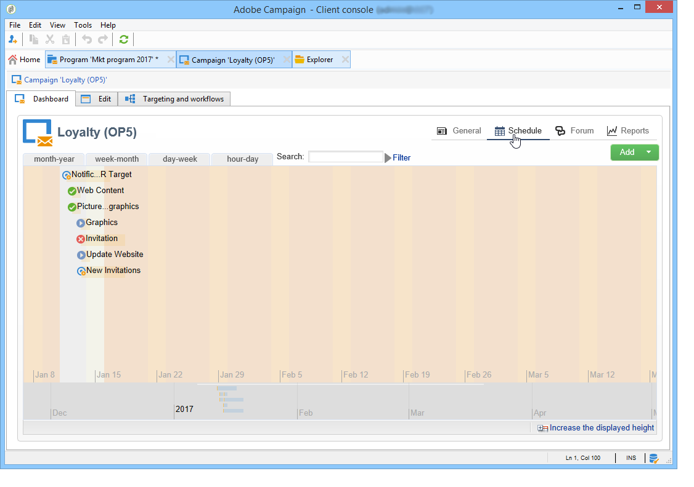

# Åtkomst till marknadsföringskampanjer{#accessing-marketing-campaigns}

Med Adobe Campaign kan ni skapa, konfigurera, köra och analysera marknadsföringskampanjer. Alla marknadsföringskampanjer kan hanteras från ett enhetligt kontrollcenter.

## Grundläggande om arbetsytan {#workspace-basics}

### Startsida {#home-page}

När du har anslutit till Adobe Campaign visas startsidan.

Klicka på länkarna i navigeringsfältet för att komma åt de olika universum.

Kampanjelementen finns i **[!UICONTROL Campaigns]** universum: här kan du se en översikt över marknadsföringsprogram och -kampanjer samt deras undergrupper. Ett marknadsföringsprogram består av kampanjer, som består av leveranser, uppgifter, länkade resurser osv. När det gäller hantering av marknadsföringskampanjer med Campaign finns det information om leveranser, budgetar, granskare och länkade dokument i kampanjerna.

Universums navigeringsblock erbjuder olika **[!UICONTROL Campaigns]** poster, beroende på vilka moduler som är installerade på instansen. Du kan till exempel få åtkomst till:

* **Kampanjkalender**: planeringskalender, marknadsföringsprogram, leveranser och kampanjer. Se [Kampanjkalendern](#campaign-calendar).
* **Kampanjer**: tillgång till kampanjer i alla marknadsföringsprogram.
* **Leveranser**: åtkomst till leveranser som är kopplade till kampanjerna.
* **Webbprogram**: tillgång till webbprogram (formulär, undersökningar osv.).

>[!NOTE]
>
>Mer information om Adobe Campaigns allmänna ergonomi, behörigheter och profilhanteringsfunktioner finns i [det här avsnittet](../../platform/using/adobe-campaign-workspace.md).
>
>Alla funktioner som rör kanaler och leveranser beskrivs i [detta avsnitt](../../delivery/using/communication-channels.md).

### Kampanjkalender {#campaign-calendar}

Varje kampanj tillhör ett program som i sin tur tillhör en plan. Planer, program och kampanjer nås via **[!UICONTROL Campaign calendar]** menyn i **Campaigns** universum.

Om du vill redigera en plan, ett program, en kampanj eller en leverans klickar du på namnet i kalendern och sedan på **[!UICONTROL Open...]**. Den visas sedan på en ny flik, enligt nedan:

Du kan filtrera den information som visas i kampanjkalendern. Om du vill göra det klickar du på **[!UICONTROL Filter]** länken och väljer filtervillkoren.

>[!NOTE]
>
>När du filtrerar på ett datum visas alla kampanjer med ett startdatum som är senare än det angivna datumet och/eller med ett slutdatum som är tidigare än det angivna datumet. Datum måste väljas med hjälp av kalendrarna till höger om varje fält.

Du kan också använda **[!UICONTROL Search]** fältet för att filtrera de visade objekten.

Med ikonerna som är länkade till varje objekt kan du visa objektets status: klart, pågående, redigeras osv.

### Bläddra i ett marknadsföringsprogram {#browsing-in-a-marketing-program}

Med Campaign kan ni hantera en uppsättning program som består av olika marknadsföringskampanjer. Varje kampanj innehåller leveranser och tillhörande processer och resurser.

#### Bläddra i ett program {#browsing-a-program}

När du redigerar ett program använder du flikarna nedan för att bläddra och konfigurera det.

* På fliken **Schema** visas kalendern för program för en månad, vecka eller dag beroende på vilken flik du klickar på i kalenderrubriken.

   Om det behövs kan du skapa en kampanj, ett program eller en uppgift via den här sidan.

   

* På fliken **Redigera** kan du anpassa programmet: namn, start- och slutdatum, budget, länkade dokument osv.

   

#### Bläddra bland kampanjer {#browsing-campaigns}

Kampanjerna kan nås via kampanjkalendern, programfliken eller **[!UICONTROL Schedule]** kampanjlistan.

1. Välj den kampanj du vill visa via kampanjkalendern och klicka sedan på **[!UICONTROL Open]** länken.

   

   Kampanjen redigeras på en ny flik, vilket visas nedan:

   

1. Via programmets flik är redigeringsläget detsamma som via kampanjkalendern. **[!UICONTROL Schedule]**
1. Klicka på namnet på den kampanj du vill redigera via **[!UICONTROL Campaigns]** länken för **[!UICONTROL Campaigns]** universum.

   

### Styra en kampanj {#controlling-a-campaign}

#### Kontrollpanel {#dashboard}

För varje kampanj finns jobb, resurser och leveranser samlade på en enda skärm - dashboard - där ni kan hantera marknadsföringsåtgärder i samarbete med andra.

Kontrollpanelen för en kampanj används som ett kontrollgränssnitt. Här kommer man åt de viktigaste faserna för att skapa och hantera kampanjer direkt: leveranser, extraheringsfiler, meddelanden, budgetar osv.

Med Adobe Campaign kan ni skapa samarbetsprocesser för att skapa och godkänna de olika faserna i marknadsförings- och kommunikationskampanjer: godkännande av budget, mål, innehåll osv.

>[!NOTE]
>
>Konfigurationen av kampanjmallar visas i [Campaign-mallar](../../campaign/using/marketing-campaign-templates.md#campaign-templates).

#### Schema {#schedule}

En kampanj centraliserar en uppsättning leveranser. För varje kampanj ger schemat en global översikt över alla komponenter: På så sätt kan du visa uppgifter och leveranser och enkelt komma åt dem.

#### Forum {#forum}

För varje kampanj kan operatörerna utbyta meddelanden via ett särskilt forum.

Mer information finns i [diskussionsforumen](../../campaign/using/discussion-forums.md).

#### Rapporter {#reports}

Via **[!UICONTROL Reports]** länken kan du komma åt kampanjrapporterna.

>[!NOTE]
>
>Rapporterna beskrivs i [det här avsnittet](../../reporting/using/about-adobe-campaign-reporting-tools.md).

#### Konfiguration {#configuration}

Kampanjer skapas via kampanjmallar. Du kan konfigurera återanvändbara mallar för vilka vissa alternativ har valts och andra inställningar redan har sparats. För varje kampanj finns följande funktioner:

* Hänvisning till dokument och resurser: du kan associera dokument med kampanjen (i korthet, rapport, bilder osv.). Alla dokumentformat stöds. Se [Hantera associerade dokument](../../campaign/using/marketing-campaign-deliveries.md#managing-associated-documents).
* Definiera kostnader: För varje kampanj kan ni med Adobe Campaign definiera kostnadsposter och kostnadsberäkningsstrukturer som kan användas när ni skapar marknadsföringskampanjen. Till exempel: tryckkostnader, användning av en extern byrå, hyra av rum osv. Se [Definiera kostnadskategorier](../../campaign/using/providers--stocks-and-budgets.md#defining-cost-categories).
* Definiera mål: kan ni definiera kvantifierbara mål för en kampanj, t.ex. antal prenumeranter, affärsvolym osv. Den här informationen används senare i kampanjrapporter.
* Hantera dirigerade adresser (mer information finns i [det här avsnittet](../../delivery/using/about-seed-addresses.md)) och kontrollgrupper (se [Definiera en kontrollgrupp](../../campaign/using/marketing-campaign-deliveries.md#defining-a-control-group)).
* Hantera godkännanden: Du kan välja vilka behandlingar som ska godkännas och vid behov välja granskningsoperatorer eller grupper av operatorer. Se [Kontrollera och godkänna leveranser](../../campaign/using/marketing-campaign-approval.md#checking-and-approving-deliveries).

>[!NOTE]
>
>Om du vill få åtkomst till kampanjkonfigurationerna och ändra dem klickar du på **[!UICONTROL Advanced campaign parameters...]** länken på **[!UICONTROL Edit]** fliken. Mer information om att ställa in parametrar på kampanjnivå så att leveranser automatiskt ärver värden finns i [vår TechNote](https://helpx.adobe.com/campaign/kb/simplifying-campaign-management-acc.html#Setparametersatthecampaignlevelsodeliveriesinheritvaluesautomatically).

## Använda webbgränssnittet {#using-the-web-interface-}

Du kan komma åt Adobe Campaign-konsolskärmarna via en webbläsare och visa alla kampanjer och leveranser samt rapporter och information om profilerna i din databas. Det går inte att skapa poster med den här åtkomsten. Beroende på användarrättigheterna kan du visa och/eller agera på data i databasen. Du kan till exempel godkänna kampanjinnehåll och målinriktning, starta om eller stoppa en leverans osv.

1. Logga in som vanligt via https://`<your instance>:<port>/view/home`.
1. Använd menyerna för att komma åt översikterna.

   

Godkännanden (till exempel av ett mål eller ett leveransinnehåll) kan göras via webbåtkomst.

Du kan också använda länken i meddelandena. Mer information finns i [Kontrollera och godkänna leveranser](../../campaign/using/marketing-campaign-approval.md#checking-and-approving-deliveries).
