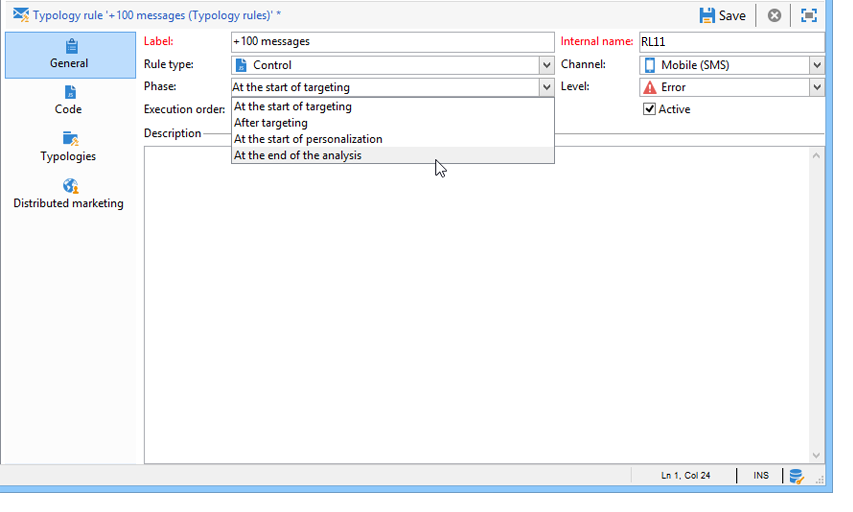

# Tillämpar regler{#applying-rules}

## Använda typologi på en leverans {#applying-a-typology-to-a-delivery}

Om du vill tillämpa de typologiregler du har skapat måste du koppla den till en typologi och sedan referera till den här typologin i leveransen. Så här gör du:

1. Skapa en kampanjtypologi.

   Typologier nås via **[!UICONTROL Administration > Campaign Management > Typology management]** > **[!UICONTROL Typologies]** -noden.

1. Gå till **[!UICONTROL Rules]** fliken, klicka på **[!UICONTROL Add]** knappen och välj de regler som ska tillämpas med den här typologin.

   

1. Spara typologin: läggs det till i listan över befintliga typologier.
1. Öppna den leverans som du vill tillämpa reglerna på.
1. Öppna leveransegenskaperna och gå till **[!UICONTROL Typology]** fliken.
1. Välj typologi i listrutan.

   

   >[!NOTE]
   >
   >Typologin kan definieras i leveransmallen som automatiskt ska tillämpas på alla leveranser som skapas med den här mallen.

## Definiera programvillkor {#defining-application-conditions}

Du kan begränsa programfältet för en regel efter behov (förutom kontrollregler).

Det är möjligt att konfigurera typologiregler så att de endast gäller vissa leveranser som de är kopplade till, eller vissa mottagare bland målet för en leverans.

Om du vill definiera programvillkoren för en regel klickar du på **[!UICONTROL Edit the rule application conditions...]** länken på **[!UICONTROL General]** fliken.

Använd sedan frågeredigeraren för att definiera filtreringsvillkor. I följande exempel gäller kapacitetsregeln endast leveranser med ordet&quot;offer&quot; på etiketten eller leveranser som skapats före 1 april 2013.

>[!NOTE]
>
>För filtreringsregler kan du välja programvillkor för filtreringsvillkor: de kan vara beroende av leveransen eller leveransdispositionen. Mer information finns i [Villkora en filtreringsregel](../../campaign/using/filtering-rules.md#conditioning-a-filtering-rule).

## Justera beräkningsfrekvens {#adjusting-calculation-frequency}

Godkännanden verkställs automatiskt varje kväll via databasrensningsarbetsflödet. Värden kan dock sparas efter den här perioden.

I vissa beräkningar används värden som inte ändras dagligen. Det skulle därför vara irrelevant att omberäkna data varje dag och överlagra databasen helt utan någonting. Om en process till exempel förbättrar marknadsföringsdatabasen med kundbenägenhetspoäng och inköpsinformation varje vecka, behöver data som baseras på dessa värden inte beräknas om varje dag.

För att göra detta kan du i fältet **[!UICONTROL Frequency]** på **[!UICONTROL General]** fliken definiera en maximal period under vilken mål sparas. Som standard anger värdet **0** att beräkningen fortsätter att gälla tills nästa gång den dagliga omskiljningen verkställs.

Om du vill spara resultaten efter den här perioden anger du ett värde som är större än 12 i **[!UICONTROL Frequency]** fältet: när denna period har löpt ut, tillämpas alla regler på nytt.

Med **[!UICONTROL Re-apply the rule at the start of personalization]** alternativet kan du tillämpa regeln automatiskt under personaliseringsfasen, även om den period som anges i **[!UICONTROL Frequency]** fältet fortfarande är giltig.

## Välja regelprogramfas {#selecting-the-rule-application-phase}

Typologiregler tillämpas i en viss sekvens under målgrupps-, analys- och personaliseringsfaserna för de leveranser de avser.

### Körningsordning {#execution-order}

I standarddriftsläget används reglerna i följande sekvens:

1. Kontrollregler, om de tillämpas i början av målinriktningen.
1. Filtreringsregler:

   * Interna ansökningsregler för adresskvalifikation: definierad adress/overifierad adress/adress i blocklistan/adresskvalitet i karantän.
   * Filtreringsregler som definieras av användaren.
   * Regel för borttagning av dubbletter för adressen eller identifieraren (används om det behövs).

1. Tryckregler.
1. Kapacitetsregler.
1. Kontrollregler, om de tillämpas när målinriktningen är slut.
1. Styr regler, om de tillämpas i början av personaliseringen. Om användarreglerna (filtrering/tryck/aktivering) har upphört att gälla och behöver beräknas om, kommer de att tillämpas under det här steget.
1. Styr reglerna, om de gäller när personaliseringen är klar.

>[!NOTE]
>
>Om du arbetar med Campaign Interaction Module tillämpas regler för kvalificering av erbjudanden samtidigt som filtreringsregler (för erbjudanden som finns i leveransdispositionerna) eller under personaliseringsfasen, under anropet till erbjudandemotorn.

Du kan anpassa körningssekvensen för regler som har samma typ med hjälp av rätt fält på regelfliken **[!UICONTROL General]** . När flera regler körs under samma meddelandebearbetningsfas kan du konfigurera deras körningssekvens i **[!UICONTROL Execution sequence]** fältet.

En tryckregel med körningsordningen 20 körs till exempel före en tryckregel med körningsordningen 30.

### Kontrollregler {#control-rules}

För **[!UICONTROL Control]** regler kan ni bestämma vid vilken tidpunkt i leveranscykeln regeln ska tillämpas (före eller efter målinriktning, i början av personaliseringen, i slutet av analysen). Välj det värde som ska användas i listrutan för **[!UICONTROL Phase]** fältet på fliken **[!UICONTROL General]** för typologiregeln.

Möjliga värden är:

* **[!UICONTROL At the start of targeting]**

   Om du vill förhindra att personaliseringssteget körs om det uppstår fel kan du använda kontrollregeln här.

* **[!UICONTROL After targeting]**

   Om du behöver känna till målvolymen för att kunna använda kontrollregeln väljer du den här fasen.

   Kontrollregeln gäller till exempel efter varje målfas: **[!UICONTROL Check proof size]** den här regeln förhindrar meddelandepersonalisering om det finns för många korrekturmottagare.

* **[!UICONTROL At the start of personalization]**

   Denna fas måste väljas om kontrollen avser godkännande av meddelandepersonalisering. Anpassning av meddelanden utförs under analysfasen.

* **[!UICONTROL At the end of the analysis]**

   Välj den här fasen när en kontroll kräver att meddelandepersonalisering är slutförd.

## Ytterligare konfigurationer {#additional-configurations}

### Kontrollera utgående SMTP-trafik {#control-outgoing-smtp-traffic}

Du kan också använda fältet för att länka leveranser till leveransservern (MTA) med den här tillhörigheten. **[!UICONTROL Managing affinities with IP addresses]** På så sätt kan du begränsa antalet e-postmeddelanden för specifika leveranser till maskiner eller utdatameddelanden.

>[!NOTE]
>
>Tillhörighetshantering gäller inte för **[!UICONTROL Filtering]** typologier.\
>Tillhörigheterna definieras i instanskonfigurationsfilen på Adobe Campaign-servern. For more on this, refer to [this section](../../installation/using/about-initial-configuration.md).

### Kampanjoptimering och distribuerad marknadsföring {#campaign-optimization-and-distributed-marketing}

På fliken **[!UICONTROL Distributed Marketing]** kan du definiera ommappning av typologier och/eller regler som gäller när en delad kampanj beställs och/eller reserveras. Typologier/regler som definieras för en lokal enhet (länkade till dem som definierats för den centrala enheten) ersätter regler/typer som är kopplade till den centrala enheten. Med ommappning kan ni anpassa reglerna för centrala enheter till de lokala enheter som beställer kampanjen.

>[!NOTE]
>
>I typologiregler och typologiregler läggs fliken till om din licens innehåller det här alternativet **[!UICONTROL Distributed Marketing]** : kontrollera licensavtalet.\
>Mer information om distribuerad marknadsföring finns i [Om distribuerad marknadsföring](../../campaign/using/about-distributed-marketing.md).

