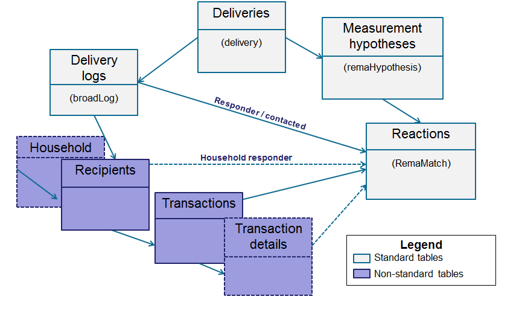

# Konfiguration{#configuration}

Detta avsnitt är avsett för personer som ansvarar för att konfigurera svarshantering. Det förutsätter en viss kunskap om hur man utökar scheman, definierar arbetsflöden och SQL-programmering.

På så sätt kan ni förstå hur ni anpassar standarddatamodellen till den specifika karaktären hos en transaktionstabell som ligger utanför Adobe Campaign med tabellen över individer. Den här tabellen med individer kan sammanfalla med tabellen med tillgängliga individer i Adobe Campaign eller med en annan tabell

Måtthypotesen startas av arbetsflödet för operationsprocessen ( **[!UICONTROL operationMgt]** ). Varje hypotes representerar en separat process som körs asynkront med körningsstatus (Redigeras, Väntar, Slutförd, Misslyckades osv.) och styrs av en schemaläggare som hanterar prioritetsbegränsningar, begränsning av antalet samtidiga processer, sidan med låg aktivitet och automatisk exekvering med frekvens.

## Konfigurera scheman {#configuring-schemas}

>[!CAUTION]
>
>Ändra inte programmets standardscheman utan använd i stället schemautbyggnadsmekanismen. I annat fall kommer ändrade scheman inte att uppdateras vid tidpunkten för framtida uppgraderingar av programmet. Detta kan leda till felfunktioner när Adobe Campaign används.

Programintegrering krävs innan reaktionsmodulen används, för att definiera de olika tabeller (transaktioner, transaktionsdetaljer) som ska mätas samt deras relation till leveranser, erbjudanden och individer.

### Standardscheman {#standard-schemas}

Det färdiga **[!UICONTROL nms:remaMatch]** schemat innehåller reaktionsloggtabellen, dvs. relationen mellan individer, hypotes och transaktionstabell. Detta schema ska användas som arvsschema för reaktionsloggarnas slutliga destinationstabell.

Schemat kommer också som standard och innehåller lagring av reaktionsloggar för Adobe Campaign-mottagare ( **[!UICONTROL nms:remaMatchRcp]** **[!UICONTROL nms:recipient]** ). För att kunna användas måste den utökas för att mappas till ett transaktionsregister (som innehåller inköp osv.).

### Transaktionsregister och transaktionsinformation {#transaction-tables-and-transaction-details}

Transaktionstabellen måste innehålla direktlänkar till personer.

Du kan också lägga till en tabell som innehåller transaktionsinformation. Detta är inte direkt kopplat till individer.

Om vi till exempel tar ett kvitto länkas ett transaktionsregister till en kontakt (inleveransregister) och ett kvittoregister länkas bara till kvittoregistret (detaljregister). Du kan sedan konfigurera hypotesen direkt på den nivå där kvittotabellen är kopplad till kvittotabellen.

>[!NOTE]
>
>Om du vill behålla den kvitto-ID som beskriver det förväntade beteendet i hypoteserna kan du utöka tabellmallen nms:remaMatchRcp för att lägga till identifieraren i den (i det här fallet är ingen ROI-beräkning kopplad till dessa fält).

Vi rekommenderar att du lägger till ett eventdatum.

I följande schema visas kopplingar mellan de olika tabellerna när konfigurationen är klar:



### Svarshantering med Adobe Campaign-mottagare {#response-management-with-adobe-campaign-recipients}

I det här exemplet kommer vi att integrera en tabell med inköp i vår svarshanteringsmodul med hjälp av mottagartabellen för Adobe Campaign ( **[!UICONTROL nms:recipient]** ).

Svarsloggarna på en **[!UICONTROL nms:remaMatchRcp]** mottagare utökas för att lägga till en länk till inköpstabellschemat. I följande exempel kallas inköpstabellen **demo:purchase**.

1. Välj **[!UICONTROL Administration]** > **[!UICONTROL Campaign management]** > **[!UICONTROL Target mappings]** i Adobe Campaign Explorer.
1. Högerklicka på **Mottagare** och välj **[!UICONTROL Actions]** och **[!UICONTROL Modify the options of the targeting dimensions]**.

   

1. Du kan anpassa dem **[!UICONTROL Extension namespace]** i nästa fönster och sedan klicka på **[!UICONTROL Next]**.

   

1. Kontrollera att **[!UICONTROL Response management]** rutan är markerad i kategorin **[!UICONTROL Generate a storage schema for reactions]** .

   Klicka sedan på **[!UICONTROL Define additional fields...]** för att markera de relaterade transaktionstabellerna och lägg till de önskade fälten i tillägget för nms:remaMatchRcp-schemat.

   

Det skapade schemat ser ut så här:

```
<srcSchema _cs="Reactions (Recipients) (cus)" entitySchema="xtk:srcSchema" extendedSchema="nms:remaMatchRcp" 
img="nms:remaMatch.png" implements="xtk:persist" label="Reactions (Recipients)" mappingType="sql"
name="remaMatchRcp" namespace="cus">  
 <element label="Reactions (Recipients)" name="remaMatchRcp">    
  <key internal="true" name="match">      
   <keyfield xlink="hypothesis"/>      
   <keyfield xlink="broadLog"/>      
   <keyfield xlink="proposition"/>    
  </key>    
  <attribute label="Quantity" name="quantity" type="long"/>    
  <element name="purchase" target="demo:purchase" type="link"/>    
  <element name="hypothesis" revLabel="Reactions (Recipients)" revLink="remaMatchRcp"/>    
  <element applicableIf="HasPackage('nms:coreInteraction')" label="Proposition" name="proposition" target="nms:propositionRcp" type="link"/>   
  <element desc="Message (Delivery log)" label="Message" name="broadLog" target="nms:broadLogRcp" type="link"/>    
  <element label="Respondent" name="responder" target="nms:recipient" type="link"/>  
 </element>  
 <createdBy _cs="Administrator (admin)"/>  
 <modifiedBy _cs="Administrator (admin)"/>
</srcSchema>
```

### Svarshantering med en anpassad mottagartabell {#response-management-with-a-personalized-recipient-table}

I det här exemplet kommer vi att integrera en inköpstabell i svarsmodulen med hjälp av en annan tabell med personer än mottagartabellen i Adobe Campaign.

* Skapar ett nytt svarsloggsschema som härletts från **[!UICONTROL nms:remaMatch]** schemat.

   Eftersom tabellen med enskilda användare skiljer sig från tabellen med mottagare av Adobe Campaign måste ett nytt schema med svarsloggarna skapas baserat på **[!UICONTROL nms:remaMatch]** schemat. Fyll sedan i den med länkar till leveransloggarna och inköpstabellen.

   I följande exempel använder vi schemat **demo:broadLogPers** och **transaktionstabellen demo:purchase** :

   ```
   <srcSchema desc="Linking of a recipient transaction to a hypothesis"    
   img="nms:remaMatch.png" label="Responses on persons" labelSingular="Responses on a person" name="remaMatchPers" namespace="nms">
     <element name="remaMatchPers" template="nms:remaMatch">
       <key internal="true" name="match">
         <keyfield xlink="hypothesis"/>
        <keyfield xlink="purchase"/>
       </key>
   
       <element name="hypothesis" revLabel="Response logs for persons" revLink="remaMatchPers"/>
       <element applicableIf="HasPackage('nms:interaction')" label="Proposition" name="proposition"
                target="demo:propositionPers" type="link"/>
       <element label="Delivery log" name="broadLog" target="demo:broadLogPers" type="link"/>
     </element>
   </srcSchema>
   ```

* Ändra hypotesformen i **[!UICONTROL nms:remaHypothesis]** schemat.

   Som standard visas svarsloggarna i mottagarloggarna. Du måste därför ändra hypotesformuläret för att kunna visa de nya svarsloggarna som skapades under det föregående steget.

   Till exempel:

   ```
    <container type="visibleGroup" visibleIf="[context/@remaMatchStorage]= 'demo:remaMatchPers'">
                 <input hideEditButtons="true" img="nms:remaMatch.png" nolabel="true" refresh="true"
                  toolbarCaption="Responses generated by the hypothesis" type="linklist"
                  xpath="remaMatchPers">
             <input xpath="[.]"/>
             <input xpath="@controlGroup"/>
           </input>
      </container> 
   ```

## Hantera indikatorer {#managing-indicators}

Svarshanterarmodulen innehåller en lista med fördefinierade indikatorer. Du kan dock lägga till andra personaliserade mätningsindikatorer.

För att göra detta måste du utöka tabellen med hypoteser genom att infoga två fält för varje ny indikator:

* den första för målpopulationen,
* den andra för kontrollgruppen.

Till exempel:

```
<srcSchema entitySchema="xtk:srcSchema" extendedSchema="nms:remaHypothesis" label="Measurement hypothesis" 
md5="1D4DED54FF8EC2432AED6736EDE6F547" name="remaHypothesis" namespace="demo" xtkschema="xtk:srcSchema">  
    <element name="remaHypothesis">    
        <element name="indicators">      
            <!-- Quantity -->      
            <attribute label="Total contacted" name="contactReactedTotalQuantity" type="long"/>
            <attribute label="Total number of people in the control group" name="proofReactedTotalquantity" type="long"/> 
        </element> 
    </element>
</srcSchema>
```

