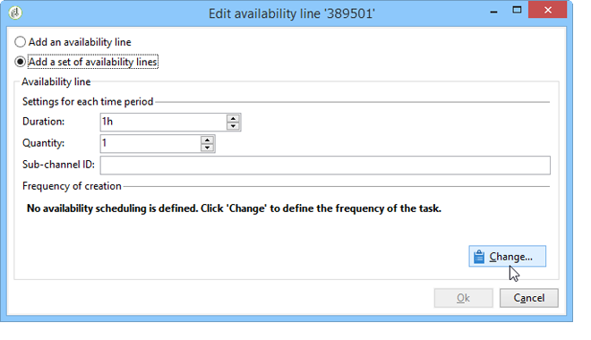
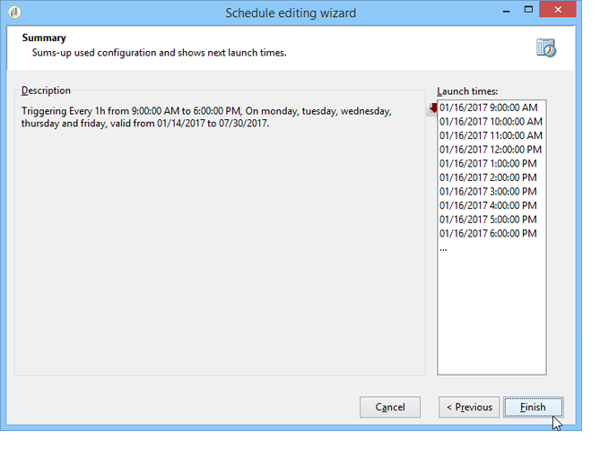

# Konsekvensregler{#consistency-rules}

## Enhetlighetsregler {#about-consistency-rules}

Adobe Campaign garanterar enhetlig kommunikation tack vare en uppsättning regler som finns i kampanjtypologier. Syftet är att kontrollera de leveranser som skickas till mottagarna, t.ex. volym, art, relevans osv.

**Kapacitetsregler** kan t.ex. undvika att överbelasta den plattform som berörs av meddelandeleveransen. Specialerbjudanden som innehåller en nedladdningslänk får inte skickas till för många personer samtidigt för att undvika att servern blir mättad. Telefonkampanjer får inte överskrida uppringningscentralernas bearbetningskapacitet osv. Mer information finns i [Kontrollera kapacitet](#controlling-capacity).

## Kontrollera kapacitet {#controlling-capacity}

Innan du levererar meddelanden måste du se till att din organisation har kapacitet att bearbeta leveransen (fysisk infrastruktur), de svar som leveransen kan generera (inkommande meddelanden) och antalet samtal som ska göras till kontaktprenumeranter (bearbetningskapacitet för callcenter), till exempel.

För att göra detta måste du skapa **[!UICONTROL Capacity]** typologiregler.

I följande exempel skapar vi en typologiregel för en lojalitetskampanj för en telefon. Vi begränsar antalet meddelanden till 20 per dag, dvs. den dagliga bearbetningskapaciteten hos ett callcenter. När regeln tillämpas på två leveranser kan vi övervaka förbrukningen via loggar.

Så här utformar du en ny kapacitetsregel:

1. Klicka under **[!UICONTROL Administration > Campaign management > Typology management > Typology rules]** noden **[!UICONTROL New]**.
1. Välj en **[!UICONTROL Capacity]** regeltyp.

   

1. Skapa tillgänglighetsraderna på **[!UICONTROL Capacity]** fliken: i vårt exempel är detta tidsperioder under vilka samtal kan göras. Välj en period på 24 timmar och ange 150 i den initiala kvantiteten, vilket innebär att callcentret kan hantera 150 samtal per dag.

   

   >[!NOTE]
   >
   >Tillgänglighetsraderna är endast avsedda som information. Om du behöver exkludera meddelanden när kapacitetsgränsen nås, se [det här avsnittet](#exclude-messages-when-capacity-limit-reached).

1. Koppla den här regeln till en typologi och referera sedan till typologin i leveransen för att tillämpa den här kapacitetsregeln. Mer information finns i [det här avsnittet](../../campaign/using/applying-rules.md#applying-a-typology-to-a-delivery).
1. Du kan övervaka förbrukningen från regeln **[!UICONTROL Consumptions]** och **[!UICONTROL Capacity]** flikarna.

   När en regel används i en leverans innehåller kolumnerna **[!UICONTROL Consumed]** och **[!UICONTROL Remaining]** information om inläsningen, vilket visas nedan:

   

   Mer information finns i [det här avsnittet](#monitoring-consumption).

## Definiera maximal belastning {#defining-the-maximum-load}

För att definiera den maximala lasten måste du definiera tillgänglighetsrader. Det finns två alternativ: Du kan skapa en eller flera tillgänglighetsrader manuellt (se [Lägga till tillgänglighetsrader en i taget](#adding-availability-lines-one-by-one)) eller skapa tillgänglighetsintervall. Frekvensen för dessa tidsperioder kan automatiseras (se [Lägga till en uppsättning tillgänglighetsrader](#add-a-set-of-availability-lines)).

### Lägga till tillgänglighetsrader en i taget {#adding-availability-lines-one-by-one}

Om du vill skapa en tillgänglighetslinje klickar du på **[!UICONTROL Add]** knappen och väljer **[!UICONTROL Add an availability line]**. Ange tillgänglighetsperioden och tillgänglig last.

Lägg till så många rader som behövs för att anpassa bearbetningskapaciteten.

### Lägg till en uppsättning tillgänglighetsrader {#add-a-set-of-availability-lines}

Om du vill definiera tillgänglighetsperioder för en viss tid klickar du på **[!UICONTROL Add]** knappen och väljer **[!UICONTROL Add a set of availability lines]** alternativet. Ange en varaktighet för varje tidsperiod och antalet perioder som ska skapas.

Om du vill automatisera hur ofta sidan skapas klickar du på **[!UICONTROL Change]** knappen och definierar tidsplaneringen.

Vi kan till exempel definiera ett schema för att skapa tillgänglighetsperioder för alla arbetsdagar med en hastighet på 10 samtal per timme mellan 09.00 och 17.00. Gör så här:

1. Välj typ av intervall och de dagar och timmar som den gäller:

   

1. Ange giltighetsdatum:

   

1. Kontrollera schemat innan du godkänner det:

   

Alla matchande rader skapas automatiskt i arbetsflödet **[!UICONTROL Forecasting]** .

>[!NOTE]
>
>Vi rekommenderar att du skapar tillgänglighetsrader via filimport. På den här fliken kan du visa och kontrollera förbrukningsrader.

## Uteslut meddelanden när kapacitetsgränsen har nåtts {#exclude-messages-when-capacity-limit-reached}

Tillgänglighetsraderna är endast avsedda som information. Markera **[!UICONTROL Exclude from the target messages in excess of capacity]** alternativet om du vill exkludera överflödiga meddelanden. Detta förhindrar att kapaciteten överskrids. För samma population som i föregående exempel får förbrukningen och den återstående kapaciteten inte överstiga den ursprungliga kvantiteten:

Antalet meddelanden som ska bearbetas är jämnt fördelat över det definierade tillgänglighetsintervallet. Detta är särskilt relevant för callcenters eftersom deras högsta antal samtal per dag är begränsat. När det gäller e-postleveranser kan du med det här alternativet **[!UICONTROL Do not limit instantaneous delivery capacity]** ignorera tillgänglighetsintervallet och skicka e-postmeddelanden samtidigt.

>[!NOTE]
>
>Om det finns en överlagring väljs de sparade meddelandena enligt formeln som definieras i leveransegenskaperna.

## Övervaka förbrukning {#monitoring-consumption}

Som standard är kapacitetsreglerna endast avsedda för indikationsändamål. Välj alternativet **[!UICONTROL Exclude messages in excess of capacity from the target]** om du vill förhindra att den definierade inläsningen överskrids. I det här fallet utesluts överflödiga meddelanden automatiskt från leveranser med denna typologiregel.

Om du vill övervaka förbrukning kan du visa de värden som visas i **[!UICONTROL Consumed]** kolumnen på **[!UICONTROL Capacity]** fliken i typologiregeln.

Om du vill visa förbrukningsrader klickar du på **[!UICONTROL Consumptions]** fliken i regeln.
