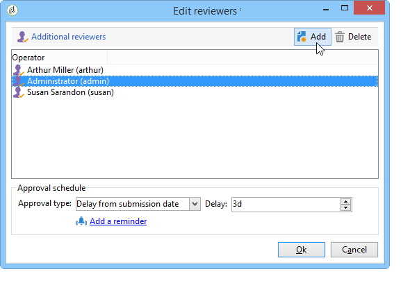

# Skapa och hantera uppgifter{#creating-and-managing-tasks}

## Om uppgifter {#about-tasks}

Med Adobe Campaign kan ni skapa uppgifter och hantera hela deras livscykel direkt i programmet. Program- och kampanjimplementering kan delas upp i uppgifter som tilldelas Adobe Campaign-operatörer eller externa tjänsteleverantörer. Med det här åtgärdsläget kan du skapa en öppen samarbetsmiljö som innehåller alla programdeltagare och externa deltagare.

Uppgifter kan skapas, visas och övervakas från listan med uppgifter eller kontrollpanelen för kampanjer. De kan också ses och spåras i tidsplanerna för marknadsföringsplanen, programmen och kampanjerna.

Aktiviteter är kopplade till kampanjen och kan ha beroenden, dvs. associerade uppgifter. Varje uppgift har en status, prioritet, uppskattad belastning och relaterade kostnader.

Alla uppgifter grupperas i en lista som är tillgänglig via **Campaigns** universum. Mer information finns i [Åtkomst av uppgifter](#accessing-tasks).

De kan visas i schemat för det program de tillhör.

## Åtkomst till uppgifter {#accessing-tasks}

### Visa uppgifter {#displaying-tasks}

Uppgifterna visas i uppgiftslistan som är tillgängliga via **[!UICONTROL Campaigns]** universum.

Där kan du visa alla uppgifter för den anslutna operatorn.

Mer information finns i [Körningsstatus för en uppgift](#execution-status-of-a-task) och [Förloppsstatus för en uppgift](#progress-status-of-a-task).

### Filtrera uppgifter {#filtering-tasks}

När du visar den här vyn filtreras den automatiskt så att den bara visas **[!UICONTROL operator tasks]**. Du kan även filtrera uppgifterna med hjälp av fälten i fönstrets övre del.

### Redigera uppgifter {#editing-tasks}

Klicka på en uppgift för att redigera den.

## Skapa en ny uppgift {#creating-a-new-task}

Om du vill skapa en uppgift klickar du på **[!UICONTROL Tasks]** länken i Campaigns-universum och väljer **[!UICONTROL Create]**.

Ange åtminstone namnet på aktiviteten och välj den kampanj som den är länkad till. Du måste också ange start- och slutdatum. Dessa tre uppgifter är obligatoriska.

Klicka **[!UICONTROL Save]** för att skapa uppgiften.

Du kan även skapa en uppgift via kontrollpanelen för en kampanj: i det här fallet länkas den automatiskt till kampanjen som den skapades från.

När en uppgift har skapats läggs den till i kampanjschemat och i listan över aktiviteter. Om du vill redigera en uppgift markerar du den i schemat eller klickar på namnet i uppgiftsöversikten och klickar på **[!UICONTROL Open]** länken.

För att konfigurera den måste du ange:

* Chefen och deltagarna: hänvisa till [chef och deltagare](#manager-and-participants).
* Skapandeschema: se [Körningsschema](#execution-schedule).
* Utfästa kostnader: se [Utgifter och intäkter](#expenses-and-revenues).

Det går också att lägga till granskare (se [Granskare](#reviewers)) och refererade dokument (se [Refererade](#documents-referenced)dokument).

Aktivitetens livscykel anges i [Livscykel](#life-cycle).

### Chef och deltagare {#manager-and-participants}

Det är bara operatorn som ansvarar för en uppgift som har behörighet att stänga den.

Som standard tilldelas en uppgift automatiskt när en Adobe Campaign-operator skapar en uppgift. Om du vill välja en annan operator använder du **[!UICONTROL Assigned to]** fältet.

>[!NOTE]
>
>Operatorhantering visas i [det här avsnittet](../../platform/using/access-management.md).

Du kan ange vilka operatorer som ska utföra uppgiften. De här operatorerna har inte behörighet att stänga aktiviteten. De kan bara godkänna den uppgift som de tilldelats.

De markeras med **[!UICONTROL Resources]** ikonen i verktygsfältet. Klicka **[!UICONTROL Add]** och välj de berörda operatörerna.

Klicka på **[!UICONTROL Ok]** och ange sedan användarfrekvensen: detta representerar den belastning som tilldelats operatorn för uppgiftskörningens varaktighet. Denna procentsats är endast en indikation och uttrycks som en procentandel.

För en aktivitet vars körningsschema är inställt på 10 dagar, kommer till exempel en operator vars användningsgrad är 50 % att mobiliseras för den här aktiviteten för halva arbetstiden i 10 dagar.

För varje operator kan du ange en schemalagd arbetsbelastning och en faktisk arbetsbelastning. Dessa varaktigheter är också avsedda endast som information.

Det går att konfigurera en påminnelse som automatiskt skickas till alla operatorer som arbetar med aktiviteten före slutdatumet.

Du kan visa operatörsprofilen för Adobe Campaign via **[!UICONTROL Edit link]** ikonen .

På kontrollpanelen för operatorer kan du kontrollera deras arbetsbelastning (andra pågående uppgifter).

### Granskare {#reviewers}

Förutom deltagarna kan du definiera operatorer som ska granska uppgiften när den har stängts av den ansvarige personen. Det gör du genom att klicka på **[!UICONTROL Enable task approval]** alternativet i den nedre vänstra delen av **[!UICONTROL Resources]** fönstret. Det kan vara en enskild operator, en grupp operatorer eller en lista med operatorer.

Om du vill ange en lista med operatorer klickar du på länken till höger om den första granskaren och lägger till så många operatorer som behövs, enligt nedan: **[!UICONTROL Edit...]**

Du kan definiera ett godkännandeschema för uppgiften i det nedre avsnittet av granskningsfönstret. Som standard har granskarna tre dagar på sig att godkänna uppgiften från och med överföringsdatumet. Det går att konfigurera en påminnelse som skickas till de berörda operatörerna automatiskt innan tidsgränsen för godkännande.

Den person som ansvarar för uppgiften kan tilldela sig själv uppgiften att godkänna den, även om andra operatorer redan har tilldelats uppgiften att göra detta. Om ingen granskare har definierats skickas meddelandena till den person som ansvarar för uppgiften. Alla andra Adobe Campaign-operatorer med **[!UICONTROL Administrator]** rättigheter kan också godkänna uppgiften. De får dock inga meddelanden.

### Refererade dokument {#documents-referenced}

Det går att lägga till dokument och marknadsföringsresurser i en uppgift (mer information finns i [Hantera marknadsföringsresurser](../../campaign/using/managing-marketing-resources.md)). Om du vill göra det öppnar du uppgiften och klickar på **[!UICONTROL Documents]** ikonen i verktygsfältet.

Klicka **[!UICONTROL Add]** och välj dokumentet som ska läggas till i uppgiften. Använd samma process för marknadsföringsresurser.

Refererade dokument visas i meddelanden som skickas till de operatorer som deltar i uppgiften samt på kontrollpanelen för uppgifter.

### Körningsschema {#execution-schedule}

Giltighetsperioden för en uppgift anges i fälten **[!UICONTROL Start]** och **[!UICONTROL End]** . Den schemalagda belastningen anger den arbetsbelastning som ska utföras under perioden. Den uttrycks i dagar eller timmar.

>[!NOTE]
>
>En uppgifts livscykel presenteras i [Livscykeln](#life-cycle).

I **[!UICONTROL Workload performed]** fältet, som även uttrycks i dagar och timmar, kan du manuellt uppdatera aktivitetens förlopp i förhållande till den schemalagda arbetsbelastningen.

Uppgiften, uttryckt i procent, uppdateras automatiskt **[!UICONTROL Progress status]** utifrån de uppgifter som utförs av de berörda operatörerna. Den kan anges manuellt.

Den här informationen kan visas på kontrollpanelen för uppgifter.

Den visas också på fliken Kampanj.

Om slutdatumet för schemat för aktivitetskörning har nåtts men aktiviteten inte har slutförts, kommer aktiviteten att vara **[!UICONTROL Late]**. Ett varningsmeddelande visas även för aviseringsoperatörer.

Mer information om detta finns i [förloppsstatus för en uppgift](#progress-status-of-a-task).

### Utgifter och intäkter {#expenses-and-revenues}

Du kan definiera relaterade utgifter och prognosintäkter för varje uppgift. Dessa beräknas och konsolideras sedan för den kampanj som aktiviteten är kopplad till.

Om du vill ange den här informationen klickar du på **[!UICONTROL Expenses and revenue]** ikonen i verktygsfältet.

Som standard är den debiterade budgeten budgeten för den kampanj som aktiviteten är kopplad till. Den visas i uppgiftsinformationen.

>[!NOTE]
>
>Mer information om utgifter och budgetar finns i [Kostnadsåtagande, beräkning och debitering](../../campaign/using/controlling-costs.md#cost-commitment--calculation-and-charging).

I det här fönstret kan du också definiera vilka mål som ska uppnås. Målen uttrycks i prognosintäkter för uppgiften.

### Tjänsteleverantörer {#service-providers}

En extern tjänsteleverantör kan vara involverad i hanteringen av en uppgift.

Om du vill göra det redigerar du uppgiftsegenskaperna och väljer tjänsteleverantören. Kostnadskategorierna som är kopplade till tjänsteleverantören listas automatiskt i fönstrets centrala avsnitt.

Mer information finns i [Skapa en tjänsteleverantör och dess kostnadskategorier](../../campaign/using/providers--stocks-and-budgets.md#creating-a-service-provider-and-its-cost-categories).

Välj de kostnadskategorier som är relaterade till utförandet av uppgiften. Välj typ av kostnad och lägg till ett tilläggsbelopp om det behövs.

>[!NOTE]
>
>Metoden för att hantera budgetar och kostnader presenteras i [Kontrollera kostnader](../../campaign/using/controlling-costs.md).

När en tjänsteleverantör har valts visas den på kontrollpanelen för uppgifter:

### Sena uppgifter {#late-tasks}

En aktivitet är sen om slutdatumet har nåtts utan att dess status ändras till **[!UICONTROL Finished]**. Som standard varnas ingen operator när en uppgift är sen. Du kan konfigurera leveransen av ett e-postmeddelande: alla operatorer kan meddelas även om de inte deltar i uppgiften.

Gå till **[!UICONTROL Resources]** rutan och lägg till operatorn i **[!UICONTROL Assignation]** fältet. Om du vill meddela flera personer väljer du en grupp med operatorer.

### Inledande meddelanden {#initial-notifications}

När du skapar eller ändrar en uppgift med ett startdatum i framtiden erbjuder Adobe Campaign att skicka ett e-postmeddelande till den person som ansvarar för uppgiften för att meddela när den börjar.

Om den uppgift du skapar är långt borta kan det dock vara bättre att schemalägga att meddelandet skickas innan aktiviteten startar. Om uppgiften till exempel startar inom en månad kan du meddela den ansvariga personen en vecka innan den börjar.

Om du vill schemalägga ett meddelande går du till **[!UICONTROL Resources]** rutan och använder **[!UICONTROL Initial notification]** fältet.

* För uppgifter inom kampanjer väljer du ett specifikt datum och en viss tid.
* För uppgifter i kampanjmallar uttrycks meddelandetiden som återstående tid innan aktiviteten startar (om du t.ex. anger 2d i **[!UICONTROL Initial notification]** fältet skickas e-postmeddelandet 2 dagar före aktivitetens startdatum).

Om du har schemalagt ett meddelande när du sparar uppgiften, kommer Adobe Campaign att skicka ett meddelande direkt. Du kan bestämma dig för att skicka det och detta ersätter inte det schemalagda meddelandet.

### Aktivitet länkad till ett program {#task-linked-to-a-program}

Du kan skapa aktiviteter direkt i ett program för att hantera åtgärder som gäller deras övergripande organisation och inte en viss kampanj (till exempel ett möte för att diskutera temat för kommande kampanjer i programmet). Aktiviteten visas i programschemat.

Så här skapar du en uppgift som är länkad direkt till ett program:

1. Öppna programschemat: på startsidan, gå till **[!UICONTROL Campaigns > Browse > Other choices > Programs]**. Det övergripande programschemat öppnas i den högra delen av fönstret.
1. Klicka på önskat program i schemat: ett fönster öppnas.
1. Klicka i det här fönstret **[!UICONTROL Open]**. Programschemat öppnas.
1. Klicka på **[!UICONTROL Add]** knappen ovanför schemat till höger och klicka sedan på **[!UICONTROL Add a task]**.

### Operatörens tillgänglighet {#operator-availability}

En ikon bredvid operatorns namn på kontrollpanelen för uppgifter anger att de redan arbetar med en annan uppgift eller händelse under den period som aktiviteten omfattar. (Uppgifter som verksamhetsutövaren ansvarar för eller deltar i: visas i **[!UICONTROL Assigned to]** fältet eller i **[!UICONTROL Resources]** åtgärdsrutan).

### Uppgift i ett arbetsflöde {#task-in-a-workflow}

Om du använder ett **[!UICONTROL Task]** element i ett kampanjarbetsflöde kan du definiera två scenarier beroende på om aktiviteten har godkänts eller inte.

I kampanjarbetsflödena finns aktiviteten **[!UICONTROL Task]** på **[!UICONTROL Flow control]** fliken.

## Typer av uppgifter {#types-of-task}

När du skapar uppgifter via en kampanj kan du skapa specifika uppgifter. Typen av uppgift definieras i den valda mallen.

Följande uppgifter kan schemaläggas:

* [Kontrolluppgifter](#control-tasks),
* [Grupperingsuppgift](#grouping-task),
* [Grupperingsuppgift](#grouping-task),
* [Aviseringsuppgift](#notification-task).

>[!NOTE]
>
>**[!UICONTROL Control task]** och **[!UICONTROL Grouping]** uppgifter kan **bara** skapas via kampanjpanelen.\
>De visas i aktivitetskartan för den operator som de är tilldelade till. Se [Åtkomst till uppgifter](#accessing-tasks).

### Styra uppgifter {#control-tasks}

A **[!UICONTROL Control task]** är länkat till leveransgodkännande: godkännande av målgruppsanpassning, innehåll, extraheringsfil, budget eller korrektur.

När aktiviteten har skapats läggs den till på kampanjkontrollpanelen.

Du kan sedan redigera den och ange dess parametrar.

### Skapande av marknadsföringsresurs {#marketing-resource-creation-task}

En uppgift att skapa marknadsföringsresurser kan användas för att hantera skapandet och publiceringen av en marknadsföringsresurs. Om du hanterar en resurs via en aktivitet och inte via själva resursen kan du:

* Styr processen för att skapa resurser via en kampanj.
* Visa resursskapandeprocessen i ett schema.
* Hantera processen för att skapa resurser (påminnelser, meddelanden).
* Beräkna och kontrollera kostnaderna för att skapa resurser.
* Godkänn och publicera resursen via aktiviteten (om det relevanta alternativet är aktiverat).

#### Interaktion mellan aktiviteten och dess länkade resurs {#interaction-between-the-task-and-its-linked-resource}

Aktiviteten för att skapa marknadsföringsresurser interagerar med den resurs som är länkad till den. Detta innebär:

* Schemat för att skapa resurser och de kostnader som är kopplade till det hanteras via aktiviteten.
* Operatorer kan arbeta med resursen som vanligt (hämta eller ladda upp, låsa och låsa upp): detta påverkar inte aktiviteten.
* Godkännande och offentliggörande av resurser kan utföras via uppgiften: om **[!UICONTROL Publish the marketing resource]** alternativet är aktiverat godkänns resursen och publiceras automatiskt när aktiviteten är klar. Om alternativet inte är aktiverat samverkar aktiviteten och resursen inte: Att agera på en påverkar inte den andra.

   Du kan använda en serie länkade uppgifter för att definiera en fullständig godkännandecykel. Markera endast alternativet **[!UICONTROL Publish the marketing resource]** för den senaste uppgiften: alla aktiviteter måste slutföras för att resursen ska kunna publiceras. När du skapar en underordnad marknadsföringsresursuppgift väljs resursen automatiskt i den underordnade aktiviteten.

   * **Via resursen**: om du skickar resursen för godkännande eller godkännande kommer dessa åtgärder inte att påverka aktiviteten.
   * **Via uppgiften**: om **[!UICONTROL Publish the marketing resource]** alternativet är incheckat i uppgiften, godkänns resursen och publiceras automatiskt när uppgiften är klar (se ovan). Om alternativet inte är markerat samverkar aktiviteten och resursen inte: Att agera på en påverkar inte den andra.

#### Konfigurera en uppgift att skapa en marknadsföringsresurs {#configuring-a-marketing-resource-creation-task}

Den person som granskar uppgiften behöver inte samma person som granskar innehållet som definierats i resursen. Om **[!UICONTROL Publish the marketing resource]** alternativet är markerat (se nedan) har uppgiftsgranskaren behörighet att godkänna resursinnehållet, eftersom åtgärden automatiskt godkänner resursen (eller, om ingen granskare är definierad, aktivitetshanteraren).

I **[!UICONTROL Marketing resource]** fältet definierar du den resurs som du vill hantera via den här uppgiften. Du kan:

* Välj en befintlig resurs: den nedrullningsbara listan innehåller alla resurser med statusen **[!UICONTROL Being edited]**.
* Skapa en resurs: klicka på **[!UICONTROL Select the link]** ikonen och sedan på **[!UICONTROL Create]** ikonen.

Med **[!UICONTROL Publish the marketing resource]** alternativet kan du automatisera resurspublicering: När aktiviteten är **[!UICONTROL Finished]** växlar resursens status automatiskt till **[!UICONTROL Published]**, även om den inte har skickats för godkännande eller godkännande, inklusive om granskaren som slutför uppgiften inte är den som har definierats i resursen.

Knappen är **[!UICONTROL Publish the resource]** tillgänglig och resurspubliceringsgranskaren får ett e-postmeddelande om att den är klar att publiceras. Granskning och publicering av uppgiftsgranskaren visas på **[!UICONTROL Edit > Tracking]** fliken. Om ett arbetsflöde för efterbearbetning av resurser har definierats, körs det nu.

### Grupperingsuppgift {#grouping-task}

Med **[!UICONTROL Grouping task]** typaktiviteten kan du gruppera flera uppgifter och synkronisera hanteringen av deras förlopp och deras godkännande.

Grupperingsuppgifter har inga länkade utgifter eller resurser.

Alla uppgifter som grupperas efter en grupperingsaktivitet kan visas på en egen kontrollpanel. På så sätt kan du filtrera listan med uppgifter så att endast de som intresserar dig visas.

Grupperingsuppgifter har en länk som gör att du enkelt kan skapa en grupperad uppgift.

Om du vill skapa en grupperad uppgift baserat på en grupperingsaktivitet går du till kontrollpanelen för kampanjer, klickar på namnet på grupperingsaktiviteten för att visa beskrivningen och klickar sedan på **[!UICONTROL Add a task]**.

Om du redan har skapat en uppgift som du vill länka till en grupperingsåtgärd kan du göra det via **[!UICONTROL Linked to]** fältet i **[!UICONTROL Properties]** rutan.

### Meddelandeuppgift {#notification-task}

Med meddelandeaktiviteter kan du schemalägga e-postleveranser (till en operator, en grupp operatorer, en tjänsteleverantör osv.). På så sätt kan ni schemalägga påminnelser, till exempel för att meddela någon att en kampanj är klar snart, eller för att skicka dokument innan en kampanj startar så att operatörerna kan förbereda den. Det innebär att ni kan hålla koll på er kommunikation inom ramen för kampanjen eller programmet och få ett närmare grepp om de åtgärder som vidtas.

#### Livscykel {#life-cycle}

Meddelandeaktiviteter kräver inte godkännande. Det innebär att deras livscykel är enklare än en standarduppgift:

En meddelandeaktivitet kan ha följande status:

* **[!UICONTROL Scheduled]** tills e-postmeddelandet har skickats
* **[!UICONTROL In progress]** när e-postmeddelandet har skickats och till slutdatumet har nåtts
* **[!UICONTROL Finished]** när slutdatumet har nåtts.

#### Konfiguration {#configuration}

När du skapar en uppgift måste du ange följande element:

* **[!UICONTROL Assigned to]** : den operator eller den grupp av operatorer som ska ta emot e-postmeddelandet. Om du tilldelar om uppgiften när e-postmeddelandet har skickats, skickas inte e-postmeddelandet till den nya operatorn (för att detta ska ske måste du initiera om uppgiften och ändra startdatumet).
* **Startdatum** för uppgift: det datum då e-postmeddelandet skickas. Detta datum måste infalla i framtiden när uppgiften registreras.
* **Slutdatum** för aktivitet: det datum som uppgiftsstatusen ändras till **[!UICONTROL Finished]**. Som standard är slutdatumet identiskt med startdatumet. Om du tilldelar en varaktighet till aktiviteten kan du däremot symbolisera hur lång tid operatorn måste utföra i schemat, om det behövs.
* **[!UICONTROL Description]** : den text som anges här kommer att visas i meddelandets brödtext.

   

Du kan lägga till en bifogad fil till uppgiften och i e-postmeddelandet. Det gör du genom att klicka på **[!UICONTROL Documents]** ikonen i verktygsfältet i det övre högra hörnet.

## Livscykel {#life-cycle-1}

### Länkar mellan uppgifter {#links-between-tasks}

Med knappen för varje uppgift kan du **[!UICONTROL Properties]** definiera länkarna mellan aktiviteter i en kampanj. Du kan dela upp uppgifter i underaktiviteter med hjälp av en grupperingsaktivitet (se [Länkade uppgifter](#linked-tasks)) eller definiera beroenden mellan aktiviteterna (se [Gruppera uppgifter](#grouping-tasks)).

#### Länkade uppgifter {#linked-tasks}

Använd **[!UICONTROL Linked task]** fältet för att associera uppgifter med en grupperingsaktivitet. Se [Typer av uppgifter](#types-of-task).

I följande exempel delas godkännandet av målinriktning upp i fyra underaktiviteter.

Varje underuppgift är en standarduppgift som är länkad till huvuduppgiften.

#### Gruppera uppgifter {#grouping-tasks}

Använd **[!UICONTROL Grouped to]** fältet för att göra körningen av en uppgift beroende av körningen av en annan uppgift.

Beroendet mellan aktiviteter representeras av pilar på kontrollpanelen för kampanjer.

För grupperade uppgifter tilldelas slutdatumet för den överordnade uppgiften automatiskt som startdatum i Adobe Campaign. Om aktiviteten **Skapa inbjudan** till exempel upphör 15 oktober klockan 17:30 kommer den underordnade aktiviteten **Skicka inbjudan via e-post** att börja 15 oktober klockan 17:30.

Om du skjuter upp slutet på en överordnad uppgift kan vissa av dess underordnade uppgifter påverkas: Detta är de underordnade uppgifter vars status är **[!UICONTROL Scheduled]** och vars startdatum är tidigare än det nya slutdatumet för den överordnade uppgiften. Aktivitetens längd ändras inte. Om startdatumet för en underordnad uppgift är senare än det nya slutdatumet för den överordnade aktiviteten påverkas inte den underordnade aktiviteten.

**Exempel**

En överordnad aktivitet som schemaläggs att avslutas den 9 oktober klockan 17.00 har två underordnade uppgifter, aktivitet A och aktivitet B. Aktivitet A är planerad att påbörjas den 10 oktober kl. 20 och uppgift B är planerad att påbörjas den 12 oktober kl. 8.00.

Låt oss skjuta upp den överordnade uppgiften: upphör nu den 11 oktober klockan 11. Endast uppgift A senareläggs och börjar 11 oktober klockan 16.00.

### Körningsstatus för en uppgift {#execution-status-of-a-task}

Uppgiftsstatusvärden kan visas på aktivitetskartan. Körningsstatusen för en aktivitet uppdateras automatiskt enligt operatoråtgärder.

En uppgift kan vara: **[!UICONTROL Scheduled]**, **[!UICONTROL In progress]**, **[!UICONTROL Finished]**, **[!UICONTROL Canceled]** eller **[!UICONTROL Pending approval]** **[!UICONTROL Rejected]**.

* När en uppgift skapas är det **[!UICONTROL Scheduled]** om startdatumet infaller i framtiden. Den här statusen behålls tills dess startdatum nås.
* När aktiviteten har startats blir den **[!UICONTROL In progress]**. När den person som ansvarar för uppgiften stänger den ändras den till **[!UICONTROL Finished]**.
* Om en granskare har definierats blir uppgiften **[!UICONTROL Pending approval]** så snart den som ansvarar för den har stängt den och tills granskaren har godkänt den. Om granskaren avvisar den blir uppgiften **[!UICONTROL Rejected]**.
* En uppgift kan avbrytas av den person som är ansvarig för den via kontrollpanelen eller **[!UICONTROL Task map]** genom att klicka på **[!UICONTROL Cancel]** knappen.
* Om du vill schemalägga en aktivitet anger du ett startdatum i framtiden. Du kan sedan skicka ett första meddelande till de Adobe Campaign-operatörer som deltar i utförandet av uppgiften. Se [Fullständig livscykel](#complete-task-life-cycle)för uppgifter.

>[!NOTE]
>
>* Aktivitetens status uppdateras automatiskt.
>* Även om giltighetsperioden är slut visas uppgifter som inte stängts fortfarande i listan över pågående uppgifter. En varning meddelar operatorer om att aktiviteten är sen.
>

### Status för en uppgift {#progress-status-of-a-task}

Förutom körningsstatus kan en uppgift associeras med en förloppsstatus: **[!UICONTROL Late]**, **[!UICONTROL To approve]**, **[!UICONTROL To do today]** eller **[!UICONTROL To do this week]**. Den här informationen anges automatiskt i enlighet med aktivitetsschemat.

Du kan filtrera listan över uppgifter efter process- eller förloppsstatus.

Mer information finns i [Åtkomst av uppgifter](#accessing-tasks).

### Slutför aktivitetens livscykel {#complete-task-life-cycle}

Nedan visas de steg i en komplett uppgiftslivscykel för vilka den ansvariga personen har definierat deltagare och granskare.

1. Ansvarig skapar uppgiften och anger de olika fälten. Mer information finns i [Skapa en ny uppgift](#creating-a-new-task).

   När du skapar och redigerar en aktivitet som **schemaläggs i framtiden** (så länge som startdatumet för aktiviteten inte nås) kan du skicka ett meddelande till deltagare och chefer för att meddela dem att en ny uppgift har schemalagts.

   

   Om du vill skicka det här första meddelandet klickar du på **[!UICONTROL Yes]**. Det här meddelandet ger dem information om nästa uppgift och innehåller information om innehållet och antalet dagar som återstår tills tidsgränsen har nåtts.

   När en uppgift skapas och schemaläggs för framtiden, är dess status **[!UICONTROL Scheduled]**.

1. På startdatumet för aktiviteten får den ansvariga och deltagarna ett meddelande om att aktiviteten har startats. Dess status ändras till **[!UICONTROL In progress]**.
1. När du är klar med avsnittet som tilldelats dem kan deltagarna godkänna uppgiften, antingen:

   * via e-postmeddelandet.
   * via konsolen eller webbgränssnittet i kontrollpanelen för uppgifter.

      

1. Varje gång en deltagare godkänner ett jobb uppdateras uppgiftens förloppsstatus.

   

1. Granskaren får ett e-postmeddelande om att operatören har slutfört det avsnitt som tilldelats dem.

   De kan följa förloppet på kontrollpanelen för uppgifter.

   

1. När den person som ansvarar för uppgiften har fastställt att den är slutförd kan han eller hon stänga den med hjälp av länken i e-postmeddelandet som skickades när aktiviteten startades, konsolen eller gränssnittet.

   

   >[!NOTE]
   >
   >Den person som ansvarar för en uppgift kan när som helst stänga den, även om godkännanden saknas. Förloppsstatusen ändras automatiskt till 100 %.

1. Aktivitetsstatusen ändras till **[!UICONTROL To approve]** och ett meddelande skickas till granskaren.

   De godkänner uppgiften via e-postmeddelandet, konsolen eller webbgränssnittet.

   De kan agera via kampanjkontrollpanelen:

   

   De kan också använda knappen för godkännande av uppgifter:

   

   >[!NOTE]
   >
   >Aktivitetens status ändras endast till **[!UICONTROL To approve]** om du har aktiverat **[!UICONTROL Enable task validation]** alternativet i aktivitetens **[!UICONTROL Resources]** fönster.\
   >Om granskaren avvisar uppgiften ändras dess status till **[!UICONTROL Rejected]** och aktivitetens livscykel startar automatiskt igen.

1. Aktivitetsstatusen ändras till **[!UICONTROL Finished]**. Ett meddelande skickas till alla berörda.

   >[!NOTE]
   >
   >När en uppgift är slutförd kan den ansvariga personen återinitiera dess livscykel. Det gör du genom att öppna uppgiften och klicka på **[!UICONTROL Reset task to execute it again...]** länken längst ned på kontrollpanelen.

