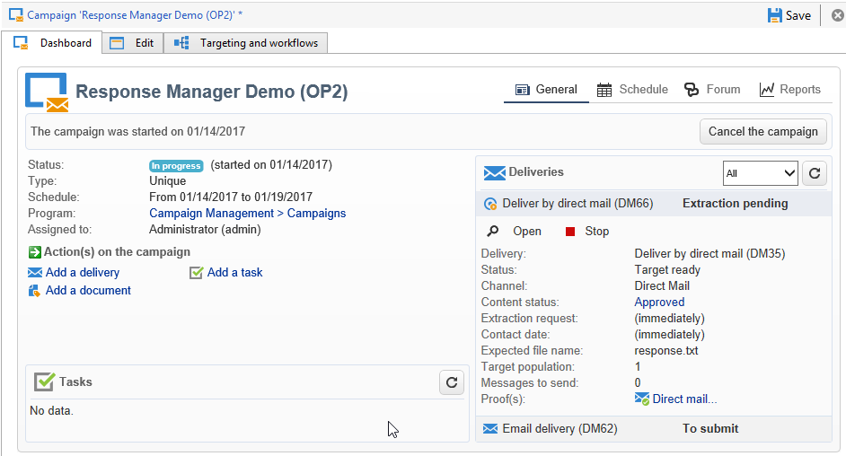

# Skapa hypoteser{#creating-hypotheses}

Det finns olika möjligheter att skapa/länka hypoteser till ett kampanjerbjudande eller en kampanjleverans:

* Via mappen genom att skapa en ny hypotes som bygger på en befintlig mall och länka den till en befintlig leverans. **[!UICONTROL Measurement hypotheses]**
* Via fliken **[!UICONTROL Edit]** > **[!UICONTROL Measurement]** i en kampanj.
* Via alternativet **[!UICONTROL Measurement]** för en leverans som skapats från en kampanj.

Hypoeser kan bara beräknas när marknadsföringskampanjen har startats och mottagarna har fått leveransen. Om hypotesen bygger på ett erbjudande måste det åtminstone presenteras och fortfarande vara aktivt. Hypoteser om erbjudanden och leveranser skapas via **[!UICONTROL Measurement hypotheses]** mappen och baseras på en hypotesmall. Det är dock möjligt att hänvisa till en hypotes direkt i leveransen eller kampanjen innan kampanjen börjar. I det här fallet beräknas hypoteserna automatiskt när marknadsföringskampanjen startas, baserat på körningsinställningar (mer information finns i [Körningsinställningar](../../campaign/using/hypothesis-templates.md#hypothesis-template-execution-settings)för hypotesmallar).

## Skapa en hypotes i farten på en leverans {#creating-a-hypothesis-on-the-fly-on-a-delivery}

Gör så här om du vill skapa en hypotes om en befintlig leverans:

>[!NOTE]
>
>Den här åtgärden är bara möjlig för väntande leveranser.

1. Gå till Adobe Campaign-trädet **[!UICONTROL Campaign management > Measurement hypotheses]**.
1. Klicka på **[!UICONTROL New]** knappen eller högerklicka på listan och välj alternativ **[!UICONTROL New]** i listrutan.

   

1. I hypotesfönstret väljer du en mall som du har skapat tidigare (se [hypotesmallar](../../campaign/using/hypothesis-templates.md)).

   

   Sammanhanget för hypotesen, så som den definierades i den valda modellen, visas i fönstret.

   >[!NOTE]
   >
   >Inställningarna som definieras i mallen och inte visas i det här steget sparas också i minnet och omtilldelas till den pågående hypotesen.

   

1. Välj den leverans som du vill skapa en hypotes för.

   

1. Du kan personalisera din hypotes genom att redigera **[!UICONTROL General]**- **[!UICONTROL Transactions]** och **[!UICONTROL Scope]** flikarna. Mer information finns i [Skapa en hypotesmodell](../../campaign/using/hypothesis-templates.md#creating-a-hypothesis-model).
1. Börja hypotesen genom att klicka **[!UICONTROL Start]**.

   Ett arbetsflöde skapas automatiskt för att utföra mätningen. Namnet definieras automatiskt beroende på hypotesens konfiguration.

   >[!CAUTION]
   >
   >Du kommer åt den om du har markerat **[!UICONTROL Keep execution workflow]** rutan.\
   >Det här alternativet måste aktiveras endast i felsökningssyfte om fel uppstår när hypotesen körs. Arbetsflöden som genereras automatiskt sparas i mappen **[!UICONTROL Administration]** > **[!UICONTROL Production]** > **[!UICONTROL Objects created automatically]** > **[!UICONTROL Campaign workflows]** i Adobe Campaign Explorer.
   > 
   >Dessutom får arbetsflöden som genereras automatiskt inte ändras. Eventuella ändringar kommer inte att beaktas någon annanstans vid senare beräkningar.
   >
   >Om du har markerat det här alternativet tar du bort arbetsflödet när det har körts.

   

   När beräkningen är klar uppdateras mätningsindikatorerna automatiskt.

   

1. Ändra inställningarna om det behövs och starta om hypotesen.

## Referera till en hypotes i en kampanjleverans {#referencing-a-hypothesis-in-a-campaign-delivery}

Du kan referera till en hypotes i en marknadsföringskampanj innan den börjar. I det här fallet kommer hypotesen att startas automatiskt när leveransen skickas, baserat på de körningsinställningar som definierats i hypotesmallen. Gör så här om du vill skapa en hypotes i en leverans:

1. Beroende på dina behov kan du skapa en eller flera **[!UICONTROL Delivery]** typmallar, vilket beskrivs i [Skapa en hypotesmodell](../../campaign/using/hypothesis-templates.md#creating-a-hypothesis-model)
1. Skapa en marknadsföringskampanj och arbetsflöden för målinriktning.
1. Klicka på **[!UICONTROL Delivery measurement]** ikonen i leveransfönstret.
1. Välj hypotesmallen (frågan som är konfigurerad i modellen visas i hypotesfönstret).

   Hypotesen beräknas automatiskt när kampanjen är avslutad, baserat på de datum som konfigurerats i modellen (se [Körningsinställningar](../../campaign/using/hypothesis-templates.md#hypothesis-template-execution-settings)för hypotesmallen).

   

## Lägga till en standardhypotes i leveranser för en kampanj {#adding-a-default-hypothesis-to-deliveries-for-a-campaign}

Ni kan hänvisa direkt till en hypotes på kampanjnivå. I det här fallet kommer hypotesen automatiskt att länkas till alla leveranser som skapats i kampanjen. Så här gör du:

1. Gå till fliken **[!UICONTROL Edit]** i kampanjen.
1. Klicka på **[!UICONTROL Default hypotheses]** fliken i mätningsavsnittet.

   

1. Klicka **[!UICONTROL Add]** och välj en hypotesmall.

   

   En hypotes som bygger på den här mallen kommer nu att refereras som standard i varje ny leverans för kampanjen.

   

Ögonblicksresultaten kan ses på hypotesens **[!UICONTROL General]** flikar och **[!UICONTROL Reactions]** på flikarna (se [Hypotesspårning](../../campaign/using/hypothesis-tracking.md))

Mer information finns också i [Exempel: skapa en hypotes kopplad till en leverans](#example--creating-a-hypothesis-linked-to-a-delivery).

## Skapa en hypotes om ett erbjudande {#creating-a-hypothesis-on-an-offer}

Att skapa en hypotes om ett offertförslag liknar att skapa en hypotes på direkten. Hypotesen kan verkställas så länge som erbjudandet är aktivt. Beräkningsperioden baseras på offertens förslagsdatum. När hypotesen låter dig länka en mottagare till ett köp kan status för det erbjudande som sannolikt accepteras ändras automatiskt (mer information finns i [Transaktioner](../../campaign/using/hypothesis-templates.md#transactions)).

1. Skapa en eller flera **[!UICONTROL Offer]** typmodeller enligt beskrivningen i [Skapa en hypotesmodell](../../campaign/using/hypothesis-templates.md#creating-a-hypothesis-model).
1. Gå till **[!UICONTROL Campaign management > Measurement hypotheses]** noden.
1. Skapa en **[!UICONTROL Offers]** typografi genom att markera den tidigare skapade modellen.

   

   Frågan som skapas i modellen visas i fönstret.

   

1. Välj det erbjudande du vill skapa en hypotes för.

   

1. Förfina frågan om det behövs.
1. Klicka **[!UICONTROL Start]** för att köra hypotesen.
1. Trottoarresultaten kan visas på dess **[!UICONTROL General]** och **[!UICONTROL Reactions]** dess flikar (se även [Hypotesspårning](../../campaign/using/hypothesis-tracking.md)).

   Det finns referenser till hypoteser om ett erbjudande på **[!UICONTROL Measurement]** fliken.

   

   Om alternativet **[!UICONTROL Update offer proposition status]** aktiverades i hypotesmallen ändras status för erbjudandeförslaget automatiskt, vilket ger återkoppling om kampanjens effekt (mer information finns i [Transaktioner](../../campaign/using/hypothesis-templates.md#transactions)).

## Exempel: skapa en hypotes kopplad till en leverans {#example--creating-a-hypothesis-linked-to-a-delivery}

I det här exemplet vill vi skapa en hypotes kopplad till en leverans. Den här hypotesen kommer att baseras på den modell som skapats tidigare (se [Exempel: skapa en hypotesmall för en leverans](../../campaign/using/hypothesis-templates.md#example--creating-a-hypothesis-template-on-a-delivery)). Därefter förfinar vi frågan som ärvts från modellen så att vi kan göra en hypotes om en viss artikel i inköpstabellen.

1. Skapa en kampanj och en leverans (mer information finns i [Skapa en kampanj](../../campaign/using/setting-up-marketing-campaigns.md#creating-a-campaign)).

   Vi använder till exempel en direktutskick.

1. Konfigurera en startadress: den tidigare skapade hypotesmallen har konfigurerats för att ta hänsyn till en kontrollgrupp i reaktionsresultaten.

   

   >[!NOTE]
   >
   >Mer information finns i [Definiera en kontrollgrupp](../../campaign/using/marketing-campaign-deliveries.md#defining-a-control-group).

1. Öppna **[!UICONTROL Direct mail delivery]** och klicka på **[!UICONTROL Delivery measurement]** ikonen och klicka sedan på **[!UICONTROL Add]**.

   

1. Välj den tidigare skapade hypotesmallen i listrutan.

   

   Frågan som skapas i modellen visas.

   

1. Klicka **[!UICONTROL Edit query...]** och förfina frågan genom att ange den produkt som hypotesen ska beröra.

   

   Du kan kontrollera att hypotesen är kopplad till leveransen på fliken **[!UICONTROL Edit]** > **[!UICONTROL Measurement]** i kampanjen.

   

1. Starta målarbetsflödet och kör nödvändiga kontroller tills kampanjen är klar (mer information finns i [Påbörja leverans](../../campaign/using/marketing-campaign-deliveries.md#starting-a-delivery)).

   

1. I trädet Adobe Campaign går du till noden för att kontrollera de indikatorer som beräknats utifrån hypotesen. **[!UICONTROL Campaign management > Measurement hypotheses]**

   

