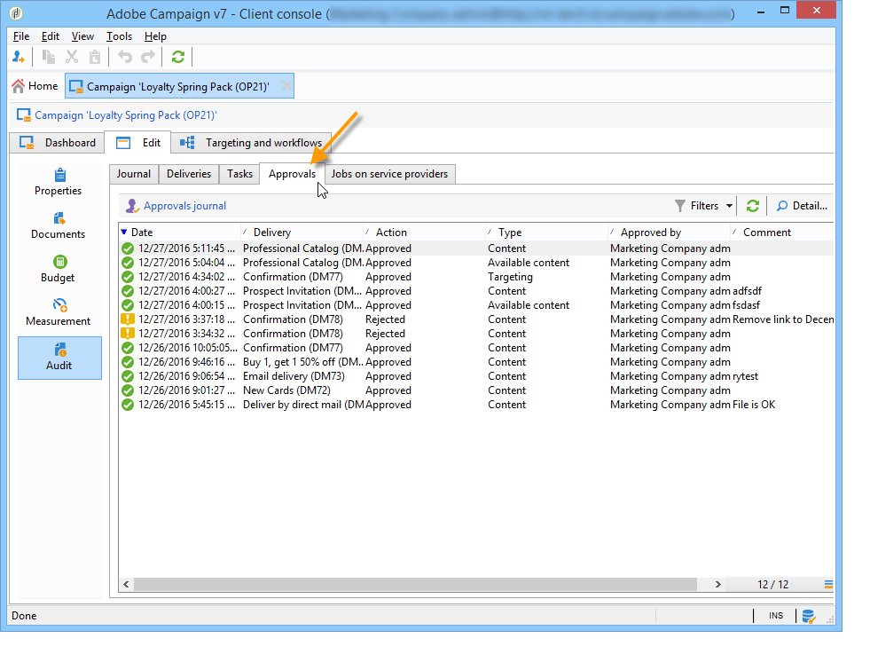
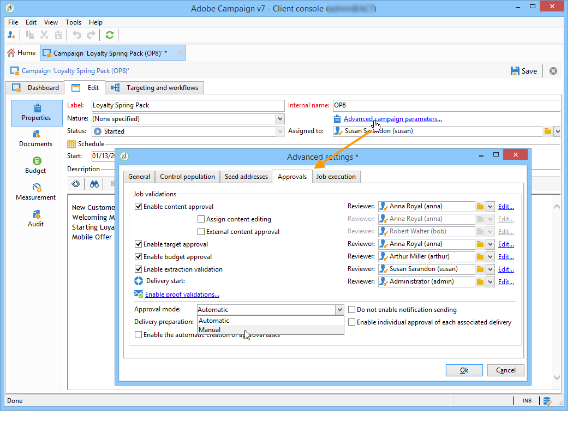
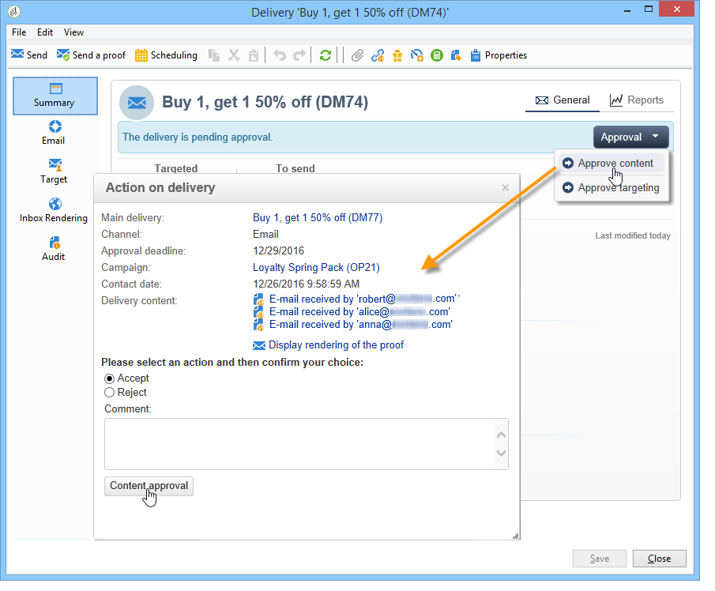
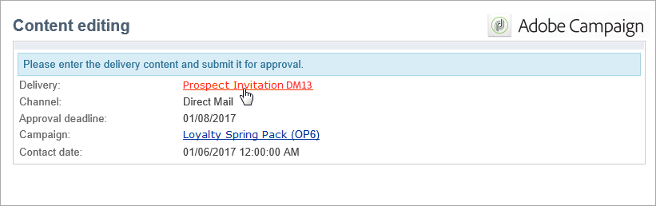
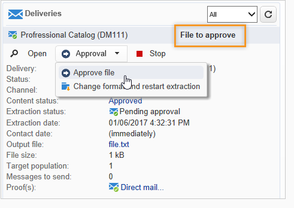

# Konfigurera och hantera godkännandeprocessen {#approving-marketing-campaigns}

Varje steg i en leverans kan godkännas för att säkerställa full övervakning och kontroll av kampanjens olika processer: målgruppsanpassning, innehåll, budget, extrahering och utskick av ett bevis.

Meddelanden skickas till de Adobe Campaign-operatörer som är utsedda granskare för att informera dem om en ansökan om godkännande. Kontrollera att granskarna har **behörighet** för godkännande och att deras säkerhetszon är korrekt definierad. [Läs mer](#selecting-reviewers).

Godkännandeproceduren presenteras i [det här avsnittet](#checking-and-approving-deliveries).

>[!NOTE]
>
>Endast leveransägaren kan påbörja en leverans. För att en annan operator (eller operatörsgrupp) ska kunna starta en leverans måste du lägga till dem som granskare i fältet **[!UICONTROL Delivery start:]**.\
>[Läs mer](#selecting-reviewers).

## Verksamhetsprincip {#operating-principle-}

Standardmeddelandet för budgetgodkännande är till exempel följande:

Granskningsoperatorerna kan sedan välja att godkänna budgeten eller inte.

När operatorn validerar vidarebefordras godkännande eller avvisning av jobbet till kontrollpanelen för leverans.

Informationen är också tillgänglig i kampanjens godkännandeloggar. Loggarna nås via fliken **[!UICONTROL Edit > Tracking > Approvals]**.

Dessa meddelanden skickas till de operatorer som påverkas av varje process som har aktiverats för godkännande.

Godkännanden kan aktiveras för kampanjmallen, för varje enskild kampanj eller för en leverans.

Alla jobb som kräver godkännande markeras i kampanjmallen ( **[!UICONTROL Properties]** > **[!UICONTROL Advanced campaign settings...]** > fliken **[!UICONTROL Approvals]**), liksom de operatorer som ansvarar för godkännandet (de får meddelanden, om inte det här alternativet är aktiverat). Mer information om detta finns i [det här avsnittet](#approving-processes).

De här inställningarna kan åsidosättas för varje kampanj som skapas med den här mallen och individuellt för varje kampanjleverans: klicka på knappen **[!UICONTROL Properties]** och sedan på fliken **[!UICONTROL Approvals]**.

I följande exempel kommer leveransinnehållet inte att kräva godkännande:

## Välj granskare {#selecting-reviewers}

För varje typ av godkännande väljs de operatörer eller operatörsgrupper som ansvarar för godkännandet i den nedrullningsbara listan i leveransen. Fler operatorer kan läggas till med länken **[!UICONTROL Edit...]**. I det här fönstret kan du även redigera deadline för godkännande.

Om ingen granskare anges ansvarar kampanjhanteraren för godkännande och får meddelanden. Kampanjhanteraren anges på fliken **[!UICONTROL Edit > Properties]** i kampanjen:

>[!NOTE]
>
>Alla andra Adobe Campaign-operatorer med **[!UICONTROL Administrator]**-rättigheter kan också godkänna jobb, men de får inga meddelanden.\
>Som standard kan kampanjledaren inte genomföra godkännandet eller starta leveranserna om godkännandeoperatorer har definierats. Du kan ändra det här beteendet och auktorisera kampanjhanteraren att godkänna/starta leveranser genom att skapa alternativet **NmsCampaign_Activate_OwnerConfirmation** med **1** som ett värde.

## Godkännandelägen {#approval-modes}

### Godkännande via kontrollpanelen {#approval-via-the-dashboard}

Om du vill godkänna ett jobb via konsolen eller webbgränssnittet klickar du på lämplig länk på kontrollpanelen för kampanjer. Jobb kan också godkännas via leveransspårning eller via kontrollpanelen för leverans.

Kontrollera den information som ska godkännas, välj om du vill godkänna eller inte och ange en kommentar om det behövs. Klicka på **[!UICONTROL Ok]** för att spara.

>[!NOTE]
>
>Om en process redan har godkänts av en annan operator är godkännandelänken inte tillgänglig.

### Godkännande via aviseringsmeddelanden {#approval-via-notification-messages}

Klicka på länken som finns i meddelandet (se [Meddelanden](#notifications)). Du måste logga in enligt nedan:

Välj **[!UICONTROL Accept]** eller **[!UICONTROL Reject]** och ange en kommentar om det behövs.

Klicka på **[!UICONTROL Validate]**.

>[!NOTE]
>
>Om varningar utlöstes under processen visas en varning i meddelandet.

### Godkännandespårning {#approval-tracking}

Informationen finns på flera ställen:

* **[!UICONTROL Approvals]**-underfliken på fliken **[!UICONTROL Edit > Tracking]** i loggen för kampanjgodkännande:

   

* **[!UICONTROL Deliveries]**-underfliken på fliken **[!UICONTROL Edit > Tracking]** i kampanjleveransloggen:

   

* Godkännandestatusen för varje leverans kan visas genom att klicka på alternativet **[!UICONTROL Hide/show log]** på fliken **[!UICONTROL Summary]**.

   

* Den här informationen kan även nås via fliken **[!UICONTROL Tracking > Approvals]** för varje leverans:

   

>[!NOTE]
>
>När en operator har godkänt eller avvisat ett jobb kan de andra granskarna inte längre agera på godkännandet.

### Automatiskt och manuellt godkännande {#automatic-and-manual-approval}

När du skapar ett arbetsflöde för målinriktning, om godkännande är automatiskt (standardläge), visar Adobe Campaign godkännandelänken eller skickar ett meddelande så snart ett godkännande krävs.

Om du vill välja godkännandeläge (manuellt eller automatiskt) klickar du på fliken **[!UICONTROL Edit > Properties]** i kampanj- eller kampanjmallen, sedan på **[!UICONTROL Advanced campaign settings...]** och slutligen på fliken **[!UICONTROL Approvals]**.

>[!NOTE]
>
>Det valda godkännandeläget gäller alla leveranser av kampanjen.

När ett arbetsflöde med målinriktning skapas kan du med manuellt godkännande undvika att skapa godkännandelänkar eller skicka meddelanden automatiskt. Kampanjinstrumentpanelen erbjuder sedan en **[!UICONTROL Submit targeting for approval]**-länk för att starta godkännandeprocessen manuellt.

Med ett bekräftelsemeddelande kan du auktorisera godkännanden för de jobb som valts för den här leveransen.

Godkännandeknapparna visas sedan på kontrollpanelen för kampanjer (för den här leveransen), på kontrollpanelen för leveranser och i leveransspårningen. Om meddelanden är aktiverade skickas de parallellt.

Med den här metoden kan du aktivera godkännanden utan att skicka falska meddelanden till granskarna.

## Meddelanden {#notifications}

Meddelanden är specifika e-postmeddelanden som skickas till granskarna för att informera dem om att en process väntar på godkännande. När operatorn klickar på länken i meddelandet visas en autentiseringssida, och efter inloggningen kan operatorn visa informationen och godkänna eller avvisa jobbet. En kommentar kan också anges i godkännandefönstret.

Innehållet i e-postmeddelanden kan personaliseras. Se [Meddelandeinnehåll](#notification-content).

### Aktivera/inaktivera meddelande {#enabling-disabling-notification}

Som standard skickas aviseringsmeddelanden om godkännandet av det relaterade jobbet är aktiverat i kampanjmallen, kampanjen eller leveransen. Meddelanden kan dock inaktiveras för att endast auktorisera godkännanden från konsolen.

Om du vill göra det redigerar du godkännandefönstret för kampanj- eller kampanjmallen ( **[!UICONTROL Edit > Properties]** > **[!UICONTROL Advanced campaign settings...]** > fliken **[!UICONTROL Approvals]**) och väljer **[!UICONTROL Do not enable notification sending]**.

### Meddelandeinnehåll {#notification-content}

Meddelandeinnehåll definieras i en specifik mall: **[!UICONTROL Notification of validations for the marketing campaign]**. Den här mallen sparas i mappen **[!UICONTROL Administration > Campaign management > Technical delivery templates]** i Adobe Campaign-trädet.

## Granska och godkänn leveranser {#checking-and-approving-deliveries}

Med Adobe Campaign kan ni skapa godkännandeprocesser för de viktigaste stegen i marknadsföringskampanjen i samverkansbaserat läge.

För direktutskick kan Adobe Campaign-operatörer visa extraheringsfilen innan den skickas till routern, och om det behövs kan de ändra formatet och starta extraheringen igen. Se [Godkänn en extraheringsfil](#approving-an-extraction-file).

För varje kampanj kan du godkänna leveransmålet, innehållet (se [Godkänn innehåll](#approving-content)) och kostnaderna. Adobe Campaign-operatörer som ansvarar för godkännande kan meddelas via e-post och kan godkänna eller avvisa godkännanden från konsolen eller via en webbanslutning. Se [Steg för att godkänna en leverans](#approving-processes).

När dessa valideringsfaser är klara kan leveransen startas. [Läs mer](../../campaign/using/marketing-campaign-deliveries.md#starting-a-delivery).

### Steg för att godkänna en leverans {#approving-processes}

De faser som kräver godkännande visas på kampanjkontrollpanelen (via konsolen i webbgränssnittet). De visas också i leveransspårningstabellen och på leveransinstrumentpanelen.

Nu är kampanjens status **[!UICONTROL To validate]**.

>[!NOTE]
>
>Om du vill välja de processer som kräver ett godkännande ändrar du kampanjmallen. Mer information finns i [Kampanjmallar](../../campaign/using/marketing-campaign-templates.md#campaign-templates).

>[!NOTE]
>
>Om ett fel som är länkat till ett konfigurationsproblem uppstår under meddelandeförberedelsen i ett målarbetsflöde visas länken **[!UICONTROL Restart message preparation]** på kontrollpanelen. Åtgärda felet och klicka på den här länken för att starta om meddelandeförberedelsen samtidigt som målfasen kringgås.

För varje leverans i kampanjen kan du godkänna följande processer:

* **Målgruppsanpassning, innehåll och budget**

   När alternativen **[!UICONTROL Enable target approval]**, **[!UICONTROL Enable content approval]** eller **[!UICONTROL Enable budget approval]** väljs i inställningsfönstret för jobbgodkännande visas de relevanta länkarna i kontrollpanelen för kampanjen för de aktuella leveranserna.

   >[!NOTE]
   >
   >Budgetgodkännande är bara tillgängligt om riktade godkännanden är aktiverat i fönstret för godkännandeinställningar. Länken för budgetgodkännande visas bara när målet har analyserats. Länken visas också tillsammans med länken för målgodkännande.

   Om alternativen **[!UICONTROL Assign content editing]** eller **[!UICONTROL External content approval]** har valts i fönstret för godkännandeinställningar visas länkarna **[!UICONTROL Available content]** och **[!UICONTROL External content approval]** på kontrollpanelen.

   Med godkännande av innehåll får du åtkomst till de skickade korrekturen.

* **Godkännande av utdrag (direktutskick)**

   När **[!UICONTROL Enable extraction approval]** har valts i fönstret för godkännandeinställningar måste den extraherade filen godkännas innan routern kan meddelas.

   En **[!UICONTROL Approve content]**-länk är tillgänglig på kampanjinstrumentpanelen enligt nedan:

   

   Extraheringsfiler kan förhandsgranskas via rutan för godkännande och sedan accepteras eller avvisas.

   

   >[!NOTE]
   >
   >Förhandsgranskningen av extraheringsfilen gäller endast ett dataexempel. Hela utdatafilen läses inte in.

* **Godkänner associerade leveranser**

   Alternativet **[!UICONTROL Enable individual approval of each associated delivery]** används för en huvudleverans som är associerad med sekundära leveranser. Som standard är det här alternativet inte markerat så att ett övergripande godkännande av huvudleveransen kan utföras. Om du väljer det här alternativet måste varje leverans godkännas individuellt.

   

### Välj processer som ska godkännas {#choosing-the-processes-to-be-approved}

Godkännandefaserna definieras med den mall som är associerad med kampanjen. Du måste välja vilka element som ska godkännas från mallen och ange vilka Adobe Campaign-operatorer som ansvarar för godkännandena. Mer information om kampanjmallar finns i [det här avsnittet](../../campaign/using/marketing-campaign-templates.md#campaign-templates).

>[!NOTE]
>
>Godkännandekonfigurationen för kampanjen (eller kampanjmallen) gäller för alla framtida leveranser som är länkade till den här kampanjen. Konfigurationsändringar kommer inte att tillämpas på tidigare leveranser.

Den här informationen kan åsidosättas för varje kampanj och varje leverans.

Om det gäller en kampanj klickar du på fliken **[!UICONTROL Edit > Properties]**, sedan på länken **[!UICONTROL Advanced campaign settings...]** och slutligen på underfliken **[!UICONTROL Approvals]** för att komma åt sidan för godkännandekonfiguration.

Du kan markera och avmarkera de processer som ska godkännas och utse Adobe Campaign-operatörer som ansvarar för godkännandet. Det kan vara enskilda operatorer, en grupp operatorer eller en lista med operatorer.

Om du vill välja en lista med operatorer klickar du på länken **[!UICONTROL Edit...]** till höger om fältet som anger den första granskaren och lägger till så många operatorer som behövs, enligt nedan:

>[!NOTE]
>
>* Om en lista över granskare definieras, godkänns ett jobb när en granskare har godkänt det. Länken för godkännande finns inte längre på kontrollpanelen. Om en annan granskare klickar på länken för godkännande i meddelandet när meddelanden har skickats, får de ett meddelande om att en annan operator redan har godkänt jobbet.
>* Du kan definiera ett godkännandeschema för kampanjen i den nedre delen av granskningsfönstret. Som standard har granskarna tre dagar på sig att godkänna en process från och med överföringsdatumet. Det är möjligt att konfigurera en påminnelse som automatiskt skickas till de berörda operatörerna före godkännandedeadline.
>* Du kan lägga till påminnelser från det här avsnittet.

>

För varje leverans klickar du på knappen **[!UICONTROL Audit]** och fliken **[!UICONTROL Approvals]** för att visa och redigera godkännandedatum och automatiska påminnelser.

>[!NOTE]
>
>Den här fliken är tillgänglig när innehållsgodkännandeprocessen har startats.

### Godkänn ett innehåll {#approving-content}

>[!CAUTION]
>
>För att godkänna ett innehåll är en korrekturcykel obligatorisk. Med korrektur kan du godkänna visningen av information, personaliseringsdata och kontrollera att länkar fungerar. Lär dig hur du skapar ett korrektur i [det här avsnittet](../../delivery/using/steps-validating-the-delivery.md#sending-a-proof).
>
>De funktioner för godkännande av innehåll som beskrivs nedan avser leveransbeviset.

Det går att konfigurera en innehållsgodkännandecykel. Det gör du genom att välja alternativet **[!UICONTROL Enable content approval]** i fönstret för godkännandeinställningar. Huvudstegen i innehållsgodkännandecykeln är:

1. När en ny leverans har skapats klickar kampanjhanteraren på länken **[!UICONTROL Submit content]** på kontrollpanelen för kampanjer för att starta innehållsgodkännandecykeln.

   

   >[!NOTE]
   >
   >Om alternativen **[!UICONTROL Enable the sending of proofs]** (för e-postleveranser) eller **[!UICONTROL Enable the sending and approval of proofs]** (för direkte-postleveranser) har valts i fönstret för godkännandeinställningar skickas korrektur automatiskt.

1. Ett e-postmeddelande skickas till den person som ansvarar för innehållet, som kan välja om det ska godkännas eller inte:

   * via e-postmeddelandet:

      

      >[!NOTE]
      >
      >E-postmeddelandet innehåller en länk till de korrektur som redan har skickats, och eventuellt till en återgivning av meddelandet för de olika webbreformaten, om alternativet **Deliverability** är aktiverat för den här instansen.

   * via konsolen eller webbgränssnittet, leveransspårning, kontrollpanelen för leverans eller kontrollpanelen för kampanjer:

      

      >[!NOTE]
      >
      >På den här kampanjkontrollpanelen kan du visa en lista över de korrektur som har skickats genom att klicka på länken **[!UICONTROL Inbox rendering...]**. Om du vill visa innehållet klickar du på ikonen **[!UICONTROL Detail]** till höger om listan.

      

1. Ett e-postmeddelande skickas till den person som är ansvarig för kampanjen som informerar dem om huruvida innehållet har godkänts eller inte.

   >[!NOTE]
   >
   >Den person som ansvarar för kampanjen kan när som helst starta om innehållsgodkännandecykeln. Det gör du genom att klicka på länken på raden **[!UICONTROL Content status]** på kontrollpanelen för kampanjer (på leveransnivå) och sedan klicka på **[!UICONTROL Reset content approval to submit it again]**.

   

#### Tilldela redigering av innehåll {#assign-content-editing}

Med det här alternativet kan du definiera någon som ansvarar för redigering av innehåll, till exempel en webbmaster. Om alternativet **[!UICONTROL Assign content editing]** är markerat i fönstret för godkännandeinställningar läggs flera godkännandesteg till mellan att leveransen skapas och att meddelandet levereras till den person som ansvarar för innehållet:

1. När en ny leverans har skapats klickar den person som ansvarar för kampanjen på länken **[!UICONTROL Submit content editing]** på kontrollpanelen för kampanjer för att starta redigeringscykeln för innehållet.

   

1. Den person som ansvarar för redigering av innehåll får ett e-postmeddelande om att innehållet är tillgängligt.

   

1. De kan sedan logga in på konsolen, öppna leveransen och redigera den med en förenklad guide för att ändra motiv, HTML och textinnehåll samt skicka korrektur.

   

   >[!NOTE]
   >
   >Om alternativen **[!UICONTROL Enable the sending of proofs]** (för e-postleveranser) eller **[!UICONTROL Enable the sending and approval of proofs]** (för direkte-postleveranser) har valts i fönstret för godkännandeinställningar skickas korrektur automatiskt.

1. När den person som ansvarar för redigeringen av innehållet är klar med alla ändringar av leveransinnehållet kan han eller hon göra innehållet tillgängligt.

   För att göra detta kan de

   * klicka på länken **[!UICONTROL Available content]** via Adobe Campaign-konsolen.

      

   * klicka på länken i meddelandet och godkänn sedan innehållstillgängligheten.

      

      Operatören kan lägga till en kommentar innan innehållet skickas till den person som ansvarar för kampanjen.

      

      I meddelandet kan granskaren godkänna eller avvisa innehållet.

      

#### Godkännande av externt innehåll {#external-content-approval}

Med det här alternativet kan du definiera en extern operatör som ansvarar för att godkänna leveransåtergivning, som enhetlig varumärkeskommunikation, priser osv. När alternativet **[!UICONTROL External content approval]** har valts i fönstret för godkännandeinställningar läggs flera godkännandesteg till mellan innehållsgodkännandet och leveransen av meddelandet till den person som ansvarar för kampanjen:

1. Den externa innehållshanteraren får ett e-postmeddelande om att innehållet har godkänts och begär externt godkännande.
1. E-postmeddelandet innehåller länkar till skickade korrektur, som gör att du kan visa leveransåtergivning, och en knapp för att godkänna eller avvisa leveransinnehållet.

   >[!NOTE]
   >
   >Länkarna är bara tillgängliga om ett eller flera korrektur har skickats. I annat fall är leveransåtergivning bara tillgängligt via konsolen eller webbgränssnittet.

   

### Godkänn en extraheringsfil {#approving-an-extraction-file}

För offlineleveranser genererar Adobe Campaign en extraheringsfil som, beroende på hur den är konfigurerad, skickas till routern. Dess innehåll beror på vilken exportmall som används.

När innehåll, mål och budget har godkänts ändras leveransen till **[!UICONTROL Extraction pending]** tills extraheringsarbetsflödet för kampanjerna startas.

På extraheringsbegärandedatumet skapas extraheringsfilen och leveransstatusen ändras till **[!UICONTROL File to approve]**.

Du kan visa innehållet i den extraherade filen (genom att klicka på filens namn), godkänna den eller, om det behövs, ändra formatet och starta extraheringen igen med hjälp av länkarna på kontrollpanelen.

När filen har godkänts kan du skicka e-postmeddelandet till routern. Mer information finns i [Starta en offlineleverans](../../campaign/using/marketing-campaign-deliveries.md#starting-an-offline-delivery).
