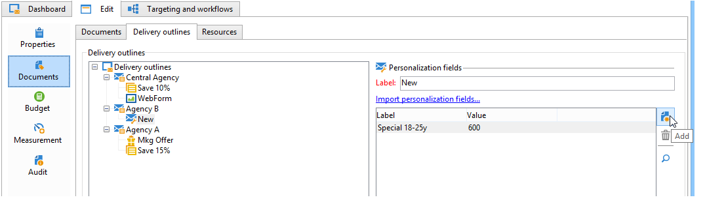

# Hantera associerade dokument {#managing-associated-documents}

Du kan koppla olika dokument till en kampanj: rapporter, foton, webbsidor, diagram osv. Dessa dokument kan ha vilket format som helst (Microsoft Word, PowerPoint, PNG, JPG, Acrobat PDF).

>[!IMPORTANT]
>
>Den här funktionen är reserverad för små resurser och dokument.

I en kampanj kan du även hänvisa till andra saker, som kampanjkuponger, specialerbjudanden som gäller ett visst varumärke eller en viss butik, osv. När dessa element ingår i en disposition kan de kopplas till en direktutskick. Se [Associera och strukturera resurser som är länkade via en leveransöversikt](#associating-and-structuring-resources-linked-via-a-delivery-outline).

>[!NOTE]
>
>Om du använder modulen för hantering av marknadsföringsresurser för Campaign kan du även hantera ett bibliotek med marknadsföringsresurser som är tillgängliga för flera användare för samarbete. [Läs mer](../../mrm/using/managing-marketing-resources.md).

## Lägga till dokument {#adding-documents}

Dokument kan kopplas på kampanjnivå (sammanhangsberoende dokument) eller på programnivå (allmänna dokument).

The **[!UICONTROL Documents]** -fliken innehåller:

* Listan över alla dokument som krävs för innehållet (mall, bilder osv.) som kan laddas ned lokalt av Adobe Campaign-operatörer med lämpliga rättigheter,
* Dokument som innehåller information för routern, om sådan finns.

Dokumenten är länkade till programmet eller kampanjen via **[!UICONTROL Edit > Documents]** -fliken.

Du kan också lägga till ett dokument i en kampanj via länken på kontrollpanelen.

Klicka på **[!UICONTROL Details]** -ikon för att visa innehållet i en fil och lägga till information:

På kontrollpanelen grupperas dokument som är kopplade till kampanjen i **[!UICONTROL Document(s)]** som i följande exempel:

De kan också redigeras och ändras i den här vyn.

## Associera och strukturera resurser som är länkade via en leveransöversikt {#associating-and-structuring-resources-linked-via-a-delivery-outline}

>[!NOTE]
>
>Leveranskonturer används endast i samband med direktreklamkampanjer.

En leveransöversikt betecknar en strukturerad uppsättning element (dokument, butiker, kampanjkuponger osv.) som skapats av företaget och för en viss kampanj.

Dessa element grupperas i leveransdispositioner och varje leveransdisposition kopplas till en leverans. den kommer att refereras i extraheringsfilen som skickas till **tjänstleverantör** för att bifogas leveransen. Du kan till exempel skapa en leveransdisposition som refererar till en gren och de marknadsföringsbroschyrer som används i den.

För en kampanj kan du strukturera externa element som ska kopplas till leveransen enligt vissa kriterier: närliggande filial, kampanjerbjudande, inbjudan till ett lokalt evenemang osv.

### Skapa en disposition {#creating-an-outline}

Om du vill skapa en kontur klickar du på **[!UICONTROL Delivery outlines]** underflik i **[!UICONTROL Edit > Documents]** fliken för den berörda kampanjen.

>[!NOTE]
>
>Om den här fliken inte finns är den här funktionen inte tillgänglig för kampanjen. Se kampanjmallskonfigurationen.
>   
>Mer information om mallar finns i [det här avsnittet](../../campaign/using/marketing-campaign-templates.md#campaign-templates).

Klicka på **[!UICONTROL Add a delivery outline]** och skapa en hierarki av konturer för kampanjen:

1. Högerklicka på trädets rot och välj **[!UICONTROL New > Delivery outlines]**.
1. Högerklicka på den kontur du just har skapat och markera **[!UICONTROL New > Item]** eller **[!UICONTROL New > Personalization fields]**.

En disposition kan innehålla objekt och personaliseringsfält, resurser och erbjudanden:

* Objekten kan till exempel vara fysiska dokument som refereras och beskrivs här och bifogas till leveransen.
* Med personaliseringsfält kan du skapa personaliseringselement för leveranser i stället för mottagare. Det är därför möjligt att skapa värden som ska användas i leveranser för ett specifikt mål (välkomsterbjudande, rabatt osv.) De skapas i Adobe Campaign och importeras till dispositionen via **[!UICONTROL Import personalization fields...]** länk.

   

   Du kan också skapa dem direkt i dispositionen genom att klicka på **[!UICONTROL Add]** till höger om listzonen.

   

* Resurserna är marknadsföringsresurser som genereras i kontrollpanelen för marknadsföringsresurser som nås via **[!UICONTROL Resources]** länk till **[!UICONTROL Campaigns]** -fliken.

   

   >[!NOTE]
   >
   >Mer information om marknadsföringsresurser finns i [det här avsnittet](../../mrm/using/managing-marketing-resources.md).

### Markera en kontur {#selecting-an-outline}

För varje leverans kan du välja den disposition som ska kopplas från det avsnitt som är reserverat för dispositionen, som i följande exempel:

Den markerade dispositionen visas sedan i fönstrets nedre del. Den kan redigeras med ikonen till höger om fältet eller ändras med hjälp av listrutan:

The **[!UICONTROL Summary]** på leveransfliken visas även följande information:

### Extraheringsresultat {#extraction-result}

I den fil som extraheras och skickas till tjänsteleverantören, namnet på konturen och, i förekommande fall, dess egenskaper (kostnad, beskrivning osv.) läggs till i innehållet enligt informationen i exportmallen som är kopplad till tjänsteleverantören.

I följande exempel läggs etiketten, den uppskattade kostnaden och beskrivningen av dispositionen som är kopplad till leveransen till i extraheringsfilen.

Exportmodellen måste vara kopplad till den tjänsteleverantör som valts för den aktuella leveransen. Se [det här avsnittet](../../campaign/using/providers--stocks-and-budgets.md#creating-service-providers-and-their-cost-structures).

>[!NOTE]
>
>Mer information om export finns i [det här avsnittet](../../platform/using/get-started-data-import-export.md) -avsnitt.
