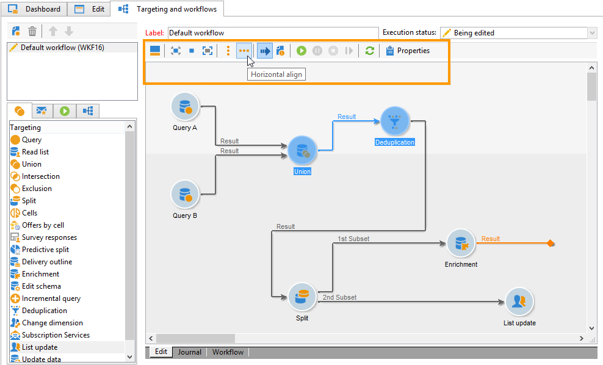
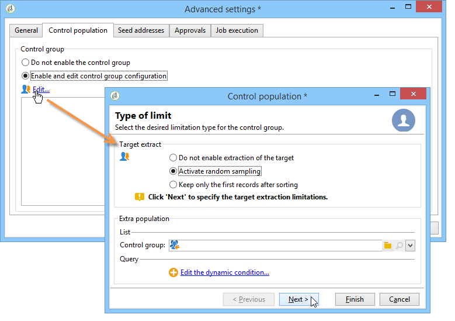
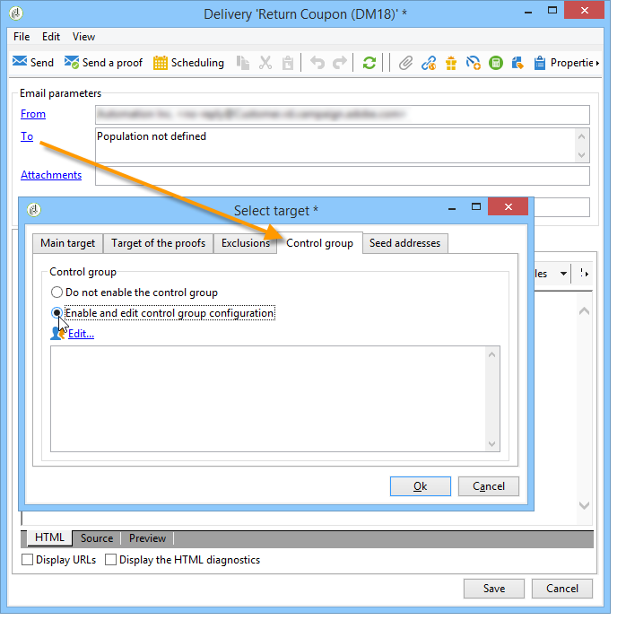

# Leveranser av marknadsföringskampanjer {#marketing-campaign-deliveries}

Leveranser kan skapas via kampanjkontrollpanelen, ett kampanjarbetsflöde eller direkt via leveransöversikten.

## Skapa leveranser {#creating-deliveries}

Om du vill skapa en leverans som är länkad till en kampanj klickar du på **[!UICONTROL Add a delivery]** länken på kontrollpanelen för kampanjer.

De föreslagna konfigurationerna är anpassade för de olika leveranstyperna (direktreklam, e-post, mobilkanaler, fax eller telefon).

>[!NOTE]
>
>Mer information om hur du skapar och konfigurerar leveranser finns i avsnittet [Skicka meddelanden](../../delivery/using/communication-channels.md) .

## Välja målpopulation {#selecting-the-target-population}

För varje leverans definierar kampanjchefen:

* Huvudmålet. Mer information finns i [Skapa huvudmålet i ett arbetsflöde](#building-the-main-target-in-a-workflow) och [Välja målpopulation](#selecting-the-target-population).
* Kontrollgruppen. Mer information finns i [Definiera en kontrollgrupp](#defining-a-control-group).
* Startadresserna. Mer information finns i [det här avsnittet](../../delivery/using/about-seed-addresses.md).

En del av den här informationen ärvs från mallen.

>[!NOTE]
>
>Kampanjmallar finns i [Campaign-mallar](../../campaign/using/marketing-campaign-templates.md#campaign-templates).

Om du vill skapa leveransmålet kan du definiera filtervillkor för mottagarna i databasen. Det här mottagarläget visas i avsnittet [Skicka meddelanden](../../delivery/using/steps-defining-the-target-population.md) .

### Exempel: leverera till en grupp mottagare {#example--delivering-to-a-group-of-recipients}

Du kan importera en population till en lista och sedan ange den här listan som mål i leveranser.

1. Om du vill göra det redigerar du den aktuella leveransen och klickar på **[!UICONTROL To]** länken för att ändra målpopulationen.

1. Markera **[!UICONTROL Main target]** alternativet på **[!UICONTROL Defined via the database]** fliken och klicka på **[!UICONTROL Add]** för att välja mottagare.

1. Välj **[!UICONTROL A list of recipients]** och klicka **[!UICONTROL Next]** för att markera den.

### Bygga huvudmålet i ett arbetsflöde {#building-the-main-target-in-a-workflow}

Huvudmålet för en leverans kan också definieras i målarbetsflödet: I den grafiska miljön kan du skapa mål med hjälp av frågor, tester och operatorer: union, borttagning av dubbletter, delning osv.

Handboken [Automatisera med arbetsflöden](../../workflow/using/executing-a-workflow.md#architecture) innehåller en detaljerad beskrivning av hur arbetsflödesmodulen fungerar.

>[!IMPORTANT]
>
>I samma kampanj kan du inte konfigurera fler än 28 arbetsflöden. Tidigare är ytterligare arbetsflöden inte synliga i gränssnittet och kan generera fel.

#### Skapa ett målarbetsflöde {#creating-a-targeting-workflow}

Målinriktning kan skapas med en kombination av filtreringsvillkor i en grafisk sekvens i ett arbetsflöde. Ni kan skapa populationer och underpopulationer som ska anpassas efter era behov. Om du vill visa arbetsflödesredigeraren klickar du på **[!UICONTROL Targeting and workflows]** fliken på kontrollpanelen för kampanjer.

Målpopulationen extraheras från Adobe Campaign-databasen via en eller flera frågor i ett arbetsflöde. Mer information om hur du skapar en fråga finns i [det här avsnittet](../../workflow/using/query.md).

Du kan starta frågor och dela populationer via rutor som Union, Intersection, Sharing, Exclusion osv.

Markera objekten i listorna till vänster om arbetsytan och länka dem för att skapa målet.

I diagrammet länkar du upp de mål- och planeringsfrågor som krävs för målkonstruktion i diagrammet. Du kan utföra målinriktningen medan konstruktionen pågår för att kontrollera populationen som extraherats från databasen.

>[!NOTE]
>
>Exempel och procedurer för att definiera frågor finns i [det här avsnittet](../../workflow/using/query.md).

I den vänstra delen av redigeraren finns ett bibliotek med grafiska objekt som representerar aktiviteter. Den första fliken innehåller målinriktningsaktiviteterna och den andra fliken innehåller flödeskontrollaktiviteterna, som används ibland för att samordna målinriktningsaktiviteter.

Körnings- och formateringsfunktionerna för målarbetsflödet är tillgängliga via verktygsfältet för diagramredigering.

>[!NOTE]
>
>Vilka aktiviteter som finns tillgängliga för att skapa diagrammet och alla funktioner för visning och layout finns i guiden [Automating with workflows](../../workflow/using/executing-a-workflow.md#architecture) .

Ni kan skapa flera arbetsflöden för målinriktning för en enskild kampanj. Så här lägger du till ett arbetsflöde:

1. Gå till den övre vänstra delen av arbetsflödeszonen, högerklicka och välj **[!UICONTROL Add]**. Du kan också använda knappen som finns ovanför den här zonen **[!UICONTROL New]** .

   

1. Välj **[!UICONTROL New workflow]** mall och ge arbetsflödet ett namn.
1. Klicka **[!UICONTROL OK]** för att bekräfta att arbetsflödet har skapats och skapa sedan diagrammet för arbetsflödet.

#### Köra ett arbetsflöde {#executing-a-workflow}

Målarbetsflöden kan startas manuellt med knappen i verktygsfältet, förutsatt att du har rätt behörighet. **[!UICONTROL Start]**

Målinriktningen kan programmeras för automatisk körning enligt ett schema (schemaläggare) eller en händelse (extern signal, filimport osv.).

Åtgärder som rör körning av målarbetsflödet (starta, stoppa, pausa, osv.) är **asynkrona** processer: kommandot sparas och börjar gälla så fort servern är tillgänglig för att använda det.

Med verktygsfältsikonerna kan du utföra åtgärder för arbetsflödet.

* Starta eller starta om

   * Med **[!UICONTROL Start]** ikonen kan du starta målarbetsflödet. När du klickar på den här ikonen aktiveras alla aktiviteter utan en indataövergång (förutom slutpunktshopp).

      

      Servern tar hänsyn till begäran, vilket framgår av dess status:

      

      Processens status ändras till **[!UICONTROL Started]**.

   * Du kan starta om arbetsflödet för målanpassning via motsvarande verktygsfältsikon. Det här kommandot kan vara användbart om **[!UICONTROL Start]** ikonen inte är tillgänglig, t.ex. om du vill att arbetsflödet ska stoppas. I det här fallet klickar du på **[!UICONTROL Restart]** ikonen för att förutse omstarten. Servern tar hänsyn till begäran, vilket framgår av dess status:

      

      Processen anger sedan **[!UICONTROL Started]** status.

* Stoppa eller pausa

   * Med verktygsfältsikonerna kan du stoppa eller pausa ett pågående målarbetsflöde.

      När du klickar **[!UICONTROL Pause]** på **[!UICONTROL are not]** pausas pågående åtgärder, men ingen annan aktivitet startas förrän nästa omstart.

      

      Servern tar hänsyn till kommandot, vilket visas i dess status:

      

      Du kan också pausa ett arbetsflöde för målinriktning automatiskt när körningen når en viss aktivitet. Om du vill göra det högerklickar du på aktiviteten som målarbetsflödet ska pausas från och väljer **[!UICONTROL Enable but do not execute]**.

      

      Den här konfigurationen visas med en särskild ikon.

      

      >[!NOTE]
      >
      >Det här alternativet är användbart under design- och testfaser av avancerade riktade kampanjer.

      Klicka **[!UICONTROL Start]** för att återuppta körningen.

   * Klicka på **[!UICONTROL Stop]** ikonen om du vill stoppa den pågående körningen.

      

      Servern tar hänsyn till kommandot, vilket visas i dess status:

      
   Du kan också stoppa ett målarbetsflöde automatiskt när körningen når en aktivitet. Om du vill göra det högerklickar du på aktiviteten som målarbetsflödet ska stoppas från och väljer **[!UICONTROL Do not activate]**.

   

   

   Den här konfigurationen visas med en särskild ikon.

   >[!NOTE]
   >
   >Det här alternativet är användbart under design- och testfaser av avancerade riktade kampanjer.

* Ovillkorligt stopp

   I Utforskaren väljer du **[!UICONTROL Administration > Production > Object created automatically > Campaign workflows]** att få åtkomst till och agera på alla kampanjarbetsflöden.

   Du kan avbryta ditt arbetsflöde genom att klicka på **[!UICONTROL Actions]** ikonen och välja **[!UICONTROL Unconditional]** stopp. Den här åtgärden avbryter kampanjarbetsflödet.

   

### Definiera en kontrollgrupp {#defining-a-control-group}

En kontrollgrupp är en population som inte kommer att få leveransen. Det används för att spåra beteenden och kampanjeffekter efter leverans genom att göra en jämförelse med beteendet hos målpopulationen, som har fått leveransen.

Kontrollgruppen kan extraheras från huvudmålet och/eller komma från en viss grupp eller fråga.

#### Aktivera kontrollgruppen för en kampanj {#activating-the-control-group-for-a-campaign}

Du kan definiera en kontrollgrupp på kampanjnivå, och i så fall tillämpas kontrollgruppen på varje leverans av den aktuella kampanjen.

1. Redigera den aktuella kampanjen och klicka på **[!UICONTROL Edit]** -fliken.
1. Klicka **[!UICONTROL Advanced campaign settings]**.

   

1. Välj **[!UICONTROL Enable and edit control group configuration]** alternativet.
1. Klicka **[!UICONTROL Edit...]** för att konfigurera kontrollgruppen.

   

Konfigurationsproceduren presenteras i [Extrahera kontrollgruppen från huvudmålet](#extracting-the-control-group-from-the-main-target) och [lägga till en population](#adding-a-population).

#### Aktivera kontrollgruppen för en leverans {#activating-the-control-group-for-a-delivery}

Du kan definiera en kontrollgrupp på leveransnivå. I så fall tillämpas kontrollgruppen på varje leverans av den aktuella kampanjen.

Som standard gäller den kontrollgruppskonfiguration som definieras på kampanjnivå för varje leverans av kampanjen. Du kan dock anpassa kontrollgruppen för en enskild leverans.

>[!NOTE]
>
>Om du har definierat en kontrollgrupp för en kampanj, och du även konfigurerar den för en leverans som är länkad till den här kampanjen, tillämpas bara den kontrollgrupp som har definierats för leveransen.

1. Redigera den aktuella leveransen och klicka sedan på **[!UICONTROL To]** länken i **[!UICONTROL Email parameters]** avsnittet.

   

1. Klicka på **[!UICONTROL Control group]** fliken och välj sedan **[!UICONTROL Enable and edit control group configuration]**.
1. Klicka **[!UICONTROL Edit...]** för att konfigurera kontrollgruppen.

Konfigurationsproceduren presenteras i [Extrahera kontrollgruppen från huvudmålet](#extracting-the-control-group-from-the-main-target) och [lägga till en population](#adding-a-population).

#### Extrahera kontrollgruppen från huvudmålet {#extracting-the-control-group-from-the-main-target}

Du kan extrahera mottagare från huvudmålet för leveransen. I det här fallet hämtas mottagarna från målet för leveransåtgärder som påverkas av den här konfigurationen. Extraheringen kan vara slumpmässig eller bero på att mottagarna har sorterats.

Om du vill extrahera en kontrollgrupp aktiverar du kontrollgruppen för kampanjen eller leveransen och väljer något av följande alternativ: **[!UICONTROL Activate random sampling]** eller **[!UICONTROL Keep only the first records after sorting]**.

* **[!UICONTROL Activate random sampling]** : Med det här alternativet tillämpas slumpmässiga stickprov på mottagarna i målpopulationen. Om du sedan anger tröskelvärdet till 100 kommer kontrollgruppen att bestå av 100 mottagare som väljs slumpmässigt från målpopulationen. Det slumpmässiga urvalet beror på databasmotorn.
* **[!UICONTROL Keep only the first records after sorting]** : Med det här alternativet kan du definiera en begränsning baserat på en eller flera sorteringsordningar. Om du väljer **[!UICONTROL Age]** fältet som sorteringsvillkor och sedan anger 100 som ett tröskelvärde, kommer kontrollgruppen att bestå av de 100 yngsta mottagarna. Det kan till exempel vara intressant att definiera en kontrollgrupp som innehåller mottagare som gör få inköp, eller mottagare som gör vanliga inköp, och att jämföra deras beteende med de kontaktade mottagarna.

Klicka **[!UICONTROL Next]** för att definiera sorteringsordningen (om det behövs) och välj mottagarbegränsningsläge.

Den här konfigurationen motsvarar en delningsaktivitet i arbetsflödet, vilket gör att du kan dela upp målet i delmängder. Kontrollgruppen är en av dessa deluppsättningar. Mer information finns i [det här avsnittet](../../workflow/using/executing-a-workflow.md#architecture) .

### Lägga till en population {#adding-a-population}

Du kan definiera en ny population som ska användas som kontrollgrupp. Den här populationen kan komma från en grupp mottagare eller så kan du skapa den via en specifik fråga.

>[!NOTE]
>
>Frågeredigeraren för Adobe Campaign presenteras i [det här avsnittet](../../workflow/using/query.md).

## Starta en leverans {#starting-a-delivery}

När alla godkännanden har beviljats är leveransen klar att startas. Leveransproceduren beror sedan på typen av leverans. Information om leveranser via e-post eller mobilkanal finns i [Starta en onlineleverans](#starting-an-online-delivery), och för leveranser via direktreklam, se [Starta en offlineleverans](#starting-an-offline-delivery).

### Starta en onlineleverans {#starting-an-online-delivery}

När alla godkännandebegäranden har beviljats ändras leveransstatusen till **[!UICONTROL Pending confirmation]** och kan startas av en operator. I tillämpliga fall meddelas den Adobe Campaign-operatör (eller grupp av operatörer) som utsetts till granskare för att påbörja leveransen att en leverans är klar att påbörjas.

>[!NOTE]
>
>Om en viss operator eller grupp av operatorer har utsetts för att starta en leverans i leveransegenskaperna, kan du även tillåta den operator som ansvarar för leveransen att bekräfta sändningen. Aktivera alternativet **NMS_ActivateOwnerConfirmation** genom att ange **1** som värde. Alternativen hanteras från **[!UICONTROL Administration]** > **[!UICONTROL Platform]** > **[!UICONTROL Options]** -noden i Adobe Campaign Explorer.
>  
>Om du vill inaktivera det här alternativet anger du **0** som värde. Bekräftelseprocessen som skickas fungerar sedan som standard: Endast den operator eller grupp av operatorer som är avsedda för sändning i leveransegenskaperna (eller en administratör) kan bekräfta och utföra sändningen.

Informationen visas också på kampanjkontrollpanelen. Med **[!UICONTROL Confirm delivery]** länken kan du påbörja leveransen.

Med ett bekräftelsemeddelande kan du skydda den här åtgärden.

### Starta en offlineleverans {#starting-an-offline-delivery}

När alla godkännanden har beviljats ändras leveransstatusen till **[!UICONTROL Pending extraction]**. Extraheringsfilerna skapas med ett särskilt arbetsflöde som, i en standardkonfiguration, startar automatiskt när en direktleverans väntar på extrahering. När en process pågår visas den på kontrollpanelen och kan redigeras via länken.

>[!NOTE]
>
>De tekniska arbetsflödena för kampanjprocesserna presenteras i [Lista över kampanjprocessarbetsflöden](../../workflow/using/campaign.md).

**Steg 1 - Godkännande av fil**

När extraheringsarbetsflödet har körts måste extraheringsfilen godkännas (förutsatt att godkännande av extraheringsfilen har valts i leveransinställningarna).

Mer information finns i [Godkänna en extraheringsfil](../../campaign/using/marketing-campaign-approval.md#approving-an-extraction-file).

**Steg 2 - Godkännande av meddelandet till tjänsteleverantören**

* När extraheringsfilen har godkänts kan du generera ett bevis för routermeddelandet via e-post. Det här e-postmeddelandet är konstruerat utifrån en leveransmall. Det måste godkännas.

   >[!NOTE]
   >
   >Det här steget är bara tillgängligt om du har aktiverat sändning och godkännande av korrektur i godkännandefönstret.

* Klicka på **[!UICONTROL Send a proof]** knappen för att skapa korrektur.

   Korrekturmålet måste definieras i förväg.

   Du kan skapa så många korrektur som behövs. De visas via länken **[!UICONTROL Direct mail...]** för leveransinformationen.

   

* Leveransstatusen ändras till **[!UICONTROL To submit]**. Klicka på **[!UICONTROL Submit proofs]** knappen för att starta godkännandeprocessen.

   

* Leveransstatusen ändras till **[!UICONTROL Proof to validate]** och med en knapp kan du godkänna eller avvisa.

   

   Du kan antingen godkänna eller avvisa det här godkännandet eller återgå till extraheringssteget.

   

* Extraheringsfilen skickas till routern och leveransen är klar.

### Beräkning av kostnader och lager {#calculation-of-costs-and-stocks}

Filextraheringen startar två åtgärder: budgetberäkning och lagerberäkning. Budgetposterna uppdateras.

* På fliken **[!UICONTROL Budget]** kan du hantera budgeten för kampanjen. Summan av kostnadsposterna visas i fältet **[!UICONTROL Calculates cost]** på kampanjens huvudflik och i vilket program den hör till. Beloppen återspeglas också i kampanjbudgeten.

   Den verkliga kostnaden kommer så småningom att beräknas utifrån information som tillhandahålls av routern. Endast meddelanden som skickas faktureras.

* Lager definieras i trädnoden och **[!UICONTROL Administration > Campaign management > Stocks]** kostnadsstrukturer i **[!UICONTROL Administration > Campaign management > Service providers]** noden.

   Lagerrader visas i lagersektionen. Om du vill definiera det ursprungliga lagret öppnar du en aktielinje. Lagret minskas varje gång en leverans sker. Du kan definiera en varningsnivå och meddelanden.

>[!NOTE]
>
>Mer information om kostnadsberäkningar och lagerhantering finns i [Leverantörer, stockar och budgetar](../../campaign/using/providers--stocks-and-budgets.md).

## Hantera associerade dokument {#managing-associated-documents}

Du kan koppla olika dokument till en kampanj: rapport, foto, webbsida, diagram osv. Dessa dokument kan vara i vilket format som helst (Microsoft Word, PowerPoint, PNG, JPG, Acrobat PDF osv.). Mer information om hur du länkar dokument med en kampanj finns i [Lägga till dokument](#adding-documents).

>[!IMPORTANT]
>
>Det här läget är reserverat för små dokument.

I en kampanj kan du även hänvisa till andra poster, t.ex. kampanjkuponger, specialerbjudanden för en viss gren eller butik. När dessa element ingår i en disposition kan de kopplas till en direktutskick. Se [Associera och strukturera resurser länkade via en leveransdisposition](#associating-and-structuring-resources-linked-via-a-delivery-outline).

>[!NOTE]
>
>Om du använder MRM kan du även hantera ett bibliotek med marknadsföringsresurser som är tillgängliga för flera deltagare för samarbete. Se [Hantera marknadsföringsresurser](../../campaign/using/managing-marketing-resources.md).

### Lägga till dokument {#adding-documents}

Dokument kan kopplas på kampanjnivå (sammanhangsberoende dokument) eller på programnivå (allmänna dokument).

Fliken **[!UICONTROL Documents]** innehåller:

* Listan över alla dokument som krävs för innehållet (mall, bilder osv.) som kan laddas ned lokalt av Adobe Campaign-operatörer med lämpliga rättigheter,
* Dokument som innehåller information för routern, om sådan finns.

Dokumenten länkas till programmet eller kampanjen via **[!UICONTROL Edit > Documents]** fliken.

Du kan också lägga till ett dokument i en kampanj via länken på kontrollpanelen.

Klicka på **[!UICONTROL Details]** ikonen om du vill visa innehållet i en fil och lägga till information:

På kontrollpanelen grupperas dokument som är kopplade till kampanjen i **[!UICONTROL Document(s)]** -avsnittet, som i följande exempel:

De kan också redigeras och ändras i den här vyn.

### Associera och strukturera resurser som är länkade via en leveransöversikt {#associating-and-structuring-resources-linked-via-a-delivery-outline}

>[!NOTE]
>
>Leveranskonturer används endast i samband med direktreklamkampanjer.

En leveransöversikt betecknar en strukturerad uppsättning element (dokument, filialer/butiker, kampanjkuponger osv.) som skapats i företaget och för en viss kampanj.

Dessa element är grupperade i leveranskonturer och en särskild leveransdisposition kommer att kopplas till en leverans. den kommer att refereras i extraheringsfilen som skickas till **tjänsteleverantören** för att bifogas till leveransen. Du kan till exempel skapa en leveransdisposition som refererar till en gren och de marknadsföringsbroschyrer som används i den.

För en kampanj kan du strukturera externa element som ska kopplas till leveransen enligt vissa kriterier: närliggande filial, kampanjerbjudande, inbjudan till ett lokalt evenemang osv.

#### Skapa en kontur {#creating-an-outline}

Om du vill skapa en disposition klickar du på **[!UICONTROL Delivery outlines]** underfliken på **[!UICONTROL Edit > Documents]** fliken för den aktuella kampanjen.

>[!NOTE]
>
>Om den här fliken inte finns är den här funktionen inte tillgänglig för kampanjen. Se kampanjmallskonfigurationen.
>   
>Mer information finns i [Campaign-mallar](../../campaign/using/marketing-campaign-templates.md#campaign-templates).

Klicka sedan på **[!UICONTROL Add a delivery outline]** och skapa en hierarki med konturer för kampanjen:

1. Högerklicka på trädets rot och välj **[!UICONTROL New > Delivery outlines]**.
1. Högerklicka på konturen som du just har skapat och markera **[!UICONTROL New > Item]** eller **[!UICONTROL New > Personalization fields]**.

En disposition kan innehålla objekt och personaliseringsfält, resurser och erbjudanden:

* Objekten kan till exempel vara fysiska dokument som refereras och beskrivs här och bifogas till leveransen.
* Med personaliseringsfält kan du skapa personaliseringselement för leveranser i stället för mottagare. Det är därför möjligt att skapa värden som ska användas i leveranser för ett specifikt mål (välkomsterbjudande, rabatt osv.) De skapas i Adobe Campaign och importeras till dispositionen via **[!UICONTROL Import personalization fields...]** länken.

   

   Du kan också skapa dem direkt i dispositionen genom att klicka på **[!UICONTROL Add]** ikonen till höger om listområdet.

   

* Resurserna är marknadsföringsresurser som genereras i kontrollpanelen för marknadsföringsresurser som nås via **[!UICONTROL Resources]** länken till **[!UICONTROL Campaigns]** universum.

   

   >[!NOTE]
   >
   >Mer information om marknadsföringsresurser finns i [Hantera marknadsföringsresurser](../../campaign/using/managing-marketing-resources.md).

#### Markera en kontur {#selecting-an-outline}

För varje leverans kan du välja den disposition som ska kopplas från det avsnitt som är reserverat för dispositionen, som i följande exempel:

Den markerade dispositionen visas sedan i fönstrets nedre del. Den kan redigeras med ikonen till höger om fältet eller ändras med hjälp av listrutan:

På fliken **[!UICONTROL Summary]** för leveransen visas även den här informationen:

#### Extraheringsresultat {#extraction-result}

I den fil som extraheras och skickas till tjänsteleverantören, namnet på konturen och, i förekommande fall, dess egenskaper (kostnad, beskrivning osv.) läggs till i innehållet enligt informationen i exportmallen som är kopplad till tjänsteleverantören.

I följande exempel läggs etiketten, den uppskattade kostnaden och beskrivningen av dispositionen som är kopplad till leveransen till i extraheringsfilen.

Exportmodellen måste vara kopplad till den tjänsteleverantör som valts för den aktuella leveransen. Se [Skapa tjänsteleverantörer och deras kostnadsstrukturer](../../campaign/using/providers--stocks-and-budgets.md#creating-service-providers-and-their-cost-structures).

>[!NOTE]
>
>Mer information om export finns i avsnittet [Komma igång](../../platform/using/generic-imports-and-exports.md) .
