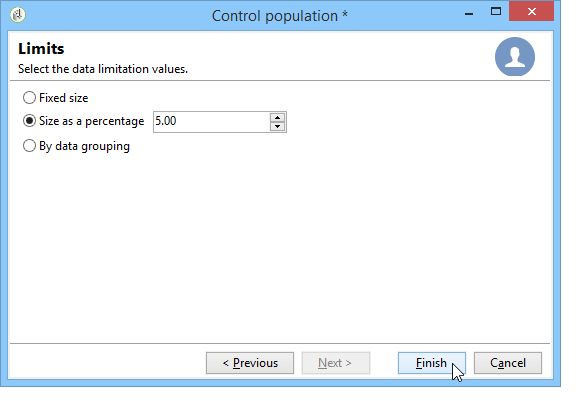

# Välj målgruppen för dina kampanjer {#marketing-campaign-deliveries}

I en marknadsföringskampanj kan ni för varje leverans definiera:

* Målgruppen - Läs mer i [Skapa målgruppen i ett arbetsflöde](#building-the-main-target-in-a-workflow) och [Välja målpopulationen](#selecting-the-target-population).
* En kontrollgrupp - Läs mer i [det här avsnittet](#defining-a-control-group).
* dirigerade adresser - Läs mer i [det här avsnittet](../../delivery/using/about-seed-addresses.md).

En del av den här informationen kan ärvas från [kampanjmallen](../../campaign/using/marketing-campaign-templates.md#campaign-templates).

Om du vill skapa leveransmålet kan du definiera filtervillkor för mottagarna i databasen. Det här mottagarvalsläget visas i [det här avsnittet](../../delivery/using/steps-defining-the-target-population.md).

## Skicka till en grupp

Du kan importera en population till en lista och sedan ange den här listan som mål i leveranser. Följ stegen nedan för att göra detta:

1. Redigera den aktuella leveransen och klicka på länken **[!UICONTROL To]** för att ändra målpopulationen.

1. Välj alternativet **[!UICONTROL Defined via the database]** på fliken **[!UICONTROL Main target]** och klicka på **[!UICONTROL Add]** för att välja mottagare.

1. Välj **[!UICONTROL A list of recipients]** och klicka på **[!UICONTROL Next]** för att markera den.

## Bygg målgruppen i ett kampanjarbetsflöde {#building-the-main-target-in-a-workflow}

Huvudmålet för en leverans kan också definieras i kampanjarbetsflödet: I den grafiska miljön kan du skapa mål med hjälp av frågor, tester och operatorer: union, borttagning av dubbletter, delning osv.

>[!IMPORTANT]
>
>Du får inte lägga till fler än 28 arbetsflöden i en kampanj. Tidigare är ytterligare arbetsflöden inte synliga i gränssnittet och kan generera fel.

### Skapa arbetsflödet {#creating-a-targeting-workflow}

Målinriktning kan skapas med en kombination av filtreringsvillkor i en grafisk sekvens i ett arbetsflöde. Ni kan skapa populationer och underpopulationer som ska anpassas efter era behov. Om du vill visa arbetsflödesredigeraren klickar du på fliken **[!UICONTROL Targeting and workflows]** på kontrollpanelen för kampanjer.

Målpopulationen extraheras från Adobe Campaign-databasen via en eller flera frågor i ett arbetsflöde. Mer information om hur du skapar en fråga finns i [det här avsnittet](../../workflow/using/query.md).

Du kan starta frågor och dela populationer via rutor som Union, Intersection, Sharing, Exclusion osv.

Markera objekten i listorna till vänster om arbetsytan och länka dem för att skapa målet.

I diagrammet länkar du upp de mål- och planeringsfrågor som krävs för målkonstruktion i diagrammet. Du kan utföra målinriktningen medan konstruktionen pågår för att kontrollera populationen som extraherats från databasen.

>[!NOTE]
>
>Exempel och procedur för att definiera frågor finns i [det här avsnittet](../../workflow/using/query.md).

I den vänstra delen av redigeraren finns ett bibliotek med grafiska objekt som representerar aktiviteter. Den första fliken innehåller målinriktningsaktiviteterna och den andra fliken innehåller flödeskontrollaktiviteterna, som används ibland för att samordna målinriktningsaktiviteter.

Körnings- och formateringsfunktionerna för målarbetsflödet är tillgängliga via verktygsfältet för diagramredigering.

>[!NOTE]
>
>Vilka aktiviteter som är tillgängliga för att skapa diagrammet och alla visnings- och layoutfunktioner finns i guiden [Automatisera med arbetsflöden](../../workflow/using/architecture.md).

Ni kan skapa flera arbetsflöden för målinriktning för en enskild kampanj. Så här lägger du till ett arbetsflöde:

1. Gå till den övre vänstra delen av arbetsflödets område, högerklicka och välj **[!UICONTROL Add]**. Du kan också använda knappen **[!UICONTROL New]** ovanför den här zonen.

   

1. Välj mallen **[!UICONTROL New workflow]** och ge arbetsflödet ett namn.
1. Klicka på **[!UICONTROL OK]** för att bekräfta att arbetsflödet har skapats och skapa sedan diagrammet för arbetsflödet.

### Kör arbetsflödet {#executing-a-workflow}

Målarbetsflöden kan startas manuellt med knappen **[!UICONTROL Start]** i verktygsfältet, förutsatt att du har rätt behörighet.

Målinriktningen kan programmeras för automatisk körning enligt ett schema (schemaläggare) eller en händelse (extern signal, filimport osv.).

Åtgärder som rör körning av målarbetsflödet (starta, stoppa, pausa, osv.) är **asynkrona** processer: kommandot sparas och börjar gälla så fort servern är tillgänglig för att använda det.

Med verktygsfältsikonerna kan du utföra åtgärder för arbetsflödet.

* Starta eller starta om

   * Med ikonen **[!UICONTROL Start]** kan du starta målarbetsflödet. När du klickar på den här ikonen aktiveras alla aktiviteter utan en indataövergång (förutom slutpunktshopp).

      

      Servern tar hänsyn till begäran, vilket framgår av dess status:

      

      Processens status ändras till **[!UICONTROL Started]**.

   * Du kan starta om arbetsflödet för målanpassning via motsvarande verktygsfältsikon. Det här kommandot kan vara användbart om ikonen **[!UICONTROL Start]** inte är tillgänglig, t.ex. när stoppning av målarbetsflöde pågår. I det här fallet klickar du på ikonen **[!UICONTROL Restart]** för att förutse omstarten. Servern tar hänsyn till begäran, vilket framgår av dess status:

      

      Processen anger sedan **[!UICONTROL Started]**-status.

* Stoppa eller pausa

   * Med verktygsfältsikonerna kan du stoppa eller pausa ett pågående målarbetsflöde.

      När du klickar på **[!UICONTROL Pause]** har åtgärder som pågår **[!UICONTROL are not]** pausats, men ingen annan aktivitet startas förrän nästa omstart.

      

      Servern tar hänsyn till kommandot, vilket visas i dess status:

      

      Du kan också pausa ett arbetsflöde för målinriktning automatiskt när körningen når en viss aktivitet. Om du vill göra det högerklickar du på aktiviteten som målarbetsflödet ska pausas från och väljer **[!UICONTROL Enable but do not execute]**.

      

      Den här konfigurationen visas med en särskild ikon.

      

      >[!NOTE]
      >
      >Det här alternativet är användbart under design- och testfaser av avancerade riktade kampanjer.

      Klicka på **[!UICONTROL Start]** för att återuppta körningen.

   * Klicka på ikonen **[!UICONTROL Stop]** för att stoppa den pågående körningen.

      

      Servern tar hänsyn till kommandot, vilket visas i dess status:

      
   Du kan också stoppa ett målarbetsflöde automatiskt när körningen når en aktivitet. Om du vill göra det högerklickar du på aktiviteten som målarbetsflödet ska stoppas från och väljer **[!UICONTROL Do not activate]**.

   

   

   Den här konfigurationen visas med en särskild ikon.

   >[!NOTE]
   >
   >Det här alternativet är användbart under design- och testfaser av avancerade riktade kampanjer.

* Ovillkorligt stopp

   I Utforskaren väljer du **[!UICONTROL Administration > Production > Object created automatically > Campaign workflows]** för att få åtkomst till och agera på alla kampanjarbetsflöden.

   Du kan avbryta ditt arbetsflöde genom att klicka på ikonen **[!UICONTROL Actions]** och välja **[!UICONTROL Unconditional]** steg. Den här åtgärden avbryter kampanjarbetsflödet.

   

## Lägg till en kontrollgrupp {#defining-a-control-group}

En kontrollgrupp är en population som inte kommer att få leveransen. Det används för att spåra beteenden och kampanjeffekter efter leverans genom att göra en jämförelse med beteendet hos målpopulationen, som har fått leveransen.

Kontrollgruppen kan extraheras från huvudmålet och/eller komma från en viss grupp eller fråga.

### Aktivera kontrollgruppen för en kampanj {#activating-the-control-group-for-a-campaign}

Du kan definiera en kontrollgrupp på kampanjnivå, och i så fall tillämpas kontrollgruppen på varje leverans av den aktuella kampanjen.

1. Redigera den aktuella kampanjen och klicka på fliken **[!UICONTROL Edit]**.
1. Klicka på **[!UICONTROL Advanced campaign settings]**.

   

1. Välj alternativet **[!UICONTROL Enable and edit control group configuration]**.
1. Klicka på **[!UICONTROL Edit...]** för att konfigurera kontrollgruppen.

   

Konfigurationsproceduren presenteras i [Extrahera kontrollgruppen från huvudmålet](#extracting-the-control-group-from-the-main-target) och [Lägga till en kontrollgrupp](#adding-a-population).

### Aktivera kontrollgruppen för en leverans {#activating-the-control-group-for-a-delivery}

Du kan definiera en kontrollgrupp på leveransnivå. I så fall tillämpas kontrollgruppen på varje leverans av den aktuella kampanjen.

Som standard gäller den kontrollgruppskonfiguration som definieras på kampanjnivå för varje leverans av kampanjen. Du kan dock anpassa kontrollgruppen för en enskild leverans.

>[!NOTE]
>
>Om du har definierat en kontrollgrupp för en kampanj, och du även konfigurerar den för en leverans som är länkad till den här kampanjen, tillämpas bara den kontrollgrupp som har definierats för leveransen.

1. Redigera den aktuella leveransen och klicka sedan på länken **[!UICONTROL To]** i avsnittet **[!UICONTROL Email parameters]**.

   

1. Klicka på fliken **[!UICONTROL Control group]** och välj sedan **[!UICONTROL Enable and edit control group configuration]**.
1. Klicka på **[!UICONTROL Edit...]** för att konfigurera kontrollgruppen.

Konfigurationsproceduren presenteras i [Extrahera kontrollgruppen från huvudmålet](#extracting-the-control-group-from-the-main-target) och [Lägga till en kontrollgrupp](#adding-a-population).

### Extrahera kontrollgruppen från huvudmålet {#extracting-the-control-group-from-the-main-target}

Du kan extrahera mottagare från huvudmålet för leveransen. I det här fallet hämtas mottagarna från målet för leveransåtgärder som påverkas av den här konfigurationen. Extraheringen kan vara slumpmässig eller bero på att mottagarna har sorterats.

Om du vill extrahera en kontrollgrupp aktiverar du kontrollgruppen för kampanjen eller leveransen och väljer något av följande alternativ: **[!UICONTROL Activate random sampling]** eller **[!UICONTROL Keep only the first records after sorting]**.

* **[!UICONTROL Activate random sampling]** : Med det här alternativet tillämpas slumpmässiga stickprov på mottagarna i målpopulationen. Om du sedan anger tröskelvärdet till 100 kommer kontrollgruppen att bestå av 100 mottagare som väljs slumpmässigt från målpopulationen. Det slumpmässiga urvalet beror på databasmotorn.
* **[!UICONTROL Keep only the first records after sorting]** : med det här alternativet kan du definiera en begränsning baserat på en eller flera sorteringsvillkor. Om du väljer fältet **[!UICONTROL Age]** som sorteringsvillkor och sedan definierar 100 som ett tröskelvärde, kommer kontrollgruppen att bestå av de 100 yngsta mottagarna. Det kan till exempel vara intressant att definiera en kontrollgrupp som innehåller mottagare som gör få inköp, eller mottagare som gör vanliga inköp, och att jämföra deras beteende med de kontaktade mottagarna.

Klicka på **[!UICONTROL Next]** för att definiera sorteringsordningen (om det behövs) och välj mottagarbegränsningsläget.

Den här konfigurationen motsvarar en delningsaktivitet i arbetsflödet, vilket gör att du kan dela upp målet i delmängder. Kontrollgruppen är en av dessa deluppsättningar. Mer information finns i [det här avsnittet](../../workflow/using/architecture.md).

### Använd en ny population som kontrollgrupp {#adding-a-population}

Du kan definiera en ny population som ska användas som kontrollgrupp. Den här populationen kan komma från en grupp mottagare eller så kan du skapa den via en specifik fråga.

>[!NOTE]
>
>Adobe Campaign frågeredigerare presenteras i [det här avsnittet](../../workflow/using/query.md).

#### Självstudievideo {#create-email-video}

I den här videon förklaras hur du skapar en kampanj och ett e-postmeddelande i Adobe Campaign.

>[!VIDEO](https://video.tv.adobe.com/v/25604?quality=12)

Ytterligare utbildningsvideor för Campaign finns [här](https://experienceleague.adobe.com/docs/campaign-classic-learn/tutorials/overview.html?lang=sv).
