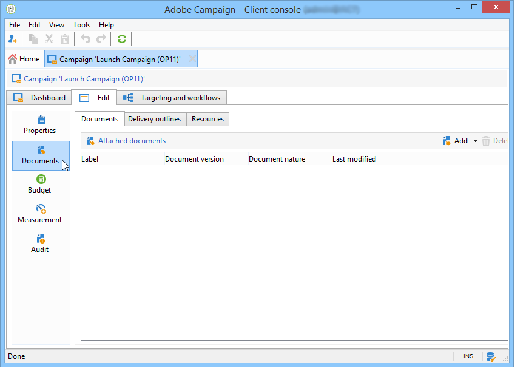
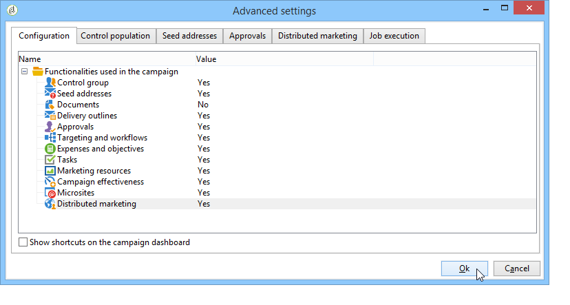
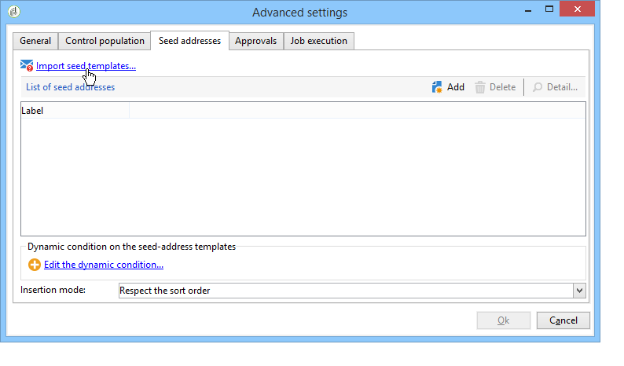
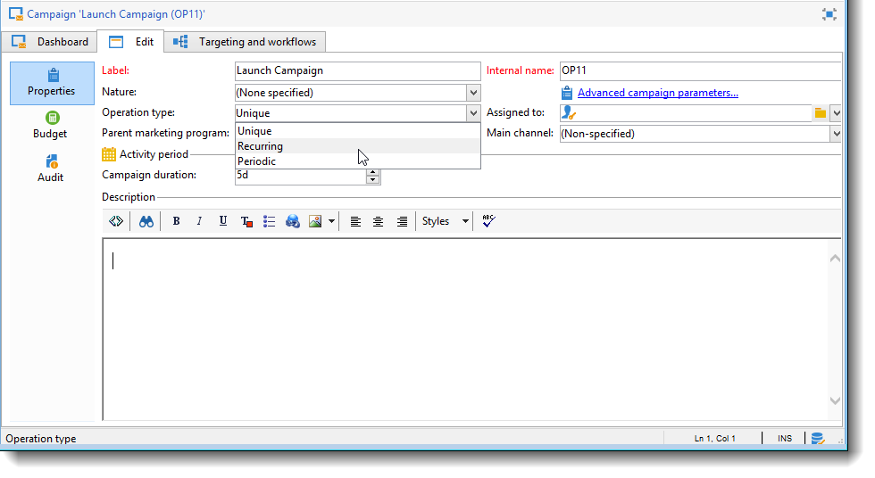

# Mallar för marknadsföringskampanj {#campaign-templates}

Kampanjmallar är centraliserade i **[!UICONTROL Resources > Templates > Campaign templates]** noden. En standardmall anges som standard. Med den kan ni skapa en ny kampanj med hjälp av alla tillgängliga moduler (dokument, uppgifter, dirigerade adresser osv.), men vilka moduler som erbjuds beror på era rättigheter och konfigurationen av Adobe Campaign-plattformen.

## Skapa eller duplicera en kampanjmall {#creating-or-duplicating-a-campaign-template}

Så här skapar du en ny mall:

1. Öppna Campaign **Explorer**.
1. I **Resurser > Mallar > Kampanjmallar** klickar du på **Nytt** i verktygsfältet ovanför listan med mallar.

   

1. Ange etiketten för den nya kampanjmallen.
1. Klicka på **Spara** och öppna mallen igen.
1. Ange vid behov det **interna namnet** och andra värden på fliken **Redigera** .
1. Välj **Avancerade kampanjinställningar** om du vill lägga till ett arbetsflöde i kampanjmallen.

   

1. Ändra värdet för **Mål och arbetsflöden** till **Ja**.

   

1. **Klicka på** Lägg till ett arbetsflöde på fliken **Mål och arbetsflöden**.. .

   

1. Fyll i fältet **Etikett** och klicka på **OK**.
1. Skapa ett arbetsflöde som passar dina behov.
1. Klicka på **Spara**. Mallen kan nu användas i en kampanj.

Du kan också duplicera standardmallen för att återanvända och anpassa dess konfiguration.

På de olika flikarna och underflikarna i kampanjmallen kan du komma åt inställningarna som beskrivs i [Allmän konfiguration](#general-configuration).

## Konfigurera en kampanjmall {#configuring-a-campaign-template}

Kampanjer baseras på modeller som delar en uppsättning fördefinierade parametrar.

I en standardkonfiguration är kampanjmallarna centraliserade i noden **[!UICONTROL Resources > Templates > Campaign templates]** i Adobe Campaign-trädet.

>[!NOTE]
>
>Trädet visas när du klickar på **[!UICONTROL Explorer]** ikonen på startsidan.

En färdig mall tillhandahålls för att skapa en kampanj för vilken ingen specifik konfiguration har definierats. Du kan skapa och konfigurera kampanjmallar och sedan skapa kampanjer utifrån dessa mallar.

Skapandet och konfigurationen av kampanjmallar presenteras i [Campaign-mallar](#campaign-templates).

Mer information om hur du skapar kampanjer finns i [Skapa en kampanj och en e-postvideo](https://docs.campaign.adobe.com/doc/AC/en/Videos/Videos.html) .

## Konfiguration av tillgängliga moduler {#configuration-of-the-available-modules}

### Val av modul {#module-selection}

Med **[!UICONTROL Advanced campaign settings...]** länken kan du aktivera och inaktivera jobb för kampanjer som är baserade på den här mallen. Välj de funktioner som du vill aktivera i kampanjer som skapats baserat på den här mallen.

Om ingen funktion är markerad, de element som rör processen (menyer, ikoner, alternativ, flikar, underflikar osv.) visas inte i mallens gränssnitt eller i kampanjer som är baserade på den här mallen. Flikarna till vänster om kampanjinformationen sammanfaller vanligtvis med de processer som valts i mallen. Om du t.ex. inte väljer **Utgifter och mål** visas inte motsvarande **[!UICONTROL Budget]** flik i kampanjer som baseras på den här mallen.

Dessutom läggs genvägar till konfigurationsfönstren till på kontrollpanelen för kampanjer. När en funktion är aktiverad får en direktlänk åtkomst till den från kontrollpanelen för kampanjer.

Med konfigurationen nedan:

Följande länkar visas på kontrollpanelen för kampanjer (länken saknas): **[!UICONTROL Add a task]**

Bara följande flikar visas:

Men med den här typen av konfiguration:

Följande länkar och flikar visas:

### Typologi för aktiverade moduler {#typology-of-enabled-modules}

* **Kontrollgrupp**

   När den här modulen är markerad läggs en extra flik till i de avancerade inställningarna för mallen och kampanjerna som är baserade på den här mallen. Konfigurationen kan definieras via mallen eller individuellt för varje kampanj.

   

* **Fröadresser**

   När den här modulen är markerad läggs en extra flik till i de avancerade inställningarna för mallen och kampanjerna som är baserade på den här mallen. Konfigurationen kan definieras via mallen eller individuellt för varje kampanj.

   

* **Dokument**

   När den här modulen är markerad läggs en extra flik till på **[!UICONTROL Edition]** fliken för mallen och de kampanjer som är baserade på den här mallen. Bifogade dokument kan läggas till från mallen eller individuellt för varje kampanj.

   

* **Kontur**

   När den här modulen är markerad läggs en underflik till på **[!UICONTROL Delivery outlines]** **[!UICONTROL Documents]** fliken för att definiera leveransdispositioner för kampanjen.

   

* **Målgruppsanpassning och arbetsflöden**

   När du väljer **[!UICONTROL Targeting and workflows]** modulen läggs en flik till så att du kan skapa ett eller flera arbetsflöden för kampanjer baserade på den här mallen. Arbetsflöden kan också konfigureras individuellt för varje kampanj baserat på den här mallen.

   

   När den här modulen är aktiverad läggs en flik till i de avancerade inställningarna för kampanjen för att definiera processkörningssekvensen.

   

* **Godkännande**

   Om du väljer **[!UICONTROL Approval]** det här alternativet kan du välja vilka processer som ska godkännas samt vilka operatörer som ansvarar för godkännandena.

   

* **Utgifter och mål**

   När den här modulen är markerad läggs en flik till i informationen om mallen och kampanjer som är baserade på den här mallen, så att den associerade budgeten kan väljas. **[!UICONTROL Budget]**

   

### Godkännande av jobb {#approval-of-jobs}

Du kan välja om du vill aktivera processgodkännande eller inte via fliken **[!UICONTROL Approvals]** i avsnittet Mallar för avancerade inställningar. Jobb som har valts för godkännande måste godkännas för att meddelandeleverans ska kunna auktoriseras.

Du måste associera en granskaroperator eller grupp av operatorer för varje aktiverat godkännande.

## Allmän konfiguration {#general-configuration}

### Mallegenskaper {#template-properties}

När du skapar en kampanjmall måste du ange följande information:

* Ange mallens **etikett** : Den här etiketten tilldelas som standard till alla kampanjer som skapas via den här mallen.
* Välj kampanjens **natur** i listrutan. De värden som är tillgängliga i den här listan är de som har sparats i **[!UICONTROL natureOp]** uppräkningen.

   >[!NOTE]
   >
   >Mer information om uppräkningar finns i avsnittet [Komma igång](../../platform/using/managing-enumerations.md) .

* Välj **kampanjtyp**: unika, återkommande eller periodiska. Som standard används kampanjmallar för unika kampanjer. Återkommande och periodiska kampanjer beskrivs här: Återkommande [och periodiska kampanjer](../../campaign/using/setting-up-marketing-campaigns.md#recurring-and-periodic-campaigns).
* Ange kampanjens varaktighet, dvs. antalet dagar som kampanjen ska äga rum. När du skapar en kampanj som baseras på den här mallen fylls start- och slutdatumet för kampanjen i automatiskt.

   Om kampanjen är återkommande måste du ange kampanjens start- och slutdatum direkt i mallen.

* Ange mallens **relaterade program** : kampanjer som är baserade på den här mallen länkas till det valda programmet.

### Parametrar för mallkörning {#template-execution-parameters}

Med **[!UICONTROL Advanced campaign settings...]** länken kan du konfigurera de avancerade alternativen för mallen för bearbetning av leveransmålet (kontrollgrupp, dirigeringsadresser osv.) och konfigurationen av kampanjmätning och arbetsflödeskörning.

## Kampanj för omvänd planering {#campaign-reverse-scheduling}

Du kan skapa ett omvänt schema för en kampanj, till exempel för att förbereda en händelse vars datum är känt i förväg. Med kampanjmallar kan du nu beräkna startdatumet för en aktivitet baserat på slutdatumet för en kampanj.

Gå till **[!UICONTROL Implementation schedule]** området i konfigurationslådan för uppgifter och markera **[!UICONTROL The start date is calculated based on the campaign end date]** rutan. (Här är &quot;startdatum&quot; startdatum för aktiviteten). Gå till **[!UICONTROL Start]** fältet och ange ett intervall: aktiviteten startar så här långt före kampanjens slutdatum. Om du anger en period som är längre än kampanjen är inställd på att vara sista, börjar aktiviteten före kampanjen.

När du skapar en kampanj med den här mallen beräknas startdatumet för aktiviteten automatiskt. Du kan dock ändra den senare.
