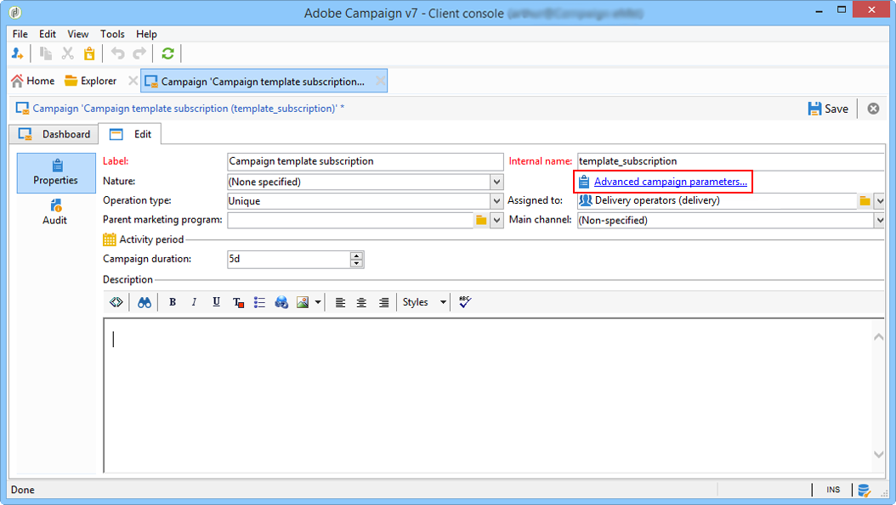

# Skapa och konfigurera kampanjmallar {#campaign-templates}

Alla marknadsföringskampanjer bygger på en mall som lagrar de viktigaste egenskaperna och funktionerna. Kampanjmallar är centraliserade i noden **[!UICONTROL Resources > Templates > Campaign templates]**. En standardmall anges som standard. Du kan skapa en ny kampanj med hjälp av alla tillgängliga moduler (dokument, uppgifter, dirigerade adresser osv.), men vilka moduler som erbjuds beror på dina rättigheter och konfigurationen av din Adobe Campaign-plattform.

>[!NOTE]
>
>Trädet visas när du klickar på ikonen **[!UICONTROL Explorer]** på startsidan.

En inbyggd mall tillhandahålls för att skapa en kampanj för vilken ingen specifik konfiguration har definierats. Du kan skapa och konfigurera kampanjmallar och sedan skapa kampanjer utifrån dessa mallar.

 Mer information om hur du skapar kampanjer finns i  [den här videon](../../campaign/using/marketing-campaign-deliveries.md#create-email-video).

## Skapa en kampanjmall {#creating-or-duplicating-a-campaign-template}

Så här skapar du en kampanjmall:

1. Öppna Campaign **Utforskaren**.
1. I **Resurser > Mallar > Kampanjmallar** klickar du på **Nytt** i verktygsfältet ovanför listan med mallar.

   

1. Ange etiketten för den nya kampanjmallen.
1. Klicka på **Spara** och öppna mallen igen.
1. På fliken **Redigera** anger du vid behov det interna namnet **interna namnet** och andra värden.
1. Välj **Avancerade kampanjinställningar** om du vill lägga till ett arbetsflöde i kampanjmallen.

   

1. Ändra värdet **Mål och arbetsflöden** till **Ja**.

   

1. På fliken **Mål och arbetsflöden** klickar du på **Lägg till ett arbetsflöde..**.

   

1. Fyll i fältet **Etikett** och klicka på **OK**.
1. Skapa ett arbetsflöde som passar dina behov.
1. Klicka på **Spara**. Mallen kan nu användas i en kampanj.

Du kan även **duplicera** standardmallen för att återanvända och anpassa dess konfiguration.

På de olika flikarna och underflikarna i kampanjmallen kan du komma åt inställningarna som beskrivs i [Allmän konfiguration](#general-configuration).

## Välj moduler {#select-modules}

Med länken **[!UICONTROL Advanced campaign settings...]** kan du aktivera och inaktivera jobb för kampanjer som är baserade på den här mallen. Välj de funktioner som du vill aktivera i kampanjer som skapas baserat på den här mallen.

Om en funktion inte har valts, de element som rör processen (menyer, ikoner, alternativ, flikar, underflikar osv.) visas inte i mallens gränssnitt eller i kampanjer som är baserade på den här mallen. Flikarna till vänster om kampanjinformationen sammanfaller vanligtvis med de processer som valts i mallen. Om du t.ex. inte väljer **Utgifter och mål** visas inte motsvarande **[!UICONTROL Budget]**-flik i kampanjer som baseras på den här mallen.

Dessutom läggs genvägar till konfigurationsfönstren till på kontrollpanelen för kampanjer. När en funktion är aktiverad får en direktlänk åtkomst till den från kontrollpanelen för kampanjer.

Med konfigurationen nedan:

Följande länkar visas på kontrollpanelen för kampanjer (länken **[!UICONTROL Add a task]** saknas):

Bara följande flikar visas:

Men med den här typen av konfiguration:

Följande länkar och flikar visas:

## Typologi för moduler {#typology-of-enabled-modules}

* **Kontrollgrupp**

   När den här modulen är markerad läggs en extra flik till i de avancerade inställningarna för mallen och kampanjerna som är baserade på den här mallen. Konfigurationen kan definieras via mallen eller individuellt för varje kampanj. Läs mer om kontrollgrupper i [det här avsnittet](../../campaign/using/marketing-campaign-deliveries.md#defining-a-control-group).

   

* **Fröadresser**

   När den här modulen är markerad läggs en extra flik till i de avancerade inställningarna för mallen och kampanjerna som är baserade på den här mallen. Konfigurationen kan definieras via mallen eller individuellt för varje kampanj. Läs mer om dirigerade adresser i [det här avsnittet](../../delivery/using/about-seed-addresses.md).

   

* **Dokument**

   När den här modulen är markerad läggs en extra flik till på fliken **[!UICONTROL Edition]** i mallen och de kampanjer som är baserade på den här mallen. Bifogade dokument kan läggas till från mallen eller individuellt för varje kampanj. Läs mer om dokument i [det här avsnittet](../../campaign/using/marketing-campaign-deliveries.md#managing-associated-documents).

   

* **Kontur**

   När den här modulen är markerad läggs en **[!UICONTROL Delivery outlines]**-underflik till på fliken **[!UICONTROL Documents]** för att definiera leveransdispositioner för kampanjen. Läs mer om leveransdispositioner i [det här avsnittet](../../campaign/using/marketing-campaign-deliveries.md#associating-and-structuring-resources-linked-via-a-delivery-outline).

   

* **Målgruppsanpassning och arbetsflöden**

   När du väljer modulen **[!UICONTROL Targeting and workflows]** läggs en flik till så att du kan skapa ett eller flera arbetsflöden för kampanjer baserade på den här mallen. Arbetsflöden kan också konfigureras individuellt för varje kampanj baserat på den här mallen.Läs mer om kampanjarbetsflöden i [det här avsnittet](../../campaign/using/marketing-campaign-deliveries.md#building-the-main-target-in-a-workflow).

   

   När den här modulen är aktiverad läggs en flik till i de avancerade inställningarna för kampanjen för att definiera processkörningssekvensen.

   

* **Godkännande**

   Om du väljer **[!UICONTROL Approval]** kan du välja vilka processer som ska godkännas samt vilka operatorer som ansvarar för godkännandena. Läs mer om godkännanden i [det här avsnittet](../../campaign/using/marketing-campaign-approval.md#selecting-reviewers).

   

   Du kan välja om du vill aktivera processgodkännande eller inte via fliken **[!UICONTROL Approvals]** i avsnittet för mallar för avancerade inställningar. Jobb som har valts för godkännande måste godkännas för att meddelandeleverans ska kunna auktoriseras.

   Du måste associera en granskaroperator eller grupp av operatorer för varje aktiverat godkännande.

* **Utgifter och mål**

   När den här modulen har valts läggs en **[!UICONTROL Budget]**-flik till i informationen om mallen och kampanjer som är baserade på den här mallen, så att den associerade budgeten kan väljas.

   

## Egenskaper och körning {#general-configuration}

### Mallegenskaper {#template-properties}

När du skapar en kampanjmall måste du ange följande information:

* Ange **etiketten** för mallen: Den här etiketten tilldelas som standard till alla kampanjer som skapas via den här mallen.
* Välj kampanjen **natur** i listrutan. De värden som är tillgängliga i den här listan är de som har sparats i **[!UICONTROL natureOp]**-uppräkningen.

   >[!NOTE]
   >
   >Mer information om uppräkningar finns i avsnittet [Komma igång](../../platform/using/managing-enumerations.md).

* Välj **kampanjtyp**: unika, återkommande eller periodiska. Som standard används kampanjmallar för unika kampanjer. Återkommande och periodiska kampanjer beskrivs i [det här avsnittet](../../campaign/using/setting-up-marketing-campaigns.md#recurring-and-periodic-campaigns).
* Ange kampanjens varaktighet, dvs. antalet dagar som kampanjen ska äga rum. När du skapar en kampanj som baseras på den här mallen fylls start- och slutdatumet för kampanjen i automatiskt.

   Om kampanjen är återkommande måste du ange kampanjens start- och slutdatum direkt i mallen.

* Ange **det relaterade programmet** för mallen: kampanjer som är baserade på den här mallen länkas till det valda programmet.

### Parametrar för mallkörning {#template-execution-parameters}

Med länken **[!UICONTROL Advanced campaign settings...]** kan du konfigurera de avancerade alternativen för mallen för bearbetning av leveransmålet (kontrollgrupp, dirigerade adresser osv.) och konfigurationen av kampanjmätning och arbetsflödeskörning.

## Spåra kampanjkörning{#campaign-reverse-scheduling}

Du kan skapa ett schema för en kampanj och spåra resultat, till exempel för att förbereda ett händelseschema för ett visst datum. Med kampanjmallar kan du nu beräkna startdatumet för en aktivitet baserat på slutdatumet för en kampanj.

Gå till området **[!UICONTROL Implementation schedule]** i konfigurationslådan för aktiviteten och markera kryssrutan **[!UICONTROL The start date is calculated based on the campaign end date]**. (Här är &quot;startdatum&quot; startdatum för aktiviteten). Gå till fältet **[!UICONTROL Start]** och ange ett intervall: aktiviteten startar så här långt före kampanjens slutdatum. Om du anger en period som är längre än kampanjen är inställd på att vara sista, börjar aktiviteten före kampanjen.

När du skapar en kampanj med den här mallen beräknas startdatumet för aktiviteten automatiskt. Du kan dock ändra den senare.
