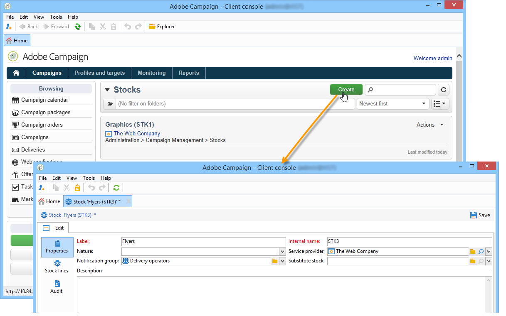
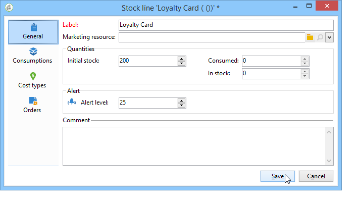

# Leverantörer, stockar och budgetar{#providers-stocks-and-budgets}

Med Adobe Campaign kan ni definiera tjänsteleverantörer som ska vara engagerade i de jobb som utförs i kampanjerna. Adobe Campaign-administratören definierar information om tjänsteleverantörerna och de tillhörande kostnadsstrukturerna utifrån huvudperspektivet. Tjänsteleverantören hänvisas till från leveransen, och dess kostnadsstrukturer gör det möjligt att beräkna kostnaderna i samband med denna leverans samt förvaltningen av det berörda lagret.

## Skapa tjänsteleverantörer och deras kostnadsstrukturer {#creating-service-providers-and-their-cost-structures}

Varje tjänsteleverantör sparas i en fil med kontaktinformation, tjänstmallar och relaterade jobb.

Tjänsteleverantörer är konfigurerade i trädnoden **[!UICONTROL Administration > Campaign management]** .

De jobb som utförs under leveranser utförs av tjänsteleverantörer, särskilt för direktreklam och mobila kanaler. Dessa tjänsteleverantörer kan till exempel vara inblandade i utskrift eller distribution av meddelanden. Dessa jobb omfattar konfigurationer och kostnader som är specifika för varje tjänsteleverantör. Konfigurationen av tjänsteleverantörer omfattar fyra steg:

1. Skapa en tjänsteleverantör i Adobe Campaign

   Se [Lägga till en tjänsteleverantör](#adding-a-service-provider).

1. Definiera kostnadskategorier och strukturer för tillhörande tjänstmallar

   Se [Definiera kostnadskategorier](#defining-cost-categories) och [Definiera kostnadsstrukturen](#defining-the-cost-structure).

1. Konfiguration av processer

   Se [Konfigurera processer som är kopplade till en tjänst](#configuring-processes-associated-with-a-service).

1. Referera tjänstleverantören på kampanjnivå

   Se [Associera en tjänst med en kampanj](#associating-a-service-with-a-campaign).

### Skapa en tjänsteleverantör och dess kostnadskategorier {#creating-a-service-provider-and-its-cost-categories}

#### Lägga till en tjänsteleverantör {#adding-a-service-provider}

Du kan skapa så många tjänsteleverantörer som behövs för dina leveranser. Så här lägger du till en tjänsteleverantör:

1. Högerklicka på listan över tjänsteleverantörer och välj **[!UICONTROL New]** eller klicka på **[!UICONTROL New]** knappen ovanför listan över tjänsteleverantörer.
1. Ange tjänstleverantörens namn och kontaktinformation i fönstrets nedre del.

   

1. Klicka på **[!UICONTROL Save]** knappen för att lägga till tjänsteleverantören i listan.

#### Definiera kostnadskategorier {#defining-cost-categories}

Du måste associera tjänstmallar med varje tjänstleverantör. I dessa mallar måste du först identifiera kostnadskategorierna och vid behov det berörda lagret. Du måste sedan skapa kostnadsberäkningsreglerna för varje kategori via kostnadsstrukturerna.

>[!NOTE]
>
>Mer information finns i [Definiera kostnadsstrukturen](#defining-the-cost-structure).

En kostnadskategori är en enhet som innehåller en uppsättning kostnader som berättigar till en typ av leverans (e-post, direktreklam osv.) eller för en uppgift. Kostnadskategorierna grupperas i mallar för tjänster som är kopplade till tjänsteleverantörerna. Varje tjänsteleverantör kan referera till en eller flera tjänstmallar.

Så här skapar du en tjänstmall och definierar dess innehåll:

1. Klicka på **[!UICONTROL Services]** knappen och ge tjänstmallen ett namn på **[!UICONTROL Add]** fliken för tjänsteleverantören.

   

1. Skapa kostnadskategorier för varje typ av process (direktreklam/e-post/etc.). eller uppgift). Det gör du genom att klicka på **[!UICONTROL Cost categories]** fliken och sedan på **[!UICONTROL Add]** knappen och ange parametrarna för varje kostnadskategori.

   

   * Ange en etikett för kostnadskategorin och välj typ av process: Leverans av **[!UICONTROL Direct mail]**, **[!UICONTROL E-mail]**, **[!UICONTROL Mobile]** eller **[!UICONTROL Telephone]** **[!UICONTROL Task]**.
   * Klicka på **[!UICONTROL Add]** knappen för att definiera de kostnadstyper som är associerade med den här kategorin.
   * Vid behov skall en lagerlinje kopplas till varje typ av kostnad så att de använda kvantiteterna automatiskt kopplas till de befintliga lagren.

      >[!NOTE]
      >
      >Lagerraderna definieras i **[!UICONTROL Stock management]** noden.\
      >Mer information finns i [Stock och orderhantering](#stock-and-order-management).

1. Du kan i förväg välja ett värde för den här kostnadskategorin, som erbjuds som standard i tjänsteleverantörens kostnadskategorier (i stället för ett tomt värde). För att göra detta väljer du alternativet för den aktuella kategorin i **[!UICONTROL Selected]** kolumnen:

   

   På leveransnivån väljs värdet som standard:

   

### Definiera kostnadsstrukturen {#defining-the-cost-structure}

För varje typ av kostnad anger en kostnadsstruktur de beräkningsregler som ska tillämpas.

Klicka på **[!UICONTROL Cost structure]** fliken för att konfigurera kostnadsberäkningen för varje kostnadskategori och typ. Klicka **[!UICONTROL Add]** och ange kostnadsstrukturen.

* Om du vill skapa kostnadsstrukturen väljer du typ av meddelande och den berörda kostnadskategorin i listrutorna samt den typ av kostnad som beräkningsregeln ska gälla för. Innehållet i de här listrutorna kommer från den information som anges på **[!UICONTROL Cost categories]** fliken.

   Du måste tilldela en etikett till kostnadsstrukturen. Som standard har den följande leveransdisposition: **Kostnadskategori - typ av kostnad**.

   Du kan dock byta namn på den: ange det önskade värdet direkt i **[!UICONTROL Label]** fältet.

* Kostnadsberäkningsformeln definieras i fönstrets nedre del.

   Den här formeln kan vara fast (för valfritt antal meddelanden) eller beräknas utifrån antalet meddelanden.

   När det beror på antalet meddelanden kan kostnadsberäkningsstrukturen vara **[!UICONTROL Linear]**, **[!UICONTROL Linear by threshold]** eller **[!UICONTROL Constant by threshold]**.

#### Linjär struktur {#linear-structure}

Om mängden alltid är densamma för ett meddelande (eller en grupp med meddelanden) oavsett det totala antalet meddelanden väljer du **[!UICONTROL Linear]** och anger kostnaden för varje meddelande.

Om detta belopp gäller för en grupp meddelanden, ange antalet meddelanden som berörs i **[!UICONTROL for]** fältet.

#### Linjär struktur efter tröskelvärde {#linear-structure-by-threshold}

Om beloppet gäller med tröskelvärde för varje meddelande måste du definiera en **[!UICONTROL Linear by threshold]** beräkningsstruktur. I den här typen av kostnadsstruktur kostar varje meddelande till exempel 0,13 om det totala antalet meddelanden är mellan 1 och 100 och kommer att kosta 0,12 från 100 till 1000 skickade meddelanden, eller 0,11 bortom 1000 meddelanden.

Konfigurationen blir följande:

Om du vill lägga till ett tröskelvärde klickar du på **[!UICONTROL Add]** knappen till höger om listan.

#### Konstant struktur efter tröskelvärde {#constant-structure-by-threshold}

Slutligen kan du konfigurera en kostnadsberäkning utifrån det totala antalet meddelanden. Välj en **[!UICONTROL Constant by threshold]** beräkningsstruktur. Kostnaden sätts till exempel till ett fast belopp på 12,00 för 1 till 100 meddelanden och till 100,00 för leverans av 101 till 1000 meddelanden och till 500,00 för alla leveranser av över 1000 meddelanden, oavsett totalt antal.

### Konfigurera processer som är kopplade till en tjänst {#configuring-processes-associated-with-a-service}

Du kan associera information om processerna som är kopplade till tjänsten via **[!UICONTROL Processes]** fliken.

Om du vill göra det klickar du på **[!UICONTROL Processes]** fliken för att konfigurera överföring av information till routern.

* Avsnittet anger den exportmall som används för leverans när den här tjänsten väljs. **[!UICONTROL File extraction]** Du kan ange namnet på utdatafilen i **[!UICONTROL Extraction file]** fältet. Med knappen till höger om fältet kan du infoga variabler.

   

* I det här **[!UICONTROL Notification e-mail]** avsnittet kan du ange vilken mall som ska användas för att meddela tjänsteleverantörer när filerna har skickats. Välj den mall som används för att skapa varningsmeddelandet och gruppen med mottagare.

   Leveransmallar för meddelanden sparas som standard i noden **[!UICONTROL Administration > Campaign management > Technical delivery templates]** , som du kommer åt från den allmänna vyn.

* I det här **[!UICONTROL Post-processing]** avsnittet kan du välja vilket arbetsflöde som ska startas när leveransen har godkänts. Om en arbetsflödesmall anges skapas en arbetsflödesinstans automatiskt och startas så snart godkännandet börjar gälla. Det här arbetsflödet kan till exempel skicka extraheringsfilen till en extern tjänsteleverantör för bearbetning.

### Associera en tjänst med en kampanj {#associating-a-service-with-a-campaign}

Tjänster är kopplade till kampanjer via leveranser eller aktiviteter. Tjänsteleverantörer är länkade till leveransmallar för att erbjuda sina tjänster i leveranser som skapas via den här mallen.

När en tjänst har valts, de kostnadskategorier som motsvarar leveranstypen (direktreklam, e-post osv.) anges automatiskt i den centrala tabellen tillsammans med de bearbetningsalternativ som har definierats.

>[!NOTE]
>
>Om ingen kostnadskategori visas när en tjänst väljs betyder det att ingen kostnadskategori har definierats för den här typen av process. Om t.ex. ingen kostnadskategori har definierats för en e-postleverans visas ingen kategori, och det går inte att välja tjänsten. **[!UICONTROL E-mail]**

* Om du vill få direktreklam kan du välja tjänsten i konfigurationsfönstret.

   

* För leverans i mobilkanaler eller via telefon gäller samma urvalsmodell.
* För en e-postleverans väljs tjänsten på fliken **[!UICONTROL Advanced]** i leveransegenskaperna, som i följande exempel:

   

I **[!UICONTROL Amount to surcharge]** kolumnen kan du lägga till en kostnad för den här kategorin i samband med den aktuella leveransen eller uppgiften.

Du kan införa obligatoriskt val av en kostnadstyp under definitionen av kostnadskategorier för en leverans. Välj **[!UICONTROL A cost type must be selected]**.

## Lager- och orderhantering {#stock-and-order-management}

Kostnadstyperna kan kopplas till lagerrader för att hantera aviseringar, spåra leveranser och startorder.

Här beskrivs förfarandet för att upprätta lager- och orderhantering i Adobe Campaign och för att varna leverantörer om det inte finns tillräckligt med material för att kunna leverera:

1. Skapa och referera till associerade tjänsteleverantörer

   Se [Skapa en aktie](#creating-a-stock).

1. Lägga till aktierader

   Se [Lägga till aktierader](#adding-stock-lines).

1. Meddela aktörer i händelse av en varning

   Se [Varningsoperatorer](#alerting-operators).

1. Beställningar och leverans.

   Se [Beställningar](#orders).

### Stock-hantering {#stock-management}

Adobe Campaign kan varna en grupp operatorer om lagret har tagit slut eller nått en miniminivå. Stock-nivåerna är tillgängliga via **[!UICONTROL Stocks]** länken till **[!UICONTROL Campaigns]** universum via navigeringsområdets **[!UICONTROL Other choices]** länk.

#### Skapa en aktie {#creating-a-stock}

Så här skapar du en ny aktie:

1. Klicka på **[!UICONTROL Create]** knappen ovanför listan över lager.
1. Ange Stock-etiketten och välj den tjänsteleverantör som den är associerad med i listrutan.

   

   >[!NOTE]
   >
   >Mer information finns i [Skapa tjänsteleverantörer och deras kostnadsstrukturer](#creating-service-providers-and-their-cost-structures).

#### Lägga till aktierader {#adding-stock-lines}

En aktie består av olika stocklinjer. En lagerrad innehåller en ursprunglig kvantitet resurser som förbrukas av leveranser. Varje lagerrad anger förbrukad kvantitet, lagerkvantitet och beställd kvantitet.

När du skapar en aktie klickar du på **[!UICONTROL Stock lines]** fliken för att lägga till nya rader.

När du har skapat stocken klickar du på den för att redigera den och använda kontrollpanelen för att skapa och visa stockrader.

Klicka på **[!UICONTROL Create]** knappen om du vill definiera parametrar för Stock.

* Ange den ursprungliga lagerkvantiteten i **[!UICONTROL Initial stock]** fältet. Fälten **[!UICONTROL Consumed]** och **[!UICONTROL In stock]** beräknas automatiskt och uppdateras allt eftersom kampanjer pågår.

   

* Ange tröskelvärdet från vilket operatorer ska larmas för att beställa lager i **[!UICONTROL Alert level]** fältet. När varningsnivån nås visas ett varningsmeddelande i godkännandefönstret för leveranser som använder detta lager.

#### Associera en aktie med kostnadskategorier {#associating-a-stock-with-cost-categories}

För en viss tjänsteleverantör kan en aktierad refereras till av en av kostnadskategorierna i en tjänst, enligt följande:

### Stock-spårning {#stock-tracking}

#### Varningsoperatorer {#alerting-operators}

En varning visas när ett lager som refereras i en leverans inte räcker till. Följande varning visas till exempel när en extraheringsfil har godkänts:

#### Beställningar {#orders}

På **[!UICONTROL Orders]** underfliken kan du visa aktuella order och spara nya order.

Om du vill spara en beställning redigerar du den avsedda lagerraden, klickar på **[!UICONTROL Add]** knappen och anger leveransdatum och beställd kvantitet.

>[!NOTE]
>
>När leveransdatumet har nåtts försvinner den beställda lagerraden automatiskt och den kvantitet som anges i **[!UICONTROL Volume on order]** fältet läggs till på **[!UICONTROL Tracking]** fliken. Den här kvantiteten läggs automatiskt till i lagervolymen.

Fliken innehåller den volym som förbrukas per kampanj **[!UICONTROL Consumptions]** . Informationen på den här fliken matas in automatiskt efter leveransen. Klicka på **[!UICONTROL Edit]** knappen för att öppna kampanjen i fråga.

## Beräknar budgetar {#calculating-budgets}

### Princip {#principle}

Kostnaderna hanteras för leveranser och kampanjer. Kostnaderna fördelas enligt framstegen på budgetarna.

Leveranskostnaderna för en kampanj konsolideras på kampanjnivå och kostnaderna för alla kampanjer i ett program överförs till det program som de är kopplade till. Med dedikerade rapporter kan ni hålla reda på budgeten för hela plattformen eller för varje plan och program.

### Implementering {#implementation}

När du väljer budget i en kampanj måste du ange det ursprungliga beloppet. De beräknade kostnaderna uppdateras automatiskt i enlighet med åtagandenivån för de angivna beloppen (utgifter som gjorts, förväntades, reserverades, gjordes). Se [Beräkna belopp](../../campaign/using/controlling-costs.md#calculating-amounts).

>[!NOTE]
>
>Hur du skapar budgetar beskrivs i [Skapa en budget](../../campaign/using/controlling-costs.md#creating-a-budget).

