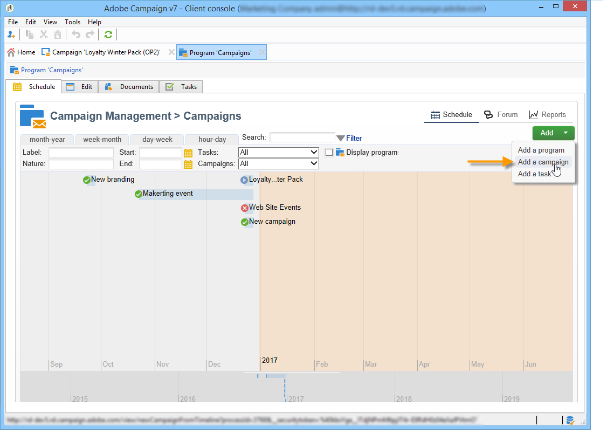

# Kom igång med marknadsföringskampanjer{#setting-up-marketing-campaigns}

Kampanjerna omfattar åtgärder (leveranser) och processer (import eller extrahering av filer) samt resurser (marknadsföringsdokument, leveransdispositioner). De används i marknadsföringskampanjer. Kampanjer ingår i ett program och program ingår i en kampanjplan.

 Upptäck hur du skapar en marknadsföringsplan, ett program och en kampanj [i en video](#video)

Så här skapar du en marknadsföringskampanj:

1. Skapa en kampanj: identifiera kampanjer och deras egenskaper: etikett, typ, start- och slutdatum, budget, associerade resurser, chefer och deltagare. [Läs mer](#creating-a-campaign).

1. Definiera målgrupper: skapa ett arbetsflöde med målfrågor. [Läs mer](../../campaign/using/marketing-campaign-deliveries.md#selecting-the-target-population).

1. Skapa leveranser: välj kanaler och definiera innehållet som ska skickas. [Läs mer](../../campaign/using/marketing-campaign-deliveries.md#creating-deliveries).

1. Godkänn leveranser. [Läs mer](../../campaign/using/marketing-campaign-approval.md).

1. Övervaka leveranser. [Läs mer](../../campaign/using/marketing-campaign-monitoring.md).

1. Planera kampanjer och tillhörande kostnader. [Läs mer](../../campaign/using/providers-stocks-and-budgets.md#creating-service-providers-and-their-cost-structures).

När de här stegen har slutförts kan du starta leveranserna (se [det här avsnittet](../../campaign/using/marketing-campaign-deliveries.md#starting-a-delivery)), kontrollera data, processer och information som hör till leveranserna och, om det behövs, hantera tillhörande dokument (se [det här avsnittet](../../campaign/using/marketing-campaign-deliveries.md#managing-associated-documents)). Du kan också spåra körningen av bearbetningsfaserna för kampanjer och leveranser (se [det här avsnittet](../../campaign/using/marketing-campaign-monitoring.md)).

## Skapa plan- och programhierarki {#creating-plan-and-program-hierarchy}

Så här konfigurerar du din mapphierarki för marknadsföringsplaner och program:

1. Klicka på ikonen **Utforskaren** på startsidan.
1. Högerklicka på den mapp där du vill skapa din plan.
1. Välj **Lägg till ny mapp > Campaign Management > Planera**.

   

1. Byt namn på planen.
1. Högerklicka på den nya planen och välj **Egenskaper..**.

   

1. På fliken **Allmänt** ändrar du det **interna namnet** för att undvika dubbletter under paketexporter.
1. Klicka på **Spara**.
1. Högerklicka på den nya planen och välj **Skapa en ny programmapp**.
1. Upprepa stegen ovan för att byta namn på den nya programmappen och dess interna namn.

## Skapa en kampanj {#creating-a-campaign}

### Lägg till en kampanj {#adding-a-campaign}

Du kan skapa en kampanj via listan med kampanjer. Om du vill visa den här vyn väljer du menyn **[!UICONTROL Campaigns]** på kontrollpanelen **[!UICONTROL Campaigns]**.

I fältet **[!UICONTROL Program]** kan du välja det program som kampanjen ska kopplas till. Denna information är obligatorisk.

Kampanjer kan också skapas via ett program. Det gör du genom att klicka på knappen **[!UICONTROL Add]** på fliken **[!UICONTROL Schedule]** i det aktuella programmet.

När du skapar en kampanj via fliken **[!UICONTROL Schedule]** i ett program länkas kampanjen automatiskt till det aktuella programmet. Fältet **[!UICONTROL Program]** är dolt i det här fallet.

Välj kampanjmallen och lägg till ett namn och en beskrivning av kampanjen i fönstret där kampanjen skapades. Du kan också ange kampanjens start- och slutdatum.

Klicka på **[!UICONTROL OK]** för att skapa kampanjen. Den läggs till i programschemat.

>[!NOTE]
>
>Om du vill filtrera kampanjer som ska visas klickar du på länken **[!UICONTROL Filter]** och väljer status för de kampanjer som ska visas.

### Redigera och konfigurera en kampanj {#editing-and-configuring-a-campaign}

Sedan kan du redigera kampanjen som du just har skapat och definiera dess parametrar.

Om du vill öppna och konfigurera en kampanj väljer du den i schemat och klickar på **[!UICONTROL Open]**.

Då kommer du till kontrollpanelen för kampanjer.

## Återkommande och periodiska kampanjer {#recurring-and-periodic-campaigns}

En återkommande kampanj är en kampanj som baseras på en viss mall vars arbetsflöden är konfigurerade att köras enligt ett associerat schema. Arbetsflödena kommer därför att återkomma inom en kampanj. Målinriktningen dupliceras för varje genomförande och de olika processerna och målpopulationerna spåras. Det är också möjligt att genomföra framtida mål i förväg, via avtalsperioden när arbetsflödet skapas automatiskt, för att starta simuleringar med måluppskattningar.

En periodisk kampanj är en kampanj som skapas automatiskt i enlighet med körningsschemat i sin mall.

### Skapa en återkommande kampanj {#creating-a-recurring-campaign}

Återkommande kampanjer skapas från en specifik mall som definierar den arbetsflödesmall som ska köras och körningsschemat.

#### Skapa en mall för återkommande kampanjer {#creating-the-campaign-template}

1. Skapa en **[!UICONTROL Recurring]**-kampanjmall.

   >[!NOTE]
   >
   >Vi rekommenderar att du duplicerar standardmallen i stället för att skapa en tom mall.

   

1. Ange namnet på mallen och kampanjens varaktighet.

   

1. För den här kampanjtypen läggs en **[!UICONTROL Schedule]**-flik till för att skapa mallkörningsschemat.

På den här fliken anger du planerade körningsdatum för kampanjer som är baserade på den här mallen.

Körningsschemats konfigurationsläge sammanfaller med arbetsflödets **[!UICONTROL Scheduler]**-objekt. Mer information om detta finns i [det här avsnittet](../../workflow/using/architecture.md).

>[!IMPORTANT]
>
>Konfigurationen av körningsschemat måste utföras noggrant för att undvika överbelastning av databasen. Återkommande kampanjer duplicerar arbetsflödet eller arbetsflödena i mallen beroende på angivet schema. Implementeringen av alltför ofta förekommande arbetsflöden kan hindra databasens funktion.

1. Ange ett värde i fältet **[!UICONTROL Create in advance for]** för att skapa motsvarande arbetsflöden för den angivna perioden.
1. Skapa arbetsflödesmallen som ska användas i kampanjer baserade på den här mallen, med målparametrar och en eller flera generiska leveranser.

   >[!NOTE]
   >
   >Det här arbetsflödet måste sparas som en mall för återkommande arbetsflöde. Om du vill göra det redigerar du arbetsflödesegenskaperna och väljer alternativet **[!UICONTROL Recurring workflow template]** på fliken **[!UICONTROL Execution]**.

   

#### Skapa den återkommande kampanjen {#create-the-recurring-campaign}

Om du vill skapa den återkommande kampanjen och köra dess arbetsflöden enligt det schema som definierats i mallen gör du så här:

1. Skapa en ny kampanj baserat på en mall för återkommande kampanjer.
1. Fyll i arbetsflödets körningsschema.

   

1. Med kampanjschemat kan du ange ett automatiskt datum för när arbetsflödet skapas eller körs för varje rad.

   För varje rad kan du lägga till följande alternativ:

   * **[!UICONTROL To be approved]** : gör att du kan framtvinga begäranden om leveransgodkännande i arbetsflödet.
   * **[!UICONTROL To be started]** : låter dig starta arbetsflödet när startdatumet har nåtts.

   I fältet **[!UICONTROL Create in advance for]** kan du skapa alla arbetsflöden som täcker den angivna perioden.

   När arbetsflödet **[!UICONTROL Jobs on campaigns]** körs skapas de dedikerade arbetsflödena baserat på de förekomster som definierats i kampanjschemat. Ett arbetsflöde skapas alltså för varje körningsdatum.

1. Återkommande arbetsflöden skapas automatiskt från arbetsflödesmallen som finns i kampanjen. De visas på fliken **[!UICONTROL Targeting and workflows]** i kampanjen.

   

   Etiketten för en återkommande arbetsflödesinstans består av malletiketten och arbetsflödesnumret, med tecknet # däremellan.

   Arbetsflöden som skapas från schemat associeras automatiskt med det i kolumnen **[!UICONTROL Workflow]** på fliken **[!UICONTROL Schedule]**.

   

   Alla arbetsflöden kan redigeras på den här fliken.

   

   >[!NOTE]
   >
   >Startdatumet för den schemarad som är associerad med arbetsflödet är tillgängligt från en variabel i arbetsflödet med följande syntax:\
   >`$date(instance/vars/@startPlanningDate)`

### Skapa en periodisk kampanj {#creating-a-periodic-campaign}

En periodisk kampanj är en kampanj som baseras på en viss mall som gör att du kan skapa kampanjinstanser baserat på ett körschema. Kampanjinstanser skapas automatiskt baserat på en mall för periodiska kampanjer, beroende på den frekvens som definieras i mallschemat.

#### Skapa kampanjmallen {#creating-the-campaign-template-1}

1. Skapa en **[!UICONTROL Periodic]**-kampanjmall, helst genom att duplicera en befintlig kampanjmall.

   

1. Ange mallens egenskaper.

   >[!NOTE]
   >
   >Operatorn som mallen tilldelas måste ha rätt behörighet för att skapa kampanjer i det valda programmet.

1. Skapa arbetsflödet som är associerat med den här mallen. Den dupliceras i varje periodisk kampanj som skapas av mallen.

   

   >[!NOTE]
   >
   >Det här arbetsflödet är en arbetsflödesmall. Den kan inte köras från kampanjmallen.

1. Slutför körningsschemat som för en mall för återkommande kampanjer: klicka på knappen **[!UICONTROL Add]** och definiera start- och slutdatum, eller fyll i körningsschemat via länken.

   

   >[!IMPORTANT]
   >
   >Periodiska kampanjmallar skapar nya kampanjer enligt det schema som definieras ovan. Den måste därför fyllas i noggrant för att undvika överbelastning av Adobe Campaign-databasen.

1. När startdatumet för körningen har uppnåtts skapas den matchande kampanjen automatiskt. Den får alla egenskaper som mallarna har.

   Varje kampanj kan redigeras via ett mallschema.

   

Varje periodisk kampanj innehåller samma element. När den väl har skapats hanteras den som en standardkampanj.

## Självstudievideo {#video}

Den här videon visar hur du skapar en marknadsföringsplan, ett program och en kampanj.

>[!VIDEO](https://video.tv.adobe.com/v/35132?quality=12)

Ytterligare utbildningsvideor för Campaign är tillgängliga [här](https://experienceleague.adobe.com/docs/campaign-classic-learn/tutorials/overview.html?lang=sv).
