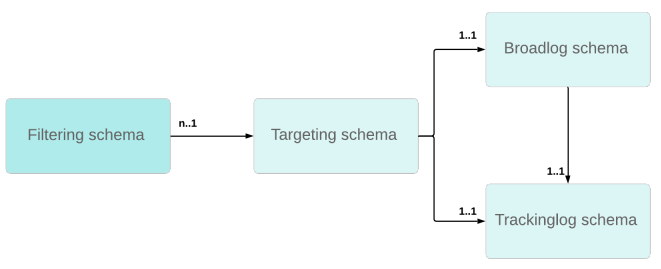

# Om anpassad mottagartabell{#about-custom-recipient-table}

I det här avsnittet beskrivs principerna för användning av en mottagartabell som inte är standard.

Adobe Campaign erbjuder som standard en mottagartabell som färdiga funktioner och processer är länkade till. Standardmottagartabellen har ett antal fördefinierade fält och tabeller som enkelt kan utökas med hjälp av en tilläggstabell.

Om den här tilläggsmetoden ger stor flexibilitet för att utöka en tabell kan inte antalet fält eller länkar i den minskas. Om du använder en tabell som inte är standard, eller en &quot;extern mottagartabell&quot;, får du större flexibilitet men det krävs vissa försiktighetsåtgärder när du implementerar den.

## Precision {#precisions}

Med den här funktionen kan Adobe Campaign bearbeta data från en extern databas: dessa data kommer att användas som en uppsättning profiler för leveranser. Implementeringen av den här processen innefattar flera precisioner som kan vara relevanta beroende på kundens behov. Till exempel:

* Ingen uppdateringsström till och från Adobe Campaign-databasen: data från den här tabellen kan uppdateras direkt via den databasmotor som är värd för den.
* Inga ändringar i processerna som körs på den befintliga databasen.
* Använda en profildatabas med en icke-standardstruktur: möjlighet att leverera till profiler som sparats i olika tabeller med olika strukturer, med en enda instans.
* Inga ändringar eller inget underhåll krävs vid uppdatering av Adobe Campaign-databasen.
* Standardmottagartabellen är värdelös om du inte behöver de flesta tabellfälten eller om databasmallen inte är centrerad på mottagarna.
* För att vara effektiv krävs en tabell med få fält om du har ett stort antal profiler. Standardmottagartabellen har för många fält för det här specifika fallet.

I det här avsnittet beskrivs de huvudpunkter som gör att du kan mappa befintliga tabeller i Adobe Campaign och konfigurationen som ska användas för att köra leveranser baserat på vilken tabell som helst. Slutligen beskrivs hur man ger användarna möjlighet att fråga efter gränssnitt som är lika praktiska som de som finns i den vanliga mottagartabellen. För att förstå det material som presenteras i detta avsnitt krävs god kunskap om principerna för skärm och schemadesign.

## Rekommendationer och begränsningar {#recommendations-and-limitations}

Användningen av en extern mottagartabell har följande begränsningar:

* Adobe Campaign har inte stöd för flera mottagarscheman, som kallas målinriktningsscheman, som är länkade till samma sändnings- och/eller spårningsloggscheman. Detta kan i annat fall leda till avvikelser i dataavstämningen efteråt.

   Bilden nedan visar den nödvändiga relationsstrukturen för varje anpassat mottagarschema:
   

   Vi rekommenderar:

   * Dedikera **[!UICONTROL nms:BroadLogRcp]** scheman och **[!UICONTROL nms:TrackingLogRcp]** scheman till färdiga **[!UICONTROL nms:Recipientschema]**. Dessa två loggtabeller ska inte länkas till någon annan anpassad mottagartabell.
   * Definiera dedikerade anpassade sändnings- och spårningsloggscheman för varje nytt anpassat mottagarschema. Detta kan göras automatiskt när du ställer in målmappningen, se [Målmappning](../../configuration/using/target-mapping.md).

* Du kan inte använda den standard **[!UICONTROL Services and Subscriptions]** som finns i produkten.

   Detta innebär att den övergripande åtgärd som beskrivs i [detta avsnitt](../../delivery/using/managing-subscriptions.md) inte är tillämplig.

* Länken med **[!UICONTROL visitor]** tabellen fungerar inte.

   För att kunna använda modulen för **[!UICONTROLSsocial marknadsföring]** måste du därför konfigurera lagringssteget så att det refererar till rätt tabell.

   På samma sätt måste standardmallen för inledande meddelandeöverföring anpassas när hänvisningsfunktioner används.

* Du kan inte lägga till profiler manuellt i en lista.

   Därför är den procedur som beskrivs i [detta avsnitt](../../platform/using/creating-and-managing-lists.md) inte tillämplig utan ytterligare konfiguration.

   >[!NOTE]
   >
   >Du kan fortfarande skapa mottagarlistor med hjälp av arbetsflöden. Mer information finns i [Skapa en profillista med ett arbetsflöde](../../configuration/using/creating-a-profile-list-with-a-workflow.md).

Vi rekommenderar också att du kontrollerar standardvärdena som används i de olika färdiga konfigurationerna: Beroende på vilka funktioner som används måste flera anpassningar göras.

Till exempel:

* Vissa standardrapporter, särskilt de som erbjuds av **Interaction** och **Mobile Applications** , måste utvecklas på nytt. Se avsnittet [Hantera rapporter](../../configuration/using/managing-reports.md) .
* Standardkonfigurationerna för vissa arbetsflödesaktiviteter refererar till standardmottagartabellen (**[!UICONTROL nms:recipient]**): dessa konfigurationer måste ändras när de används för en extern mottagartabell. Se avsnittet [Hantera arbetsflöden](../../configuration/using/managing-workflows.md) .
* Standardblocket för **[!UICONTROL Unsubscription link]** personalisering måste anpassas.
* Målmappningen för standardleveransmallarna måste ändras.
* V4-formulär är inte kompatibla med en extern mottagartabell: måste du använda webbprogram.

