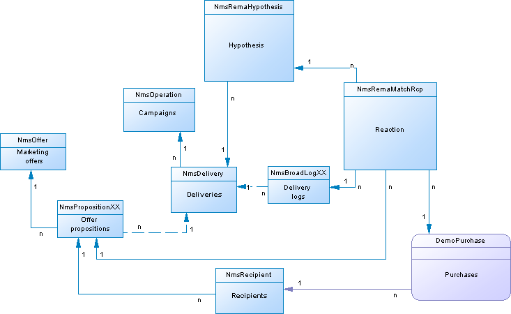
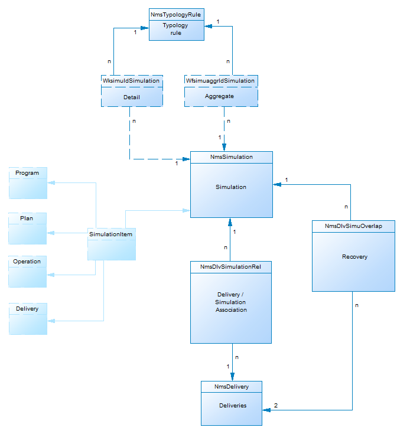
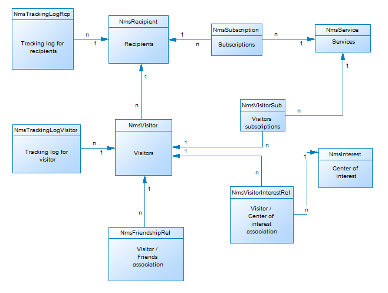

# Beskrivning av kampanjdatamodell{#data-model-description}

Adobe Campaign innehåller en fördefinierad datamodell. I det här avsnittet finns mer information om de inbyggda tabellerna för datamodellen i Adobe Campaign och deras interaktion.

Om du vill få åtkomst till beskrivningen av varje tabell går du till **[!UICONTROL Admin > Configuration > Data schemas]**, väljer en resurs i listan och klickar på **[!UICONTROL Documentation]** fliken.

>[!NOTE]
>
>Den fysiska och logiska strukturen hos de data som medföljer programmet beskrivs i XML. Den lyder under en grammatik som är specifik för Adobe Campaign, som kallas schema. Mer information om Adobe Campaign-scheman finns i [det här avsnittet](../../configuration/using/about-schema-reference.md).

## Beskrivning av huvudtabellerna {#description-main-tables}

Adobe Campaign bygger på en relationsdatabas som innehåller tabeller som är länkade tillsammans.

I följande diagram visas kopplingarna mellan huvudtabellerna i Adobe Campaign-datamodellen och huvudfälten för varje.

<!---->

Den fördefinierade datamodellen för Adobe Campaign innehåller huvudtabellerna som listas nedan.

### NmsRecipient {#NmsRecipient}

Tabellen matchar **nms:mottagarschemat** .

Det är standardtabellen som används för **mottagare av leveranser**. Den innehåller därför den information som krävs för leveranser via de olika kanalerna:

* sEmail: e-postadress.
* iEmailFormat: önskat format för e-post (1 för Text, 2 för HTML och 0 om det är odefinierat).
* sAddress1, sAddress2, sAddress3, sAddress4, sZipCode, sCity används för att skapa postadressen (i enlighet med standarden XPZ 10-011 AFNOR från maj 1997).
* sPhone, sMobilePhone, sFax innehåller telefon-, mobiltelefon- och faxnummer.
* iBlackList är standardavanmälningsflaggan som används för profilerna (1 betyder&quot;unsubscribed&quot;, 0 annars).

Fältet iFolderId är den sekundärnyckel som länkar mottagaren till dess körningsmapp. Mer information finns i [XtkFolder](#XtkFolder).

Fältet sCountryCode är ISO-koden 3166-1 Alpha 2 (2 tecken) för det land som är associerat med mottagaren. Det här fältet är i själva verket en sekundärnyckel i landreferenstabellen (NmsCountry), som innehåller landsetiketter och andra landskoddata. Om landet inte är ifyllt sparas värdet&quot;XX&quot; (och används i stället för en nollpost).

Mer information om mottagartabellen finns i [det här avsnittet](../../configuration/using/about-data-model.md#default-recipient-table).

### NmsGroup {#NmsGroup}

Tabellen matchar **nms:group** -schemat.

Det gör att du kan skapa **statiska grupper med mottagare**. Det finns en många-till-många-relation mellan mottagare och grupper. En mottagare kan till exempel tillhöra flera grupper och en grupp kan innehålla flera mottagare. Grupper kan skapas manuellt, via en import eller via leveransanpassning. Grupper används ofta som leveransmål. Det finns ett unikt index i fältet som representerar det interna namnet för sName-gruppen. Gruppen är länkad till en mapp (nyckeln är iFolderId). Mer information finns i [XtkFolder](#XtkFolder)).

### NmsRcpGrpRel {#NmsRcpGrpRel}

Relationstabellen NmsRcpGrpRel innehåller bara de två fälten som motsvarar identifierarna för de länkade tabellerna iRecipientId och iGroupId.

### NmsService {#NmsService}

Tabellen matchar **nms:service** -schemat.

I Adobe Campaign kan du skapa och hantera prenumerationer på informationstjänster (ämnen). Registret NmsService lagrar definitionen av de informationstjänster (ämnen) som du erbjuder dina mottagare att prenumerera på (till exempel ett nyhetsbrev).

Tjänster är enheter som liknar grupper (statiska mottagargrupper), förutom att de distribuerar mer information och gör det enkelt att hantera prenumerationer och avbeställningar via formulär.

Det finns ett unikt index i fältet som representerar det interna namnet för sName-tjänsten. Tjänsten är länkad till en mapp (nyckeln är iFolderId). Mer information finns i [XtkFolder](#XtkFolder)). Slutligen anger iType-fältet tjänstens leveranskanal (0 för e-post, 1 för SMS, 2 för telefon, 3 för direktreklam och 4 för fax).

### NmsSubscription {#NmsSubscription}

Tabellen matchar **nms:subscription** -schemat.

Det gör att du kan hantera mottagarnas prenumerationer på informationstjänster.

### NmsSubHisto {#NmsSubHisto}

Den här tabellen matchar schemat **nms:subHistory** .

Om prenumerationerna hanteras med webbformulär eller programmets gränssnitt, kommer alla prenumerationer och avbeställningar att sparas i NmsSubHistory-tabellen. I iAction-fältet anges den åtgärd (0 för prenumeration och 1 för prenumeration) som utfördes på det datum som lagras i fältet tsDate.

### NmsDelivery {#NmsDelivery}

Tabellen matchar **nms:delivery** -schemat.

Varje post i den här tabellen representerar en **leveransåtgärd** eller en **leveransmall**. Den innehåller alla parametrar som krävs för att utföra leveranser (mål, innehåll osv.). Leveransloggar (utsändning) (NmsBroadLog) och tillhörande spårnings-URL:er (NmsTrackingUrl) skapas under analysfasen (mer information om båda tabellerna finns nedan).

Det finns ett unikt index i fältet som representerar det interna namnet för sInternalName-leveransen eller scenariot. Leveransen är länkad till en körningsmapp (den externa nyckeln är iFolderProcessId. Mer information finns i [XtkFolder](#XtkFolder)).

### XtkFolder {#XtkFolder}

Den innehåller **alla mappar i trädet** som visas på fliken **Navigering** i konsolen.

Mapparna skrivs: värdet för sModel-fältet anger vilken typ av data som kan finnas i mappen. I det här fältet kan klientkonsolen visa data korrekt med motsvarande formulär. Möjliga värden för det här fältet definieras i navTree.

Trädet hanteras av fälten iParentId och iChildCount. Fältet sFullName ger den fullständiga sökvägen till mappen i trädet. Slutligen finns det ett unikt index i fältet som representerar det interna namnet i mappen sName.

## Leverans och spårning {#delivery-and-tracking}

Den här tabelluppsättningen är länkad till modulen **Leverans** , som används för att övervaka leveranser och eventuella problem som uppstår när meddelanden skickas. Mer information finns i [Övervaka leveranser](../../delivery/using/monitoring-a-delivery.md). Mer information om spårning finns i [Spåra meddelanden](../../delivery/using/about-message-tracking.md).

**NmsBroadLogMsg**: Tabellen matchar schemat **nms:broadLogMsg** . Det är ett tillägg till leveransloggtabellen.

## Kampanjhantering {#campaign-management}

Den här tabelluppsättningen är kopplad till modulen **Marknadsföringskampanjer** , som gör det möjligt att definiera, optimera, genomföra och analysera kommunikation och marknadsföringskampanjer. Mer information finns i [Om marknadsföringskampanjer](../../campaign/using/designing-marketing-campaigns.md).

* **NmsOperation**: Tabellen matchar **nms:operation** -schemat. Det innehåller data från marknadsföringskampanjer.
* **NmsDeliveryOutline**: Den här tabellen matchar schemat **nms:deliveryOutline** . Den innehåller de utökade egenskaperna för leveransen (leveransdisposition).
* **NmsDlvOutlineItem**: Tabellen matchar schemat **nms:dlvOutlineItem** . Den innehåller artiklarna i en leveransdisposition.
* **NmsDeliveryCustomization**: Tabellen matchar schemat **nms:deliveryCustomization** . Det innehåller personaliseringsfälten för en leverans.
* **NmsBudget**: Tabellen matchar schemat **nms:budget** . Den innehåller data från en budget för en kampanj, en plan, ett program, en aktivitet och/eller leveranser.
* **NmsDocument**: Tabellen matchar **nms:document** -schemat. Det innehåller kampanjens marknadsföringsdokument i form av filer (bilder, Excel- eller ordfiler etc.)
* **XtkWorkflow**: Tabellen matchar schemat **xtk:workflow** . Det innehåller kampanjinriktning.
* **NmsTask**: Tabellen matchar **nms:task** -schemat. Den innehåller definitionen av en marknadsföringsuppgift.
* **NmsAsset**: Tabellen matchar **nms:asset** -schemat. Den innehåller definitionen av en marknadsföringsresurs.

## Enhetlig kommunikation {#communication-consistency}

Den här tabelluppsättningen är länkad till modulen **Kampanjoptimering** , som gör det möjligt att styra, filtrera och övervaka leveransen. Mer information finns i [Om kampanjtypologier](../../campaign/using/about-campaign-typologies.md).

* **NmsTypologyRule**: Tabellen matchar schemat **nms:typologyRule** . Det innehåller de regler som gäller för leveranser beroende på typologi.
* **NmsTypology**: Tabellen matchar schemat **nms:typology** . Den innehåller den uppsättning regler som ska tillämpas på leveranser som matchar typologin.
* **NmsTypologyRuleRel**: Den här tabellen matchar schemat **nms:typologyRuleRel** . Det innehåller relationerna mellan typologier och deras regler.
* **NmsVolumeLine**: Tabellen matchar schemat **nms:volumeLine** . Den innehåller en uppsättning tillgänglighetslinjer för kapacitetsreglerna.
* **NmsVolumeCONSmed**: Den här tabellen matchar schemat **nms:volumeCONSmed** . Den innehåller alla förbrukningslinjer för kapacitetsreglerna.

## Svarshantering {#response-management}

Den här tabelluppsättningen är kopplad till **Response Manager** -modulen, som gör det möjligt att mäta framgången och lönsamheten för marknadsföringskampanjer eller erbjuda förslag för alla kommunikationskanaler. Mer information finns i [Om svarshanteraren](../../campaign/using/about-response-manager.md).

### NmsRemaHypothesis {#NmsRemaHypothesis}

Den här tabellen sammanfaller med schemat **nms:remaHypothesis** . Den innehåller definitionen av mäthypotesen.

Tabellen innehåller viktig information som lagras i XML, bland annat:

**Körningskontext (information lagrad i XML)**

Körningskontexten fyller i de tabeller och fält som ska beaktas vid beräkning av mått, nämligen:
* Lagringsschemat för nms:remaMatchRcp-reaktionsloggen.
* Transaktionstabellschemat (t.ex. inköp).
* Frågeschemat som gör att du kan definiera den inledande tabellen för hypotesvillkoren.
* Länkarna till enskilda personer, som gör att du kan identifiera individen baserat på frågeschemat.
* Transaktionsdatumet. Det här fältet är inte obligatoriskt, men vi rekommenderar att du använder det för att begränsa beräkningens perimeter.
* Transaktionsbeloppet: det är ett valfritt fält för automatisk beräkning av intäktsindikatorer.

**Hypotesperimeter (information lagrad i XML)**

Den hypotetiska perimetern består av filtreringen av hypotesen baserat på tabellen i frågeschemat.

**Hypoesöverlagringsskript (information lagrad i XML)**

Skriptet för hypotesöverlagring är en JavaScript-kod som gör att du kan överlagra innehållet i hypotesen under körningen.

**Mätningsindikatorer**

Följande indikatorer uppdateras automatiskt under hypoteskörningen:

* Antal reaktioner: **iTransaction**. Antal rader i reaktionsloggtabellen.
* Antal kontaktade: **iContactReached**. Distinkt antal målkontakter i hypotesen.
* Antal kontrollgrupper: **iProofReached**. Distinkt antal riktade kontakter i kontrollgruppen i hypotesen.
* Kontaktad svarsfrekvens: **dContactReactRate**. Svarsfrekvens för målkontakter i hypotesen.
* Kontrollgruppens svarsfrekvens: **dProofReactionsRate**. Svarsfrekvens för den hypotetiska kontrollgruppen.
* De totala intäkterna för den befolkningsgrupp som kontaktas: **dContactReactingTotalAmount**. Sammanlagda intäkter från målkontakter i hypotesen.
* Genomsnittlig intäkt för kontrollgruppen: **dContactReactingAvgAmount**. Genomsnittlig intäkt för målgruppskontakter i hypotesen.
* Total intäkt för kontrollgruppen: **dProofReactingTotalAmount**. Sammanlagda intäkter för kontrollgruppen för hypoteser.
* Genomsnittlig intäkt för kontrollgruppen: **dProofReactingAvgAmount**. Genomsnittlig intäkt för kontrollgruppen för hypoteser.
* Total marginal per kontakt: **dContactReactingTotalMargin**. Total marginal per kontakt som anges i hypotesen.
* Genomsnittlig marginal per kontakt: **dContactReactingAvgMargin**. Genomsnittlig marginal per kontakt som anges i hypotesen.
* Total marginal för kontrollgruppen: **dProofReactingTotalMargin**. Total marginal för den kontrollgrupp som omfattas av hypotesen.
* Genomsnittlig marginal för kontrollgruppen: **dProofReactingAvgMargin**. Genomsnittlig marginal för den kontrollgrupp som omfattas av hypotesen.
* Ytterligare intäkter: **dAdditionalAmount**. (Genomsnittlig intäkt för kontaktad kontrollgrupp - genomsnittlig intäkt för kontrollgruppen) * Antal kontaktade.
* Ytterligare marginal: **dAdditionalMargin**. (Genomsnittlig kontaktmarginal - genomsnittlig kontrollgruppsmarginal) / Antal kontaktade.
* Genomsnittskostnad per kontakt (SQL-uttryck). Beräknad leveranskostnad / Antal kontaktade.
* ROI (SQL-uttryck). Beräknad kostnad för leveransen/Total kontaktmarginal.
* Effektiv ROI (SQL-uttryck). Beräknad kostnad för leveransen/tilläggsmarginalen.
* Signifikans: **iSignificativy** (SQL-uttryck). Innehåller värden mellan 0 och 3 beroende på kampanjens betydelse.

### NmsRemaMatchRcp {#NmsRemaMatchRcp}

Den här tabellen matchar schemat **nms:remaMatchRcp** .

Det innehåller ett register som representerar en individs reaktion på en given hypotes. Dessa poster skapades under hypoteskörningen.

## Simulering och leverans {#simulation-and-delivery}

Den här tabelluppsättningen är länkad till modulen **Simulering** , som gör att du kan testa distributionen av erbjudanden som tillhör en kategori eller miljö innan du skickar ditt förslag till mottagarna. Mer information finns i [Om erbjudandesimulering](../../interaction/using/about-offers-simulation.md).

* **NmsSimulation**: Den här tabellen matchar **nms:simulation** -schemat. Det representerar en simulering för en uppsättning leveranser eller erbjudanden för en viss population.
* **NmsDlvSimulationRel**: Tabellen matchar schemat **nms:dlvSimulationRel** . Den innehåller en förteckning över leveranser som har beaktats vid simuleringen. Simuleringens omfång lagras i XML.
* **NmsOfferSimulationRel**: Tabellen matchar schemat **nms:offerSimulationRel** . Du kan länka ihop en simulering med ett erbjudande.

## Interaktionsmodul {#interaction-module}

Den här tabelluppsättningen är länkad till **interaktionsmodulen** , som gör att du kan svara i realtid under en interaktion med en viss kontakt genom att göra dem till ett eller flera anpassade erbjudanden. Mer information finns i [Interaktion och erbjudandehantering](../../interaction/using/interaction-and-offer-management.md).

* **NmsOffer**: Tabellen matchar schemat **nms:offer** . Det innehåller definitionen av varje marknadsföringserbjudande.
* **NmsPropositionRcp**: Tabellen matchar schemat **nms:propositionRcp** . Det innehåller en flerkanalslogg över de marknadsföringsförslag som skickas till varje enskild person. Posten skapas när ett förslag förbereds eller görs på ett effektivt sätt till en individ.
* **NmsOfferSpace**: Tabellen matchar schemat **nms:offerSpace** . Den innehåller definitionen av platser där förslag läggs fram.
* **NmsOfferContext**: Tabellen matchar schemat **nms:offerContext** . Den innehåller ytterligare kriterier om förslagets tillämplighet samt definitionen av viktberäkningsformeln.
* **NmsOfferView**: Tabellen matchar **nms:offerView**. Det innehåller erbjudanderepresentationerna.
* **NmsOfferCategory**: Tabellen matchar **nms:offerCategory**. Den innehåller erbjudandekategorierna.
* **NmsOfferEnv**: Tabellen matchar **nms:offerEnv**. Den innehåller erbjudandemiljöerna.

## Modul för meddelandecenter {#message-center-module}

Följande tabelluppsättning är länkad till modulen **Transactional Messaging** (Message Center), som gör det möjligt att hantera enskilda och unika meddelanden som skickas till en användare och som genereras från händelser som utlöses från informationssystem. Mer information finns i [Om transaktionsmeddelanden](../../message-center/using/about-transactional-messaging.md).

### NmsRtEvent {#NmsRtEvent}

Tabellen matchar schemat **nms:rtEvent** . Den innehåller en definition av händelser i realtid.

### NmsBatchEvent {#NmsBatchEvent}

Tabellen matchar schemat **nms:batchEvent** . Den innehåller definitionen av händelser per grupp.

<!--## Microsites Module {#microsites-module}

This set of tables is linked to the **Web applications** functionality, which allows to create and publish dynamic and interactive web applications with data from the database and content adapted to the rights of the connected user. For more on this, see [About web applications](../../web/using/about-web-applications.md).

* **NmsTrackingUrl**: This table matches the **nms:trackingUrl** schema.

* **NmsPurl**: This table matches the **nms:purl** schema.-->

## NMAC-modul {#nmac-module}

Den här tabelluppsättningen är länkad till **mobilappskanalen**, som gör att du kan skicka personaliserade meddelanden till iOS- och Android-terminaler via appar. Mer information finns i [Om mobilappskanalen](../../delivery/using/about-mobile-app-channel.md).

* **NmsMobileApp**: Tabellen matchar schemat **nms:mobileApp** . Det innehåller de mobilprogram som definieras i Adobe Campaign.
* **NmsAppSubscription**: Tabellen matchar schemat **nms:appSubscription** . Det innehåller information om prenumeranter för ett eller flera program.
* **NmsAppSubscriptionRcp**: Tabellen matchar schemat **nms:appSubscriptionRcp** . Det gör att du kan länka besökare som prenumererar på ett program till mottagartabellen.
* **NmsExcludeLogAppSubRcp**: Den här tabellen matchar schemat **nms:excludeLogAppSubRcp** .
* **NmsTrackingLogAppSubRcp**: Den här tabellen matchar schemat **nms:trackingLogAppSubRcp** .
* **NmsBroadLogAppSubRcp**: Den här tabellen matchar schemat **nms:broadLogAppSubRcp** .

## Modul för social marknadsföring {#social-marketing-module}

Den här tabelluppsättningen är länkad till modulen **Hantera sociala nätverk** , som gör det möjligt att interagera med kunder och potentiella kunder via Facebook och Twitter. Mer information finns i [Om social marknadsföring](../../social/using/about-social-marketing.md).

* **NmsVisitor**: Tabellen matchar schemat **nms:visitor** . Det innehåller information om besökare.
* **NmsVisitorSub**: Tabellen matchar schemat **nms:visitorSub** . Det gör att du kan länka en besökare till de tjänster som de har prenumererat på (Twitter eller Facebook).
* **NmsFriendShipRel**: Tabellen matchar schemat **nms:VänshipRel** . Det gör att du kan länka besökare till deras vänner inom ramen för Facebook-tjänsten.
* **NmsVisitorInterestRel**: Den här tabellen matchar schemat **nms:visitorInterestRel** . Det gör det möjligt för er att länka samman besökare och deras intressen.
* **NmsInterest**: Tabellen matchar schemat **nms:interest** . Den innehåller en lista med intressen för varje besökare.