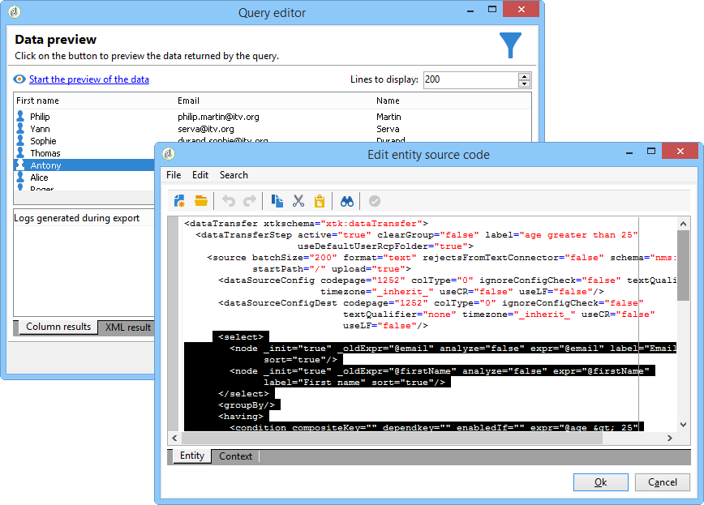

# Dataorienterade API:er{#data-oriented-apis}

Med dataorienterade API:er kan du hantera hela datamodellen.

## Översikt över datamodellen {#overview-of-the-datamodel}

Adobe Campaign erbjuder inte ett dedikerat läs-API per entitet (ingen getRecipient- eller getDelivery-funktion osv.). Använd metoderna för läsning och ändring av QUERY- och WRITER-data för att komma åt modellens data.

Med Adobe Campaign kan ni hantera samlingar: Med frågor kan du återställa en uppsättning information som samlats in i hela basen. Till skillnad från åtkomst i SQL-läge returnerar Adobe Campaign-API:er ett XML-träd i stället för datakolumner. Adobe Campaign skapar därmed sammansatta dokument med alla insamlade data.

Det här operativläget erbjuder inte en-till-en-mappning mellan attributen och elementen i XML-dokumenten och kolumnerna i tabellerna i databasen.

XML-dokument lagras i databasens MEMO-typfält.

## Beskrivning av modellen {#description-of-the-model}

Du måste känna till datamodellen för Adobe Campaign för att kunna hantera fälten i databasen i dina skript.

En presentation av datamodellen finns i beskrivningen [av](https://docs.campaign.adobe.com/doc/AC/en/technicalResources/_Datamodel_Description_of_the_main_tables.html)datamodellen för Adobe Campaign.

Läs den här artikeln om du vill skapa en struktur: [Så här skapar du en datamodell eller datamordlista](https://helpx.adobe.com/campaign/kb/generate-data-model.html).

## Fråga och skrivprogram {#query-and-writer}

Följande introduktionsschema innehåller information om utbyten på låg nivå för läsning (ExecuteQuery) och skrivning (Writer) mellan databas och kund (webbsidor eller Adobe Campaign-klientkonsolen).


### ExecuteQuery {#executequery}

För kolumner och villkor kan du använda Frågor.

Detta gör att du kan isolera den underliggande SQL-koden. Frågespråket är inte beroende av den underliggande motorn: vissa funktioner mappas om, vilket kan generera flera SELECT SQL-order.

Mer information finns i [Exempel på metoden ExecuteQuery i schemat xtk:queryDef](../../configuration/using/web-service-calls.md#example-on-the--executequery--method-of-schema--xtk-querydef-).

Metoden **ExecuteQuery** presenteras i [ExecuteQuery (xtk:queryDef)](#executequery--xtk-querydef-).

### Skriv {#write}

Med skrivkommandon kan du skriva enkla eller komplexa dokument, med poster i en eller flera tabeller i basen.

Med transaktionella API:er kan du hantera avstämningar via **kommandot updateOrInsert** : med ett kommando kan du skapa eller uppdatera data. Du kan också konfigurera ändringssammanfogning (**sammanfogning**): I det här operativläget kan du godkänna partiella uppdateringar.

XML-strukturen ger en logisk vy av data och gör att du kan stega dig förbi den fysiska strukturen i SQL-tabellen.

Skrivmetoden presenteras i [Write/WriteCollection (xtk:session)](#write---writecollection--xtk-session-).

## ExecuteQuery (xtk:queryDef) {#executequery--xtk-querydef-}

Med den här metoden kan du utföra frågor från data som är kopplade till ett schema. Det krävs en autentiseringssträng (måste vara inloggad) och ett XML-dokument som beskriver frågan som ska skickas som parametrar. Returparametern är ett XML-dokument som innehåller resultatet av frågan i formatet för det schema som frågan refererar till.

Definition av metoden &quot;ExecuteQuery&quot; i schemat &quot;xtk:queryDef&quot;:

```
<method name="ExecuteQuery" const="true">
  <parameters>
    <param desc="Output XML document" name="output" type="DOMDocument" inout="out"/>
  </parameters>
</method>
```

>[!NOTE]
>
>Detta är en const-metod. Indataparametrarna inkluderas i ett XML-dokument i formatet för xtk:queryDef-schemat.

### Format för XML-dokumentet i indatafrågan {#format-of-the-xml-document-of-the-input-query}

XML-dokumentets struktur för frågan beskrivs i schemat &quot;xtk:queryDef&quot;. I det här dokumentet beskrivs satserna i en SQL-fråga: &quot;select&quot;, &quot;where&quot;, &quot;order by&quot;, &quot;group by&quot;, &quot;having&quot;.

```
<queryDef schema="schema_key" operation="operation_type">
  <select>
    <node expr="expression1">
    <node expr="expression2">
    ...
  </select>
  <where> 
    <condition expr="expression1"/> 
    <condition expr="expression2"/>
    ... 
  </where>
  <orderBy>
    <node expr="expression1">
    <node expr="expression2">
    ...
  </orderBy>
  <groupBy>
    <node expr="expression1">
    <node expr="expression2">
    ...
  </groupBy>
  <having>
    <condition expr="expression1"/> 
    <condition expr="expression2"/>
    ...
  </having>
</queryDef>
```

En underfråga ( `<subquery>` ) kan definieras i ett `<condition> ` element. Syntaxen för ett `<subquery> ` element baseras på syntaxen för ett `<querydef>`.

Exempel på en `<subquery>  : </subquery>`

```
<condition setOperator="NOT IN" expr="@id" enabledIf="$(/ignored/@ownerType)=1">
  <subQuery schema="xtk:operatorGroup">
     <select>
       <node expr="[@operator-id]" />
     </select>
     <where>
       <condition expr="[@group-id]=$long(../@owner-id)"/>
     </where>
   </subQuery>
</condition>  
  
```

En fråga måste referera till ett startschema från **schemaattributet** .

Den önskade typen av åtgärd anges i **åtgärdsattributet** och innehåller ett av följande värden:

* **get**: hämtar en post från tabellen och returnerar ett fel om data inte finns,
* **getIfExists**: hämtar en post från tabellen och returnerar ett tomt dokument om data inte finns,
* **välj**: skapar en markör som returnerar flera poster och returnerar ett tomt dokument om det inte finns några data,
* **antal**: returnerar ett antal data.

XPath- **syntaxen** används för att hitta data baserat på indatabchemat. Mer information om XPaths finns i [Datascheman](../../configuration/using/data-schemas.md).

#### Exempel på åtgärden get {#example-with-the--get--operation}

Hämtar efternamnet och förnamnet för en mottagare (&quot;nms:ecifikt&quot; schema) med ett filter i e-postmeddelandet.

```
<queryDef schema="nms:recipient" operation="get">
  <!-- fields to retrieve -->
  <select>
    <node expr="@firstName"/>
    <node expr="@lastName"/>
  </select> 

  <!-- condition on email -->
  <where>  
    <condition expr="@email= 'john.doe@aol.com'"/>
  </where>
</queryDef>
```

#### Exempel med åtgärden select {#example-with-the--select--operation}

Returnerar listan med mottagare filtrerade i en mapp och e-postdomänen med sortering i fallande ordning på födelsedatumet.

```
<queryDef schema="nms:recipient" operation="select">
  <select>
    <node expr="@email"/>
    <!-- builds a string with the concatenation of the last name and first name separated by a dash -->      
    <node expr="@lastName+'-'+@firstName"/>
    <!-- get year of birth date -->
    <node expr="Year(@birthDate)"/>
  </select> 

  <where>  
     <condition expr="[@folder-id] = 1234 and @domain like 'Adobe%'"/>
  </where>

  <!-- order by birth date -->
  <orderBy>
    <node expr="@birthDate" sortDesc="true"/> <!-- by default sortDesc="false" -->
  </orderBy>
</queryDef>
```

Uttryck kan vara enkla fält eller komplexa uttryck som aritmetiska operationer eller sammanfogning av strängar.

Om du vill begränsa antalet poster som ska returneras lägger du till attributet **lineCount** i `<querydef>` elementet.

Så här begränsar du antalet poster som returneras av frågan till 100:

```
<queryDef schema="nms:recipient" operation="select" lineCount="100">
...
```

Om du vill hämta de följande 100 posterna kör du samma fråga igen och lägger till **attributet startLine** .

```
<queryDef schema="nms:recipient" operation="select" lineCount="100" startLine="100">
...
```

#### Exempel med åtgärden &#39;count&#39; {#example-with-the--count--operation}

Så här räknar du antalet poster i en fråga:

```
<queryDef schema="nms:recipient" operation="count"">
  <!-- condition on the folder and domain of the e-mail -->
  <where>  
    <condition expr="[@folder-id] = 1234" and @domain like 'Adobe%'"/>
  </where>
</queryDef>
```

>[!NOTE]
>
>Återigen använder vi villkoret från föregående exempel. Satserna `<select>` och används inte. </select>`

#### Datagrupper {#data-grouping}

Så här hämtar du e-postadresser som refereras flera gånger:

```
<queryDef schema="nms:recipient" operation="select">
  <select>
    <node expr="@email"/>
    <node expr="count(@email)"/>
  </select>

  <!-- e-mail grouping clause -->
  <groupby>
    <node expr="@email"/>
  </groupby>

  <!-- grouping condition -->
  <having>
    <condition expr="count(@email) > 1"/>
  </having>

</queryDef>
```

Frågan kan förenklas genom att attributet **groupBy** läggs till direkt i fältet som ska grupperas:

```
<select>
  <node expr="@email" groupBy="true"/>
</select>
```

>[!NOTE]
>
>Du behöver inte längre fylla i `<groupby>` elementet.

#### Brackering under förhållanden {#bracketing-in-conditions}

Här är två exempel på hakparenteser på samma villkor.

* Den enkla versionen i ett enda uttryck:

   ```
   <where>
     <condition expr="(@age > 15 or @age <= 45) and  (@city = 'Newton' or @city = 'Culver City') "/>
   </where>
   ```

* Den strukturerade versionen med `<condition>` element:

   ```
   <where>
     <condition bool-operator="AND">
       <condition expr="@age > 15" bool-operator="OR"/>
       <condition expr="@age <= 45"/>
     </condition>
     <condition>
       <condition expr="@city = 'Newton'" bool-operator="OR"/>
       <condition expr="@city = 'Culver City'"/>
     </condition>
   </where>
   ```

Det går att ersätta operatorn &quot;OR&quot; med operatorn &quot;IN&quot; när flera villkor gäller för samma fält:

```
<where>
  <condition>
    <condition expr="@age IN (15, 45)"/>
    <condition expr="@city IN ('Newton', 'Culver City')"/>
  </condition>
</where>
```

Den här syntaxen förenklar frågan när mer än två data används i villkoret.

#### Exempel på länkar {#examples-on-links}

* Länkarna 1-1 eller N1: när tabellen har sekundärnyckeln (länken startar från tabellen) kan fälten i den länkade tabellen filtreras eller hämtas direkt.

   Exempel på ett filter på mappetiketten:

   ```
   <where>
     <condition expr="[folder/@label] like 'Segment%'"/>
   </where>
   ```

   Så här hämtar du mappens fält från schemat &quot;nms:receive&quot;:

   ```
   <select>
     <!-- label of recipient folder -->
     <node expr="[folder/@label]"/>
     <!-- displays the string count of the folder -->
     <node expr="partition"/>
   </select>
   ```

* Samlingslänkar (1N): filtreringen av fälten i en samlingstabell måste utföras med operatorn **EXISTS** eller **NOT EXISTS** .

   Så här filtrerar du de mottagare som har prenumererat på informationstjänsten Newsletter:

   ```
   <where>
     <condition expr="subscription" setOperator="EXISTS">
       <condition expr="@name = 'Newsletter'"/>
     </condition>
   </where>
   ```

   Direkthämtning av fälten för en samlingslänk från `<select>` satsen rekommenderas inte eftersom frågan returnerar en kardinalprodukt. Den används bara när den länkade tabellen bara innehåller en post (exempel `<node expr="">`).

   Exempel på prenumerationslänken:

   ```
   <select>
     <node expr="subscription/@label"/>
   </select>
   ```

   Det går att hämta en underlista som innehåller elementen i en samlingslänk i `<select>` -satsen. XPaths för de refererade fälten är sammanhangsberoende från samlingselementet.

   Filtrerings- ( `<orderby>` ) och `<where>` begränsningselementen ( ) kan läggas till i samlingselementet.

   I det här exemplet returnerar frågan e-post och en lista över informationstjänster som mottagaren prenumererar på:

   ```
   <queryDef schema="nms:recipient" operation="select">
     <select>
       <node expr="@email"/>
   
       <!-- collection table (unbound type) -->
       <node expr="subscription">  
         <node expr="[service/@label]"/>    
         <!-- sub-condition on the collection table -->
         <where>  
           <condition expr="@expirationDate >= GetDate()"/>
         </where>
         <orderBy>
           <node expr="@expirationDate"/> 
         </orderBy>
       </node>
     </select> 
   </queryDef>
   ```

#### Binda parametrarna för var- och select-satsen {#binding-the-parameters-of-the--where--and--select--clause}

Parametrarnas bindning gör att motorn kan ange värden för parametrarna som används i frågan. Detta är mycket användbart, eftersom motorn ansvarar för att värden undgås och det finns en ytterligare fördel med ett cache-minne för de parametrar som ska hämtas.

När en fråga skapas ersätts de bundna värdena med ett tecken (? i ODBC, `#[index]#` i postgres..) i SQL-frågans brödtext.

```
<select>
  <!--the value will be bound by the engine -->
  <node expr="@startDate = #2002/02/01#"/>                   
  <!-- the value will not be bound by the engine but visible directly in the query -->
  <node expr="@startDate = #2002/02/01#" noSqlBind="true"/> 
</select>
```

För att undvika bindning av en parameter måste attributet noSqlBind fyllas i med värdet true.

>[!CAUTION]
>
>Om frågan innehåller instruktioner för &quot;order-by&quot; eller &quot;grupp-för&quot;, kommer databasmotorerna inte att kunna &quot;binda&quot; värden. Du måste placera attributet @noSqlBind=&quot;true&quot; i instruktionerna &quot;select&quot; och/eller &quot;where&quot; för frågan.

#### Tips för frågeskapande: {#query-building-tip-}

Om du vill ha hjälp med syntaxen för en fråga kan du skriva frågan med den generiska frågeredigeraren i Adobe Campaign-klientkonsolen ( **[!UICONTROL Tools/ Generic query editor...]** menyn). Så här gör du:

1. Välj de data som ska hämtas:

   

1. Definiera filtervillkoret:

   

1. Kör frågan och tryck på CTRL+F4 för att visa frågekällkoden.

   

### Utdatadokumentformat {#output-document-format}

Returparametern är ett XML-dokument i formatet för det schema som är associerat med frågan.

Exempel på en retur från schemat &quot;nms:mottagare&quot; för en &quot;get&quot;-åtgärd:

```
<recipient email="john.doe@adobe.com" lastName"Doe" firstName="John"/>
```

I en select-åtgärd är det returnerade dokumentet en uppräkning av element:

```
<!-- the name of the first element does not matter -->
<recipient-collection>   
  <recipient email="john.doe@adobe.com" lastName"Doe" firstName="John"/>
  <recipient email="peter.martinez@adobe.com" lastName"Martinez" firstName="Peter"/>
  <recipient...
</recipient-collection>  
```

Exempel på ett dokument som returneras för en räkningstyp:

```
<recipient count="3"/>
```

#### Alias {#alias}

Med ett alias kan du ändra platsen för data i utdatadokumentet. Attributet **alias** måste ange en XPath i motsvarande fält.

```
<queryDef schema="nms:recipient" operation="get">
  <select>
    <node expr="@firstName" alias="@firstName"/>
    <node expr="@lastName"/>
    <node expr="[folder/@label]" alias="@My_folder"/>
  </select> 
</queryDef>
```

Returnerar:

```
<recipient My_folder="Recipients" First name ="John" lastName="Doe"/>
```

I stället för:

```
<recipient firstName="John" lastName="Doe">
  <folder label="Recipients"/>
</recipient>
```

### Exempel på SOAP-meddelanden {#example-of-soap-messages}

* Fråga:

   ```
   <?xml version='1.0' encoding='ISO-8859-1'?>
   <SOAP-ENV:Envelope xmlns:xsd='http://www.w3.org/2001/XMLSchema' xmlns:xsi='http://www.w3.org/2001/XMLSchema-instance' xmlns:ns='http://xml.apache.org/xml-soap' xmlns:SOAP-ENV='http://schemas.xmlsoap.org/soap/envelope/'>
     <SOAP-ENV:Body>
       <ExecuteQuery xmlns='urn:xtk:queryDef' SOAP-ENV:encodingStyle='http://schemas.xmlsoap.org/soap/encoding/'>
         <__sessiontoken xsi:type='xsd:string'/>
         <entity xsi:type='ns:Element' SOAP-ENV:encodingStyle='http://xml.apache.org/xml-soap/literalxml'>
           <queryDef operation="get" schema="nms:recipient" xtkschema="xtk:queryDef">
             <select>
               <node expr="@email"/>
               <node expr="@lastName"/>
               <node expr="@firstName"/>
             </select>
             <where>
               <condition expr="@id = 3599"/>
             </where>
           </queryDef>
         </entity>
       </ExecuteQuery>
     </SOAP-ENV:Body>
   </SOAP-ENV:Envelope>
   ```

* Svar:

   ```
   <?xml version='1.0' encoding='ISO-8859-1'?>
   <SOAP-ENV:Envelope xmlns:xsd='http://www.w3.org/2001/XMLSchema' xmlns:xsi='http://www.w3.org/2001/XMLSchema-instance' xmlns:ns='http://xml.apache.org/xml-soap' xmlns:SOAP-ENV='http://schemas.xmlsoap.org/soap/envelope/'>
     <SOAP-ENV:Body>
       <ExecuteQueryResponse xmlns='urn:xtk:queryDef' SOAP-ENV:encodingStyle='http://schemas.xmlsoap.org/soap/encoding/'>
         <pdomOutput xsi:type='ns:Element' SOAP-ENV:encodingStyle='http://xml.apache.org/xml-soap/literalxml'>
           <recipient email="john.doe@adobe.com" lastName"Doe" firstName="John"/>
         </pdomOutput>
       </ExecuteQueryResponse>
     </SOAP-ENV:Body>
   </SOAP-ENV:Envelope>
   ```

## Write/WriteCollection (xtk:session) {#write---writecollection--xtk-session-}

Dessa tjänster används för att infoga, uppdatera eller ta bort en entitet (&quot;write&quot; method) eller en samling entiteter (&quot;WriteCollection&quot; method).

De entiteter som ska uppdateras är associerade med ett dataschema. Indataparametrarna är en autentiseringssträng (måste loggas in) och ett XML-dokument som innehåller de data som ska uppdateras.

Detta dokument kompletteras med anvisningar för hur skrivningsproceduren konfigureras.

Anropet returnerar inga data, förutom fel.

Definition av metoderna &quot;Write&quot; och &quot;WriteCollection&quot; i schemat &quot;xtk:session&quot;:

```
<method name="Write" static="true">
  <parameters>
    <param name="doc" type="DOMDocument" desc="Difference document"/>
  </parameters>
</method>
<method name="WriteCollection" static="true">
  <parameters>
    <param name="doc" type="DOMDocument" desc="Difference collection document"/>
  </parameters>
</method>
```

>[!NOTE]
>
>Detta är en&quot;statisk&quot; metod. Indataparametrarna inkluderas i ett XML-dokument i formatet för det schema som ska uppdateras.

### Översikt {#overview}

Datavstämningen utförs baserat på definitionen av nycklarna som anges i det associerade schemat. Skrivproceduren söker efter den första valbara nyckeln baserat på de data som anges i indatadokumentet. Enheten infogas eller uppdateras baserat på dess existens i databasen.

Nyckeln till schemat för den entitet som ska uppdateras slutförs baserat på attributet **xtkschema** .

Avstämningsnyckeln kan därför framtvingas med attributet **_key** som innehåller listan med XPaths som utgör nyckeln (avgränsade med kommatecken).

Det går att tvinga fram typen av åtgärd genom att fylla i attributet **_operation** med följande värden:

* **infoga**: tvingar in posten (avstämningsnyckeln används inte),
* **insertOrUpdate**: uppdaterar eller infogar posten beroende på avstämningsnyckeln (standardläge),
* **uppdatering**: uppdaterar posten, gör ingenting om data inte finns,
* **delete**: tar bort posterna,
* **ingen**: används endast för länkavstämning, utan uppdatering eller infogning.

### Exempel med metoden &#39;Write&#39; {#example-with-the--write--method}

Uppdatera eller infoga en mottagare (implicit&quot;insertOrUpdate&quot;-åtgärd) med e-postadress, födelsedatum och ort:

```
<recipient xtkschema="nms:recipient" email="john.doe@adobe.com" birthDate="1956/05/04" folder-id=1203 _key="@email, [@folder-id]">
  <location city="Newton"/>
</recipient>
```

Ta bort en mottagare:

```
<recipient xtkschema="nms:recipient" _operation="delete" email="rene.dupont@adobe.com" folder-id=1203 _key="@email, [@folder-id]"/>
```

>[!NOTE]
>
>För en borttagningsåtgärd får indatadokumentet endast innehålla de fält som utgör avstämningsnyckeln.

### Exempel med metoden WriteCollection {#example-with-the--writecollection--method}

Uppdatera eller infoga för flera mottagare:

```
<recipient-collection xtkschema="nms:recipient">    
  <recipient email="john.doe@adobe.com" firstName="John" lastName="Doe" _key="@email"/>
  <recipient email="peter.martinez@adobe.com" firstName="Peter" lastName="Martinez" _key="@email"/>
  <recipient ...
</recipient-collection>
```

### Exempel på länkar {#example-on-links}

#### Exempel 1 {#example-1}

Kopplar mappen till en mottagare baserat på dess interna namn (@name).

```
<recipient _key="[folder/@name], @email" email="john.doe@adobe.net" lastName="Doe" firstName="John" xtkschema="nms:recipient">
  <folder name="Folder2" _operation="none"/>
</recipient>
```

Attributen&quot;_key&quot; och&quot;_operation&quot; kan anges för ett länkat element. Beteendet för det här elementet är detsamma som för huvudelementet i indatarammet.

Definitionen av nyckeln för huvudentiteten (&quot;nms:receive&quot;) består av ett fält från en länkad tabell (elementschema `<folder>` &quot;xtk:folder&quot;) och e-postmeddelandet.

>[!NOTE]
>
>Åtgärden &quot;none&quot; som anges i mappelementet definierar en avstämning för mappen utan uppdatering eller infogning.

#### Exempel 2 {#example-2}

Uppdaterar företaget (länkad tabell i&quot;cus:company&quot;-schema) från en mottagare:

```
<recipient _key="[folder/@name], @email" email="john.doe@adobe.net" lastName="Doe" firstName="John" xtkschema="nms:recipient">
  <company name="adobe" code="ERT12T" _key="@name" _operation="update"/>
</recipient>
```

#### Exempel 3 {#example-3}

Lägga till en mottagare i en grupp med grupprelationstabellen (&quot;nms:rcpGrpRel&quot;):

```
<recipient _key="@email" email="martin.ledger@adobe.net" xtkschema="nms:recipient">
  <rcpGrpRel _key="[rcpGroup/@name]">
    <rcpGroup name="GRP1"/>
  </rcpGrpRel>
</recipient>
```

>[!NOTE]
>
>Definitionen av nyckeln anges inte i `<rcpgroup>` elementet eftersom en implicit nyckel baserad på gruppnamnet definieras i schemat nms:group.

### XML-samlingselement {#xml-collection-elements}

Som standard måste alla samlingselement fyllas i för att XML-samlingens element ska kunna uppdateras. Data från databasen ersätts med data från indatadokumentet. Om dokumentet bara innehåller de element som ska uppdateras måste du fylla i attributet&quot;_operation&quot; för alla samlingselement som ska uppdateras för att tvinga fram en sammanfogning med databasens XML-data.

### Exempel på SOAP-meddelanden {#example-of-soap-messages-1}

* Fråga:

   ```
   <?xml version='1.0' encoding='ISO-8859-1'?>
   <SOAP-ENV:Envelope xmlns:xsd='http://www.w3.org/2001/XMLSchema' xmlns:xsi='http://www.w3.org/2001/XMLSchema-instance' xmlns:ns='http://xml.apache.org/xml-soap' xmlns:SOAP-ENV='http://schemas.xmlsoap.org/soap/envelope/'>
     <SOAP-ENV:Body>
       <Write xmlns='urn:xtk:persist' SOAP-ENV:encodingStyle='http://schemas.xmlsoap.org/soap/encoding/'>
         <__sessiontoken xsi:type='xsd:string'/>
         <domDoc xsi:type='ns:Element' SOAP-ENV:encodingStyle='http://xml.apache.org/xml-soap/literalxml'>
           <recipient xtkschema="nms:recipient" email="rene.dupont@adobe.com" firstName="René" lastName="Dupont" _key="@email">
         </domDoc>
       </Write>
     </SOAP-ENV:Body>
   </SOAP-ENV:Envelope>
   ```

* Svar:

   ```
   <?xml version='1.0' encoding='ISO-8859-1'?>
   <SOAP-ENV:Envelope xmlns:xsd='http://www.w3.org/2001/XMLSchema' xmlns:xsi='http://www.w3.org/2001/XMLSchema-instance' xmlns:ns='http://xml.apache.org/xml-soap' xmlns:SOAP-ENV='http://schemas.xmlsoap.org/soap/envelope/'>
     <SOAP-ENV:Body>
       <WriteResponse xmlns='urn:' SOAP-ENV:encodingStyle='http://schemas.xmlsoap.org/soap/encoding/'>
       </WriteResponse>
     </SOAP-ENV:Body>
   </SOAP-ENV:Envelope>
   ```

   Returnera med fel:

   ```
   <?xml version='1.0'?>
   <SOAP-ENV:Envelope xmlns:xsd="http://www.w3.org/2001/XMLSchema" xmlns:xsi="http://www.w3.org/2001/XMLSchema-instance" xmlns:SOAP-ENV='http://schemas.xmlsoap.org/soap/envelope/'>
     <SOAP-ENV:Body>
       <SOAP-ENV:Fault>
         <faultcode>SOAP-ENV:Server</faultcode>
         <faultstring xsi:type="xsd:string">Error while executing the method 'Write' of service 'xtk:persist'.</faultstring>
         <detail xsi:type="xsd:string">PostgreSQL error: ERROR:  duplicate key violates unique constraint &quot;nmsrecipient_id&quot;Impossible to save document of type 'Recipients (nms:recipient)'</detail>
       </SOAP-ENV:Fault>
     </SOAP-ENV:Body>
   </SOAP-ENV:Envelope>
   ```

