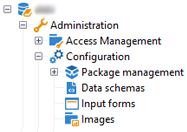
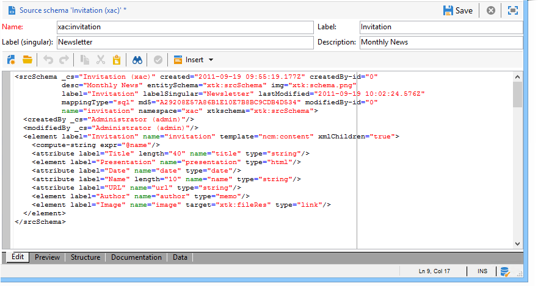

# Datascheman{#data-schemas}

## Principer {#principles}

Om du vill redigera, skapa och konfigurera scheman klickar du på knappen **[!UICONTROL Administration > Configuration > Data schemas]** noden i Adobe Campaign klientkonsol.

>[!NOTE]
>
>Inbyggda datascheman kan bara tas bort av en administratör för din Adobe Campaign Classic-konsol.



Redigeringsfältet visar XML-innehållet i källschemat:



>[!NOTE]
>
>Med redigeringskontrollen &quot;Namn&quot; kan du ange schemanyckeln som består av namnet och namnutrymmet. Attributen name och namespace för schemats rotelement uppdateras automatiskt i schemats XML-redigeringszon.

Förhandsgranskningen genererar automatiskt det utökade schemat:


>[!NOTE]
>
>När källschemat sparas startas genereringen av det utökade schemat automatiskt.

Om du behöver kontrollera hela strukturen för ett schema kan du använda fliken Förhandsgranska. Om schemat har utökats kan du visa alla dess tillägg. Som ett komplement visar fliken Dokumentation alla schemaattribut och -element och deras egenskaper (SQL-fält, typ/längd, etikett, beskrivning). Fliken Dokumentation gäller endast för genererade scheman. Mer information finns i [Återskapar scheman](../../configuration/using/regenerating-schemas.md) -avsnitt.

## Exempel: skapa en kontraktstabell {#example--creating-a-contract-table}

I följande exempel vill vi skapa en ny tabell för **kontrakt** i databasmodellen för Adobe Campaign-databasen. I den här tabellen kan du lagra förnamn och efternamn samt e-postadresser för innehavare och medarbetare för varje kontrakt.

För att göra detta måste du skapa tabellschemat och uppdatera databasstrukturen för att generera motsvarande tabell. Använd följande steg:

1. Redigera **[!UICONTROL Administration > Configuration > Data schemas]** noden i Adobe Campaign-trädet och klicka **[!UICONTROL New]** .
1. Välj **[!UICONTROL Create a new table in the data model]** och klicka **[!UICONTROL Next]** .

   

1. Ange ett namn för tabellen och ett namnutrymme.

   

   >[!NOTE]
   >
   >Som standard lagras scheman som skapas av användare i &#39;cus&#39;-namnutrymmet. Mer information finns i [Identifiering av ett schema](../../configuration/using/about-schema-reference.md#identification-of-a-schema).

1. Skapa tabellens innehåll. Vi rekommenderar att du använder anmälningsguiden för att kontrollera att inga inställningar saknas. Om du vill göra det klickar du på **[!UICONTROL Insert]** och väljer vilken typ av inställning som ska läggas till.

   

1. Definiera inställningarna för kontraktstabellen:

   ```
   <srcSchema desc="Active contracts" img="ncm:channels.png" label="Contracts" labelSingular="Contract" mappingType="sql" name="Contracts" namespace="cus" xtkschema="xtk:srcSchema">
     <element desc="Active contracts" img="ncm:channels.png" label="Contracts" labelSingular="Contract"
              name="Contracts" autopk="true">
              <attribute name="holderName" label="Holder last name" type="string"/>
              <attribute name="holderFirstName" label="Holder first name" type="string"/>
              <attribute name="holderEmail" label="Holder email" type="string"/>
              <attribute name="co-holderName" label="Co-holder last name" type="string"/>           
              <attribute name="co-holderFirstName" label="Co-holder first name" type="string"/>           
              <attribute name="co-holderEmail" label="Co-holder email" type="string"/>    
              <attribute name="date" label="Subscription date" type="date"/>     
              <attribute name="noContract" label="Contract number" type="long"/>  
     </element>
   </srcSchema>
   ```

   Lägg till typen av kontrakt och placera ett index på kontraktsnumret.

   ```
   <srcSchema _cs="Contracts (cus)" desc="Active contracts" entitySchema="xtk:srcSchema" img="ncm:channels.png"
              label="Contracts" labelSingular="Contract" name="Contracts" namespace="cus" xtkschema="xtk:srcSchema">
     <enumeration basetype="byte" name="typeContract">
       <value label="Home" name="home" value="0"/>
       <value label="Car" name="car" value="1"/>
       <value label="Health" name="health" value="2"/>
       <value label="Pension fund" name="pension fund" value="2"/>
     </enumeration>
     <element autopk="true" desc="Active contracts" img="ncm:channels.png" label="Contracts"
              labelSingular="Contract" name="Contracts">
       <attribute label="Holder last name" name="holderName" type="string"/>
       <attribute label="Holder first name" name="holderFirstName" type="string"/>
       <attribute label="Holder email" name="holderEmail" type="string"/>
       <attribute label="Co-holder last name" name="co-holderName" type="string"/>
       <attribute label="Co-holder first name" name="co-holderFirstName" type="string"/>
       <attribute label="Co-holder email" name="co-holderEmail" type="string"/>
       <attribute label="Subscription date" name="date" type="date"/>
      <attribute desc="Type of contract" enum="cus:Contracts:typeContract" label="Type of contract"
                  name="type" type="byte"/>
       <attribute label="Contract number" name="noContract" type="long"/>
       <dbindex name="noContract" unique="true">
         <keyfield xpath="@noContract"/>
       </dbindex>
     </element>
   </srcSchema>
   ```

1. Spara schemat för att generera strukturen:

   

1. Uppdatera databasstrukturen för att skapa tabellen som schemat ska länkas till. Mer information finns i [Uppdaterar databasstrukturen](../../configuration/using/updating-the-database-structure.md).
