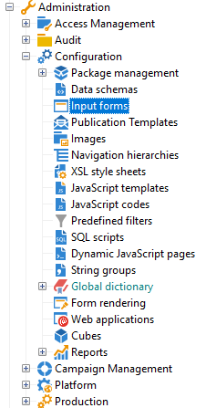

# Redigera formulär{#editing-forms}

Skärmen för att skapa och konfigurera inmatningsformulär är tillgänglig från mappen **[!UICONTROL Administration > Configuration > Input forms]** på Adobe Campaign-klientkonsolen:

I redigeringszonen kan du ange XML-innehållet i indataformuläret:

Förhandsgranskningen genererar en visning av indataformuläret:

