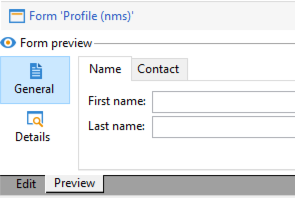

# Redigera formulär{#editing-forms}


## Översikt

Marknadsförare och operatörer använder indataformulär för att skapa, ändra och förhandsgranska poster. Forms visar en visuell representation av information.

Du kan skapa och ändra indataformulär:

* Du kan ändra de fabriksinmatningsformulär som levereras som standard. Fabriksindataformulären är baserade på fabriksdatascheman.
* Du kan skapa anpassade inmatningsformulär baserade på datamappningar som du definierar.

Forms är enheter i `xtk:form` typ. Du kan visa indataformulärstrukturen i dialogrutan `xtk:form` schema. Om du vill visa det här schemat väljer du **[!UICONTROL Administration]** > **[!UICONTROL Configuration]** > **[!UICONTROL Data schemas]** på menyn. Läs mer om [formulärstruktur](form-structure.md).

Välj **[!UICONTROL Administration]> [!UICONTROL Configuration] >[!UICONTROL Input forms]** på menyn:


Om du vill utforma formulär redigerar du XML-innehållet i XML-redigeraren:


[Läs mer](form-structure.md#formatting).

Om du vill förhandsgranska ett formulär klickar du på **[!UICONTROL Preview]** tab:


## Formulärtyper

Du kan skapa olika typer av indataformulär. Formulärtypen avgör hur användarna navigerar i formuläret:

* Konsolskärm

   Det här är standardformulärtypen. Formuläret består av en enda sida.

   

* Innehållshantering

   Använd den här formulärtypen för innehållshantering. Se det här [användningsfall](../../delivery/using/use-case--creating-content-management.md).

   

* guide

   Formuläret innehåller flera flytande skärmar som ordnas i en viss sekvens. Användarna navigerar från en skärm till nästa. [Läs mer](form-structure.md#wizards).

* Ikoner

   Formuläret består av flera sidor. Användarna kan navigera i formuläret genom att markera ikoner till vänster om formuläret.

   

* Anteckningsbok

   Formuläret består av flera sidor. Användarna kan navigera i formuläret genom att markera flikar högst upp i formuläret.

   

* Lodrät ruta

   I det här formuläret visas ett navigeringsträd.

* Vågrät ruta

   Det här formuläret innehåller en lista med objekt.

## Behållare

I formulär kan du använda behållare för olika syften:

* Ordna innehåll i formulär
* Definiera åtkomst till inmatningsfält
* Kapsla formulär i andra formulär

[Läs mer](form-structure.md#containers).

### Ordna innehåll

Använd behållare för att ordna innehåll i formulär:

* Du kan gruppera fält i avsnitt.
* Du kan lägga till sidor i flersidiga formulär.

Om du vill infoga en behållare använder du `<container>` -element. [Läs mer](form-structure.md#containers).

#### Gruppera fält

Använd behållare för att gruppera inmatningsfält i ordnade avsnitt.

Om du vill infoga ett avsnitt i ett formulär använder du det här elementet: `<container type="frame">`. Om du vill lägga till en avsnittsrubrik använder du `label` -attribut.

Syntax: `<container type="frame" label="`*section_title*`"> […] </container>`

I det här exemplet definierar en behållare **Skapande** som innehåller **[!UICONTROL Created by]** och **[!UICONTROL Name]** indatafält:

```xml
<form _cs="Coupons (nms)" entitySchema="xtk:form" img="xtk:form.png" label="Coupons"
      name="coupon" namespace="nms" type="default" xtkschema="xtk:form">
  <input xpath="@code"/>
  <input xpath="@type"/>
  <container label="Creation" type="frame">
    <input xpath="createdBy"/>
    <input xpath="createdBy/@name"/>
  </container>
</form>
```


#### Lägga till sidor i flersidiga formulär

För flersidiga formulär använder du en behållare för att skapa en formulärsida.

I det här exemplet visas behållare för **Allmänt** och **Detaljer** sidor i ett formulär:

```xml
<container img="ncm:book.png" label="General">
[…]
</container>
<container img="ncm:detail.png" label="Details">
[…]
</container>
```

### Definiera åtkomst till fält

Använd behållare för att definiera vad som är synligt och för att definiera åtkomst till fält. Du kan aktivera och inaktivera fältgrupper.

### Kapsla formulär

Använd behållare för att kapsla in formulär i andra formulär. [Läs mer](#add-pages-to-multipage-forms).

## Referenser till bilder

Välj **[!UICONTROL Administration]** > **[!UICONTROL Configuration]** > **[!UICONTROL Images]** på menyn.

Om du vill associera en bild med ett element i formuläret, till exempel en ikon, kan du lägga till en referens till en bild. Använd `img` -attribut, till exempel i `<container>` -element.

Syntax: `img="`*`namespace`*`:`*`filename`*`.`*`extension`*`"`

I det här exemplet visas referenser till `book.png` och `detail.png` bilder från `ncm` namnutrymme:

```xml
<container img="ncm:book.png" label="General">
[…]
</container>
<container img="ncm:detail.png" label="Details">
[…]
</container>
```

De här bilderna används för ikoner som användare klickar på för att navigera i ett flersidigt formulär:




## Skapa ett enkelt formulär {#create-simple-form}

Så här skapar du ett formulär:

1. Välj **[!UICONTROL Administration]** > **[!UICONTROL Configuration]** > **[!UICONTROL Input forms]**.
1. Klicka på **[!UICONTROL New]** längst upp till höger i listan.

   

1. Ange formuläregenskaperna:

   * Ange formulärnamnet och namnutrymmet.

      Formulärnamnet och namnutrymmet kan matcha det relaterade dataschemat.  I det här exemplet visas ett formulär för `cus:order` dataschema:

      ```xml
      <form entitySchema="xtk:form" img="xtk:form.png" label="Order" name="order" namespace="cus" type="iconbox" xtkschema="xtk:form">
        […]
      </form>
      ```

      Du kan också uttryckligen ange dataschemat i `entity-schema` -attribut.

      ```xml
      <form entity-schema="cus:stockLine" entitySchema="xtk:form" img="xtk:form.png" label="Stock order" name="stockOrder" namespace="cus" xtkschema="xtk:form">
        […]
      </form>
      ```

   * Ange etiketten som ska visas i formuläret.
   * Du kan också ange formulärtypen. Om du inte anger någon formulärtyp används skärmtypen för konsolen som standard.

      

      Om du utformar ett flersidigt formulär kan du utesluta formulärtypen i dialogrutan `<form>` och ange typen i en behållare.

1. Klicka på **[!UICONTROL Save]**.

1. Infoga formulärelementen.

   Om du till exempel vill infoga ett inmatningsfält använder du `<input>` -element. Ange `xpath` till fältreferensen som ett XPath-uttryck. [Läs mer](schema-structure.md#referencing-with-xpath).

   I det här exemplet visas indatafält baserade på `nms:recipient` schema.

   ```xml
   <input xpath="@firstName"/>
   <input xpath="@lastName"/>
   ```

1. Om formuläret baseras på en viss schematyp kan du söka efter fälten för det här schemat:

   1. Klicka på **[!UICONTROL Insert]** > **[!UICONTROL Document fields]**.

      

   1. Markera fältet och klicka på **[!UICONTROL OK]**.

      

1. Du kan även ange fältredigeraren.

   En standardredigerare för fält är associerad med varje datatyp:
   * För datumfält visar formuläret en indatakalender.
   * För ett uppräkningstypfält visas en urvalslista i formuläret.

   Du kan använda dessa fältredigerartyper:

   | Fältredigerare | Formulärattribut |
   | --- | --- |
   | Alternativknapp | `type="radiobutton"` |
   | Kryssruta | `type="checkbox"` |
   | Redigera träd | `type="tree"` |

   Läs mer om [minneslistkontroller](form-structure.md#memory-list-controls).

1. Du kan även definiera åtkomst till fälten:

   | Element | Attribut | Beskrivning |
   | --- | --- | --- |
   | `<input>` | `read-only="true"` | Ger skrivskyddad åtkomst till ett fält |
   | `<container>` | `type="visibleGroup" visibleIf="`*edit-expr*`"` | Visar en grupp fält villkorligt |
   | `<container>` | `type="enabledGroup" enabledIf="`*edit-expr*`"` | Aktiverar en grupp fält villkorligt |

   Exempel:

   ```xml
   <container type="enabledGroup" enabledIf="@gender=1">
     […]
   </container>
   <container type="enabledGroup" enabledIf="@gender=2">
     […]
   </container>
   ```

1. Du kan också använda behållare för att gruppera fält i avsnitt.

   ```xml
   <container type="frame" label="Name">
      <input xpath="@firstName"/>
      <input xpath="@lastName"/>
   </container>
   <container type="frame" label="Contact details">
      <input xpath="@email"/>
      <input xpath="@phone"/>
   </container>
   ```

   

## Skapa ett flersidigt formulär {#create-multipage-form}

Du kan skapa flersidiga formulär. Du kan också kapsla in formulär i andra formulär.

### Skapa en `iconbox` formulär

Använd `iconbox` formulärtyp för att visa ikoner till vänster om formuläret, som tar användarna till olika sidor i formuläret.


Ändra typ av ett befintligt formulär till `iconbox`gör du så här:

1. Ändra `type` attributet för `<form>` element till `iconbox`:

   ```xml
   <form […] type="iconbox">
   ```

1. Ange en behållare för varje formulärsida:

   1. Lägg till en `<container>` -element som underordnad till `<form>` -element.
   1. Om du vill definiera en etikett och en bild för ikonen använder du `label` och `img` attribut.

      ```xml
      <form entitySchema="xtk:form" name="Service provider" namespace="nms" type="iconbox" xtkschema="xtk:form">
          <container img="xtk:properties.png" label="General">
              <input xpath="@label"/>
              <input xpath="@name"/>
              […]
          </container>
          <container img="nms:msgfolder.png" label="Details">
              <input xpath="@address"/>
              […]
          </container>
          <container img="nms:supplier.png" label="Services">
              […]
          </container>
      </form>
      ```
   Du kan även ta bort `type="frame"` attribut från befintlig `<container>` -element.

### Skapa ett anteckningsboksformulär

Använd `notebook` formulärtyp om du vill visa flikar högst upp i formuläret, vilket tar användarna till olika sidor.


Ändra typ av ett befintligt formulär till `notebook`gör du så här:

1. Ändra `type` attributet för `<form>` element till `notebook`:

   ```xml
   <form […] type="notebook">
   ```

1. Lägg till en behållare för varje formulärsida:

   1. Lägg till en `<container>` -element som underordnad till `<form>` -element.
   1. Om du vill definiera etiketten och bilden för ikonen använder du `label` och `img` attribut.

   ```xml
     <form entitySchema="xtk:form" name="Service provider" namespace="nms" type="notebook" xtkschema="xtk:form">
         <container label="General">
             <input xpath="@label"/>
             <input xpath="@name"/>
             […]
         </container>
         <container label="Details">
             <input xpath="@address"/>
             […]
         </container>
         <container label="Services">
             […]
         </container>
     </form>
   ```

   Du kan även ta bort `type="frame"` attribut från befintlig `<container>` -element.

### Kapsla formulär

Du kan kapsla in formulär i andra formulär. Du kan t.ex. kapsla anteckningsboksformulär i ikonboxformulär.

Nivån för navigering i kapslingskontroller. Användare kan gå ned på djupet i delformulär.

Om du vill kapsla ett formulär i ett annat formulär infogar du ett `<container>` -element och ange `type` till formulärtypen. För formuläret på den översta nivån kan du ange formulärtypen i en yttre behållare eller i `<form>` -element.

### Exempel

I det här exemplet visas ett komplext formulär:

* Formuläret på den översta nivån är ett ikonformulär. Detta formulär består av två behållare med etiketten **Allmänt** och **Detaljer**.

   Det innebär att det yttre formuläret visar **Allmänt** och **Detaljer** sidor på den översta nivån. Användarna kommer åt dessa sidor genom att klicka på ikonerna till vänster i formuläret.

* Delformuläret är ett anteckningsboksformulär som är kapslat i **Allmänt** behållare. Delformuläret består av två behållare med etiketter **Namn** och **Kontakt**.

```xml
<form _cs="Profile (nms)" entitySchema="xtk:form" img="xtk:form.png" label="Profile" name="profile" namespace="nms" xtkschema="xtk:form">
  <container type="iconbox">
    <container img="ncm:general.png" label="General">
      <container type="notebook">
        <container label="Name">
          <input xpath="@firstName"/>
          <input xpath="@lastName"/>
        </container>
        <container label="Contact">
          <input xpath="@email"/>
        </container>
      </container>
    </container>
    <container img="ncm:detail.png" label="Details">
      <input xpath="@birthDate"/>
    </container>
  </container>
</form>
```

Resultatet blev att **Allmänt** sidan i det yttre formuläret visar **Namn** och **Kontakt** -tabbar.


Om du vill kapsla ett formulär i ett annat formulär infogar du ett `<container>` -element och ange `type` till formulärtypen. För formuläret på den översta nivån kan du ange formulärtypen i en yttre behållare eller i `<form>` -element.

### Exempel

I det här exemplet visas ett komplext formulär:

* Formuläret på den översta nivån är ett ikonformulär. Detta formulär består av två behållare med etiketten **Allmänt** och **Detaljer**.

   Det innebär att det yttre formuläret visar **Allmänt** och **Detaljer** sidor på den översta nivån. Användarna kommer åt dessa sidor genom att klicka på ikonerna till vänster i formuläret.

* Delformuläret är ett anteckningsboksformulär som är kapslat i **Allmänt** behållare. Delformuläret består av två behållare med etiketter **Namn** och **Kontakt**.

```xml
<form _cs="Profile (nms)" entitySchema="xtk:form" img="xtk:form.png" label="Profile" name="profile" namespace="nms" xtkschema="xtk:form">
  <container type="iconbox">
    <container img="ncm:general.png" label="General">
      <container type="notebook">
        <container label="Name">
          <input xpath="@firstName"/>
          <input xpath="@lastName"/>
        </container>
        <container label="Contact">
          <input xpath="@email"/>
        </container>
      </container>
    </container>
    <container img="ncm:detail.png" label="Details">
      <input xpath="@birthDate"/>
    </container>
  </container>
</form>
```

Resultatet blev att **Allmänt** sidan i det yttre formuläret visar **Namn** och **Kontakt** -tabbar.


## Ändra ett fabriksinmatningsformulär {#modify-factory-form}

Så här ändrar du ett fabriksformulär:

1. Ändra fabriksinmatningsformuläret:

   1. Välj **[!UICONTROL Administration]** > **[!UICONTROL Configuration]** > **[!UICONTROL Input forms]**.
   1. Markera ett inmatningsformulär och ändra det.

   Du kan utöka fabriksdatamappningar, men du kan inte utöka fabriksinmatningsformulär. Vi rekommenderar att du ändrar fabriksinmatningsformulär direkt utan att återskapa dem. Vid uppgraderingar sammanfogas ändringarna i fabriksinmatningsformulären med uppgraderingarna. Om den automatiska sammanfogningen misslyckas kan du lösa konflikterna. [Läs mer](../../production/using/upgrading.md#resolving-conflicts).

   Om du till exempel utökar ett fabriksschema med ett extra fält kan du lägga till det här fältet i det relaterade fabriksformuläret.

## Validera formulär {#validate-forms}

Du kan inkludera valideringskontroller i formulär.

### Bevilja skrivskyddad åtkomst till fält

Om du vill ge skrivskyddad åtkomst till ett fält använder du `readOnly="true"` -attribut. Du kanske vill visa primärnyckeln för en post, men med skrivskyddad åtkomst. [Läs mer](form-structure.md#non-editable-fields).

I det här exemplet har primärnyckeln (`iRecipientId`) `nms:recipient` schemat visas med skrivskyddad åtkomst:

```xml
<value xpath="@iRecipientId" readOnly="true"/>
```

### Kontrollera obligatoriska fält

Du kan kontrollera obligatorisk information:

* Använd `required="true"` för de obligatoriska fälten.
* Använd `<leave>` för att kontrollera dessa fält och visa felmeddelanden.

I det här exemplet krävs e-postadressen och ett felmeddelande visas om användaren inte har angett den här informationen:

```xml
<input xpath="@email" required="true"/>
<leave>
  <check expr="@email!=''">
    <error>The email address is required.</error>
  </check>
</leave>
```

Läs mer om [uttrycksfält](form-structure.md#expression-field) och [formulärkontext](form-structure.md#context-of-forms).

### Validera värden

Du kan använda JavaScript SOAP-anrop för att validera formulärdata från konsolen. Använd dessa anrop för komplex validering, till exempel för att kontrollera ett värde mot en lista över godkända värden. [Läs mer](form-structure.md#soap-methods).

1. Skapa en valideringsfunktion i en JS-fil.

   Exempel:

   ```js
   function nms_recipient_checkValue(value)
   {
     logInfo("checking value " + value)
     if (…)
     {
       logError("Value " + value + " is not valid")
     }
     return 1
   }
   ```

   I det här exemplet heter funktionen `checkValue`. Den här funktionen används för att kontrollera `recipient` datatypen i `nms` namnutrymme. Värdet som kontrolleras loggas. Om värdet inte är giltigt loggas ett felmeddelande. Om värdet är giltigt returneras värdet 1.

   Du kan använda det returnerade värdet för att ändra formuläret.

1. Lägg till `<soapCall>` -element till `<leave>` -element.

   I det här exemplet används ett SOAP-anrop för att validera `@valueToCheck` sträng:

   ```xml
   <form name="recipient" (…)>
   (…)
     <leave>
       <soapCall name="checkValue" service="nms:recipient">
         <param exprIn="@valueToCheck" type="string"/>
       </soapCall>
     </leave>
   </form>
   ```

   I det här exemplet `checkValue` -metoden och `nms:recipient` används:

   * Tjänsten är namnutrymmet och datatypen.
   * Metoden är funktionsnamnet. Namnet är skiftlägeskänsligt.

   Anropet utförs synkront.

   Alla undantag visas. Om du använder `<leave>` kan användarna inte spara formuläret förrän den angivna informationen har validerats.

I det här exemplet visas hur du kan ringa tjänstanrop inifrån formulär:

```xml
<enter>
  <soapCall name="client" service="c4:ybClient">
    <param exprIn="@id" type="string"/>
    <param type="boolean" xpathOut="/tmp/@count"/>
  </soapCall>
</enter>
```

I det här exemplet är indata ett ID, som är en primärnyckel. När användarna fyller i formuläret för detta ID görs ett SOAP-anrop med detta ID som indataparameter. Utdata är ett booleskt värde som skrivs till det här fältet: `/tmp/@count`. Du kan använda det här booleska innehållet i formuläret. Läs mer om [formulärkontext](form-structure.md#context-of-forms).
