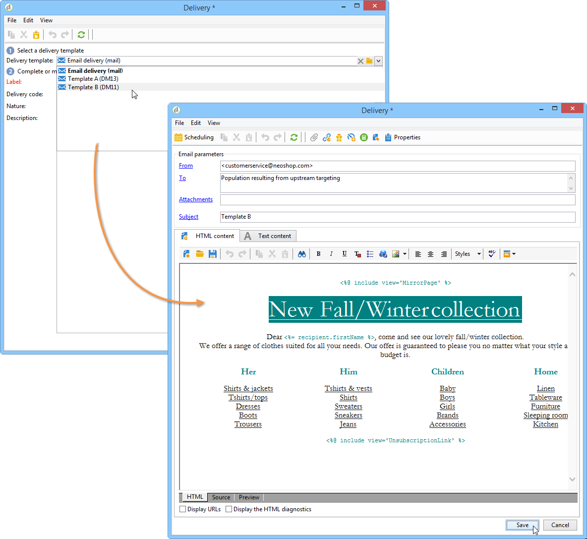

# AB-testning: Konfigurera leveranser i arbetsflödet {#step-4--configuring-the-deliveries-in-the-workflow}

En gång [populationer skapas](a-b-testing-uc-population-samples.md)kan du konfigurera leveranser. I det här fallet gör de två första leveranserna att du kan skicka olika innehåll till populationen A och B. Den tredje leveransen är reservleveransen: den skickas till mottagare som inte tillhör A eller B. Innehållet beräknas med ett skript och är identiskt med antingen A eller B, beroende på vilken som har den högsta öppna frekvensen. Vi måste konfigurera en vänteperiod för den tredje leveransen för att ta reda på resultatet av leveranserna A och B. Det är därför den tredje leveransen innehåller **[!UICONTROL Wait]** aktivitet.

1. Gå till **[!UICONTROL Split]** aktivitet och länka övergången avsedd för population A till en av de e-postleveranser som redan finns i arbetsflödet.

   

1. Dubbelklicka på leveransen för att öppna den.
1. Välj mall för leverans A i listrutan.

   

1. Klicka **[!UICONTROL Continue]** för att visa leveransen och sedan spara den.

   

1. Länka övergången för **[!UICONTROL Split]** aktivitet avsedd för population B till den andra e-postleveransen.

   

1. Öppna leveransen, välj mallen i leverans B och spara sedan leveransen.

   

1. Länka övergången avsedd för den återstående populationen till **[!UICONTROL Wait]** aktivitet.

   

1. Öppna **[!UICONTROL Wait]** och konfigurera en vänteperiod på 5 dagar.

   

1. Länka **[!UICONTROL Wait]** till **[!UICONTROL JavaScript code]** aktivitet.

   

Nu kan du skapa skriptet. [Läs mer](a-b-testing-uc-script.md).
