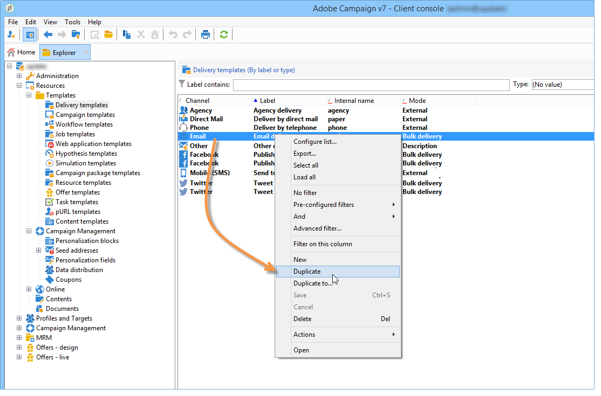

# AB-testning: Skapa leveransmallar {#step-3--creating-two-delivery-templates}

Vi vill nu skapa två leveransmallar. Varje mall refereras i en **[!UICONTROL Email delivery]** aktivitet länkad till **[!UICONTROL Split]** aktivitet. Mer information om detta finns i [det här avsnittet](about-templates.md).

1. Gå till **[!UICONTROL Resources > Delivery template]** mapp.
1. Duplicera **[!UICONTROL Email]** leveransmall.

   

1. Skapa innehållet som ska användas för leverans A.

   

1. Upprepa den här processen om du vill skapa en mall för leverans B.

   

Du kan nu konfigurera leveranser i arbetsflödet. [Läs mer](a-b-testing-uc-configuring-deliveries.md).
