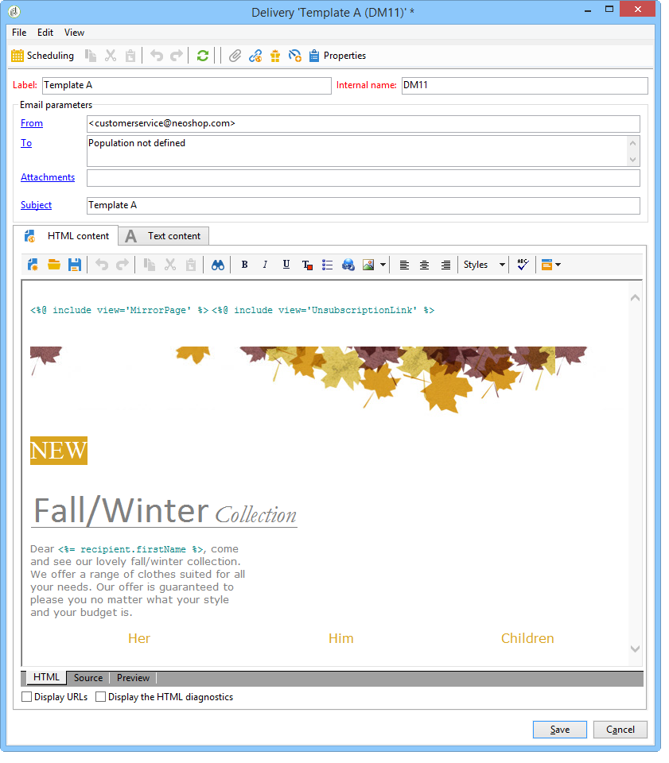

# Skapa leveransmallar {#step-3--creating-two-delivery-templates}

Vi vill nu skapa två leveransmallar. Varje mall refereras i en **[!UICONTROL Email delivery]**-aktivitet som är länkad till **[!UICONTROL Split]**-aktiviteten. Mer information om detta hittar du i det här [avsnittet](../../delivery/using/about-templates.md).

1. Gå till mappen **[!UICONTROL Resources > Delivery template]**.
1. Duplicera leveransmallen **[!UICONTROL Email]**.

   

1. Skapa innehållet som ska användas för leverans A.

   

1. Upprepa den här processen om du vill skapa en mall för leverans B.

   
