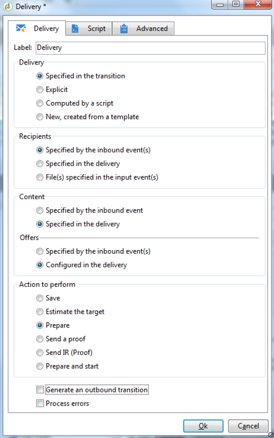

# Definiera den slutliga leveransen {#step-6--defining-the-final-delivery}

När skriptet har skapats för att välja vinnare av A/B-tester kan du definiera parametrarna för den slutliga leveransen.

1. Anslut **[!UICONTROL JavaScript code]** aktivitet till återstående **[!UICONTROL Delivery]** aktivitet.
1. Öppna **[!UICONTROL Delivery]** aktivitet.
1. Avmarkera **[!UICONTROL Generate an outbound transition]** för att slutföra arbetsflödet med den här aktiviteten.
1. Låt de andra alternativen behålla standardvärdena.

   

Genom att förbereda leveransen som anges i övergången (definieras via **[!UICONTROL Javascript Code]** -aktivitet) kan du sedan godkänna den och starta sändningen, enligt beskrivningen i nästa steg.

Du kan nu starta arbetsflödet. [Läs mer](a-b-testing-uc-start-workflow.md).
