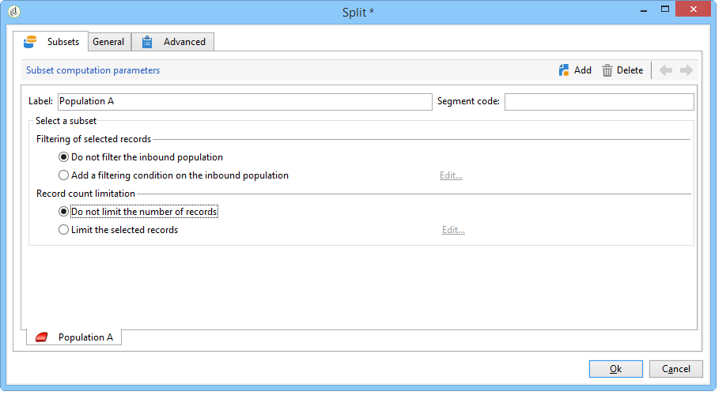

# Konfigurera populationsexempel {#step-2--configuring-population-samples}

## Konfigurera frågeaktiviteten {#configuring-the-query-activity}

* Dubbelklicka på aktiviteten **[!UICONTROL Query]**.

   

* Klicka på länken **[!UICONTROL Edit query]** och välj de mottagare som du vill ange som mål.

   

* Länka aktiviteten **[!UICONTROL Query]** till aktiviteten **[!UICONTROL Split]**.

   

## Konfigurera den delade aktiviteten {#configuring-the-split-activity}

Med den här aktiviteten kan du skapa flera populationer: den som får A, den som får B, och den återstående befolkningen. Om du använder slumpmässig markering kan du bara rikta in dig på en del av populationen av varje leverans.

1. Skapar population A:

   * Dubbelklicka på aktiviteten **[!UICONTROL Split]**.

      

   * Ändra etiketten till A på den befintliga fliken.

      

   * Välj alternativet **[!UICONTROL Limit the selected records]**.

      

   * Klicka på länken **[!UICONTROL Edit]**, välj **[!UICONTROL Activate random sampling]** och klicka på **[!UICONTROL Next]**.

      

   * Ange tröskelvärdet till 10 % och klicka sedan på **[!UICONTROL Finish]**.

      

1. Skapar population B:

   * Klicka på **[!UICONTROL Add]** för att skapa en ny flik för population B.

      

   * Begränsa populationen till 10% som tidigare.

      

1. Skapar den återstående populationen:

   * Gå till fliken **[!UICONTROL General]**.

      

   * Välj **[!UICONTROL Generate complement]**.

      

   * Ändra etiketten för att ange att den här populationen varken innehåller A eller B och klicka på **[!UICONTROL OK]** för att stänga aktiviteten.

      

Nu kan du skapa två leveransmallar (se [Steg 3: Skapa två leveransmallar](../../delivery/using/a-b-testing-uc-delivery-templates.md)).
