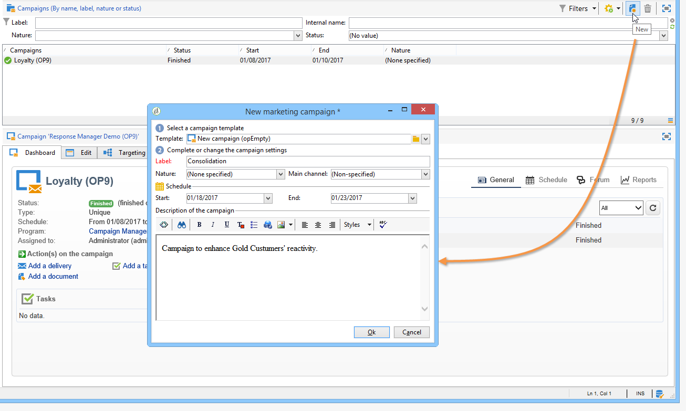

# Skapa ett målinriktat arbetsflöde {#step-1--creating-a-targeting-workflow}

Du måste skapa arbetsflödet i **[!UICONTROL Targeting and Workflows]** -fliken i en kampanj. Den består av en **[!UICONTROL Query]** aktivitet, **[!UICONTROL Split]** aktivitet länkad till två **[!UICONTROL Email delivery]** verksamhet, **[!UICONTROL Wait]** aktivitet, **[!UICONTROL JavaScript code]** aktivitet och **[!UICONTROL Delivery]** aktivitet.

1. Om du inte redan har gjort det skapar du en kampanj (mer information om detta finns i [det här avsnittet](../../campaign/using/setting-up-marketing-campaigns.md#creating-a-campaign)).

   

1. Gå till fliken **[!UICONTROL Targeting and Workflows]**.

   

1. Ändra etiketten för det befintliga arbetsflödet eller klicka på **[!UICONTROL Add]** om du vill skapa en ny (mer information om detta finns i [det här avsnittet](../../campaign/using/marketing-campaign-deliveries.md#selecting-the-target-population)).

   

1. Använd musen för att dra och släppa aktiviteter i arbetsflödesdiagrammet, inklusive en **[!UICONTROL Query]** (**[!UICONTROL Target]** tabba), **[!UICONTROL Split]** (**[!UICONTROL Target]** tabbtangent), två **[!UICONTROL Email deliveries]** (**[!UICONTROL Deliveries]** tabba), **[!UICONTROL Wait]** aktivitet (**[!UICONTROL Flow Control]** tabba), **[!UICONTROL JavaScript code]** aktivitet (**[!UICONTROL Actions]** tabbtangenten) och **[!UICONTROL Delivery]** aktivitet (**[!UICONTROL Actions]** -fliken).

Du kan nu konfigurera populationsexemplen. [Läs mer](a-b-testing-uc-population-samples.md).
