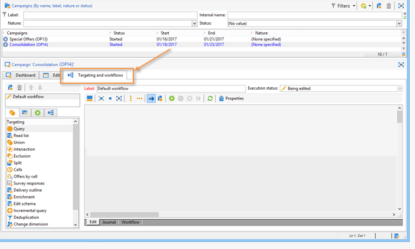

# Skapa ett målarbetsflöde {#step-1--creating-a-targeting-workflow}

Du måste skapa ett arbetsflöde på fliken **[!UICONTROL Targeting and Workflows]** i en kampanj. Den består av en **[!UICONTROL Query]**-aktivitet, en **[!UICONTROL Split]**-aktivitet som är länkad till två **[!UICONTROL Email delivery]**-aktiviteter, en **[!UICONTROL Wait]**-aktivitet, en **[!UICONTROL JavaScript code]**-aktivitet och en **[!UICONTROL Delivery]**-aktivitet.

1. Om du inte redan har gjort det skapar du en kampanj (mer information finns i [avsnittet](../../campaign/using/setting-up-marketing-campaigns.md#creating-a-campaign)).

   

1. Gå till fliken **[!UICONTROL Targeting and Workflows]**.

   

1. Ändra etiketten för det befintliga arbetsflödet eller klicka på **[!UICONTROL Add]** för att skapa en ny (mer information finns i [avsnittet](../../campaign/using/marketing-campaign-deliveries.md#selecting-the-target-population)).

   

1. Använd musen för att dra och släppa aktiviteter i arbetsflödesdiagrammet, inklusive en **[!UICONTROL Query]** (**[!UICONTROL Target]**-flik), en **[!UICONTROL Split]** (**[!UICONTROL Target]**-flik), två **[!UICONTROL Email deliveries]** (**[!UICONTROL Deliveries]**-flik), en **[!UICONTROL Wait]**-aktivitet (**[!UICONTROL Flow Control]**-flik), en **[!UICONTROL JavaScript code]**-aktivitet (**[!UICONTROL Actions]**) och en &lt;a &lt;a10///// > aktivitet (**[!UICONTROL Actions]**-flik).**[!UICONTROL Delivery]**

