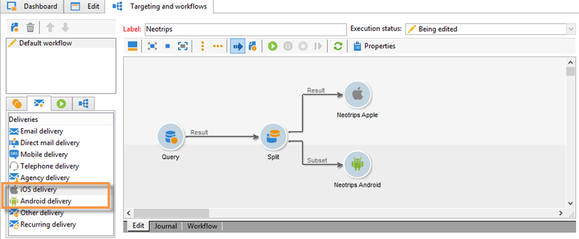

# Om mobilappskanal{#about-mobile-app-channel}

>[!CAUTION]
>
>I det här dokumentet beskrivs hur du integrerar mobilapplikationer med Adobe Campaign-plattformen. Det innehåller ingen information om hur du skapar mobilprogrammet eller hur du konfigurerar det för att hantera meddelanden. Om du vill ha mer information om detta, se den officiella Apple-dokumentationen ([https://developer.apple.com/](https://developer.apple.com/)) och Android-dokumentationen ([https://developer.android.com/index.html](https://developer.android.com/index.html)).

Avsnitten nedan innehåller information som är specifik för mobilappskanalen. Global information om hur du skapar en leverans finns i[det här avsnittet](../../delivery/using/steps-about-delivery-creation-steps.md).

Med **mobilappskanalen** kan ni använda Adobe Campaign-plattformen för att skicka personaliserade meddelanden till iOS- och Android-terminaler via appar. Det finns två leveranskanaler:

* En iOS-kanal som gör att du kan skicka meddelanden till Apple-mobilenheter.

   

* En Android-kanal som gör att du kan skicka datameddelanden till mobila Android-enheter.

   

Motsvarar dessa två kanaler finns det två leveransaktiviteter i kampanjarbetsflödena:

>[!NOTE]
>
>Det finns även två mallar för transaktionsmeddelanden.

Du kan definiera programbeteendet för när användaren aktiverar meddelandet för att visa skärmen som matchar programsammanhanget. Till exempel:

* Ett meddelande skickas till kunden för att meddela att deras paket har avslutats. När du aktiverar meddelandet öppnas en sida med leveransrelaterad information.
* Användaren har lagt till artiklar i kundvagnen, men lämnat programmet utan att slutföra köpet. Ett meddelande om att kundvagnen har övergetts skickas. När de aktiverar meddelandet visas objektet på skärmen.

>[!CAUTION]
>
>* Du måste kontrollera att de meddelanden som skickas till ett mobilprogram är kompatibla med de krav och villkor som anges av Apple (Apple Push Notification Service) och Google (Google Cloud Messaging).
>* Varning: I vissa länder kräver lagen att du informerar användarna om dina insamlade datatyper för mobilprogram och syftet med deras behandling. Ni måste kontrollera lagstiftningen.

Arbetsflödet **[!UICONTROL NMAC opt-out management]** (mobileAppOptOutMgt) uppdaterar meddelanden om att prenumerationen har avbrutits på mobila enheter. Mer information om det här arbetsflödet finns i handboken [för](../../workflow/using/mobile-app-channel.md)arbetsflöden.

Adobe Campaign är kompatibelt med både binära och HTTP/2 APNS. Mer information om konfigurationsstegen finns i avsnittet [Anslutningar](../../delivery/using/setting-up-mobile-app-channel.md#connectors) .
