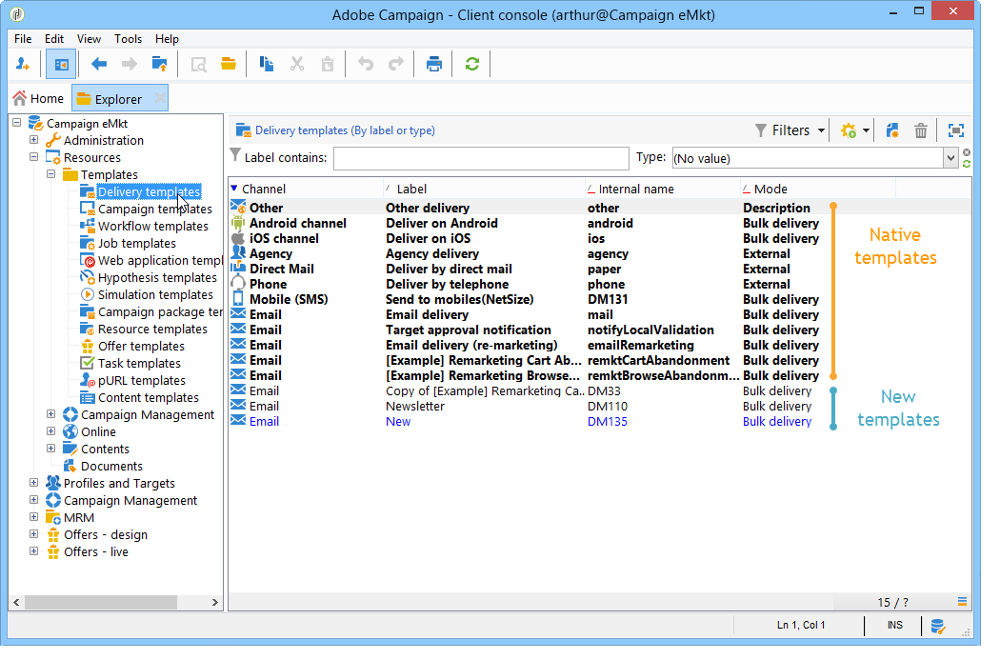

# Om mallar{#about-templates}

En leveranskonfiguration kan sparas i en leveransmall för återanvändning. Mallen kan innehålla en fullständig eller partiell konfiguration av leveransen.

Leveransmallen kan köras manuellt, enligt beskrivningen i detta kapitel, eller enligt en händelse (som startas vid en viss tidpunkt, när en fil anländer till en server, osv.). Leveransmallar kan konfigureras via **[!UICONTROL Resources > Templates > Delivery templates]** noden i trädet.

Det finns två typer av mallar:

1. Inbyggda mallar för Adobe Campaign

   Inbyggda mallar FÅR INTE tas bort från systemet. De innehåller en minimikonfiguration för varje leveranskanal. Administratören kan dock begränsa vissa funktioner eller erbjuda standardvärden till användare (spårningsaktivering, e-postadresser till avsändaren osv.). Inbyggda scenarier visas i fet stil i listan med mallar. De måste dupliceras för att kunna ändras.

1. Fördefinierade leveransmallar

   Adobe Campaign-administratören kan skapa nya leveransmallar. De kan återanvändas av operatorer (de med lämpliga åtkomsträttigheter) eller automatiskt av serverprocesser. Du kan till exempel konfigurera en mall för e-postleverans, och när användaren skapar en leverans med den här mallen behöver han bara ange texten eller HTML-innehållet och sedan skicka den; de andra alternativen redan har definierats av administratören.

>[!NOTE]
>
>Vilka mallar som är tillgängliga beror på din behörighet, instanskonfigurationen och kontexten. När du till exempel skapar en informationstjänst kan du länka en leveransmall för bekräftelsemeddelanden: du får då bara åtkomst till mallar vars målmappning är prenumerationsmappningen. Mer information finns i [Välja målmappning](../../delivery/using/selecting-a-target-mapping.md) och [Om tjänster och prenumerationer](../../delivery/using/about-services-and-subscriptions.md).
