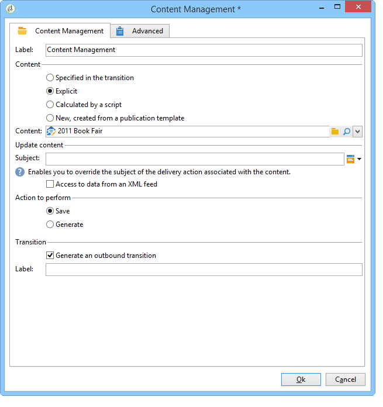

# Automatisera via arbetsflöden{#automating-via-workflows}

## Innehållshanteringsaktivitet {#content-management-activity}

Skapa, redigera och publicera innehåll kan automatiseras med ett arbetsflöde som konfigurerats via Adobe Campaign-klientgränssnittet.

Aktiviteten **Innehållshantering** visas via **[!UICONTROL Tools]** verktygsfältet i arbetsflödesdiagrammet.

Aktivitetsegenskaperna delas in i fyra steg:

* **[!UICONTROL Content]** : gör att du kan ange befintligt innehåll eller skapa innehåll,
* **[!UICONTROL Update content]** : gör att du kan ändra innehållet eller uppdatera innehållet via ett XML-dataflöde,
* **[!UICONTROL Action to execute]** : gör att du kan spara eller generera innehåll,
* **[!UICONTROL Transition]** : Med kan du välja om du vill generera en utdataövergång och ge den ett namn.



### Innehåll {#content}

* **Anges av övergången**

   Innehållet som ska användas har skapats tidigare. Processerna rör den innehållsinstans som sprids av den inkommande händelsen. Innehållsidentifieraren nås via händelsens contentId-variabel.

* **Explicit**

   Här kan du välja innehåll som du skapat tidigare.

* **Beräknas av ett skript**

   Väljer en innehållsinstans baserad på en JavaScript-mall. Med koden som ska utvärderas kan du hämta innehållsidentifieraren.

* **Nytt, skapat via en publiceringsmall**

   Skapar ett nytt innehåll via en publiceringsmall. Innehållsinstansen sparas i den ifyllda strängmappen.

### Uppdatera innehållet {#update-the-content}

* **Ämne**

   Gör att du kan ändra föremålet för leveransåtgärden vid publicering.

* **Åtkomst till data från en XML-feed**

   Innehållet uppdateras från en XML-feed från en extern källa. En URL måste anges för att nedladdning av data ska ske.

   En XSL-formatmall kan användas för att omforma inkommande XML-data.

### Åtgärd som ska köras {#action-to-execute}

* **Spara**

   Sparar det skapade eller ändrade innehållet. Identifieraren för det sparade innehållet sprids i variabeln contentId för den utgående händelsen.

* **Generera**

   Genererar utdatafilerna för varje omformningsmall med en publikation av typen &quot;Fil&quot;. Den utgående övergången aktiveras för varje genererad fil med följande parametrar: identifieraren för innehållet som har sparats i variabeln contentId och filnamnet i variabeln filename.

### Övergång {#transition}

Med alternativet **Generera en utdataövergång** kan du lägga till en utdataövergång i **[!UICONTROL Content management]** aktiviteten för att länka en ny aktivitet till arbetsflödeskörningen. När du har markerat det här alternativet anger du en etikett för övergången.

## Exempel {#examples}

### Automatisera framtagning och leverans av innehåll {#automating-content-creation-and-delivery}

I följande exempel automatiseras skapandet och leveransen av ett innehållsblock.


Innehållet konfigureras via aktiviteten Innehållshantering:


En ny innehållsinstans skapas via publiceringsmodellen och innehållssträngsmappen.

I vårt exempel har vi överbelastat leveransämnet. Den tas med i beräkningen i stället för den som anges i **[!UICONTROL Delivery]** mallen.

Innehållet fylls i automatiskt av ett XML-flöde som kommer från den URL som anges:

```
<?xml version='1.0' encoding='ISO-8859-1'?>
<book name="Content automation test" date="2008/06/08" language="eng" computeString="Content automation test">
  <section id="1" name="Introduction">
    <page>Introduction to input forms.</page>
  </section>
</book>
```

Dataformatet matchar inte det dataschema som anges i publikationsmallen (**cus:book** i vårt exempel); elementet **`<section>`** måste ersättas med **`<chapter>`** elementet . Vi måste använda formatmallen&quot;cus:book-workflow.xsl&quot; för att kunna göra nödvändiga ändringar.

Källkod för XSLT-formatmallen som används:

```
<?xml version="1.0" encoding="utf-8"?>
<xsl:stylesheet version="1.0" xmlns:xsl="http://www.w3.org/1999/XSL/Transform">
 <xsl:output indent="yes" method="xml"  encoding="ISO-8859-1"/>

 <xsl:template match="text()|@*"/>

  <xsl:template match="*">
    <xsl:variable name="element.name" select="name(.)"/>
    <xsl:element name="{$element.name}">
      <xsl:copy-of select="text()|@*"/>
      <xsl:apply-templates/>
    </xsl:element>
  </xsl:template>

  <xsl:template match="book">
  <book name="test">
     <xsl:apply-templates/>
    <book>
 </xsl:template>

  <xsl:template match="section">
    <chapter>
      <xsl:for-each select="@*">
        <xsl:copy-of select="."/>
      </xsl:for-each>
       <xsl:apply-templates/>
    </chapter>
  </xsl:template>
  
</xsl:stylesheet>
```

Den sista åtgärden i aktiviteten är att spara innehållsinstansen och fortsätta till nästa uppgift.

Målsättningen görs via aktiviteten **Fråga** .

En **AND-join** -aktivitet lades till för att säkerställa att leveransen bara startas när målfrågorna och innehållsuppdateringarna är klara.

Leveransåtgärden konfigureras via aktiviteten **Leverans** :


En ny leveransåtgärd skapas utifrån en mall.

Leveransmallen för aktiviteten används för att välja omformningsmallarna för publiceringsmallen. Vid generering av innehåll beaktas alla HTML- och textmallar utan leveransmallar eller mallar som refereras till med samma mall som aktiviteten.

Målet som ska levereras anges via den inkommande händelsen.

Leveransinnehållet fylls i via den inkommande händelsen.

Det sista steget i att slutföra aktiviteten är att förbereda och sedan starta leveransen.

### Skapa innehåll och publicera det senare {#creating-content-and-publishing-it-later}

I det här exemplet skapas ett innehållsblock och filpubliceringen startas efter en viss tidsfördröjning.


Den första **innehållshanteringsåtgärden** skapar en innehållsinstans.


>[!NOTE]
>
>Fliken **[!UICONTROL Publication]** i fönstret med omformningsmallar måste fyllas i med platsen för målet som ska skapas.

En väntande aktivitet läggs till för att pausa nästa övergång i en vecka.


Innehåll anges manuellt under den här tidsperioden.

Nästa uppgift startar genereringen av innehåll.


Innehållet som ska publiceras anges via den inkommande övergången.

Den sista åtgärden är att generera innehållet genom att tvinga fram publikationskatalogen.

Aktiviteten **JavaScript-kod** hämtar det fullständiga namnet för varje genererad fil.


### Skapa leveransen och dess innehåll {#creating-the-delivery-and-its-content}

I det här exemplet används samma koncept som i det första exemplet, men bara leveransåtgärden skapas i det första steget.


Den första **Skapa leveransåtgärden** skapar leveransåtgärden.

Med gaffelaktiviteten kan du starta målberäkning och skapa innehållsinstansen samtidigt.

När uppgifterna har utförts aktiverar AND-join-rutan aktiviteten **Delivery** för att starta den tidigare leveransen för innehåll och målinriktning.


Leveransåtgärden som ska startas fylls i via övergången.

Målet som ska levereras anges via den inkommande händelsen.

Leveransinnehållet fylls i via den inkommande händelsen.

Den sista åtgärden i aktiviteten är att förbereda och starta leveransen.

### Importera innehåll från FTP {#importing-content-from-ftp}

Om ditt leveransinnehåll är tillgängligt i en HTML-fil som finns på FTP- eller SFTP-servrar kan du enkelt läsa in innehållet i Adobe Campaign-leveranser. Se [det här exemplet](../../workflow/using/loading-delivery-content.md).

### Importera innehåll från Amazon Simple Storage Service-anslutning (S3) {#importing-content-from-amazon-simple-storage-service--s3--connector}

Om ditt leveransinnehåll finns på Amazon Simple Storage Service (S3)-bucket kan du enkelt läsa in innehållet i Adobe Campaign-leveranser. Se [det här exemplet](../../workflow/using/loading-delivery-content.md).

## Halvautomatisk uppdatering {#semi-automatic-update}

Innehållsdata kan uppdateras i halvautomatiskt läge. Data återställs från ett XML-flöde via en URL.

Aktiveringen av dataåterställning sker manuellt via inmatningsformuläret.

Syftet är att deklarera ett **editBtn** - **`<input>`** typfält i formuläret. Den här kontrollen består av en redigeringszon och en knapp för att starta bearbetningen.

Med redigeringszonen kan du fylla i variabeldata som används för att skapa URL:en för XML-flödet med data som ska hämtas.

Knappen kör **metoden GetAndTransform** SOAP som fylls i under **`<input>`** -taggen.

Kontrolldeklarationen i formuläret är följande:

```
<input type="editbtn" xpath="<path>">
  <enter>
    <soapCall name="GetAndTransform" service="ncm:content">
      <param exprIn="<url>" type="string"/>
      <param exprIn="'xtk:xslt|<style sheet>'" type="string"/>
      <param type="DOMElement" xpathOut="<output path>"/>
    </soapCall>
  </enter>
</input>
```

Metoden **GetAndTransform** måste deklareras under **`<enter>`** -elementet för **`<input>`** -taggen. Den här taggen fungerar som parametrar för URL-återställningen av XML-data från ett uttryck som konstruerats dynamiskt. Den andra parametern för funktionen är valfri och refererar till en formatmall som används för en mellanliggande omformning när inkommande XML-data inte har samma format som innehållet.

Utdata uppdaterar innehållet baserat på den sökväg som angavs i den sista parametern.

**Exempel**: För att illustrera det här exemplet börjar vi från &quot;cus:book&quot;-schemat.

Ett halvautomatiskt indataformulär för redigeringskontroll för uppdatering läggs till:


```
<input label="File name" type="editbtn" xpath="/tmp/@name">
  <enter>
    <soapCall name="GetAndTransform" service="ncm:content">
      <param exprIn="'https://server/incoming/' + [/tmp/@name] + '.xml'" type="string"/>
      <param exprIn="'xtk:xslt|cus:book-workflow.xsl'" type="string"/>
      <param type="DOMElement" xpathOut="."/>
    </soapCall>
  </enter>
</input>
```

I redigeringszonen kan du ange namnet på filen som ska hämtas. URL:en skapas utifrån det här namnet, till exempel: https://server/incomin/data.xml

Formatet på de data som ska hämtas är detsamma som i exempel 1 av automatisering av arbetsflöden. Vi ska använda formatmallen&quot;cus:book-workflow.xsl&quot; som finns i det här exemplet.

Resultatet av jobbkörningen uppdaterar innehållsinstansen från sökvägen &#39;.&#39;.
