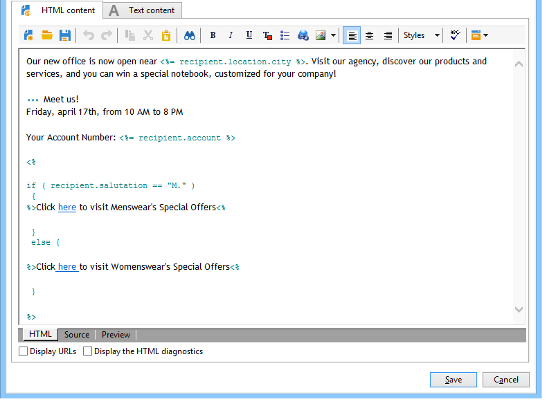

# Villkorligt innehåll{#conditional-content}

Genom att konfigurera fält för villkorligt innehåll kan du skapa dynamisk personalisering baserat på mottagarens profil, till exempel. Textblock och/eller bilder ersätts när ett visst villkor uppfylls.

## Använda villkor i ett e-postmeddelande {#using-conditions-in-an-email}

I exemplet nedan får du lära dig att skapa ett meddelande som dynamiskt anpassas efter mottagarens kön och intressen.

* Visning som visar &quot;Mr.&quot; eller&quot;Fröken&quot; enligt värdet för **[!UICONTROL Gender]** fältet (M eller F) i datakällan,
* Personligt anpassade nyhetsbrev eller kampanjerbjudanden enligt angivna eller identifierade intressen:

   * Ränta 1 - > Block 1
   * Ränta 2 - > Block 2
   * Ränta 3 - > Block 3
   * Ränta 4 - > Block 4

Om du vill skapa villkorligt innehåll enligt värdet för ett fält gör du så här:

1. Klicka på personaliseringsikonen och välj **[!UICONTROL Conditional content > If]**.

   

   Anpassningselementen infogas i meddelandetexten. Du måste konfigurera dem nu.

1. Fyll sedan i parametrarna för **if** -uttrycket.

   Så här gör du:

   * Markera det första elementet i uttrycket, **`<field>`**(som standard markeras det här elementet när **if** -uttrycket infogas) och klicka på personaliseringsikonen för att ersätta det med testfältet.

      

   * Ersätt **`<value>`** med värdet för det fält som villkoret ska uppfyllas för. Värdet måste vara inom citattecken.
   * Ange det innehåll som ska infogas när villkoret är uppfyllt. Detta kan bestå av text, en bild, ett formulär, en hypertextlänk osv.

      

1. Klicka på fliken **[!UICONTROL Preview]** för att visa innehållet i meddelandet enligt leveransmottagaren:

   * Välja en mottagare för vilken villkoret är sant:

      

   * Välja en mottagare för vilken villkoret inte är sant:

      

Du kan lägga till andra fall och definiera olika innehåll utifrån värdena i ett eller flera fält. Använd **[!UICONTROL Conditional content > Else]** och **[!UICONTROL Conditional content > Else if]**. Dessa uttryck konfigureras på samma sätt som **if** -uttrycket.



>[!CAUTION]
>
>För att JavaScript-syntaxen ska respekteras måste tecknen **%> &lt;%** tas bort efter att villkoren **Else** och **Else har** lagts till.

Klicka på **[!UICONTROL Preview]** och välj en mottagare för att visa det villkorliga innehållet.


## Skapa flerspråkig e-post {#creating-multilingual-email}

I exemplet nedan får du lära dig att skapa ett flerspråkigt e-postmeddelande. Innehållet visas på det ena språket eller det andra beroende på vilket språk mottagaren föredrar.

1. Skapa ett e-postmeddelande och välj målpopulation. I det här exemplet baseras villkoret för att visa en version eller den andra på **språkvärdet** för mottagarens profil. I det här exemplet är dessa värden inställda på **EN**, **FR** och **ES**.
1. Klicka på fliken och klistra in följande kod i HTML-innehåll för e-post **[!UICONTROL Source]** :

   ```
   <% if (language == "EN" ) { %>
   <DIV id=en-version>Hello <%= recipient.firstName %>,</DIV>
   <DIV>Discover your new offers!</DIV>
   <DIV><a href="https://www.adobe.com/products/en">www.adobe.com/products/en</A></FONT></DIV><%
    } %>
   <% if (language == "FR" ) { %>
   <DIV id=fr-version>Bonjour <%= recipient.firstName %>,</DIV>
   <DIV>Découvrez nos nouvelles offres !</DIV>
   <DIV><a href="https://www.adobe.com/products/fr">www.adobe.com/products/fr</A></DIV><%
    } %>
    <% if (language == "ES" ) { %>
   <DIV id=es-version><FONT face=Arial>
   <DIV>Olà <%= recipient.firstName %>,</DIV>
   <DIV>Descubra nuestros nuevas ofertas !</DIV>
   <DIV><a href="https://www.adobe.com/products/es">www.adobe.com/products/es</A></DIV>
   <% } %>
   ```

1. Testa e-postinnehåll på **[!UICONTROL Preview]** fliken genom att välja mottagare med olika språk.

   >[!NOTE]
   >
   >Eftersom ingen alternativ version har definierats i e-postinnehållet måste du filtrera målpopulationen innan du skickar e-postmeddelandet.
