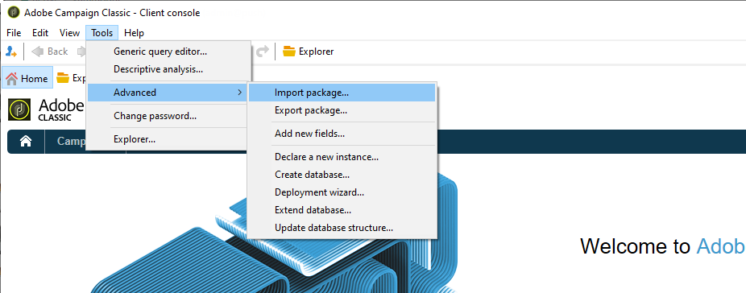
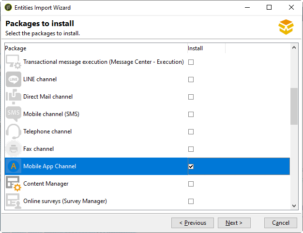
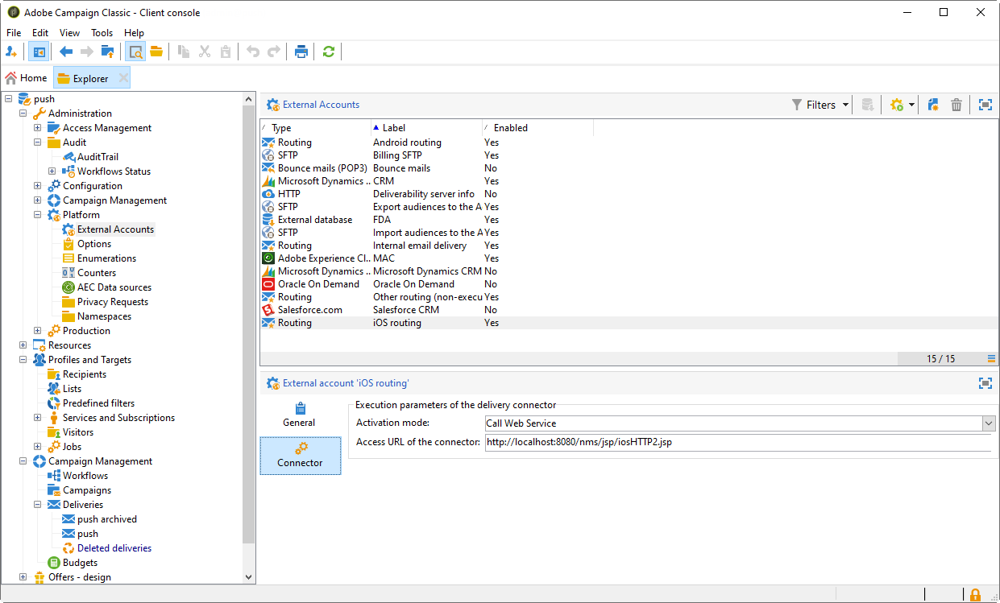
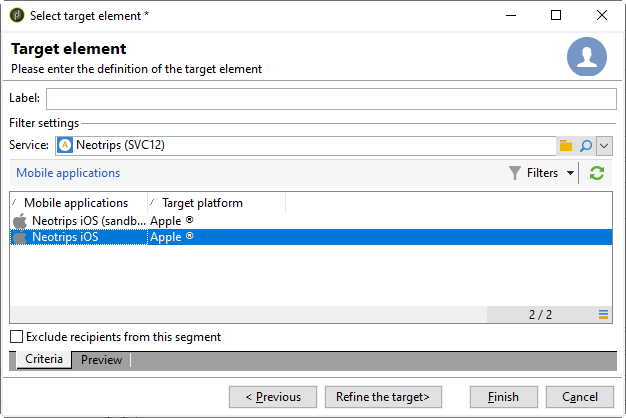
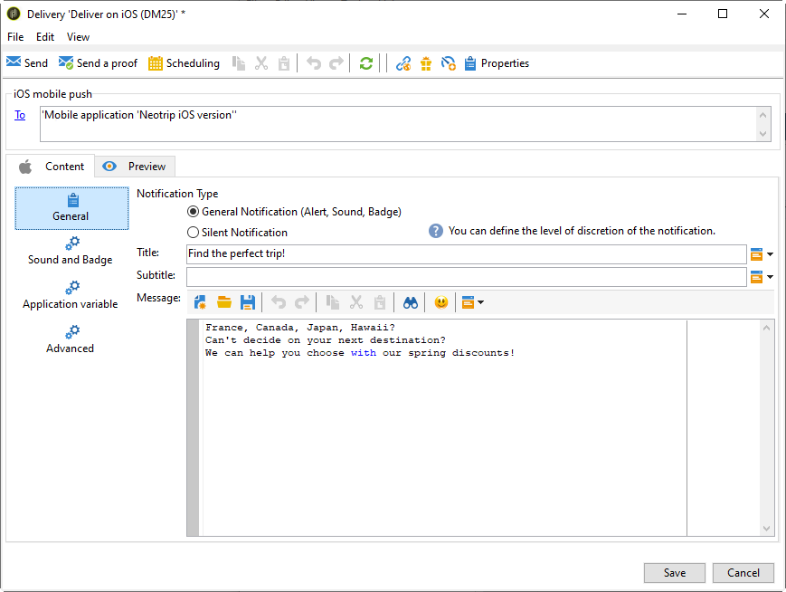
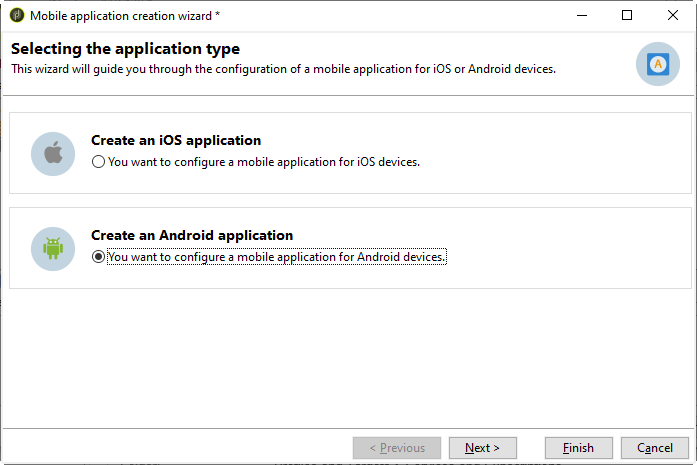

# Konfigurera mobilprogrammet i Adobe Campaign {#configuring-the-mobile-application-in-adobe-campaign}

Nedan finns ett konfigurationsexempel som baseras på ett företag som säljer semesterpaket online. Hans mobilapplikation (Neotrips) finns i två versioner: Neotrips för Android och Neotrips för iOS. Om du vill konfigurera mobilprogrammet i Adobe Campaign måste du:

* Skapa en **[!UICONTROL Mobile application]** typinformationstjänst för mobilappen Neotrips.
* Lägg till iOS- och Android-versionerna av programmet i den här tjänsten.
* Skapa en leverans för både iOS och Android.

>[!NOTE]
>
>Gå till fliken **[!UICONTROL Subscriptions]** för tjänsten för att visa en lista över prenumeranter på tjänsten, dvs. alla personer som har installerat programmet på sin mobiltelefon och gått med på att ta emot meddelanden.

## Konfigurera mobilprogrammet med iOS {#configuring-the-mobile-application-ios}

>[!CAUTION]
>
>Programmet måste ha konfigurerats för push-åtgärder INNAN du integrerar med Adobe Campaign SDK.
>
>Om så inte är fallet, se [den här sidan](https://developer.apple.com/library/archive/documentation/NetworkingInternet/Conceptual/RemoteNotificationsPG/).

### Steg 1:Installera paketet {#installing-package-ios}

1. Öppna guiden för paketimport från **[!UICONTROL Tools > Advanced > Package import...]** Adobe Campaign-klientkonsolen.

   

1. Välj **[!UICONTROL Install a standard package]**.

1. Markera i listan som visas **[!UICONTROL Mobile App Channel]**.

   

1. Klicka **[!UICONTROL Next]** och sedan **[!UICONTROL Start]** för att starta paketinstallationen.

   När paketen har installerats visar förloppsindikatorn **100 %** och följande meddelande visas i installationsloggarna: **[!UICONTROL Installation of packages successful]**.

   

1. **[!UICONTROL Close]** installationsfönstret.

### Steg 2: Konfigurera externt iOS-konto {#configuring-external-account-ios}

För iOS finns två anslutningar:

* Den binära iOS-kopplingen skickar meddelanden på den gamla binära APNS-servern.
* iOS HTTP/2-kopplingen skickar meddelanden till HTTP/2 APNS.

Så här väljer du vilken koppling du vill använda:

1. Gå till **[!UICONTROL Administration > Platform > External accounts]**.
1. Välj det **[!UICONTROL iOS routing]** externa kontot.
1. På **[!UICONTROL Connector]** fliken fyller du i **[!UICONTROL Access URL of the connector]** fältet:

   För iOS HTTP2: http://localhost:8080/nms/jsp/iosHTTP2.jsp

   

   >[!NOTE]
   >
   > Du kan även konfigurera den enligt https://localhost:8080/nms/jsp/ios.jsp, men vi rekommenderar att du använder version 2 av kopplingen.

1. Klicka **[!UICONTROL Save]**.

Din iOS-anslutning är nu konfigurerad. Du kan börja skapa tjänsten.

### Steg 3: Konfigurerar iOS-tjänsten {#configuring-ios-service}

1. Gå till **[!UICONTROL Profiles and Targets > Services and subscriptions]** noden och klicka på **[!UICONTROL New]**.

   

1. Definiera en **[!UICONTROL Label]** och en **[!UICONTROL Internal name]**.
1. Gå till **[!UICONTROL Type]** fältet och välj **[!UICONTROL Mobile application]**.

   >[!NOTE]
   >
   >Standardmålmappningen **[!UICONTROL Subscriber applications (nms:appSubscriptionRcp)]** är länkad till mottagartabellen. Om du vill använda en annan målmappning måste du skapa en ny målmappning och ange den i **[!UICONTROL Target mapping]** fältet för tjänsten. Mer information om hur du skapar målmappning finns i [konfigurationsguiden](../../configuration/using/about-custom-recipient-table.md).

   

1. Klicka sedan på **[!UICONTROL Add]** knappen för att välja programtyp.

   

1. Följande fönster visas. Markera **[!UICONTROL Create an iOS application]** och börja med att ange **[!UICONTROL Label]**.

   

1. Som ett alternativ kan du utöka ett push-meddelandeinnehåll med vissa **[!UICONTROL Application variables]** om det behövs. Dessa är helt anpassningsbara och utgör en del av den meddelandenyttolast som skickas till den mobila enheten.
I följande exempel lägger vi till **mediaURl** och **mediaExt** för att skapa ett omfattande push-meddelande och förser sedan programmet med den bild som ska visas i meddelandet.

   

1. På fliken **[!UICONTROL Subscription parameters]** kan du definiera mappningen med ett tillägg till **[!UICONTROL Subscriber applications (nms:appsubscriptionRcp)]** schemat.

   >[!NOTE]
   >
   >Se till att du inte använder samma certifikat för utvecklingsversionen (sandlådan) och produktionsversionen av programmet.

1. På fliken **[!UICONTROL Sounds]** kan du ange vilket ljud som ska spelas upp. Klicka **[!UICONTROL Add]** och fyll i **[!UICONTROL Internal name]** fält som måste innehålla namnet på filen som är inbäddad i programmet eller namnet på systemljudet.

1. Klicka **[!UICONTROL Next]** för att börja konfigurera utvecklingsprogrammet.

1. Se till att samma **[!UICONTROL Integration key]** är definierat i Adobe Campaign och i programkoden via SDK. Mer information finns i: Integrera [Campaign SDK i mobilapplikationen](../../delivery/using/integrating-campaign-sdk-into-the-mobile-application.md). Med den här integrationsnyckeln, som är specifik för varje program, kan du länka mobilprogrammet till Adobe Campaign-plattformen.

   >[!NOTE]
   >
   > Det går **[!UICONTROL Integration key]** att anpassa med strängvärde, men det måste vara exakt detsamma som det som anges i SDK:n.

1. Välj en av de färdiga ikonerna i fältet för att anpassa mobilprogrammet i din tjänst. **[!UICONTROL Application icon]** .

1. Klicka på **[!UICONTROL Enter the certificate...]** länken, välj autentiseringscertifikatet och ange lösenordet som angavs av mobilprogramutvecklaren. Du kan klicka **[!UICONTROL Test the connection]** för att kontrollera att det fungerar.

   >[!NOTE]
   >
   >Apple kräver olika certifikat för utvecklings- och produktionsversionerna av samma mobilprogram. Du måste konfigurera de två separata programmen i Adobe Campaign.

   

1. Klicka **[!UICONTROL Next]** för att börja konfigurera produktionsprogrammet och följ stegen som beskrivs ovan.

   

1. Klicka **[!UICONTROL Finish]**. Ditt iOS-program kan nu användas i Campaign Classic.

### Steg 4: Skapa ett iOS-meddelande {#creating-ios-delivery}

I iOS 10 eller senare är det möjligt att generera omfattande meddelanden. Adobe Campaign kan skicka meddelanden med variabler som gör att enheten kan visa ett omfattande meddelande.

Nu måste du skapa en ny leverans och länka den till mobilappen som du har skapat.

1. Gå till **[!UICONTROL Campaign management]** > **[!UICONTROL Deliveries]**.

1. Klicka **[!UICONTROL New]**.

   

1. Välj **[!UICONTROL Deliver on iOS (ios)]** i **[!UICONTROL Delivery template]** listrutan. Lägg till en **[!UICONTROL Label]** till leveransen.

1. Klicka **[!UICONTROL To]** för att definiera målpopulationen. Som standard används **[!UICONTROL Subscriber application]** målmappningen. Klicka **[!UICONTROL Add]** för att välja den tjänst du skapade tidigare.

   

1. I **[!UICONTROL Target type]** fönstret markerar du **[!UICONTROL Subscribers of an iOS mobile application (iPhone, iPad)]** och klickar **[!UICONTROL Next]**.

1. I **[!UICONTROL Service]** listrutan väljer du den tjänst du skapat tidigare, det program du vill ha som mål och klickar på **[!UICONTROL Finish]**.
De **[!UICONTROL Application variables]** läggs automatiskt till beroende på vad som lades till under konfigurationsstegen.

   

1. Redigera dina meddelanden.

   

1. Markera **[!UICONTROL Mutable content]** rutan i fönstret för redigeringsmeddelanden så att mobilprogrammet kan hämta medieinnehåll.

1. Klicka **[!UICONTROL Save]** och skicka leveransen.

Bilden och webbsidan ska visas i push-meddelandet när de tas emot på prenumerantens mobila iOS-enheter.

## Konfigurera mobilprogrammet med Android {#configuring-the-mobile-application-android}

### Steg 1:Installera paketet {#installing-package-android}

1. Öppna guiden för paketimport från **[!UICONTROL Tools > Advanced > Package import...]** Adobe Campaign-klientkonsolen.

   

1. Välj **[!UICONTROL Install a standard package]**.

1. Markera i listan som visas **[!UICONTROL Mobile App Channel]**.

   

1. Klicka **[!UICONTROL Next]** och sedan **[!UICONTROL Start]** för att starta paketinstallationen.

   När paketen har installerats visar förloppsindikatorn **100 %** och följande meddelande visas i installationsloggarna: **[!UICONTROL Installation of packages successful]**.

   

1. **[!UICONTROL Close]** installationsfönstret.

### Steg 2: Konfigurera externt Android-konto {#configuring-external-account-android}

För Android finns två anslutningar:

* V1-anslutningen som tillåter en anslutning per underordnad MTA.
* V2-anslutningen som tillåter samtidiga anslutningar till FCM-servern för att förbättra genomströmningen.

Så här väljer du vilken koppling du vill använda:

1. Gå till **[!UICONTROL Administration > Platform > External accounts]**.
1. Välj det **[!UICONTROL Android routing]** externa kontot.
1. På **[!UICONTROL Connector]** fliken fyller du i **[!UICONTROL JavaScript used in the connector]** fältet:

   För Android V2: https://localhost:8080/nms/jsp/androidPushConnectorV2.js

   >[!NOTE]
   >
   > Du kan även konfigurera den enligt https://localhost:8080/nms/jsp/androidPushConnector.js, men vi rekommenderar att du använder version 2 av kopplingen.

   

1. För Android V2 finns ytterligare en parameter i konfigurationsfilen för Adobe Server (serverConf.xml):

   * **maxGCMConnectPerChild**: Maximal gräns för parallella HTTP-begäranden till FCM som initieras av varje underordnad server (8 som standard).

### Steg 3: Konfigurera Android-tjänsten {#configuring-android-service}

1. Gå till **[!UICONTROL Profiles and Targets > Services and subscriptions]** noden och klicka på **[!UICONTROL New]**.

   

1. Definiera en **[!UICONTROL Label]** och en **[!UICONTROL Internal name]**.
1. Gå till **[!UICONTROL Type]** fältet och välj **[!UICONTROL Mobile application]**.

   >[!NOTE]
   >
   >Standardmålmappningen **[!UICONTROL Subscriber applications (nms:appSubscriptionRcp)]** är länkad till mottagartabellen. Om du vill använda en annan målmappning måste du skapa en ny målmappning och ange den i **[!UICONTROL Target mapping]** fältet för tjänsten. Mer information om hur du skapar målmappning finns i [konfigurationsguiden](../../configuration/using/about-custom-recipient-table.md).

   

1. Klicka sedan på **[!UICONTROL Add]** knappen för att välja programtyp.

   

1. Välj **[!UICONTROL Create an Android application]**.

   

1. Ange en **[!UICONTROL Label]**.

1. Se till att samma **[!UICONTROL Integration key]** är definierat i Adobe Campaign och i programkoden via SDK. Mer information finns i: Integrera [Campaign SDK i mobilapplikationen](../../delivery/using/integrating-campaign-sdk-into-the-mobile-application.md).

   >[!NOTE]
   >
   > Det går **[!UICONTROL Integration key]** att anpassa med strängvärde, men det måste vara exakt detsamma som det som anges i SDK:n.

1. Välj en av de färdiga ikonerna i fältet för att anpassa mobilprogrammet i din tjänst. **[!UICONTROL Application icon]** .

1. Ange programmets anslutningsinställningar: Ange den projektnyckel som utvecklaren av mobilprogrammet har angett.

1. Som ett alternativ kan du utöka ett push-meddelandeinnehåll med vissa **[!UICONTROL Application variables]** om det behövs. Dessa är helt anpassningsbara och utgör en del av den meddelandenyttolast som skickas till den mobila enheten.

   I följande exempel lägger vi till **title**, **imageURL** och **iconURL** för att skapa ett omfattande push-meddelande och förser sedan programmet med bilden, titeln och ikonen som ska visas i meddelandet.

   

1. Klicka **[!UICONTROL Finish]** då **[!UICONTROL Save]**. Android-programmet kan nu användas i Campaign Classic.

Som standard sparar Adobe Campaign en nyckel i fältet **[!UICONTROL User identifier]** (@userKey) i **[!UICONTROL Subscriber applications (nms:appSubscriptionRcp)]** tabellen. Med den här nyckeln kan du länka en prenumeration till en mottagare. Om du vill samla in ytterligare data (till exempel en komplex avstämningsnyckel) måste du använda följande konfiguration:

1. Skapa ett tillägg till **[!UICONTROL Subscriber applications (nms:appsubscriptionRcp)]** schemat och definiera de nya fälten.
1. Definiera mappningen på **[!UICONTROL Subscription parameters]** fliken.
   >[!CAUTION]
   >
   >Kontrollera att konfigurationsnamnen på fliken **[!UICONTROL Subscription parameters]** är desamma som de i mobilprogramkoden. Se avsnittet [Integrera Campaign SDK i mobilappen](../../delivery/using/integrating-campaign-sdk-into-the-mobile-application.md) .

### Steg 4: Skapa ett multimediemeddelande från Android {#creating-android-delivery}

Nu måste du skapa en ny leverans och länka den till mobilappen som du har skapat.

1. Gå till **[!UICONTROL Campaign management]** > **[!UICONTROL Deliveries]**.

1. Klicka **[!UICONTROL New]**.

   

1. Välj **[!UICONTROL Deliver on Android (android)]** i **[!UICONTROL Delivery template]** listrutan. Lägg till en **[!UICONTROL Label]** till leveransen.

1. Klicka **[!UICONTROL To]** för att definiera målpopulationen. Som standard används **[!UICONTROL Subscriber application]** målmappningen. Klicka **[!UICONTROL Add]** för att välja den tjänst du skapade tidigare.

   

1. I **[!UICONTROL Target type]** fönstret väljer du Prenumeranter på ett Android-mobilprogram och klickar på **[!UICONTROL Next]**.

1. I **[!UICONTROL Service]** listrutan väljer du en tjänst som du skapat tidigare och klickar sedan på **[!UICONTROL Finish]**.
De **[!UICONTROL Application variables]** läggs automatiskt till beroende på vad som lades till under konfigurationsstegen.

   

1. Redigera dina meddelanden.

   

1. Klicka **[!UICONTROL Save]** och skicka leveransen.

Bilden och webbsidan ska visas i push-meddelandet när de tas emot på prenumerantens mobila Android-enheter.

