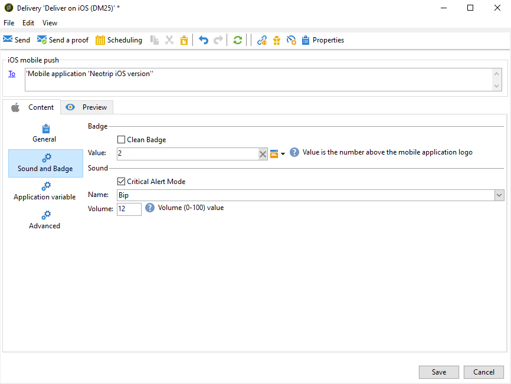
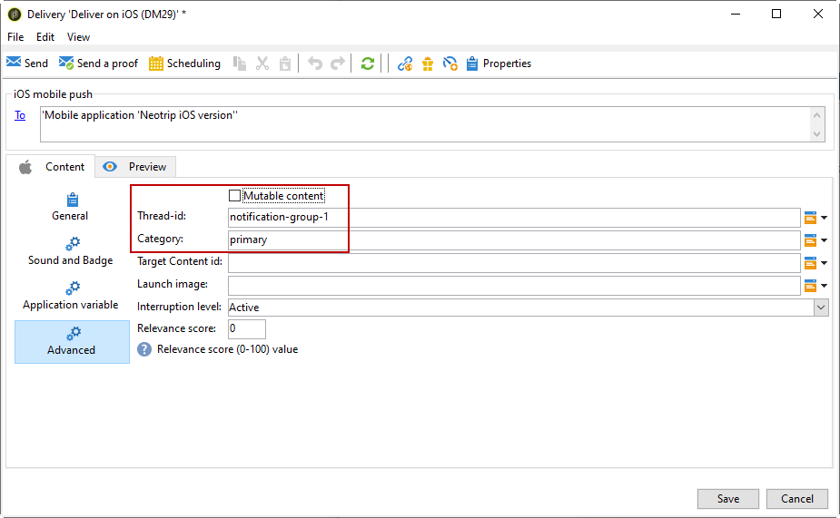

# Skapa meddelanden för iOS{#create-notifications-ios}

I det här avsnittet beskrivs de element som är specifika för leveransen av iOS-meddelanden. Globala koncept för leveransskapande presenteras i [det här avsnittet](steps-about-delivery-creation-steps.md).

Börja med att skapa en ny leverans.

Följ stegen nedan för att skapa ett push-meddelande för iOS-enheter:

1. Välj leveransmallen **[!UICONTROL Deliver on iOS]**.

   

1. Om du vill definiera målet för meddelandet klickar du på länken **[!UICONTROL To]** och sedan på **[!UICONTROL Add]**.

   

   >[!NOTE]
   >
   >Den detaljerade processen när målpopulationen för en leverans väljs visas i [det här avsnittet](steps-defining-the-target-population.md).
   >
   >Mer information om användning av anpassningsfält finns i [det här avsnittet](about-personalization.md).
   >
   >Mer information om hur du inkluderar en dirigeringslista finns i [Om dirigeringsadresser](about-seed-addresses.md).

1. Välj **[!UICONTROL Subscribers of an iOS mobile application (iPhone, iPad)]**, välj den tjänst som är relevant för ditt mobilprogram (Neotrips, i det här fallet) och välj sedan iOS-versionen av programmet.

   

1. Välj **[!UICONTROL Notification type]** mellan **[!UICONTROL General notification (Alert, Sound, Badge)]** eller **[!UICONTROL Silent notification]**.

   

   >[!NOTE]
   >
   >I läget **Tyst överföring** kan ett tyst meddelande skickas till ett mobilprogram. Användaren har inte informerats om meddelandets ankomst. Den överförs direkt till programmet.

1. I fältet **[!UICONTROL Title]** anger du etiketten för titeln som du vill ska visas i listan med meddelanden som är tillgängliga från meddelandecentret.

   I det här fältet kan du definiera värdet för parametern **title** i iOS-meddelandenyttolasten.

1. Du kan lägga till **[!UICONTROL Subtitle]**, värdet för undertitelparametern i iOS-meddelandenyttolasten. Se [det här avsnittet](configuring-the-mobile-application.md).

1. Ange innehållet i meddelandet i avsnittet **[!UICONTROL Message content]** i assistenten. Användningen av anpassningsfält beskrivs i avsnittet [Om anpassning](about-personalization.md).

   

1. Klicka på ikonen **[!UICONTROL Insert emoticon]** om du vill infoga uttryckssymboler i push-meddelandet. Om du vill anpassa uttryckslistan läser du [det här avsnittet](customizing-emoticon-list.md)

1. På fliken **[!UICONTROL Sound and Badge]** kan du redigera följande alternativ:

   * **[!UICONTROL Clean Badge]**: aktivera de här alternativen för att uppdatera badge-värdet.

   * **[!UICONTROL Value]**: ange ett tal som ska användas för att visa antalet nya olästa uppgifter direkt på programikonen.

   * **[!UICONTROL Critical alert mode]**: aktivera det här alternativet om du vill lägga till ljud i meddelandet även om användarens telefon är inställd på fokusläge eller om iPhone är avstängt.

   * **[!UICONTROL Name]**: välj ljudet som ska spelas upp av mobilterminalen när meddelandet tas emot.

   * **[!UICONTROL Volume]**: ljudvolym från 0 till 100.

   >[!NOTE]
   >
   >Ljud måste inkluderas i programmet och definieras när tjänsten skapas. Se [det här avsnittet](configuring-the-mobile-application.md#configuring-external-account-ios).

   

1. **[!UICONTROL Application variables]** läggs automatiskt till på fliken **[!UICONTROL Application variables]**. De gör att du kan definiera meddelandebeteende, till exempel kan du konfigurera en specifik programskärm som ska visas när användaren aktiverar meddelandet.

   Mer information om detta finns i [det här avsnittet](configuring-the-mobile-application.md).

1. På fliken **[!UICONTROL Advanced]** kan du redigera följande allmänna alternativ:

   * **[!UICONTROL Mutable content]**: aktivera det här alternativet om du vill tillåta mobilprogrammet att hämta medieinnehåll.

   * **[!UICONTROL Thread-id]**: Identifierare som används för att gruppera relaterade meddelanden tillsammans.

   * **[!UICONTROL Category]**: namnet på ditt kategori-ID som kommer att visa åtgärdsknappar. Dessa meddelanden ger användaren ett snabbare sätt att utföra olika åtgärder som svar på ett meddelande utan att öppna eller navigera i programmet.

   

1. För tidskänsliga meddelanden kan du ange följande alternativ:

   * **[!UICONTROL Target content ID]**: Identifierare som används för att ange vilket programfönster som ska flyttas fram när meddelandet öppnas.

   * **[!UICONTROL Launch image]**: namnet på startbildfilen som ska visas. Om användaren väljer att starta programmet visas den valda bilden i stället för programmets startskärm.

   * **[!UICONTROL Interruption level]**:

      * **[!UICONTROL Active]**: Som standard visas meddelandet omedelbart, skärmen visas och ett ljud kan spelas upp. Meddelanden går inte igenom fokusläget.

      * **[!UICONTROL Passive]**: Systemet lägger till meddelandet i meddelandelistan utan att skärmen eller ett ljud spelas upp. Meddelanden går inte igenom fokusläget.

      * **[!UICONTROL Time sensitive]**: Systemet visar meddelandet omedelbart, lyser upp skärmen, kan spela upp ett ljud och gå igenom fokus-lägen. Den här nivån kräver inget särskilt tillstånd från Apple.

      * **[!UICONTROL Critical]**: Systemet visar meddelandet omedelbart, lyser skärmen och kringgår avstängningsväxeln eller fokusläget. Observera att den här nivån kräver ett särskilt tillstånd från Apple.

   * **[!UICONTROL Relevance score]**: Ange ett relevansvärde mellan 0 och 100. Systemet använder detta för att sortera meddelandena i meddelandesammanfattningen.

   

1. När meddelandet har konfigurerats klickar du på fliken **[!UICONTROL Preview]** för att förhandsgranska meddelandet.

   

   >[!NOTE]
   >
   >Meddelandeformatet (banner eller alert) har inte definierats i Adobe Campaign. Det beror på vilken konfiguration som har valts av användaren i deras iOS-inställningar. I Adobe Campaign kan du dock förhandsgranska varje typ av meddelandeformat. Klicka på pilen längst ned till höger för att växla från ett format till ett annat.
   >
   >Förhandsgranskningen använder iOS 10-utseendet.

Använd samma process som för e-postleveranser om du vill skicka ett korrektur och den slutliga leveransen. [Läs mer](steps-validating-the-delivery.md)

När du har skickat meddelanden kan du övervaka och spåra dina leveranser. Mer information om detta hittar du i dessa avsnitt.

* [Kantlinjer för push-meddelanden](understanding-quarantine-management.md#push-notification-quarantines)
* [Övervaka en leverans](about-delivery-monitoring.md)
* [Förstå leveransfel](understanding-delivery-failures.md)

## Skapa ett iOS-meddelande {#creating-ios-delivery}

Med iOS 10 eller senare är det möjligt att generera omfattande meddelanden. Adobe Campaign kan skicka meddelanden med variabler som gör att enheten kan visa ett omfattande meddelande.

Nu måste du skapa en ny leverans och länka den till mobilappen som du har skapat.

1. Gå till **[!UICONTROL Campaign management]** > **[!UICONTROL Deliveries]**.

1. Klicka på **[!UICONTROL New]**.

   

1. Välj **[!UICONTROL Deliver on iOS (ios)]** i listrutan **[!UICONTROL Delivery template]**. Lägg till en **[!UICONTROL Label]** i leveransen.

1. Klicka på **[!UICONTROL To]** för att definiera målpopulationen. Målmappningen **[!UICONTROL Subscriber application]** används som standard. Klicka på **[!UICONTROL Add]** om du vill välja den tjänst som skapats tidigare.

   

1. I fönstret **[!UICONTROL Target type]** väljer du **[!UICONTROL Subscribers of an iOS mobile application (iPhone, iPad)]** och klickar på **[!UICONTROL Next]**.

1. I listrutan **[!UICONTROL Service]** väljer du den tjänst du skapat tidigare, sedan det program du vill ha som mål och klickar på **[!UICONTROL Finish]**.

   

1. Redigera dina meddelanden.

   

1. På fliken **[!UICONTROL Application variables]** läggs **[!UICONTROL Application variables]** automatiskt till beroende på vad som lades till under konfigurationsstegen.

   >[!NOTE]
   >
   >Programvariabler måste definieras i koden för mobilprogrammet och anges när tjänster skapas. Mer information om detta finns i [det här avsnittet](configuring-the-mobile-application.md).

   

1. Markera kryssrutan **[!UICONTROL Mutable content]** på fliken **[!UICONTROL Advanced]** för att tillåta mobilprogrammet att hämta medieinnehåll.

1. Klicka på **[!UICONTROL Save]** och skicka leveransen.

Bilden och webbsidan ska visas i push-meddelandet när de tas emot på prenumerantens mobila iOS-enheter.

