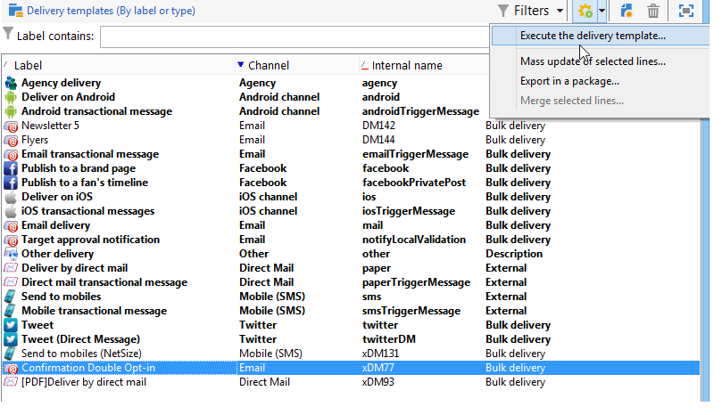

# Skapa en leverans från en mall{#creating-a-delivery-from-a-template}

## Länka mallen till en leverans {#linking-the-template-to-a-delivery}

Om du vill skapa en leverans baserad på en befintlig mall väljer du mallen i listan med tillgängliga leveransmallar.

I annat fall klickar du på **[!UICONTROL Select link]** mappen till höger om fältet för att bläddra i trädet.

Välj önskad katalog i **[!UICONTROL Folder]** fältet eller klicka på **[!UICONTROL Display sub-levels]** -ikonen för att visa innehållet i katalogerna i underträden till den aktuella katalogen.

Välj den leveransmall som ska användas och klicka på **[!UICONTROL Ok]**.

## Köra mallen {#executing-the-template}

Du kan starta körningen av en mall direkt från malllistan utan att först skapa en leverans. Om du vill göra det väljer du den mall som ska köras och högerklickar. Välj **[!UICONTROL Actions>Execute the delivery template...]**.

Du kan också använda **[!UICONTROL File>Actions>Execute the delivery template...]**.

Ange leveransparametrarna och klicka på **[!UICONTROL Send]**.

Den här åtgärden genererar en leverans i den mapp som är kopplad till mallen. Namnet på den här leveransen är namnet på leveransmallen som den skapades från.

>[!NOTE]
>
>Mer information om hur du konfigurerar en leverans finns i [Definiera e-postinnehållet](../../delivery/using/defining-the-email-content.md).
