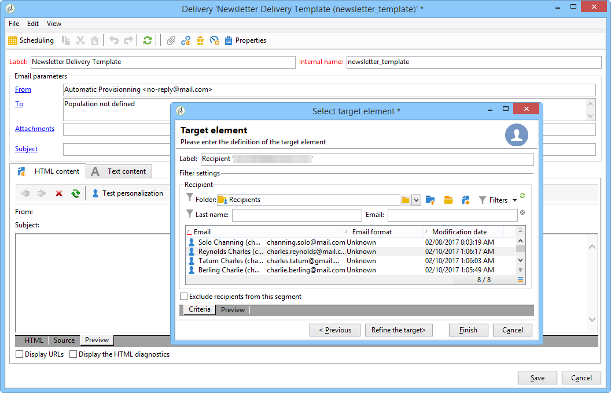

# Skapa en leveransmall{#creating-a-delivery-template}

## Konvertera en befintlig leverans till en mall {#converting-an-existing-delivery-to-a-template}

En leverans kan konverteras till en mall för nya upprepade leveransåtgärder. Om du vill konvertera en leverans till en mall väljer du den i leveranslistan, som du når via trädets **[!UICONTROL Campaign management]** nod.

Högerklicka och välj **[!UICONTROL Actions > Save as template...]**.

Den här åtgärden skapar en leveransmall av den valda leveransen. Du måste ange den mapp där den sparas (i **[!UICONTROL Folder]** fältet) samt den mapp där leveranser som skapats baserat på den här mallen skapas (i **[!UICONTROL Execution folder]** fältet).

Mer information om konfigurationsläget finns i [Länka mallen till en leverans](../../delivery/using/creating-a-delivery-from-a-template.md#linking-the-template-to-a-delivery).

## Skapa en ny mall {#creating-a-new-template}

Så här konfigurerar du en leveransmall:

1. Öppna Campaign Explorer.
1. I mappen **Resources** väljer du **Templates** och sedan **Delivery templates**.

   

1. Klicka på **Nytt** i verktygsfältet för att skapa en ny leveransmall.

   

1. Ändra mappens **etikett** och **interna namn** .
1. Spara mallen och öppna den igen.
1. Klicka på knappen **Egenskaper** och ändra sedan värdena enligt dina önskemål.

   

1. På fliken **Allmänt** bekräftar eller ändrar du de platser som är markerade i listrutorna **Körningsmapp**, **Mapp** och **Routning** .

   

1. Fyll i kategorin **E-postparametrar** med ditt e-postämne och din målgrupp.
1. Om du lägger till ditt **HTML-innehåll** för att anpassa mallen kan du visa en länk för spegelsida och en länk för att avbryta prenumerationen.
1. Välj fliken **Förhandsgranska** . I listrutan **Testa personalisering** väljer du **Mottagare** för att förhandsgranska mallen som vald profil.

   

1. Klicka på **Spara**. Mallen kan nu användas i en leverans.

>[!NOTE]
>
>För att undvika konfigurationsfel rekommenderar vi att du duplicerar en intern mall och ändrar dess egenskaper i stället för att skapa en ny mall.
