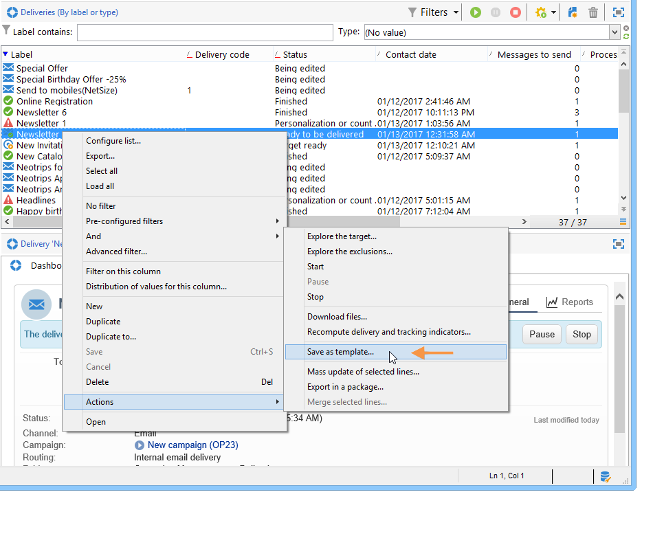

# Skapa en leveransmall{#creating-a-delivery-template}

 [Upptäck den här funktionen i en video](#delivery-template-video)

## Konvertera en befintlig leverans till en mall {#converting-an-existing-delivery-to-a-template}

En leverans kan konverteras till en mall för nya upprepade leveransåtgärder. Om du vill konvertera en leverans till en mall väljer du den i leveranslistan, som du kommer åt via noden **[!UICONTROL Campaign management]** i trädet.

Högerklicka och välj **[!UICONTROL Actions > Save as template...]**.

Den här åtgärden skapar en leveransmall av den valda leveransen. Du måste ange den mapp där den sparas (i fältet **[!UICONTROL Folder]**) samt den mapp där leveranser som skapats baserat på den här mallen skapas (i fältet **[!UICONTROL Execution folder]**).

Mer information om konfigurationsläget finns i [Länka mallen till en leverans](../../delivery/using/creating-a-delivery-from-a-template.md#linking-the-template-to-a-delivery).

## Skapa en ny mall {#creating-a-new-template}

Så här konfigurerar du en leveransmall:

1. Öppna Campaign Explorer.
1. I mappen **Resources** väljer du **Mallar** och sedan **Leveransmallar**.

   

1. Klicka på **Nytt** i verktygsfältet för att skapa en ny leveransmall.

   

1. Ändra **etiketten** och **det interna namnet** för mappen.
1. Spara mallen och öppna den igen.
1. Klicka på knappen **Egenskaper** och ändra sedan värdena enligt dina önskemål.

   

1. På fliken **Allmänt** bekräftar eller ändrar du de platser som har valts i mappen **Körning**, **Mapp** och **Routning**.

   

1. Fyll i kategorin **E-postparametrar** med ditt e-postämne och din målgrupp.
1. Lägg till ditt **HTML-innehåll** för att anpassa mallen, så kan du visa en länk för spegelsida och en länk för att avbryta prenumeration.
1. Välj fliken **Förhandsgranska**. I listrutan **Testa anpassning** väljer du **Mottagare** om du vill förhandsgranska mallen som den valda profilen.

   

1. Klicka på **Spara**. Mallen kan nu användas i en leverans.

>[!NOTE]
>
>För att undvika konfigurationsfel rekommenderar vi att du duplicerar en intern mall och ändrar dess egenskaper i stället för att skapa en ny mall.

## Självstudievideor {#delivery-template-video}

### Konfigurera en leveransmall

I följande video visas hur du konfigurerar en mall för en ad hoc-leverans.

>[!VIDEO](https://video.tv.adobe.com/v/24066?quality=12)

### Så här ställer du in egenskaper för leveransmallar

I följande video visas hur du ställer in leveransmallsegenskaperna och förklarar varje egenskap i detalj.

>[!VIDEO](https://video.tv.adobe.com/v/24067?quality=12)

### Distribuera en ad hoc-leveransmall

I den här videon förklaras hur du distribuerar en mall för ad hoc-e-postleverans och den förklarar skillnaden mellan en e-postleverans och ett leveransarbetsflöde.

>[!VIDEO](https://video.tv.adobe.com/v/24065?quality=12)

Ytterligare Campaign Classic-instruktionsvideor finns [här](https://experienceleague.adobe.com/docs/campaign-classic-learn/tutorials/overview.html?lang=sv).
