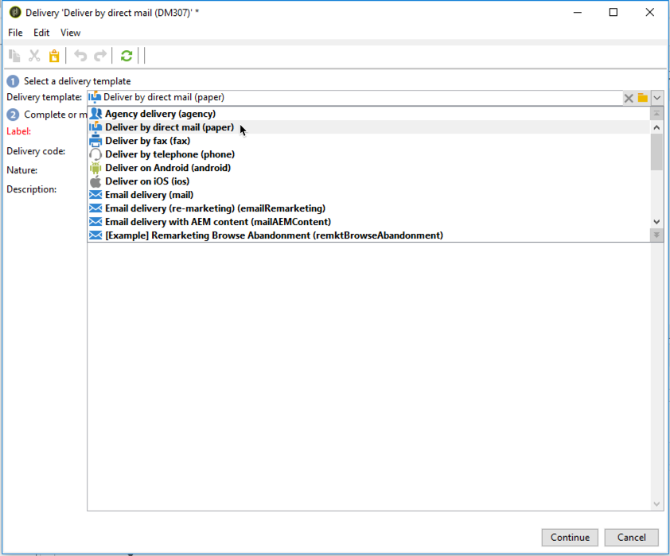

# Skapa en leverans av direktutskick{#creating-a-direct-mail-delivery}

Så här skapar du en ny direktutskick:

>[!NOTE]
>
>Globala koncept för leveransskapande presenteras i [det här avsnittet](steps-about-delivery-creation-steps.md).

1. Skapa en ny leverans, till exempel från kontrollpanelen Leverans.
1. Välj leveransmallen **Leverera via direktreklam (papper)**.

   

1. Identifiera leveransen med en etikett, kod och beskrivning. Mer information finns i [det här avsnittet](steps-create-and-identify-the-delivery.md#identifying-the-delivery)
1. Klicka på **Fortsätt** för att bekräfta den här informationen och visa meddelandekonfigurationsfönstret.
