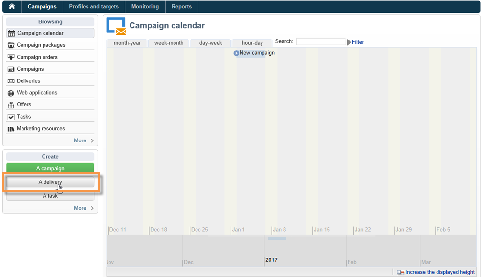

# Skapa meddelanden{#creating-notifications}

I det här avsnittet beskrivs de element som är specifika för leveransen av iOS- och Android-meddelanden. Globala koncept för leveransskapande beskrivs i [det här avsnittet](../../delivery/using/steps-about-delivery-creation-steps.md).

Börja med att skapa en ny leverans.

## Skicka meddelanden på iOS {#sending-notifications-on-ios}

1. Välj **[!UICONTROL Deliver on iOS]** leveransmall.

   

1. Om du vill definiera målet för meddelandet klickar du på **[!UICONTROL To]** länken och sedan på **[!UICONTROL Add]**.

   

   >[!NOTE]
   >
   >Den detaljerade processen när målpopulationen för en leverans väljs visas i [det här avsnittet](../../delivery/using/steps-defining-the-target-population.md).
   >
   >Mer information om användningen av personaliseringsfält finns i [Om personalisering](../../delivery/using/about-personalization.md).
   >
   >Mer information om hur du tar med en startvärdeslista finns i [Om startadresser](../../delivery/using/about-seed-addresses.md).

1. Välj **[!UICONTROL Subscribers of an iOS mobile application (iPhone, iPad)]** den tjänst som är relevant för ditt mobilprogram (i det här fallet Neotrips) och välj sedan iOS-versionen av programmet.

   

1. Välj meddelandetyp: **[!UICONTROL Alert]**, **[!UICONTROL Badge]**, eller **[!UICONTROL Alert and badge]** eller **[!UICONTROL Silent Push]**.

   

   >[!NOTE]
   >
   >Läget **tyst överföring** är tillgängligt från iOS 7. Detta gör att ett tyst meddelande kan skickas till ett mobilprogram. Användaren har inte informerats om meddelandets ankomst. Den överförs direkt till programmet.

1. I **[!UICONTROL Title]** fältet anger du etiketten för titeln som du vill ska visas i meddelandet. Den visas bara i listan över meddelanden som är tillgängliga från meddelandecentret. I det här fältet kan du definiera värdet på **title** -parametern för iOS-meddelandenyttolasten.
1. Om du använder HTTP/2-kopplingen kan du lägga till en underrubrik (värdet för **undertitle** -parametern i iOS-meddelandenyttolasten). Se avsnittet [Kopplingar](../../delivery/using/setting-up-mobile-app-channel.md#connectors) .
1. Ange sedan **[!UICONTROL Message]** och **[!UICONTROL Value of the badge]** baserat på den valda meddelandetypen.

   

   >[!NOTE]
   >
   >Du kan lägga till känslolägesikoner i innehållet i meddelandet. Om du vill göra det går du till en webbplats med en känslolägesikonlista ([till exempel](https://www.utf8-chartable.de/unicode-utf8-table.pl?start=9728)), kopierar ett känslolägesikoner och klistrar in det direkt i innehållsredigeraren. I Windows 7 kanske vissa känslolägesikoner inte visas korrekt i redigeraren (fyrkantig symbol), men de bör skickas korrekt i det slutliga meddelandet. Möjligheten att visa känslolägesikoner beror på vilket operativsystem som används på enheten. Vi rekommenderar att du skickar korrektur för att verifiera att leveransen visas korrekt innan du skickar den.

   >[!NOTE]
   >
   >**[!UICONTROL Badge]** och **[!UICONTROL Alert and badge]** typmeddelanden gör att du kan ändra värdet på märket (numret ovanför mobilprogrammets logotyp). Om du vill uppdatera märket behöver du bara ange 0 som värde. Om fältet är tomt ändras inte badge-värdet.

1. Med **[!UICONTROL Action button]** kan du definiera en etikett för åtgärdsknappen som visas i varningsmeddelanden (**fältet action_loc_key** i nyttolasten). Om ditt iOS-program hanterar lokaliserbara strängar (**Localizable.strings**) anger du motsvarande nyckel i det här fältet. Om programmet inte hanterar lokaliserbar text anger du den etikett som du vill se på åtgärdsknappen. Mer information om översättningsbara strängar finns i [Apples dokumentation](https://developer.apple.com/library/content/documentation/NetworkingInternet/Conceptual/RemoteNotificationsPG/CreatingtheNotificationPayload.md#//apple_ref/doc/uid/TP40008194-CH10-SW1) .
1. I **[!UICONTROL Play a sound]** fältet väljer du vilket ljud som ska spelas upp av mobilterminalen när meddelandet tas emot.

   >[!NOTE]
   >
   >Ljud måste inkluderas i programmet och definieras när tjänsten skapas. Se [Programljud](../../delivery/using/setting-up-mobile-app-channel.md#application-sounds).

1. I **[!UICONTROL Application variables]** fältet anger du värdet för varje variabel. Med programvariabler kan du definiera meddelandebeteende: Du kan till exempel konfigurera en specifik programskärm som ska visas när användaren aktiverar meddelandet.

   >[!NOTE]
   >
   >Programvariabler måste definieras i koden för mobilprogrammet och anges när tjänster skapas. Mer information finns i: [Allmän information](../../delivery/using/setting-up-mobile-app-channel.md#general-information).

1. Klicka på fliken för att förhandsgranska meddelandet när meddelandet har konfigurerats **[!UICONTROL Preview]** .

   

   >[!NOTE]
   >
   >Meddelandeformatet (banner eller alert) har inte definierats i Adobe Campaign. Det beror på vilken konfiguration användaren har valt i sina iOS-inställningar. Med Adobe Campaign kan du dock förhandsgranska varje typ av meddelandeformat. Klicka på pilen längst ned till höger för att växla från ett format till ett annat.
   >
   >Förhandsgranskningen använder iOS 10-utseendet.

Använd samma process som för e-postleveranser om du vill skicka ett korrektur och den slutliga leveransen.

När du har skickat meddelanden kan du övervaka och spåra dina leveranser. Mer information finns i följande avsnitt:

* [Kantlinjer för push-meddelanden](../../delivery/using/understanding-quarantine-management.md#push-notification-quarantines)
* [Övervaka leverans](../../delivery/using/monitoring-a-delivery.md)
* [Om leveransfel](../../delivery/using/understanding-delivery-failures.md)

## Skicka meddelanden på Android {#sending-notifications-on-android}

1. Börja med att välja **[!UICONTROL Deliver on Android (android)]** leveransmall.

   

1. Om du vill definiera målet för meddelandet klickar du på **[!UICONTROL To]** länken och sedan på **[!UICONTROL Add]**.

   

1. Välj **[!UICONTROL Subscribers of an Android mobile application]** den tjänst som är relevant för ditt mobilprogram (i det här fallet Neotrips) och välj sedan Android-versionen av programmet.

   

1. Ange sedan innehållet för meddelandet.

   

   >[!NOTE]
   >
   >Du kan lägga till känslolägesikoner i innehållet i meddelandet. Om du vill göra det går du till en webbplats med en känslolägesikonlista ([till exempel](https://www.utf8-chartable.de/unicode-utf8-table.pl?start=9728)), kopierar ett känslolägesikoner och klistrar in det direkt i innehållsredigeraren. I Windows 7 kanske vissa känslolägesikoner inte visas korrekt i redigeraren (fyrkantig symbol), men de bör skickas korrekt i det slutliga e-postmeddelandet. Möjligheten att visa känslolägesikoner beror på vilket operativsystem som används på enheten. Vi rekommenderar att du skickar korrektur för att verifiera att leveransen visas korrekt innan du skickar den.

1. I **[!UICONTROL Application variables]** fältet anger du värdet för varje variabel. Med programvariabler kan du definiera meddelandebeteende: Du kan till exempel konfigurera en specifik programskärm som ska visas när användaren aktiverar meddelandet.

   >[!NOTE]
   >
   >Programvariabler måste definieras i koden för mobilprogrammet och anges när tjänster skapas. Mer information finns i: [Allmän information](../../delivery/using/setting-up-mobile-app-channel.md#general-information).

1. Klicka på fliken för att förhandsgranska meddelandet när meddelandet har konfigurerats **[!UICONTROL Preview]** .

   

Använd samma process som för e-postleveranser om du vill skicka ett korrektur och den slutliga leveransen.

Den detaljerade processen för att validera och skicka en leverans presenteras i avsnitten nedan:

* [Verifierar leveransen](../../delivery/using/steps-validating-the-delivery.md)
* [Skicka leveransen](../../delivery/using/steps-sending-the-delivery.md)

När du har skickat meddelanden kan du övervaka och spåra dina leveranser. Mer information finns i följande avsnitt:

* [Kantlinjer för push-meddelanden](../../delivery/using/understanding-quarantine-management.md#push-notification-quarantines)
* [Övervaka leverans](../../delivery/using/monitoring-a-delivery.md)
* [Om leveransfel](../../delivery/using/understanding-delivery-failures.md)
