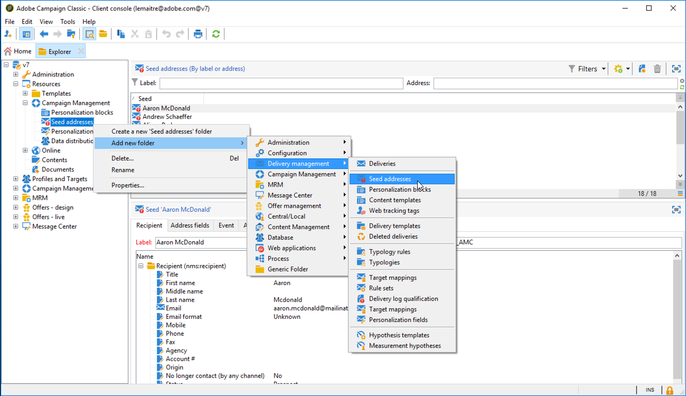

# Skapa dirigerade adresser{#creating-seed-addresses}

Seed-adresser hanteras inte via standardprofiler och -mål, utan i en dedikerad nod i Adobe Campaign-hierarkin **[!UICONTROL Resources > Campaign management > Seed addresses]**.

Du kan skapa undermappar för att ordna startadresserna. Om du vill göra det högerklickar du på **[!UICONTROL Seed addresses]** noden och väljer **[!UICONTROL Create a new 'Seed addresses' folder]**. Namnge undermappen och tryck sedan på **[!UICONTROL Enter]** för att validera. Nu kan du skapa eller kopiera dirigerade adresser till den här undermappen. Mer information finns i [Definiera adresser](#defining-addresses).

Med Adobe Campaign kan ni också skapa mallar för dirigerade adresser som importeras till leveranser eller kampanjer och som anpassas utifrån de specifika behoven hos de aktuella leveranserna och kampanjerna. Mer information finns i [Skapa dirigerade adressmallar](#creating-seed-address-templates).

## Definiera adresser {#defining-addresses}

Följ stegen nedan för att skapa dirigerade adresser:

1. Klicka på **[!UICONTROL New]** knappen ovanför listan med dirigerade adresser.
1. Ange data som är länkade till adressen i matchande fält på **[!UICONTROL Recipient]** fliken. De tillgängliga fälten motsvarar standardfälten i leveransmottagarnas profiler (nms:mottagartabellen): namn, förnamn, e-postadress osv.

   >[!NOTE]
   >
   >Adressetiketten fylls automatiskt i med det efternamn och förnamn som du har definierat.
   >
   >Du behöver inte ange alla fält på varje flik när du skapar en startadress. Eventuella personaliseringselement som saknas anges slumpmässigt under leveransen.

   

1. På **[!UICONTROL Seed fields]** fliken anger du de värden som ska infogas i leveransloggarna under analysfasen (i **[!UICONTROL nms:broadLog]** tabellen).
1. På fliken **[!UICONTROL Additional data]** anger du de personaliseringsdata som används för leveranser som skapas i arbetsflödena för datahantering och som du vill tilldela ett specifikt värde till.

## Skapa mallar för dirigerade adresser {#creating-seed-address-templates}

Om du vill skapa adressmallar som ska importeras och ändras för varje leverans, är processen densamma som när du definierar en ny dirigeringsadress. Den enda skillnaden är att adresser för startadressmallar måste lagras i en mapp av typen &quot;Mall&quot;.

Så här definierar du en mallmapp:

1. Skapa en ny **[!UICONTROL Seed addresses]** typmapp, högerklicka på mappen och välj **[!UICONTROL Properties...]**.

   

1. Klicka på **[!UICONTROL Restriction]** fliken och lägg till följande filtervillkor: **@isModel = true**.

   

   Adresser som lagras i den här mappen kan nu användas som adressmallar. Du kan importera dem till leveranser eller kampanjer och anpassa dem baserat på de specifika behoven för de aktuella leveranserna och kampanjerna (se [Lägga till dirigerade adresser](../../delivery/using/adding-seed-addresses.md)).
