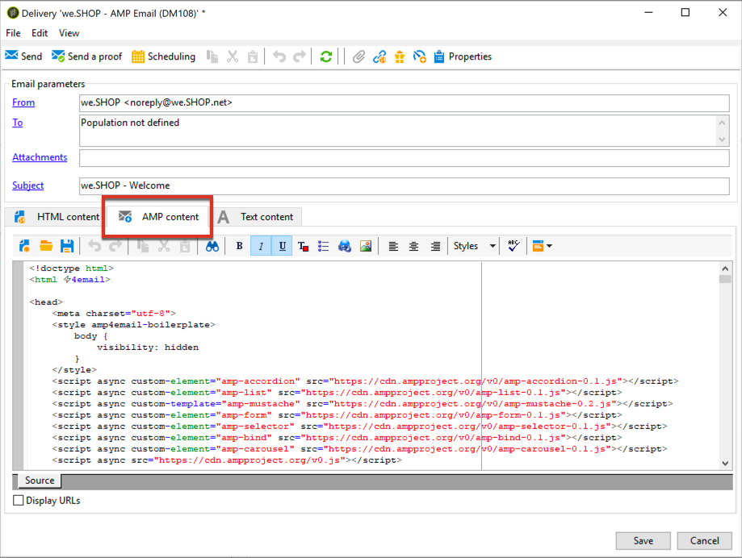

# Definiera interaktivt innehåll{#defining-interactive-content}

Med Adobe Campaign kan ni testa den nya interaktiva [AMP för e-postformat](https://amp.dev/about/email/) , som gör det möjligt att skicka dynamiska e-postmeddelanden under vissa omständigheter.

>[!CAUTION]
>
>* Den här funktionen är en betafunktion i Adobe Campaign.
>* AMP for Email är ett nytt format med öppen källkod som gör att utvecklare kan skapa dynamiska och interaktiva e-postmeddelanden. För närvarande stöds den av två e-postleverantörer: Gmail och Outlook.
>
>
Därför kan du bara:
>* Testa att leverera AMP-e-post till specifika Gmail- eller Outlook-adresser som har konfigurerats korrekt.
>* Leverera AMP-e-post till vilken Gmail-adress som helst efter registrering hos Google och till vilken Outlook-adress som helst efter registrering hos Microsoft.
>
>
Se [Ange ett AMP-e-postmeddelande](#targeting-amp-email)som mål.

Den här funktionen är tillgänglig via ett dedikerat paket i Adobe Campaign. Paketet måste vara installerat för att du ska kunna använda det. När du är klar startar du om servern så att paketet kan användas.

För hybridarkitekturer och värdbaserade arkitekturer måste paketet installeras på alla servrar, inklusive [mellankällservern](../../installation/using/mid-sourcing-server.md) och [körningsinstansen](../../message-center/using/creating-a-shared-connection.md#execution-instance). Kontakta er kontoansvarige.

I den här [videon](https://docs.adobe.com/content/help/en/campaign-learn/campaign-classic-tutorials/sending-messages/email-channel/defining-interactive-email-content-with-amp.html) ser du hur du aktiverar AMP i Adobe Campaign och lär dig mer om användningen.

## Om AMP för e-post {#about-amp-for-email}

Det nya formatet **AMP for Email** gör det möjligt att inkludera AMP-komponenter i meddelanden för att förbättra e-postupplevelsen med avancerat och användbart innehåll. Med de moderna appfunktionerna som är direkt tillgängliga i e-postmeddelanden kan mottagarna interagera dynamiskt med innehållet i själva meddelandet.

Till exempel:
* E-postmeddelanden som skrivits med AMP kan innehålla interaktiva element som bildkaruseller.
* Innehållet hålls uppdaterat i meddelandet.
* Mottagarna kan göra som att svara på ett formulär utan att lämna sin inkorg.

AMP for Email är kompatibelt med befintliga e-postmeddelanden. AMP-versionen av meddelandet är inbäddad i e-postmeddelandet som en ny MIME-del, förutom HTML och/eller oformaterad text, vilket garanterar kompatibilitet för alla e-postklienter.

Mer information om AMP för e-postformat, specifikationer och krav finns i [AMP-utvecklardokumentationen](https://amp.dev/documentation/guides-and-tutorials/learn/email-spec/amp-email-format/?format=email).

## Viktiga steg för att använda AMP för e-post med Adobe Campaign {#key-steps-to-use-amp}

Följ stegen nedan för att testa och skicka ett AMP-e-postmeddelande med Adobe Campaign:
1. Installera **[!UICONTROL AMP support (Beta)]** paketet. Se [Installera Campaign-standardpaket](../../installation/using/installing-campaign-standard-packages.md).
1. Skapa ett e-postmeddelande och bygg ert AMP-innehåll i Adobe Campaign. Se [Skapa e-postinnehåll för AMP med Adobe Campaign](#build-amp-email-content).
1. Se till att du uppfyller alla leveranskrav från e-postleverantörer som stöder AMP-formatet.

   >[!NOTE]
   >
   >AMP for Email finns som betafunktion för testning. För närvarande stöder endast två e-postleverantörer testning av det här formatet (Gmail och Outlook).

   Se [AMP för leveranskrav](#amp-for-email-delivery-requirements)via e-post.

1. När du definierar målet måste du markera de mottagare som ska kunna visa AMP-formatet.

   >[!NOTE]
   >
   >För närvarande kan du bara testa att leverera AMP-e-postmeddelanden till specifika e-postadresser som är korrekt konfigurerade eller efter registrering hos de e-postleverantörer som deltar i AMP-betaprogrammet.

   Se [Ange ett AMP-e-postmeddelande](#targeting-amp-email)som mål.

1. Skicka e-post som vanligt. Se [Skicka ett AMP-e-postmeddelande](#sending-amp-email).

## Bygga e-postinnehåll från AMP i Adobe Campaign {#build-amp-email-content}

Följ stegen nedan för att skapa ett e-postmeddelande i AMP-format.

>[!CAUTION]
>
>Se till att du följer AMP:s krav och specifikationer för e-post i [AMP:s utvecklardokumentation](https://amp.dev/documentation/guides-and-tutorials/learn/email_fundamentals/?format=email). Du kan även läsa [AMP för bästa praxis](https://amp.dev/documentation/guides-and-tutorials/develop/amp_email_best_practices/?format=email)inom e-postmarknadsföring.

1. Välj en mall när du skapar e-postleveransen.

   >[!NOTE]
   >
   >En viss AMP-mall innehåller ett exempel på de viktigaste kapaciteter du kan använda: produktlista, karusell, dubbel anmälan, undersökning och avancerad serverbegäran.

1. Klicka på **[!UICONTROL AMP content]** fliken.

   

1. Redigera AMP-innehållet efter dina behov.

   >[!NOTE]
   >
   >Mer information om hur du skapar ditt första AMP-e-postmeddelande finns i [dokumentationen](https://amp.dev/documentation/guides-and-tutorials/start/create_email/?format=email)för AMP-utvecklare.

   Du kan till exempel använda produktlistkomponenten från AMP-mallen och upprätthålla en lista över produkter från ett tredjepartssystem, eller till och med inuti Adobe Campaign. När du justerar ett pris eller något annat element visas det automatiskt när mottagaren öppnar e-postmeddelandet från sin postlåda igen.

1. Anpassa ert AMP-innehåll efter behov, precis som ni brukar göra med HTML-formatet i Adobe Campaign, med personaliseringsfält och personaliseringsblock.

   

1. När du är klar med redigeringen markerar du hela AMP-innehållet och kopierar och klistrar in det i den [AMP-webbaserade valideraren](https://validator.ampproject.org) eller på en liknande webbplats.

   >[!NOTE]
   >
   >Se till att du väljer **AMP4 EMAIL** i listrutan högst upp på skärmen.

   

   Alla fel markeras som infogade.

   >[!NOTE]
   >
   >Adobe Campaign AMP-redigeraren är inte utformad för innehållsvalidering. Använd en extern webbplats, till exempel en [AMP-webbaserad validerare](https://validator.ampproject.org) , för att kontrollera att innehållet är korrekt.

1. Gör de ändringar som behövs tills AMP-innehållet godkänns i valideringen.

   

1. Kopiera och klistra in det validerade innehållet i [AMP Playground](https://playground.amp.dev) eller en liknande webbplats för att förhandsgranska innehållet.

   >[!NOTE]
   >
   >Se till att du väljer **AMP för e-post** i listrutan högst upp på skärmen.

   

   >[!NOTE]
   >
   >Du kan inte förhandsgranska ditt AMP-innehåll direkt i Adobe Campaign. Använd en extern webbplats som [AMP Playground](https://playground.amp.dev).

1. Gå tillbaka till Adobe Campaign och kopiera och klistra in ert validerade innehåll på **[!UICONTROL AMP content]** fliken.

1. Växla till **[!UICONTROL HTML content]** - eller **[!UICONTROL Text content]** -fliken och definiera innehåll för minst ett av dessa två format.

   >[!CAUTION]
   >
   >Om e-postmeddelandet inte innehåller någon HTML- eller oformaterad textversion förutom AMP-innehållet, kan det inte skickas.

## AMP för leveranskrav via e-post {#amp-for-email-delivery-requirements}

När du skapar ditt AMP-innehåll i Adobe Campaign måste du uppfylla villkoren för att ett dynamiskt e-postmeddelande ska kunna levereras, som är specifikt för mottagarnas e-postleverantörer.

För närvarande har två e-postleverantörer stöd för att testa det här formatet: Gmail och Outlook.

Alla steg och specifikationer som krävs för att testa leveransen med AMP-format på Gmail-konton finns i motsvarande [dokumentation](https://developers.google.com/gmail/ampemail?) för Gmail-utvecklare och dokumentation [för](https://docs.microsoft.com/en-gb/outlook/amphtml/)Outlook-utvecklare.

Bland annat måste följande krav vara uppfyllda:
* Följ de säkerhetskrav för AMP som gäller för [Gmail](https://developers.google.com/gmail/ampemail/security-requirements) och [Outlook](https://docs.microsoft.com/en-gb/outlook/amphtml/security-requirements).
* AMP MIME-delen måste innehålla ett [giltigt AMP-dokument](https://amp.dev/documentation/guides-and-tutorials/learn/validation-workflow/validate_emails/?format=email).
* AMP MIME-delen måste vara mindre än 100 kB.

Du kan även läsa [Tips och kända begränsningar för Gmail](https://developers.google.com/gmail/ampemail/tips) och [AMP:s metodtips för Outlook](https://docs.microsoft.com/en-gb/outlook/amphtml/best-practices).

## Ange ett AMP-e-postmeddelande {#targeting-amp-email}

AMP för e-post är tillgängligt som betafunktion och för närvarande kan du experimentera med att skicka AMP-e-post i två steg:

1. Med Adobe Campaign kan ni testa att leverera en AMP-driven dynamisk e-postadress till utvalda e-postadresser som är korrekt konfigurerade för att verifiera dess innehåll och beteende. Se [Testa AMP-e-postleverans för valda adresser](#testing-amp-delivery-for-selected-addresses).
1. När du har testats kan du skicka en leverans eller en kampanj som en del av betaprogrammet för AMP för e-post genom att registrera dig hos de relevanta e-postleverantörerna för att få din avsändardomän vitlistad. Se [Leverera AMP-e-post genom att registrera hos en e-postleverantör](#delivering-amp-emails-by-registering).

### Testar AMP-e-postleverans för valda adresser {#testing-amp-delivery-for-selected-addresses}

Du kan testa att skicka dynamiska meddelanden från Adobe Campaign till utvalda e-postadresser.

>[!NOTE]
>
>För närvarande stöder endast Gmail och Outlook testning av AMP-formatet.

Innan du gör det måste du vitlista avsändaradressen/avsändaradresserna som du använder för att leverera från Adobe Campaign för de Gmail- och Outlook-konton du riktar dig mot.

Så här gör du:
1. Kontrollera att alternativet Aktivera dynamisk e-post är markerat för de relevanta e-postleverantörerna.
1. Kopiera avsändaradressen som visas i leveransens **[!UICONTROL From]** fält och klistra in den i rätt avsnitt i e-postleverantörens kontoinställningar.

Mer information finns i dokumentationen [till](https://developers.google.com/gmail/ampemail/testing-dynamic-email) Gmail-utvecklaren och i dokumentationen [till](https://docs.microsoft.com/en-gb/outlook/amphtml/register-outlook#individual-mailbox-registration)Outlook-utvecklaren.

### Leverera AMP-mejl genom att registrera hos en e-postleverantör {#delivering-amp-emails-by-registering}

Du kan experimentera med att leverera dynamiska e-postmeddelanden genom att registrera dig hos de e-postleverantörer som deltar i AMP-betaprogrammet för att få din avsändardomän vitlistad.

>[!NOTE]
>
>För närvarande stöder endast Gmail och Outlook AMP-formatet.

När du har testats med några adresser kan du skicka AMP-e-post till valfri Gmail- eller Outlook-adress. För att kunna göra detta måste du registrera dig på ett respektfullt sätt hos Google eller Microsoft och vänta på deras svar.

Följ stegen som beskrivs i dokumentationen [till](https://developers.google.com/gmail/ampemail/register) Gmail-utvecklaren och i dokumentationen [till](https://docs.microsoft.com/en-gb/outlook/amphtml/register-outlook#global-registration)Outlook-utvecklaren. När registreringen är klar blir du en auktoriserad avsändare.

## Skicka ett AMP-e-postmeddelande {#sending-amp-email}

När ditt AMP-innehåll och din reservalternativ är klara, och när du har definierat ett kompatibelt mål, kan du skicka e-postmeddelandet som vanligt.

För närvarande stöder endast Gmail och Outlook AMP-formatet under vissa villkor. Du kan ange adresser från andra e-postleverantörer som mål, men de får HTML- eller oformaterad text-versionen av ditt e-postmeddelande.

>[!NOTE]
>
>Om e-postmeddelandet inte innehåller någon HTML- eller oformaterad textversion förutom AMP-innehållet, kan det inte skickas.

För de matchande mottagarna visas AMP-versionen av e-postmeddelandet i deras postlåda.

Om du till exempel har tagit med en produktlista i e-postmeddelandet justeras priserna automatiskt varje gång mottagarna öppnar e-postmeddelandet igen i sin postlåda när de redigerar priserna i ett tredjepartssystem.

>[!NOTE]
>
>Du kan skapa en regel för e-postbearbetning för att förhindra att vissa domäner tar emot AMP-e-postmeddelanden. Se [Hantera e-postformat](../../installation/using/email-deliverability.md#managing-email-formats).
>
>Som standard är alternativet **[!UICONTROL AMP inclusion]** inställt på **[!UICONTROL No]**.
