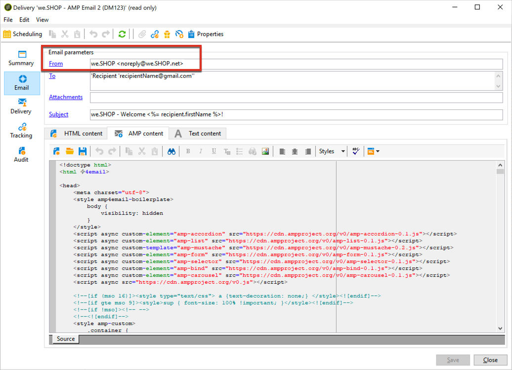

# Definiera interaktivt innehåll{#defining-interactive-content}

Med Adobe Campaign kan du använda det nya interaktiva [AMP för e-post](https://amp.dev/about/email/)-formatet, som gör att du kan skicka dynamiska e-postmeddelanden under vissa förhållanden.

Med AMP for Email kan man
* Testa att leverera AMP-e-post till specifika adresser som är korrekt konfigurerade.
* Leverera AMP-e-post till Gmail-, Outlook- eller Mail.ru-adresser efter registrering hos motsvarande leverantörer.

Mer information om hur du testar och skickar AMP-e-post finns i [Ange ett AMP-e-postmeddelande](#targeting-amp-email).

Den här funktionen är tillgänglig via ett dedikerat paket i Adobe Campaign. Paketet måste vara installerat för att du ska kunna använda det. När du är klar startar du om servern så att paketet kan användas.

>[!NOTE]
>
> För hybridarkitekturer och värdbaserade arkitekturer måste paketet installeras på alla servrar, inklusive [mittkällservern](../../installation/using/mid-sourcing-server.md) och [körningsinstansen](../../message-center/using/configuring-instances.md#execution-instance). Kontakta er kontoansvarige.

## Om AMP för e-post {#about-amp-for-email}

Med det nya formatet **AMP for Email** kan AMP-komponenter inkluderas i meddelanden för att förbättra e-postupplevelsen med avancerat och användbart innehåll. Med de moderna appliknande funktioner som finns direkt tillgängliga i e-postmeddelanden kan mottagarna interagera dynamiskt med innehållet i själva meddelandet.

Exempel:
* E-postmeddelanden som skrivits med AMP kan innehålla interaktiva element som bildkaruseller.
* Innehållet hålls uppdaterat i meddelandet.
* Mottagarna kan göra som att svara på ett formulär utan att lämna sin inkorg.

AMP for Email är kompatibelt med befintliga e-postmeddelanden. AMP-versionen av meddelandet är inbäddad i e-postmeddelandet som en ny MIME-del, förutom HTML och/eller oformaterad text, vilket garanterar kompatibilitet för alla e-postklienter.

Mer information om AMP för e-postformat, specifikationer och krav finns i [dokumentationen för AMP-utvecklare](https://amp.dev/documentation/guides-and-tutorials/learn/email-spec/amp-email-format/?format=email).

 [Upptäck den här funktionen i en video](#amp-email-video)

## Viktiga steg för att använda AMP för e-post med Adobe Campaign {#key-steps-to-use-amp}

Följ stegen nedan för att testa och skicka ett AMP-e-postmeddelande med Adobe Campaign:
1. Installera **[!UICONTROL AMP support]**-paketet. Se [Installera inbyggda Campaign-paket](../../installation/using/installing-campaign-standard-packages.md).
1. Skapa ett e-postmeddelande och bygg ditt AMP-innehåll i Adobe Campaign. Se [Bygg e-postinnehåll för AMP med Adobe Campaign](#build-amp-email-content).
1. Se till att du uppfyller alla leveranskrav från e-postleverantörer som stöder AMP-formatet. Se [AMP för leveranskrav för e-post](#amp-for-email-delivery-requirements).
1. När du definierar målet måste du markera de mottagare som ska kunna visa AMP-formatet. Se [Ange ett AMP-e-postmeddelande](#targeting-amp-email) som mål.

   >[!NOTE]
   >
   >För närvarande kan du bara leverera AMP-e-postmeddelanden till [specifika e-postadresser](#testing-amp-delivery-for-selected-addresses) (för testningsändamål) eller efter [registrering](#delivering-amp-emails-by-registering) med e-postklienter som stöds.

1. Skicka e-post som vanligt. Se [Skicka ett AMP-e-postmeddelande](#sending-amp-email).

## Skapa e-postinnehåll från AMP i Adobe Campaign {#build-amp-email-content}

Följ stegen nedan för att skapa ett e-postmeddelande i AMP-format.

>[!IMPORTANT]
>
>Se till att du följer AMP:s krav och specifikationer för e-post som beskrivs i [dokumentationen för AMP-utvecklare](https://amp.dev/documentation/guides-and-tutorials/learn/email_fundamentals/?format=email). Du kan också läsa [AMP för bästa praxis för e-post](https://amp.dev/documentation/guides-and-tutorials/develop/amp_email_best_practices/?format=email).

1. Välj en mall när du skapar e-postleveransen.

   >[!NOTE]
   >
   >En viss AMP-mall innehåller ett exempel på de viktigaste kapaciteter du kan använda: produktlista, karusell, dubbel anmälan, undersökning och avancerad serverbegäran.

1. Klicka på fliken **[!UICONTROL AMP content]**.

   

1. Redigera AMP-innehållet efter dina behov.

   >[!NOTE]
   >
   >Mer information om hur du skapar ditt första AMP-e-postmeddelande finns i [dokumentationen för AMP-utvecklare](https://amp.dev/documentation/guides-and-tutorials/start/create_email/?format=email).

   Du kan till exempel använda produktlistkomponenten från AMP-mallen och upprätthålla en lista över produkter från ett tredjepartssystem eller till och med inuti Adobe Campaign. När du justerar ett pris eller något annat element visas det automatiskt när mottagaren öppnar e-postmeddelandet från sin postlåda igen.

1. Anpassa ert AMP-innehåll efter behov, som ni vanligtvis gör med HTML-format i Adobe Campaign, med personaliseringsfält och personaliseringsblock.

   

1. När du är klar med redigeringen markerar du hela AMP-innehållet och kopierar och klistrar in det i den webbaserade valideraren [AMP](https://validator.ampproject.org) eller på en liknande webbplats.

   >[!NOTE]
   >
   >Se till att du väljer **AMP4 EMAIL** i listrutan högst upp på skärmen.

   

   Alla fel markeras som infogade.

   >[!NOTE]
   >
   >Adobe Campaign AMP-redigeraren är inte utformad för innehållsvalidering. Använd en extern webbplats som [AMP webbaserad validerare](https://validator.ampproject.org) för att kontrollera att innehållet är korrekt.

1. Gör de ändringar som behövs tills AMP-innehållet godkänns i valideringen.

   

1. Kopiera och klistra in det validerade innehållet i [AMP Playground](https://playground.amp.dev) eller en liknande webbplats för att förhandsgranska innehållet.

   >[!NOTE]
   >
   >Se till att du väljer **AMP för e-post** i listrutan högst upp på skärmen.

   

   >[!NOTE]
   >
   >Du kan inte förhandsgranska ditt AMP-innehåll direkt i Adobe Campaign. Använd en extern webbplats som [AMP Playground](https://playground.amp.dev).

1. Gå tillbaka till Adobe Campaign och kopiera och klistra in det validerade innehållet på fliken **[!UICONTROL AMP content]**.

1. Växla till fliken **[!UICONTROL HTML content]** eller **[!UICONTROL Text content]** och definiera innehåll för minst ett av dessa två format.

   >[!IMPORTANT]
   >
   >Om e-postmeddelandet inte innehåller någon HTML- eller oformaterad textversion förutom AMP-innehållet, kan det inte skickas.

## AMP för leveranskrav för e-post {#amp-for-email-delivery-requirements}

När du skapar ditt AMP-innehåll i Adobe Campaign måste du uppfylla villkoren för att ett dynamiskt e-postmeddelande ska kunna levereras, som är specifikt för mottagarnas e-postleverantörer.

För närvarande stöder tre e-postleverantörer testning av det här formatet: Gmail, Outlook och Mail.ru.

Alla steg och specifikationer som krävs för att testa leveransen med AMP-format på Gmail-konton finns i motsvarande [Gmail](https://developers.google.com/gmail/ampemail?), [Outlook ](https://docs.microsoft.com/en-gb/outlook/amphtml/) och [Mail.ru](https://postmaster.mail.ru/amp)-dokumentation för utvecklare.

Bland annat måste följande krav vara uppfyllda:
* Följ säkerhetskraven för AMP som är specifika för [Gmail](https://developers.google.com/gmail/ampemail/security-requirements), [Outlook](https://docs.microsoft.com/en-gb/outlook/amphtml/security-requirements) och [Mail.ru](https://postmaster.mail.ru/amp/?lang=en#howto).
* AMP MIME-delen måste innehålla ett [giltigt AMP-dokument](https://amp.dev/documentation/guides-and-tutorials/learn/validation-workflow/validate_emails/?format=email).
* AMP MIME-delen måste vara mindre än 100 kB.

Du kan även läsa [Tips och kända begränsningar för Gmail](https://developers.google.com/gmail/ampemail/tips) och [AMP:s metodtips för Outlook](https://docs.microsoft.com/en-gb/outlook/amphtml/best-practices).

## Ange ett AMP-e-postmeddelande {#targeting-amp-email} som mål

För närvarande kan du experimentera med att skicka ett AMP-mejl i två steg:

1. Med Adobe Campaign kan du testa att leverera en AMP-driven dynamisk e-post till utvalda e-postadresser som är korrekt konfigurerade, för att verifiera dess innehåll och beteende. Se [Testa AMP-e-postleveransen för valda adresser](#testing-amp-delivery-for-selected-addresses).

1. När du har testats kan du skicka en leverans eller en kampanj som en del av AMP for Email-programmet genom att registrera dig hos de relevanta e-postleverantörerna för att lägga till din avsändardomän i tillåtelselista. Se [Leverera AMP-e-post genom att registrera hos en e-postleverantör](#delivering-amp-emails-by-registering).

### Testar AMP-e-postleverans för valda adresser {#testing-amp-delivery-for-selected-addresses}

Du kan testa att skicka dynamiska meddelanden från Adobe Campaign till valda e-postadresser.

>[!NOTE]
>
>För närvarande stöder endast Gmail, Outlook och Mail.ru testning av AMP-formatet.

För Gmail och Outlook måste du först lägga till avsändaradressen/avsändaradresserna som du använder på tillåtelselista för att kunna leverera från Adobe Campaign för de Gmail- och Outlook-konton som du riktar dig mot.

Så här gör du:
1. Kontrollera att alternativet Aktivera dynamisk e-post är markerat för de relevanta e-postleverantörerna.
1. Kopiera avsändaradressen som visas i leveransens **[!UICONTROL From]**-fält och klistra in den i e-postleverantörens kontoinställningar.

Mer information finns i dokumentationen för [Gmail](https://developers.google.com/gmail/ampemail/testing-dynamic-email) och [Outlook](https://docs.microsoft.com/en-gb/outlook/amphtml/register-outlook#individual-mailbox-registration)-utvecklare.

Om du vill testa att skicka ett AMP-e-postmeddelande till en Mail.ru-adress följer du stegen i [Mail.ru-utvecklardokumentationen](https://postmaster.mail.ru/amp/?lang=en#howto) (**Om du är användare**).

### Leverera AMP-e-post genom att registrera hos en e-postleverantör {#delivering-amp-emails-by-registering}

Du kan experimentera med att leverera dynamiska e-postmeddelanden genom att registrera dig hos de e-postleverantörer som stöds så att din avsändardomän läggs till i tillåtelselista.

>[!NOTE]
>
>För närvarande stöder endast Gmail, Outlook och Mail.ru AMP-formatet.

När du har testats med några adresser kan du skicka AMP-e-post till valfri Gmail- eller Outlook-adress. För att kunna göra detta måste du registrera dig på ett respektfullt sätt hos Google eller Microsoft och vänta på deras svar. Följ stegen som beskrivs i [Gmail](https://developers.google.com/gmail/ampemail/register) och [Outlook](https://docs.microsoft.com/en-gb/outlook/amphtml/register-outlook#global-registration)-utvecklardokumentationen. När registreringen är klar blir du en auktoriserad avsändare.

Om du vill skicka AMP-e-post till Mail.ru-adresser följer du de krav och steg som anges i [Mail.ru-utvecklardokumentationen](https://postmaster.mail.ru/amp/?lang=en#howto) (**Om du är e-postavsändare**).

## Skicka ett AMP-e-postmeddelande {#sending-amp-email}

När ditt AMP-innehåll och din reservalternativ är klara, och när du har definierat ett kompatibelt mål, kan du skicka e-postmeddelandet som vanligt.

För närvarande stöder endast Gmail, Outlook och Mail.ru AMP-formatet under vissa villkor. Du kan ange adresser från andra e-postleverantörer som mål, men de får HTML- eller oformaterad text-versionen av ditt e-postmeddelande.

>[!IMPORTANT]
>
>Om e-postmeddelandet inte innehåller någon HTML- eller oformaterad textversion förutom AMP-innehållet, kan det inte skickas.

För de matchande mottagarna visas AMP-versionen av e-postmeddelandet i deras postlåda.

Om du till exempel har tagit med en produktlista i e-postmeddelandet justeras priserna automatiskt varje gång mottagarna öppnar e-postmeddelandet igen i sin postlåda när de redigerar priserna i ett tredjepartssystem.

>[!NOTE]
>
>Du kan skapa en regel för e-postbearbetning för att förhindra att vissa domäner tar emot AMP-e-postmeddelanden. Se [Hantera e-postformat](../../installation/using/email-deliverability.md#managing-email-formats).
>
>Alternativet **[!UICONTROL AMP inclusion]** är som standard inställt på **[!UICONTROL No]**.

## Självstudievideo {#amp-email-video}

I videon nedan förklaras hur du aktiverar och använder AMP i Adobe Campaign 

>[!VIDEO](https://video.tv.adobe.com/v/29940?quality=12&learn=on)

Ytterligare utbildningsvideor för Campaign finns [här](https://experienceleague.adobe.com/docs/campaign-classic-learn/tutorials/overview.html?lang=sv).
