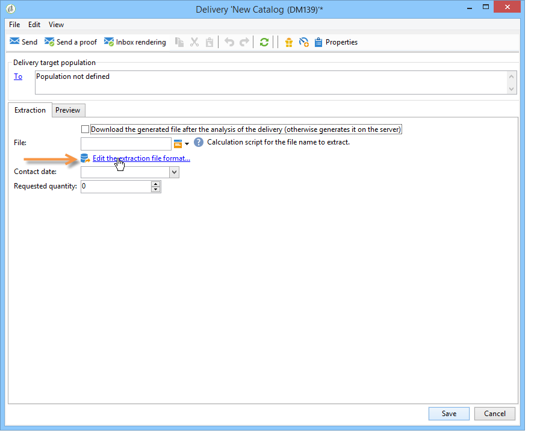

# Definiera innehållet i direktmeddelanden{#defining-the-direct-mail-content}

## Extraheringsfil {#extraction-file}

Namnet på filen som innehåller extraherade data definieras i **[!UICONTROL File]** fält. Med knappen till höger om fältet kan du använda anpassningsfält för att skapa filnamnet.

Som standard skapas extraheringsfilen och lagras på servern. Du kan spara den på datorn. Om du vill göra det går du till **[!UICONTROL Download the generated file after the analysis of the delivery]**. I det här fallet måste du ange åtkomstsökvägen till den lokala lagringskatalogen samt filnamnet.

För direktutskick definieras innehållet i extraheringen i **[!UICONTROL Edit the extraction file format...]** länk.

Med den här länken kan du komma åt extraheringsguiden och definiera den information (kolumner) som ska exporteras till utdatafilen.

Det går att infoga en personlig URL i extraheringsfilen. Mer information om detta finns i [det här avsnittet](../../web/using/publishing-a-web-form.md).

>[!NOTE]
>
>Den här guiden innehåller de steg i exportguiden som beskrivs i [Komma igång](../../platform/using/executing-export-jobs.md) -avsnitt.
