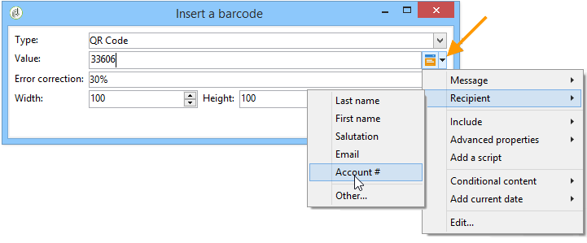

# Definiera e-postinnehållet {#defining-the-email-content}

## Avsändare {#sender}

Klicka på länken **[!UICONTROL From]** om du vill definiera namn och adress för avsändaren som ska visas i meddelandehuvudet.

I det här fönstret kan du ange all information som krävs för att skapa e-postmeddelanderubriker. Den här informationen kan anpassas. Det gör du genom att använda knapparna till höger om inmatningsfälten för att infoga anpassningsfält.

Information om hur du infogar och använder anpassningsfält finns i [Om personalisering](../../delivery/using/about-personalization.md)-avsnittet.

>[!NOTE]
>
>* Avsändarens adress används som standard för svar.
>* Huvudparametrarna får inte vara tomma. Som standard innehåller de värdeindata när distributionsguiden konfigureras. Mer information finns i [installationshandboken](../../installation/using/deploying-an-instance.md).
>* Avsändarens adress är obligatorisk för att tillåta att ett e-postmeddelande skickas (RFC-standard).
>* Adobe Campaign kontrollerar syntaxen för de e-postadresser som anges.

>[!IMPORTANT]
>
>I samband med de kontroller som Internet Access Providers (ISP) utför för att bekämpa oönskad e-post (skräppost) rekommenderar Adobe att man skapar e-postkonton som motsvarar de adresser som angetts för leveranser och svar. Kontakta systemadministratören för meddelanden.

## Meddelandeämne {#message-subject}

Meddelandets ämne är konfigurerat i motsvarande fält. Du kan ange det direkt i fältet eller klicka på länken **[!UICONTROL Subject]** för att ange ett skript. Med personaliseringslänken kan du infoga databasfält i ämnet.

>[!IMPORTANT]
>
>Ämnet för meddelandet är obligatoriskt.

Fältinnehållet ersätts med värdet i mottagarprofilen när meddelandet skickas.

I meddelandet ovan anpassas till exempel meddelandets ämne för varje mottagare med data från deras profil.

>[!NOTE]
>
>Användningen av anpassningsfält beskrivs i [Om personalisering](../../delivery/using/about-personalization.md).

Du kan också infoga uttryckssymboler på ämnesraden med popup-fönstret **[!UICONTROL Insert emoticon]**.

## Meddelandeinnehåll {#message-content}

>[!IMPORTANT]
>
>Av sekretesskäl rekommenderar vi att du använder HTTPS för alla externa resurser.

Innehållet i meddelandet definieras i det nedre avsnittet av fönstret för leveranskonfiguration.

Meddelanden skickas som standard i HTML- eller textformat enligt mottagarens önskemål. Vi rekommenderar att du skapar innehåll i båda formaten för att säkerställa att meddelanden visas korrekt i alla e-postsystem. Mer information finns i [Välja meddelandeformat](#selecting-message-formats).

* Om du vill importera ett HTML-innehåll använder du knappen **[!UICONTROL Open]**. Du kan också klistra in källkoden direkt i underfliken **[!UICONTROL Source]**.

   Om du använder [Digital Content Editor](../../web/using/about-campaign-html-editor.md) (DCE), se [Välja en innehållsmall](../../web/using/use-case--creating-an-email-delivery.md#step-3---selecting-a-content).

   >[!IMPORTANT]
   >
   >HTML-innehållet måste skapas i förväg och sedan importeras till Adobe Campaign. HTML-redigeraren är inte utformad för att skapa innehåll.

   Med underfliken **[!UICONTROL Preview]** kan du visa återgivningen av varje innehåll för en mottagare. Anpassningsfälten och de villkorliga elementen i innehållet ersätts med motsvarande information för den valda profilen.

   Verktygsfältsknapparna ger tillgång till standardåtgärder och formateringsparametrar för HTML-sidan.

   

   Du kan infoga bilder i meddelanden från en lokal fil eller från ett bildbibliotek i Adobe Campaign. Om du vill göra det klickar du på ikonen **[!UICONTROL Image]** och väljer lämpligt alternativ.

   

   Du kan komma åt biblioteksbilder via mappen **[!UICONTROL Resources>Online>Public resources]** i mappträdet. Se även [Lägga till bilder](#adding-images).

   Med den sista knappen i verktygsfältet kan du infoga anpassningsfält.

   >[!NOTE]
   >
   >Användningen av anpassningsfält beskrivs i [Om personalisering](../../delivery/using/about-personalization.md).

   Med flikarna längst ned på sidan kan du visa HTML-koden för sidan som skapas och visa återgivningen av meddelandet med dess anpassning. Om du vill starta den här visningen klickar du på **[!UICONTROL Preview]** och väljer en mottagare med knappen **[!UICONTROL Test personalization]** i verktygsfältet. Du kan välja en mottagare bland de definierade målen eller en annan mottagare.

   

   Du kan validera HTML-meddelandet. Du kan även visa innehållet i e-posthuvudet.

   

* Om du vill importera ett textinnehåll använder du knappen **[!UICONTROL Open]** eller fliken **[!UICONTROL Text Content]** för att ange innehållet i meddelandet när det visas i textformat. Använd verktygsfältsknapparna för att komma åt åtgärder för innehållet. Med den sista knappen kan du infoga anpassningsfält.

   

   När det gäller HTML-formatet klickar du på fliken **[!UICONTROL Preview]** längst ned på sidan för att visa återgivningen av meddelandet med dess anpassning.

   

<!--## Selecting message formats {#selecting-message-formats}

You can change the format of email messages sent. To do this, edit the delivery properties and click the **[!UICONTROL Delivery]** tab.

Select the format of the email in the lower section of the window:

* **[!UICONTROL Use recipient preferences]** (default mode)

  The message format is defined according to the data stored in the recipient profile and stored by default in the **[!UICONTROL email format]** field (@emailFormat). If a recipient wishes to receive messages in a certain format, this is the format sent. If the field is not filled in, a multipart-alternative message is sent (see below).

* **[!UICONTROL Let recipient mail client choose the most appropriate format]**

  The message contains both formats: text and HTML. The format displayed on reception depends on the configuration of the recipient's mail software (multipart-alternative).

  >[!IMPORTANT]
  >
  >This option includes both versions of the document. It therefore impacts the delivery rate, because the message size is greater.

* **[!UICONTROL Send all messages in text format]**

  The message is sent in text format. HTML format will not be sent, but used for the mirror page only when the recipient clicks on the message.-->

## Definiera interaktivt innehåll {#amp-for-email-format}

Med Adobe Campaign kan du testa det nya interaktiva [AMP för e-post](https://amp.dev/about/email/)-formatet, som gör att du kan skicka dynamiska e-postmeddelanden under vissa förhållanden.

Mer information finns i [det här avsnittet](../../delivery/using/defining-interactive-content.md).

## Använda innehållshantering {#using-content-management}

Du kan definiera innehållet i leveransen med hjälp av innehållshanteringsformulären, direkt i leveransguiden. För att göra detta måste du referera till publiceringsmallen för den innehållshantering som ska användas på fliken **[!UICONTROL Advanced]** i leveransegenskaperna.

Med en extra flik kan du ange innehåll som automatiskt ska integreras och formateras enligt reglerna för innehållshantering.

>[!NOTE]
>
>Mer information om innehållshantering i Adobe Campaign finns i [det här avsnittet](../../delivery/using/about-content-management.md).

## Infoga uttryckssymboler {#inserting-emoticons}

Du kan infoga uttryckssymboler i ditt e-postinnehåll.

1. Klicka på ikonen **[!UICONTROL Insert emoticon]**.
1. Välj en uttryckssymbol i popup-fönstret.

   

1. Klicka på knappen **[!UICONTROL Close]** när du är klar.

Om du vill anpassa uttryckslistan läser du i den här [sidan](../../delivery/using/customizing-emoticon-list.md).

## Lägga till bilder {#adding-images}

E-postleveranser i HTML-format kan innehålla bilder. Från leveransguiden kan du importera en HTML-sida som innehåller bilder eller infoga bilder direkt med HTML-redigeraren via ikonen **[!UICONTROL Image]**.

Bilderna kan vara:

* En lokal bild eller en bild som anropats från en server
* En bild som lagras i Adobe Campaign bibliotek för offentliga resurser

   Offentliga resurser är tillgängliga via noden **[!UICONTROL Resources > Online]** i Adobe Campaign-hierarkin. De grupperas i ett bibliotek och kan inkluderas i e-postmeddelanden, men kan också användas för kampanjer eller uppgifter, eller för innehållshantering.

* En resurs som delas med Adobe Experience Cloud. Se [det här avsnittet](../../integrations/using/sharing-assets-with-adobe-experience-cloud.md).

>[!IMPORTANT]
>
>Om du vill inkludera bilder i e-postmeddelanden med leveransguiden måste Adobe Campaign-instansen konfigureras för att aktivera offentlig resurshantering. Den här proceduren kan utföras från distributionsguiden. Mer information om konfiguration finns i [det här avsnittet](../../installation/using/deploying-an-instance.md).

Med leveransguiden kan du lägga till lokala bilder, eller bilder som lagras i biblioteket, i innehållet i meddelanden. Det gör du genom att klicka på knappen **[!UICONTROL Image]** i verktygsfältet HTML-innehåll.

>[!IMPORTANT]
>
>För att mottagarna ska kunna se bilderna i de meddelanden de får måste meddelandena vara tillgängliga på en server som är tillgänglig utifrån.

Så här hanterar du bilder via leveransguiden:

1. Klicka på ikonen **[!UICONTROL Tracking & Images]** i verktygsfältet.
   

1. Välj **[!UICONTROL Upload images]** på fliken **[!UICONTROL Images]**.
1. Du kan sedan välja om du vill inkludera bilderna i e-postmeddelandet.
   

* Du kan överföra bilder manuellt utan att vänta på leveransanalysfasen. Det gör du genom att klicka på länken **[!UICONTROL Upload the images straightaway...]**.
* Du kan ange en annan sökväg för åtkomst till bilderna på spårningsservern. Det gör du genom att ange det i fältet **[!UICONTROL Images URL]**. Det här värdet åsidosätter det värde som definieras i parametrarna i installationsguiden.

När du öppnar HTML-innehåll med inkluderade bilder i leveransguiden får du ett meddelande som ger dig möjlighet att ladda upp bilderna direkt enligt leveransparametrarna.

>[!IMPORTANT]
>
>Sökvägarna för bildåtkomst ändras vid manuell överföring eller när meddelanden skickas.

### Skicka ett meddelande med bilder {#sending-a-message-with-images}

>[!NOTE]
>
>För att undvika prestandaproblem bör varje bildstorlek som standard inte överstiga 100 000 byte om du inkluderar bilder som hämtas direkt från en anpassad URL som [bilaga](../../delivery/using/attaching-files.md). Det rekommenderade tröskelvärdet kan konfigureras från [listan med alternativ för Campaign Classic](../../installation/using/configuring-campaign-options.md#delivery).

Här följer ett exempel på en leverans med fyra bilder:

Dessa bilder kommer från en lokal katalog eller webbplats som du kan verifiera på fliken **[!UICONTROL Source]**.

Klicka på ikonen **[!UICONTROL Tracking & Images]** och sedan på fliken **[!UICONTROL Images]** för att börja identifiera bilder i meddelandet.

För varje bild som identifieras kan du visa dess status:

* Om en bild lagras lokalt eller finns på en annan server identifieras den som **[!UICONTROL Not yet online]** även om den här servern är synlig från utsidan (till exempel på en webbplats).
* Bilderna identifieras som **[!UICONTROL Already online]** om de överfördes tidigare när en annan leverans skapades.
* I distributionsguiden kan du definiera URL:er för vilka bildidentifiering inte är aktiverat: vid överföring av dessa bilder är **[!UICONTROL Skipped]**.

>[!NOTE]
>
>Bilderna identifieras av deras innehåll och inte av deras åtkomstsökvägar. Det innebär att en bild som har överförts tidigare under ett annat namn eller i en annan katalog identifieras som **[!UICONTROL Already online]**.

Under analysfasen överförs bilderna automatiskt till servern så att de är åtkomliga från utsidan, med undantag för de lokala bilderna som måste överföras i förväg.

Du kan arbeta vidare och överföra bilder så att de kan visas av andra Adobe Campaign-operatörer. Detta kan vara användbart om du arbetar tillsammans. Om du vill göra det klickar du på **[!UICONTROL Upload the images straightaway...]** för att överföra bilderna till servern.

>[!NOTE]
>
>URL:erna för bilderna i e-postmeddelandet, och deras namn i synnerhet, ändras sedan.

När bilderna är online kan du visa ändringar i namn och sökvägar på fliken **[!UICONTROL Source]** i meddelandet.

Om du väljer **[!UICONTROL Include the images in the email]** kan du välja vilka bilder som ska inkluderas i motsvarande kolumn.

>[!NOTE]
>
>Om det finns lokala bilder i meddelandet måste du bekräfta ändringarna i meddelandets källkod.

## Infoga en streckkod i ett e-postmeddelande{#inserting-a-barcode-in-an-email}

Med modulen för streckkodsgenerering kan du skapa flera typer av streckkoder som följer många vanliga standarder, inklusive 2D-streckkoder.

Det går att dynamiskt generera en streckkod som en bitmapp med ett värde som definierats enligt kundkriterierna. Personaliserade streckkoder kan inkluderas i e-postkampanjer. Mottagaren kan skriva ut meddelandet och visa det för det utgivande företaget för skanning (t.ex. vid utcheckning).

Om du vill infoga en streckkod i ett e-postmeddelande placerar du markören i innehållet där du vill visa den och klickar sedan på knappen för anpassning. Välj **[!UICONTROL Include > Barcode...]**.

Konfigurera sedan följande element efter dina behov:

1. Välj typ av streckkod.

   * För 1D-format finns följande typer i Adobe Campaign: Codabar, Code 128, GS1-128 (tidigare EAN-128), UPC-A, UPC-E, ISBN, EAN-8, Code39, Interleaved 2 of 5, POSTNET and Royal Mail (RM4SCC).

      Exempel på en 1D-streckkod:

      

   * Typerna DataMatrix och PDF417 gäller 2D-formatet.

      Exempel på en 2D-streckkod:

      

   * Om du vill infoga en QR-kod väljer du den här typen och anger den felkorrigeringsgrad som ska användas. Denna frekvens definierar mängden information som upprepas och toleransen för försämring.

      

      Exempel på en QR-kod:

      

1. Ange storleken på streckkoden som du vill infoga i e-postmeddelandet: Om du konfigurerar skalan kan du öka eller minska storleken på streckkoden, från x1 till x10.
1. I fältet **[!UICONTROL Value]** kan du definiera värdet för streckkoden. Ett värde kan matcha ett specialerbjudande och kan vara funktionen för ett villkor, det kan vara värdet för ett databasfält som är länkat till kunderna.

   I det här exemplet visas en EAN-8-typstreckkod, till vilken en mottagares kontonummer har lagts till. Om du vill lägga till det här kontonumret klickar du på personaliseringsknappen till höger om fältet **[!UICONTROL Value]** och väljer **[!UICONTROL Recipient > Account number]**.

   

1. I fältet **[!UICONTROL Height]** kan du konfigurera höjden på streckkoden utan att ändra bredden, genom att ändra avståndet mellan varje fält.

   Det finns ingen begränsande inmatningskontroll beroende på streckkodstypen. Om ett streckkodsvärde är felaktigt visas det bara i läget **Förhandsgranska** där streckkoden stryks över med rött.

   >[!NOTE]
   >
   >Vilket värde som tilldelas en streckkod beror på dess typ. En EAN-8-typ ska till exempel ha exakt 8 siffror.
   >
   >Med personaliseringsknappen till höger om fältet **[!UICONTROL Value]** kan du lägga till data utöver själva värdet. Detta förbättrar streckkoden, förutsatt att den accepteras av streckkodsstandarden.
   >
   >Om du till exempel använder en GS1-128-typstreckkod och vill ange kontonumret för en mottagare utöver värdet, klickar du på personaliseringsknappen och väljer **[!UICONTROL Recipient > Account number]**. Om kontonumret för den valda mottagaren anges korrekt kommer streckkoden att ta hänsyn till det.

När dessa element har konfigurerats kan du slutföra e-postmeddelandet och skicka det. För att undvika fel ska du alltid se till att ditt innehåll visas korrekt innan du utför en leverans genom att klicka på fliken **[!UICONTROL Preview]**.

>[!NOTE]
>
>Om värdet för en streckkod är felaktigt visas dess bitmapp överstruket i rött.

<!--## Sending emails on Japanese mobiles {#sending-emails-on-japanese-mobiles}

### Email formats for Japanese mobiles {#email-formats-for-japanese-mobiles}

Adobe Campaign manages three specific Japanese formats for email on mobiles: **Deco-mail** (DoCoMo mobiles), **Decore Mail** (Softbank mobiles) and **Decoration Mail** (KDDI AU mobiles). These formats impose particular coding, structure, and size constraints. Learn more about limitations and recommendations in [this section](#limitations-and-recommendations).

In order for the recipient to correctly receive messages in one of these formats, we recommend selecting **[!UICONTROL Deco-mail (DoCoMo)]**, **[!UICONTROL Decore Mail (Softbank)]** or **[!UICONTROL Decoration Mail (KDDI AU)]** in the corresponding profile:

However, if you leave the **[!UICONTROL Email format]** option as **[!UICONTROL Unknown]**, **[!UICONTROL HTML]** or **[!UICONTROL Text]**, Adobe Campaign will automatically detect (when sending the email) the Japanese format to use so that the message is correctly displayed.

This automatic detection system is based on the list of predefined domains defined in the **[!UICONTROL Management of Email Formats]** mail rule set. For more on managing email formats, refer to [this page](../../installation/using/email-deliverability.md#managing-email-formats).

### Limitations and recommendations {#limitations-and-recommendations}

A certain number of constraints apply for sending emails that will be read on a mobile operated by a Japanese provider (Softbank, DoCoMo, KDDI AU).

Therefore, you must:

* Only use images in JPEG or GIF format
* Create a delivery with text and HTML sections that are strictly lower than 10 000 bytes (for KDDI AU and DoCoMo)
* Use images with a total size (before encoding) that is lower than 100 KB
* Do not use more than 20 images per message
* Use a reduced size HTML format (a limited number of tags are available for each operator)

>[!NOTE]
>
>Limitations specific to each operator are to be taken into account when creating your message. Refer to:  
>
>* For DoCoMo, refer to [this page](https://www.nttdocomo.co.jp/service/developer/make/content/deco_mail/index.html)
>* For KDDI AU, refer to [this page](https://www.au.com/ezfactory/tec/spec/decorations/template.html)
>* For Softbank, refer to [this page](https://www.support.softbankmobile.co.jp/partner/home_tech3/index.cfm)

### Testing the email content {#testing-the-email-content}

#### Previewing the message {#previewing-the-message}

Adobe Campaign allows you to check that your message format is adapted to be sent to a Japanese mobile.

Once you have defined your content and entered the email subject, you can check the display and formatting when the message is created.

In the **[!UICONTROL Preview]** tab of the content editing window, clicking **[!UICONTROL More... > Deco-mail diagnostic]** allows you to:

* Check that the HTML content tags conform to the Japanese format restrictions
* Check that the number of images in the message does not exceed the limit imposed by the format (20 images)
* Check the total message size (less than 100kB)

  

#### Running typology rule {#running-typology-rule}

In addition to the previewing diagnosis, a second check is carried out when sending a proof or a delivery: a specific typology rule, **[!UICONTROL Deco-mail check]**, is started during the analysis.

>[!IMPORTANT]
>
>This typology rule is only executed if at least one of the recipients is configured to receive emails in **[!UICONTROL Deco-mail (DoCoMo)]**, **[!UICONTROL Decore Mail (Softbank)]** or **[!UICONTROL Decoration Mail (KDDI AU)]** format.

This typology rule allows you to make sure that the delivery respects the [format constraints](#limitations-and-recommendations) defined by the Japanese operators, particularly in relation to the total size of the email, the size of the HTML and text sections, the number of images in the messages, and the tags in the HTML content.

#### Sending proofs {#sending-proofs}

You can send proofs to test your delivery. When you send the proof, if you are using substitution addresses, please enter addresses that correspond to the email format of the profile used.

For example, you can replace a profile's address by test@softbank.ne.jp if the email format for this profile was defined beforehand on **[!UICONTROL Decore Mail (Softbank)]**.

### Sending messages {#sending-messages}

To send an email to recipients with Japanese email formats with Campaign, two options are possible:

* Create two deliveries: one only for Japanese recipients and another for other recipients - refer to [this section](#designing-a-specific-delivery-for-japanese-formats).
* Create a single delivery and Adobe Campaign will automatically detect the format to use - refer to [this section](#designing-a-delivery-for-all-formats).

#### Designing a specific delivery for Japanese formats {#designing-a-specific-delivery-for-japanese-formats}

You can create a workflow that contains two deliveries: one to be read on a Japanese mobile and another for recipients with a standard email format.

To do this, use the **[!UICONTROL Split]** activity in your workflow and define the Japanese email formats (Deco-mail, Decoration Mail and Decore Mail) as filtering conditions.

#### Designing a delivery for all formats {#designing-a-delivery-for-all-formats}

When Adobe Campaign dynamically manages the formats according to the domain (profiles with email formats defined as **[!UICONTROL Unknown]**, **[!UICONTROL HTML]** or **[!UICONTROL Text]** ), you can send the same delivery to all of your recipients.

The message contact will display correctly for the users on Japanese mobiles, just as for the standard recipients.

>[!IMPORTANT]
>
>Make sure to respect the special features associated with each Japanese email format (Deco-mail, Decoration Mail, and Decore Mail). For more information on limitations, refer to [this section](#limitations-and-recommendations).-->
