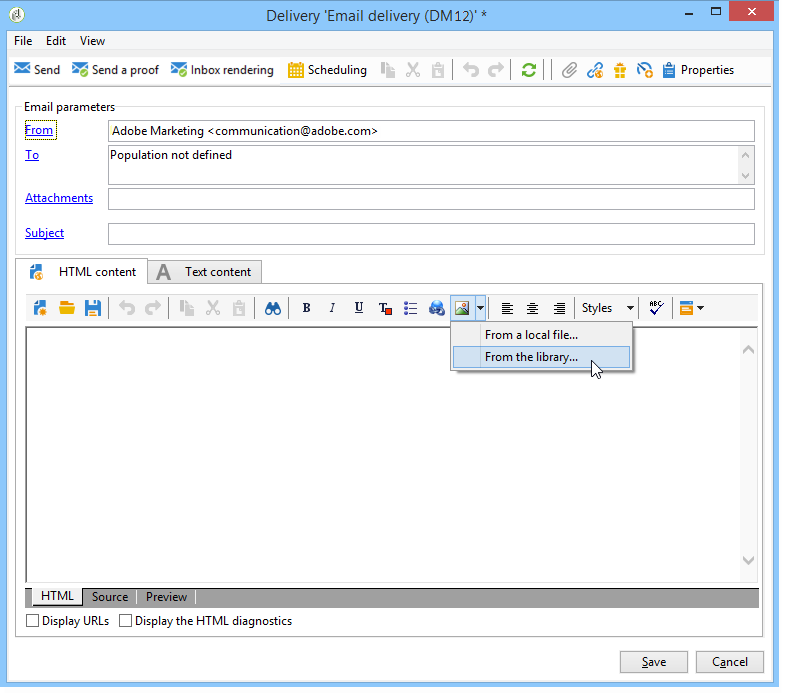

# Definiera e-postinnehållet{#defining-the-email-content}

## Avsändare {#sender}

Klicka på **[!UICONTROL From]** länken om du vill definiera namn och adress för avsändaren som ska visas i meddelandehuvudet.

I det här fönstret kan du ange all information som krävs för att skapa e-postmeddelanderubriker. Den här informationen kan personaliseras. Det gör du genom att använda knapparna till höger om inmatningsfälten för att infoga anpassningsfält.

Information om hur du infogar och använder personaliseringsfält finns i avsnittet [Om personalisering](../../delivery/using/about-personalization.md) .

>[!NOTE]
>
>* Avsändarens adress används som standard för svar.
>* Huvudparametrarna får inte vara tomma. Som standard innehåller de värdeindata när distributionsguiden konfigureras. Mer information finns i [installationshandboken](../../installation/using/deploying-an-instance.md).
>* Avsändarens adress är obligatorisk för att tillåta att ett e-postmeddelande skickas (RFC-standard).
>* Adobe Campaign kontrollerar syntaxen för de e-postadresser som anges.

>[!IMPORTANT]
>
>I samband med de kontroller som Internet Access Providers (ISP) utför för att bekämpa oönskad e-post (skräppost) rekommenderar Adobe att man skapar e-postkonton som motsvarar de adresser som angetts för leveranser och svar. Kontakta systemadministratören för meddelanden.

## Meddelandeämne {#message-subject}

Meddelandets ämne är konfigurerat i motsvarande fält. Du kan ange det direkt i fältet eller klicka på **[!UICONTROL Subject]** länken för att ange ett skript. Med personaliseringslänken kan du infoga databasfält i ämnet.

>[!IMPORTANT]
>
>Ämnet för meddelandet är obligatoriskt.

Fältinnehållet ersätts med värdet i mottagarprofilen när meddelandet skickas.

I meddelandet ovan anpassas till exempel meddelandets ämne för varje mottagare med data från deras profil.

>[!NOTE]
>
>Användningen av personaliseringsfält beskrivs i [Om personalisering](../../delivery/using/about-personalization.md).

Du kan också infoga uttryckssymboler på ämnesraden med **[!UICONTROL Insert emoticon]** popup-fönstret.

## Meddelandeinnehåll {#message-content}

>[!IMPORTANT]
>
>Av sekretesskäl rekommenderar vi att du använder HTTPS för alla externa resurser.

Innehållet i meddelandet definieras i det nedre avsnittet av fönstret för leveranskonfiguration.

Meddelanden skickas som standard i HTML- eller textformat enligt mottagarens önskemål. Vi rekommenderar att du skapar innehåll i båda formaten för att säkerställa att meddelanden visas korrekt i alla e-postsystem. Mer information finns i [Välja meddelandeformat](#selecting-message-formats).

* Om du vill importera ett HTML-innehåll använder du **[!UICONTROL Open]** knappen . Du kan också klistra in källkoden direkt på **[!UICONTROL Source]** underfliken.

   Om du använder [DCE (Digital Content Editor](../../web/using/about-campaign-html-editor.md) ) läser du [Välja en innehållsmall](../../web/using/use-case--creating-an-email-delivery.md#step-3---selecting-a-content).

   >[!IMPORTANT]
   >
   >HTML-innehållet måste skapas i förväg och sedan importeras till Adobe Campaign. HTML-redigeraren är inte utformad för att skapa innehåll.

   På **[!UICONTROL Preview]** underfliken kan du visa återgivningen av varje innehåll för en mottagare. Anpassningsfälten och de villkorliga elementen i innehållet ersätts med motsvarande information för den valda profilen.

   Verktygsfältsknapparna ger tillgång till standardåtgärder och formateringsparametrar för HTML-sidan.

   

   Du kan infoga bilder i meddelanden från en lokal fil eller från ett bildbibliotek i Adobe Campaign. Om du vill göra det klickar du på **[!UICONTROL Image]** ikonen och väljer lämpligt alternativ.

   

   Du kan komma åt biblioteksbilder via mappen **[!UICONTROL Resources>Online>Public resources]** i mappträdet. Se även [Lägga till bilder](#adding-images).

   Med den sista knappen i verktygsfältet kan du infoga anpassningsfält.

   >[!NOTE]
   >
   >Användningen av personaliseringsfält beskrivs i [Om personalisering](../../delivery/using/about-personalization.md).

   Med flikarna längst ned på sidan kan du visa HTML-koden för sidan som skapas och visa återgivningen av meddelandet med dess anpassning. Om du vill öppna den här visningen klickar du på **[!UICONTROL Preview]** och väljer en mottagare med hjälp av **[!UICONTROL Test personalization]** knappen i verktygsfältet. Du kan välja en mottagare bland de definierade målen eller en annan mottagare.

   

   Du kan validera HTML-meddelandet. Du kan även visa innehållet i e-posthuvudet.

   

* Om du vill importera ett textinnehåll använder du **[!UICONTROL Open]** knappen eller **[!UICONTROL Text Content]** fliken för att ange innehållet i meddelandet när det visas i textformat. Använd verktygsfältsknapparna för att komma åt åtgärder för innehållet. Med den sista knappen kan du infoga anpassningsfält.

   

   När det gäller HTML-formatet klickar du på **[!UICONTROL Preview]** fliken längst ned på sidan för att visa återgivningen av meddelandet med dess anpassning.

   

### Infoga uttryckssymboler i ett e-postmeddelande {#inserting-emoticons}

Du kan infoga uttryckssymboler i ditt e-postinnehåll.

1. Klicka på **[!UICONTROL Insert emoticon]** ikonen.
1. Välj en uttryckssymbol i popup-fönstret.

   

1. Klicka på **[!UICONTROL Close]** knappen när du är klar.

Mer information om hur du anpassar uttryckslistan finns på den här [sidan](../../delivery/using/customizing-emoticon-list.md).

## Välja meddelandeformat {#selecting-message-formats}

Du kan ändra formatet för skickade e-postmeddelanden. Det gör du genom att redigera leveransegenskaperna och klicka på **[!UICONTROL Delivery]** fliken.

Välj formatet för e-postmeddelandet i fönstrets nedre del:

* **[!UICONTROL Use recipient preferences]** (standardläge)

   Meddelandeformatet definieras enligt data som lagras i mottagarprofilen och lagras som standard i **[!UICONTROL email format]** fältet (@emailFormat). Om en mottagare vill ta emot meddelanden i ett visst format är detta det format som skickas. Om fältet inte är ifyllt skickas ett multipart-alternativt meddelande (se nedan).

* **[!UICONTROL Let recipient mail client choose the most appropriate format]**

   Meddelandet innehåller båda formaten: text och HTML. Formatet som visas vid mottagning beror på konfigurationen av mottagarens e-postprogramvara (multipart-option).

   >[!IMPORTANT]
   >
   >Det här alternativet inkluderar båda versionerna av dokumentet. Det påverkar därför leveransgraden eftersom meddelandestorleken är större.

* **[!UICONTROL Send all messages in text format]**

   Meddelandet skickas i textformat. HTML-formatet skickas inte, utan används bara för spegelsidan när mottagaren klickar på meddelandet.

## Definiera interaktivt innehåll {#amp-for-email-format}

Med Adobe Campaign kan ni testa den nya interaktiva [AMP för e-postformat](https://amp.dev/about/email/) , som gör det möjligt att skicka dynamiska e-postmeddelanden under vissa omständigheter.

Mer information finns i [det här avsnittet](../../delivery/using/defining-interactive-content.md).

## Använda innehållshantering {#using-content-management}

Du kan definiera innehållet i leveransen med hjälp av innehållshanteringsformulären, direkt i leveransguiden. För att göra detta måste du referera till publiceringsmallen för den innehållshantering som ska användas på fliken **[!UICONTROL Advanced]** i leveransegenskaperna.

Med en extra flik kan du ange innehåll som automatiskt ska integreras och formateras enligt reglerna för innehållshantering.

>[!NOTE]
>
>Mer information om innehållshantering i Adobe Campaign finns i [det här avsnittet](../../delivery/using/about-content-management.md).

## Lägga till bilder {#adding-images}

E-postleveranser i HTML-format kan innehålla bilder. I leveransguiden kan du importera en HTML-sida som innehåller bilder eller infoga bilder direkt med HTML-redigeraren via **[!UICONTROL Image]** -ikonen.

Bilderna kan vara:

* En lokal bild eller en bild som anropats från en server
* En bild som lagras i Adobe Campaign-biblioteket för offentliga resurser

   Offentliga resurser är tillgängliga via noden **[!UICONTROL Resources > Online]** i Adobe Campaign-hierarkin. De grupperas i ett bibliotek och kan inkluderas i e-postmeddelanden, men kan också användas för kampanjer eller uppgifter, eller för innehållshantering.

* En resurs som delas med Adobe Experience Cloud. Se [det här avsnittet](../../integrations/using/sharing-assets-with-adobe-experience-cloud.md).

>[!IMPORTANT]
>
>Om du vill inkludera bilder i e-postmeddelanden med leveransguiden måste Adobe Campaign-instansen konfigureras för att aktivera offentlig resurshantering. Den här proceduren kan utföras från distributionsguiden. Mer information om konfiguration finns i [det här avsnittet](../../installation/using/deploying-an-instance.md) .

Med leveransguiden kan du lägga till lokala bilder, eller bilder som lagras i biblioteket, i innehållet i meddelanden. Det gör du genom att klicka på **[!UICONTROL Image]** knappen i verktygsfältet HTML-innehåll.

>[!IMPORTANT]
>
>För att mottagarna ska kunna se bilderna i de meddelanden de får måste meddelandena vara tillgängliga på en server som är tillgänglig utifrån.

Så här hanterar du bilder via leveransguiden:

1. Klicka på **[!UICONTROL Tracking & Images]** ikonen i verktygsfältet.
   

1. Välj **[!UICONTROL Upload images]** på **[!UICONTROL Images]** fliken.
1. Du kan sedan välja om du vill inkludera bilderna i e-postmeddelandet.
   

* Du kan överföra bilder manuellt utan att vänta på leveransanalysfasen. Klicka på **[!UICONTROL Upload the images straightaway...]** länken om du vill göra det.
* Du kan ange en annan sökväg för åtkomst till bilderna på spårningsservern. Om du vill göra det anger du det i **[!UICONTROL Images URL]** fältet. Det här värdet åsidosätter det värde som definieras i parametrarna i installationsguiden.

När du öppnar HTML-innehåll med inkluderade bilder i leveransguiden får du ett meddelande som ger dig möjlighet att ladda upp bilderna direkt enligt leveransparametrarna.

>[!IMPORTANT]
>
>Sökvägarna för bildåtkomst ändras vid manuell överföring eller när meddelanden skickas.

### Skicka ett meddelande med bilder {#sending-a-message-with-images}

>[!NOTE]
>
>För att undvika prestandaproblem bör varje bildstorlek som standard inte överstiga 100 000 byte om du inkluderar bilder som hämtas direkt från en anpassad URL som [bilaga](../../delivery/using/attaching-files.md). Det rekommenderade tröskelvärdet kan konfigureras från [listan med Campaign Classic-alternativ](../../installation/using/configuring-campaign-options.md#delivery).

Här följer ett exempel på en leverans med fyra bilder:

Dessa bilder kommer från en lokal katalog eller webbplats som du kan verifiera på **[!UICONTROL Source]** fliken.

Klicka på **[!UICONTROL Tracking & Images]** ikonen och sedan på **[!UICONTROL Images]** fliken för att börja identifiera bilderna i meddelandet.

För varje bild som identifieras kan du visa dess status:

* Om en bild lagras lokalt eller finns på en annan server identifieras den som **[!UICONTROL Not yet online]**, även om den är synlig från utsidan (till exempel på en webbplats).
* Bilderna identifieras som **[!UICONTROL Already online]** om de överfördes tidigare när en annan leverans skapades.
* I distributionsguiden kan du definiera URL:er för vilka bildidentifiering inte är aktiverat: de här bilderna kommer att överföras **[!UICONTROL Skipped]**.

>[!NOTE]
>
>Bilderna identifieras av deras innehåll och inte av deras åtkomstsökvägar. Det innebär att en bild som har överförts tidigare under ett annat namn eller i en annan katalog identifieras som **[!UICONTROL Already online]**.

Under analysfasen överförs bilderna automatiskt till servern så att de är åtkomliga från utsidan, med undantag för de lokala bilderna som måste överföras i förväg.

Ni kan arbeta vidare och överföra bilder så att de kan visas av andra Adobe Campaign-operatörer. Detta kan vara användbart om du arbetar tillsammans. Det gör du genom **[!UICONTROL Upload the images straightaway...]** att klicka för att överföra bilderna till servern.

>[!NOTE]
>
>URL:erna för bilderna i e-postmeddelandet, och deras namn i synnerhet, ändras sedan.

När bilderna är online kan du visa ändringar i namn och sökvägar på fliken **[!UICONTROL Source]** i meddelandet.

Om du väljer **[!UICONTROL Include the images in the email]** det här alternativet kan du välja vilka bilder som ska tas med i motsvarande kolumn.

>[!NOTE]
>
>Om det finns lokala bilder i meddelandet måste du bekräfta ändringarna i meddelandets källkod.

## Infoga en streckkod i ett e-postmeddelande{#inserting-a-barcode-in-an-email}

Med modulen för streckkodsgenerering kan du skapa flera typer av streckkoder som följer många vanliga standarder, inklusive 2D-streckkoder.

Det går att dynamiskt generera en streckkod som en bitmapp med ett värde som definierats enligt kundkriterierna. Personaliserade streckkoder kan inkluderas i e-postkampanjer. Mottagaren kan skriva ut meddelandet och visa det för det utgivande företaget för skanning (t.ex. vid utcheckning).

Om du vill infoga en streckkod i ett e-postmeddelande placerar du markören i innehållet där du vill visa den och klickar sedan på knappen för anpassning. Välj **[!UICONTROL Include > Barcode...]**.

Konfigurera sedan följande element efter dina behov:

1. Välj typ av streckkod.

   * För 1D-format är följande typer tillgängliga i Adobe Campaign: Codabar, Code 128, GS1-128 (tidigare EAN-128), UPC-A, UPC-E, ISBN, EAN-8, Code39, Interleaved 2 of 5, POSTNET and Royal Mail (RM4SCC).

      Exempel på en 1D-streckkod:

      

   * Typerna DataMatrix och PDF417 gäller 2D-formatet.

      Exempel på en 2D-streckkod:

      

   * Om du vill infoga en QR-kod väljer du den här typen och anger den felkorrigeringsgrad som ska användas. Denna frekvens definierar mängden information som upprepas och toleransen för försämring.

      

      Exempel på en QR-kod:

      

1. Ange storleken på streckkoden som du vill infoga i e-postmeddelandet: Om du konfigurerar skalan kan du öka eller minska storleken på streckkoden, från x1 till x10.
1. I **[!UICONTROL Value]** fältet kan du definiera streckkodens värde. Ett värde kan matcha ett specialerbjudande och kan vara funktionen för ett villkor, det kan vara värdet för ett databasfält som är länkat till kunderna.

   I det här exemplet visas en EAN-8-typstreckkod, till vilken en mottagares kontonummer har lagts till. Om du vill lägga till det här kontonumret klickar du på personaliseringsknappen till höger om **[!UICONTROL Value]** fältet och väljer **[!UICONTROL Recipient > Account number]**.

   

1. I **[!UICONTROL Height]** fältet kan du konfigurera höjden på streckkoden utan att ändra bredden, genom att ändra avståndet mellan varje stapel.

   Det finns ingen begränsande inmatningskontroll beroende på streckkodstypen. Om ett streckkodsvärde är felaktigt visas det bara i **förhandsvisningsläget** där streckkoden stryks över med rött.

   >[!NOTE]
   >
   >Vilket värde som tilldelas en streckkod beror på dess typ. En EAN-8-typ ska till exempel ha exakt 8 siffror.
   >
   >Med personaliseringsknappen till höger om **[!UICONTROL Value]** fältet kan du lägga till data utöver själva värdet. Detta förbättrar streckkoden, förutsatt att den accepteras av streckkodsstandarden.
   >
   >Om du t.ex. använder en GS1-128-typstreckkod och vill ange kontonumret för en mottagare utöver värdet, klickar du på personaliseringsknappen och väljer **[!UICONTROL Recipient > Account number]**. Om kontonumret för den valda mottagaren anges korrekt kommer streckkoden att ta hänsyn till det.

När dessa element har konfigurerats kan du slutföra e-postmeddelandet och skicka det. För att undvika fel ska du alltid se till att innehållet visas korrekt innan du utför en leverans genom att klicka på **[!UICONTROL Preview]** fliken.

>[!NOTE]
>
>Om värdet för en streckkod är felaktigt visas dess bitmapp överstruket i rött.

## Skicka e-post till japanska mobiler {#sending-emails-on-japanese-mobiles}

### E-postformat för japanska mobiler {#email-formats-for-japanese-mobiles}

Adobe Campaign hanterar tre specifika japanska format för e-post på mobiler: **Deco-mail** (DoCoMo-mobiler), **Decore Mail** (Softbank-mobiler) och **Decoration Mail** (KDDI AU-mobiler). Dessa format medför särskilda begränsningar för kodning, struktur och storlek. Läs mer om begränsningar och rekommendationer i [det här avsnittet](#limitations-and-recommendations).

För att mottagaren ska kunna ta emot meddelanden i något av dessa format rekommenderar vi att du väljer **[!UICONTROL Deco-mail (DoCoMo)]**, **[!UICONTROL Decore Mail (Softbank)]** eller **[!UICONTROL Decoration Mail (KDDI AU)]** i motsvarande profil:

Om du låter alternativet vara **[!UICONTROL Email format]** , **[!UICONTROL Unknown]** eller **[!UICONTROL HTML]** **[!UICONTROL Text]** identifieras (när du skickar e-postmeddelandet) det japanska formatet automatiskt så att meddelandet visas korrekt.

Det här automatiska identifieringssystemet baseras på listan med fördefinierade domäner som definieras i **[!UICONTROL Management of Email Formats]** postregeluppsättningen. Mer information om hur du hanterar e-postformat finns på [den här sidan](../../installation/using/email-deliverability.md#managing-email-formats).

### Begränsningar och rekommendationer {#limitations-and-recommendations}

Ett visst antal begränsningar gäller för att skicka e-postmeddelanden som ska läsas på en mobil som drivs av en japansk leverantör (Softbank, DoCoMo, KDDI AU).

Därför måste du:

* Använd endast bilder i JPEG- eller GIF-format
* Skapa en leverans med text och HTML-avsnitt som är strikt mindre än 10 000 byte (för KDDI AU och DoCoMo)
* Använd bilder med en total storlek (före kodning) som är mindre än 100 kB
* Använd inte fler än 20 bilder per meddelande
* Använd ett HTML-format med reducerad storlek (ett begränsat antal taggar finns för varje operator)

>[!NOTE]
>
>Begränsningar som är specifika för varje operator ska beaktas när meddelandet skapas. Se:
>
>* För DoCoMo, se [den här sidan](https://www.nttdocomo.co.jp/service/developer/make/content/deco_mail/index.html)
>* För KDDI AU, se [den här sidan](https://www.au.com/ezfactory/tec/spec/decorations/template.html)
>* För Softbank, se [den här sidan](https://www.support.softbankmobile.co.jp/partner/home_tech3/index.cfm)

### Testa e-postinnehållet {#testing-the-email-content}

#### Förhandsgranska meddelandet {#previewing-the-message}

Med Adobe Campaign kan ni kontrollera att meddelandeformatet är anpassat för att skickas till en japansk mobiltelefon.

När du har definierat innehållet och angett ämnet för e-postmeddelandet kan du kontrollera visningen och formateringen när meddelandet skapas.

På fliken **[!UICONTROL Preview]** i fönstret för innehållsredigering kan du klicka **[!UICONTROL More... > Deco-mail diagnostic]** för att:

* Kontrollera att HTML-innehållstaggarna följer de japanska formatbegränsningarna
* Kontrollera att antalet bilder i meddelandet inte överstiger gränsen för formatet (20 bilder)
* Kontrollera den totala meddelandestorleken (mindre än 100 kB)

   

#### Kör typologiregel {#running-typology-rule}

Förutom förhandsgranskningsdiagnosen utförs en andra kontroll när du skickar ett bevis eller en leverans: en specifik typologiregel **[!UICONTROL Deco-mail check]** startas under analysen.

>[!IMPORTANT]
>
>Den här typologiregeln körs bara om minst en av mottagarna har konfigurerats att ta emot e-post i **[!UICONTROL Deco-mail (DoCoMo)]****[!UICONTROL Decore Mail (Softbank)]** eller **[!UICONTROL Decoration Mail (KDDI AU)]** format.

Med den här typologiregeln kan du se till att leveransen uppfyller de [formatbegränsningar](#limitations-and-recommendations) som definieras av de japanska operatorerna, särskilt i förhållande till den totala storleken på e-postmeddelandet, storleken på HTML- och textavsnitten, antalet bilder i meddelandena och taggarna i HTML-innehållet.

#### Skicka korrektur {#sending-proofs}

Du kan skicka korrektur för att testa leveransen. När du skickar korrekturet anger du adresser som motsvarar e-postformatet för den profil som används, om du använder ersättningsadresser.

Du kan till exempel ersätta en profils adress med test@softbank.ne.jp om e-postformatet för profilen har definierats i förväg **[!UICONTROL Decore Mail (Softbank)]**.

### Skicka meddelanden {#sending-messages}

Om du vill skicka ett e-postmeddelande till mottagare med japanska e-postformat med Campaign kan du välja mellan två alternativ:

* Skapa två leveranser: en enbart för japanska mottagare och en annan för andra mottagare - se [det här avsnittet](#designing-a-specific-delivery-for-japanese-formats).
* Skapa en leverans så identifierar Adobe Campaign automatiskt vilket format som ska användas - se [det här avsnittet](#designing-a-delivery-for-all-formats).

#### Designa en specifik leverans för japanska format {#designing-a-specific-delivery-for-japanese-formats}

Du kan skapa ett arbetsflöde som innehåller två leveranser: en som ska läsas på japanska mobiler och en annan för mottagare med ett standardformat för e-post.

Det gör du genom att använda **[!UICONTROL Split]** aktiviteten i arbetsflödet och definiera de japanska e-postformaten (Deco-mail, Decoration Mail och Decore Mail) som filtreringsvillkor.

#### Designa en leverans för alla format {#designing-a-delivery-for-all-formats}

När Adobe Campaign hanterar formaten dynamiskt enligt domänen (profiler med e-postformat definierade som **[!UICONTROL Unknown]**, **[!UICONTROL HTML]** eller **[!UICONTROL Text]** ), kan du skicka samma leverans till alla mottagare.

Meddelandekontakten visas korrekt för användare på japanska mobiler, precis som för standardmottagare.

>[!IMPORTANT]
>
>Se till att du respekterar de specialfunktioner som är associerade med alla japanska e-postformat (Deco-mail, Decoration Mail och Decore Mail). For more information on limitations, refer to [this section](#limitations-and-recommendations).
