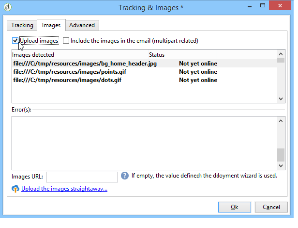

# Definiera e-postinnehållet {#defining-the-email-content}

## Avsändare {#sender}

Om du vill definiera namn och adress för avsändaren som ska visas i huvudet för skickade meddelanden klickar du på knappen **[!UICONTROL From]** länk.

I det här fönstret kan du ange all information som krävs för att skapa e-postmeddelanderubriker. Den här informationen kan anpassas. Det gör du genom att använda knapparna till höger om inmatningsfälten för att infoga anpassningsfält.

Information om hur du infogar och använder anpassningsfält finns i [Om personalisering](about-personalization.md) -avsnitt.

>[!NOTE]
>
>* Avsändarens adress används som standard för svar.
>* Huvudparametrarna får inte vara tomma. Som standard innehåller de värdeindata när distributionsguiden konfigureras. Mer information finns i [Installationshandbok](../../installation/using/deploying-an-instance.md).
>* Avsändarens adress är obligatorisk för att tillåta att ett e-postmeddelande skickas (RFC-standard).
>* Adobe Campaign kontrollerar syntaxen för de e-postadresser som anges.

>[!IMPORTANT]
>
>I samband med de kontroller som Internet Access Providers (ISP) utför för att bekämpa oönskad e-post (skräppost) rekommenderar Adobe att man skapar e-postkonton som motsvarar de adresser som angetts för leveranser och svar. Kontakta systemadministratören för meddelanden.

## Meddelandeämne {#message-subject}

Meddelandets ämne är konfigurerat i motsvarande fält. Du kan ange det direkt i fältet eller klicka på **[!UICONTROL Subject]** för att ange ett skript. Med personaliseringslänken kan du infoga databasfält i ämnet.

>[!IMPORTANT]
>
>Ämnet för meddelandet är obligatoriskt.

Fältinnehållet ersätts med värdet i mottagarprofilen när meddelandet skickas.

I meddelandet ovan anpassas till exempel meddelandets ämne för varje mottagare med data från deras profil.

>[!NOTE]
>
>Användningen av personaliseringsfält beskrivs i [Om personalisering](about-personalization.md).

Du kan även infoga uttryckssymboler på ämnesraden med **[!UICONTROL Insert emoticon]** popup-fönster.

## Meddelandeinnehåll {#message-content}

>[!IMPORTANT]
>
>Av sekretesskäl rekommenderar vi att du använder HTTPS för alla externa resurser.

Innehållet i meddelandet definieras i det nedre avsnittet av fönstret för leveranskonfiguration.

Meddelanden skickas som standard i HTML eller textformat enligt mottagarens önskemål. Vi rekommenderar att du skapar innehåll i båda formaten för att säkerställa att meddelanden visas korrekt i alla e-postsystem. Mer information finns i [Välja meddelandeformat](email-parameters.md#selecting-message-formats).

* Om du vill importera ett HTML-innehåll använder du **[!UICONTROL Open]** -knappen. Du kan också klistra in källkoden direkt i **[!UICONTROL Source]** underflik.

   Om du använder [Digital Content Editor](../../web/using/about-campaign-html-editor.md) (DCE), se [Välja en innehållsmall](../../web/using/use-case--creating-an-email-delivery.md#step-3---selecting-a-content).

   >[!IMPORTANT]
   >
   >Innehållet i HTML måste skapas i förväg och sedan importeras till Adobe Campaign. Redigeraren i HTML är inte utformad för att skapa innehåll.

   The **[!UICONTROL Preview]** Med underfliken kan du visa återgivningen av varje innehåll för en mottagare. Anpassningsfälten och de villkorliga elementen i innehållet ersätts med motsvarande information för den valda profilen.

   Verktygsfältsknapparna ger åtkomst till standardåtgärder och formateringsparametrar för HTML-sidan.

   

   Du kan infoga bilder i meddelanden från en lokal fil eller från ett bildbibliotek i Adobe Campaign. Om du vill göra det klickar du på **[!UICONTROL Image]** och välj lämpligt alternativ.

   

   Biblioteksbilder kan öppnas via **[!UICONTROL Resources>Online>Public resources]** i mappträdet. Se även [Lägga till bilder](#adding-images).

   Med den sista knappen i verktygsfältet kan du infoga anpassningsfält.

   >[!NOTE]
   >
   >Användningen av personaliseringsfält beskrivs i [Om personalisering](about-personalization.md).

   Med flikarna längst ned på sidan kan du visa HTML-koden för den sida som skapas och visa återgivningen av meddelandet med dess anpassning. Klicka på **[!UICONTROL Preview]** och välja en mottagare med **[!UICONTROL Test personalization]** i verktygsfältet. Du kan välja en mottagare bland de definierade målen eller en annan mottagare.

   

   Du kan validera HTML-meddelandet. Du kan även visa innehållet i e-posthuvudet.

   

* Om du vill importera ett textinnehåll använder du **[!UICONTROL Open]** eller **[!UICONTROL Text Content]** för att ange meddelandets innehåll när det visas i textformat. Använd verktygsfältsknapparna för att komma åt åtgärder för innehållet. Med den sista knappen kan du infoga anpassningsfält.

   

   När det gäller formatet HTML klickar du på **[!UICONTROL Preview]** längst ned på sidan för att visa återgivningen av meddelandet med dess personalisering.

   

## Definiera interaktivt innehåll {#amp-for-email-format}

Med Adobe Campaign kan du testa den nya interaktiva [AMP för e-post](https://amp.dev/about/email/) format, som gör det möjligt att skicka dynamiska e-postmeddelanden under vissa förhållanden.

Mer information finns i [det här avsnittet](defining-interactive-content.md).

## Använda innehållshantering {#using-content-management}

Du kan definiera innehållet i leveransen med hjälp av innehållshanteringsformulären, direkt i leveransguiden. För att göra detta måste du referera till publiceringsmallen för den innehållshantering som ska användas i **[!UICONTROL Advanced]** -fliken för leveransegenskaperna.

Med en extra flik kan du ange innehåll som automatiskt ska integreras och formateras enligt reglerna för innehållshantering.

>[!NOTE]
>
>Mer information om innehållshantering i Adobe Campaign finns i [det här avsnittet](about-content-management.md).

## Infoga uttryckssymboler {#inserting-emoticons}

Du kan infoga uttryckssymboler i ditt e-postinnehåll.

1. Klicka på **[!UICONTROL Insert emoticon]** ikon.
1. Välj en uttryckssymbol i popup-fönstret.

   

1. Klicka på **[!UICONTROL Close]** när du är klar.

Mer information om hur du anpassar uttryckslistan finns i [page](customizing-emoticon-list.md).

## Lägga till bilder {#adding-images}

E-postleveranser i HTML-format kan innehålla bilder. I leveransguiden kan du importera en HTML-sida som innehåller bilder eller infoga bilder direkt med redigeraren i HTML via **[!UICONTROL Image]** ikon.

Bilderna kan vara:

* En lokal bild eller en bild som anropats från en server
* En bild som lagras i Adobe Campaign bibliotek för offentliga resurser

   Offentliga resurser är tillgängliga via **[!UICONTROL Resources > Online]** noden i Adobe Campaign-hierarkin. De grupperas i ett bibliotek och kan inkluderas i e-postmeddelanden, men kan också användas för kampanjer eller uppgifter, eller för innehållshantering.

* En resurs som delas med Adobe Experience Cloud. Se [det här avsnittet](../../integrations/using/sharing-assets-with-adobe-experience-cloud.md).

>[!IMPORTANT]
>
>Om du vill inkludera bilder i e-postmeddelanden med leveransguiden måste Adobe Campaign-instansen konfigureras för att aktivera offentlig resurshantering. Den här proceduren kan utföras från distributionsguiden. Se [det här avsnittet](../../installation/using/deploying-an-instance.md) för mer information om konfiguration.

Med leveransguiden kan du lägga till lokala bilder, eller bilder som lagras i biblioteket, i innehållet i meddelanden. Om du vill göra det klickar du på **[!UICONTROL Image]** i verktygsfältet för innehåll i HTML.

>[!IMPORTANT]
>
>För att mottagarna ska kunna se bilderna i de meddelanden de får måste meddelandena vara tillgängliga på en server som är tillgänglig utifrån.

Så här hanterar du bilder via leveransguiden:

1. Klicka på **[!UICONTROL Tracking & Images]** i verktygsfältet.
   

1. Välj **[!UICONTROL Upload images]** i **[!UICONTROL Images]** -fliken.
1. Du kan sedan välja om du vill inkludera bilderna i e-postmeddelandet.
   

* Du kan överföra bilder manuellt utan att vänta på leveransanalysfasen. Om du vill göra det klickar du på **[!UICONTROL Upload the images straightaway...]** länk.
* Du kan ange en annan sökväg för åtkomst till bilderna på spårningsservern. Om du vill göra det anger du det i dialogrutan **[!UICONTROL Images URL]** fält. Det här värdet åsidosätter det värde som definieras i parametrarna i installationsguiden.

När du öppnar HTML-innehåll med inkluderade bilder i leveransguiden får du ett meddelande om du vill att bilderna ska kunna överföras direkt, enligt leveransparametrarna.

>[!IMPORTANT]
>
>* Sökvägarna för bildåtkomst ändras vid manuell överföring eller när meddelanden skickas.
> 
>* För att undvika prestandaproblem bör du inkludera bilder som laddas ned direkt från en anpassad URL som [bifogad](attaching-files.md)bör varje bildstorlek som standard inte överstiga 100 000 byte. Det rekommenderade tröskelvärdet kan konfigureras från [listan över alternativ för Campaign Classic](../../installation/using/configuring-campaign-options.md#delivery).

**Användningsfall: skicka ett meddelande med bilder**

Här följer ett exempel på en leverans med fyra bilder:

Dessa bilder kommer från en lokal katalog eller webbplats som du kan verifiera från **[!UICONTROL Source]** -fliken.

Klicka på **[!UICONTROL Tracking & Images]** -ikonen och sedan **[!UICONTROL Images]** för att börja identifiera bilder i meddelandet.

För varje bild som identifieras kan du visa dess status:

* Om en bild lagras lokalt eller finns på en annan server identifieras den som **[!UICONTROL Not yet online]**.
* Bilderna identifieras som **[!UICONTROL Already online]** om de överfördes tidigare när en annan leverans skapades.
* I distributionsguiden kan du definiera URL:er för vilka bildidentifiering inte är aktiverat: ladda upp dessa bilder **[!UICONTROL Skipped]**.

>[!NOTE]
>
>Bilderna identifieras av deras innehåll och inte av deras åtkomstsökvägar. Det innebär att en bild som har överförts tidigare under ett annat namn eller i en annan katalog identifieras som **[!UICONTROL Already online]**.

Under analysfasen överförs bilderna automatiskt till servern så att de är åtkomliga från utsidan, med undantag för de lokala bilderna som måste överföras i förväg.

Du kan arbeta vidare och överföra bilder så att de kan visas av andra Adobe Campaign-operatörer. Detta kan vara användbart om du arbetar tillsammans. Det gör du genom att klicka **[!UICONTROL Upload the images straightaway...]** för att överföra bilderna till servern.

>[!NOTE]
>
>URL:erna för bilderna i e-postmeddelandet, och deras namn i synnerhet, ändras sedan.

När bilderna är online kan du visa ändringar i deras namn och sökvägar via **[!UICONTROL Source]** meddelandets flik.

Om du väljer **[!UICONTROL Include the images in the email]** kan du välja vilka bilder som ska tas med i motsvarande kolumn.

>[!NOTE]
>
>Om det finns lokala bilder i meddelandet måste du bekräfta ändringarna i meddelandets källkod.

## Infoga en anpassad streckkod{#insert-a-barcode}

Med modulen för streckkodsgenerering kan du skapa flera typer av streckkoder som följer många vanliga standarder, inklusive 2D-streckkoder.

Det går att dynamiskt generera en streckkod som en bitmapp med ett värde som definierats enligt kundkriterierna. Personaliserade streckkoder kan inkluderas i e-postkampanjer. Mottagaren kan skriva ut meddelandet och visa det för det utgivande företaget för skanning (t.ex. vid utcheckning).

Om du vill infoga en streckkod i ett e-postmeddelande placerar du markören i innehållet där du vill visa den och klickar sedan på knappen för anpassning. Välj **[!UICONTROL Include > Barcode...]**.

Konfigurera sedan följande element efter dina behov:

1. Välj typ av streckkod.

   * För 1D-format finns följande typer i Adobe Campaign: Codabar, Code 128, GS1-128 (tidigare EAN-128), UPC-A, UPC-E, ISBN, EAN-8, Code39, Interleaved 2 of 5, POSTNET and Royal Mail (RM4SCC).

      Exempel på en 1D-streckkod:

      

   * Typerna DataMatrix och PDF417 gäller 2D-formatet.

      Exempel på en 2D-streckkod:

      

   * Om du vill infoga en QR-kod väljer du den här typen och anger den felkorrigeringsgrad som ska användas. Denna frekvens definierar mängden information som upprepas och toleransen för försämring.

      

      Exempel på en QR-kod:

      

1. Ange storleken på streckkoden som du vill infoga i e-postmeddelandet: Om du konfigurerar skalan kan du öka eller minska storleken på streckkoden, från x1 till x10.
1. The **[!UICONTROL Value]** I kan du definiera värdet för streckkoden. Ett värde kan matcha ett specialerbjudande och kan vara funktionen för ett villkor, det kan vara värdet för ett databasfält som är länkat till kunderna.

   I det här exemplet visas en EAN-8-typstreckkod, till vilken en mottagares kontonummer har lagts till. Om du vill lägga till det här kontonumret klickar du på personaliseringsknappen till höger om **[!UICONTROL Value]** fält och markera **[!UICONTROL Recipient > Account number]**.

   

1. The **[!UICONTROL Height]** I kan du konfigurera höjden på streckkoden utan att ändra bredden genom att ändra avståndet mellan varje fält.

   Det finns ingen begränsande inmatningskontroll beroende på streckkodstypen. Om ett streckkodsvärde är felaktigt visas det bara i **Förhandsgranska** där streckkoden stryks över i rött.

   >[!NOTE]
   >
   >Vilket värde som tilldelas en streckkod beror på dess typ. En EAN-8-typ ska till exempel ha exakt 8 siffror.
   >
   >Knappen för personalisering till höger om **[!UICONTROL Value]** kan du lägga till data utöver själva värdet. Detta förbättrar streckkoden, förutsatt att den accepteras av streckkodsstandarden.
   >
   >Om du till exempel använder en GS1-128-typstreckkod och vill ange en mottagares kontonummer utöver värdet, klickar du på knappen för anpassning och väljer **[!UICONTROL Recipient > Account number]**. Om kontonumret för den valda mottagaren anges korrekt kommer streckkoden att ta hänsyn till det.

När dessa element har konfigurerats kan du slutföra e-postmeddelandet och skicka det. För att undvika fel ska du alltid se till att innehållet visas korrekt innan du utför leveransen genom att klicka på knappen **[!UICONTROL Preview]** -fliken.

>[!NOTE]
>
>Om värdet för en streckkod är felaktigt visas dess bitmapp överstruket i rött.

