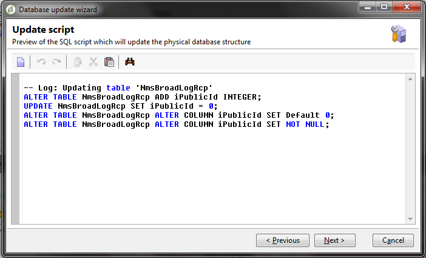
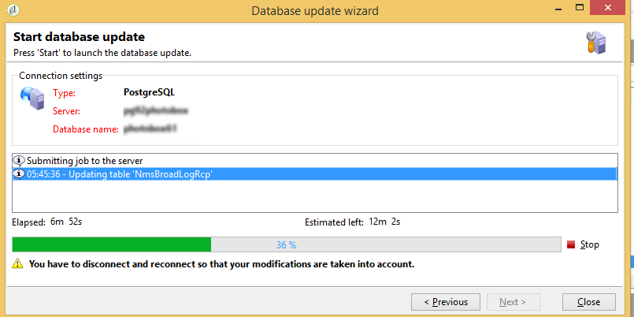

# Kontrollpanel för leverans {#delivery-dashboard}


På **kontrollpanelen för leverans** kan du övervaka leveranser och eventuella problem som uppstår när meddelanden skickas.

Du kan hämta information om en leverans och redigera den om det behövs. Observera att tabbinnehållet inte längre kan ändras när leveransen har skickats.

Här är den information du kan övervaka med hjälp av flera flikar som är tillgängliga på kontrollpanelen:

* [Leveranssammanfattning](#delivery-summary)
* [Leveransrapporter](#delivery-reports)
* [Leveransloggar, spegelsidor, undantag](#delivery-logs-and-history)
* [Loggar och historik för leveransspårning](#tracking-logs)
* [Leveransåtergivning](#delivery-rendering)
* [Leveransgranskning](#delivery-audit-)


**Relaterade ämnen:**

* [Förstå leveransfel](understanding-delivery-failures.md)
* [Förstå karantänshantering](understanding-quarantine-management.md)
* [God praxis för leverans](delivery-best-practices.md)
* [Hantera levererbarhet](about-deliverability.md)

## Leveranssammanfattning {#delivery-summary}

Fliken **[!UICONTROL Summary]** innehåller egenskaper för leveransen: leveransstatus, kanal som används, information om avsändare, ämne, information om exekvering.

## Leveransrapporter {#delivery-reports}

Med länken **[!UICONTROL Reports]**, som du når från fliken **[!UICONTROL Summary]**, kan du titta på en uppsättning rapporter som relaterar till leveransåtgärden: allmän leveransrapport, detaljerad rapport, leveransrapport, distribution av felmeddelanden, öppningsfrekvens, klick och transaktioner osv.

Innehållet på den här fliken kan konfigureras enligt dina krav. Mer information om leveransrapporter finns i [det här avsnittet](../../reporting/using/delivery-reports.md).


## Leveransloggar, historik och undantag {#delivery-logs-and-history}

Fliken **[!UICONTROL Delivery]** ger en historik över förekomsterna i den här leveransen. Den innehåller leveransloggarna, dvs. en lista över skickade meddelanden och deras status samt tillhörande meddelanden.

För en leverans kan du till exempel bara visa mottagare med en misslyckad leverans eller en adress i karantän. Det gör du genom att klicka på knappen **[!UICONTROL Filters]** och välja **[!UICONTROL By state]**. Välj sedan läget i listrutan. Olika statusvärden listas i [den här sidan](delivery-statuses.md).

>[!NOTE]
>
>Listan med leveransloggar kan anpassas, precis som alla andra listor i Campaign Classic. Du kan till exempel lägga till en kolumn för att veta vilken IP-adress som skickade varje e-post i en leverans. Mer information finns i användningsexemplet som beskrivs i [det här avsnittet](#use-case).


Med länken **[!UICONTROL Display the mirror page for this message...]** kan du visa spegelsidan för innehållet i leveransen som valts i listan i ett nytt fönster.

Spegelsidan är bara tillgänglig för leveranser för vilka HTML-innehåll har definierats. Mer information finns i [Generera spegelsidan](sending-messages.md#generating-the-mirror-page).


## Loggar och historik för leveransspårning {#tracking-logs}

På fliken **[!UICONTROL Tracking]** visas spårningshistoriken för den här leveransen. På den här fliken visas spårningsdata för skickade meddelanden, d.v.s. alla URL:er som spåras av Adobe Campaign. Spårningsdata uppdateras varje timme.

>[!NOTE]
>
>Om spårning inte är aktiverat för en leverans visas inte den här fliken.

Spårningskonfigurationen utförs i rätt steg i leveransguiden. Se [Konfigurera spårade länkar](how-to-configure-tracked-links.md).

**[!UICONTROL Tracking]** data tolkas i leveransrapporterna. Se [det här avsnittet](../../reporting/using/delivery-reports.md).


## Inkorgsåtergivning {#delivery-rendering}

På fliken **[!UICONTROL Inbox rendering]** kan du förhandsgranska meddelandet i de olika sammanhang där det kan tas emot och kontrollera kompatibiliteten i de vanligaste datorerna och programmen.

På så sätt kan du se till att ditt meddelande visas för mottagarna på ett optimalt sätt på en mängd olika webbklienter, webbmejl och enheter.

Mer information om återgivning av inkorgar finns på [den här sidan](inbox-rendering.md)


## Leveransgranskning {#delivery-audit-}

Fliken **[!UICONTROL Audit]** innehåller leveransloggen och alla meddelanden som rör korrektur.

Med knappen **[!UICONTROL Refresh]** kan du uppdatera data. Använd knappen **[!UICONTROL Filters]** för att definiera ett filter för data.

Med särskilda ikoner kan du identifiera fel och varningar. Se [Analysera leveransen](steps-validating-the-delivery.md#analyzing-the-delivery).

Med underfliken **[!UICONTROL Proofs]** kan du visa listan med korrektur som har skickats.


Du kan ändra informationen som visas i det här fönstret (och informationen på flikarna **[!UICONTROL Delivery]** och **[!UICONTROL Tracking]**) genom att markera kolumnerna som ska visas. Det gör du genom att klicka på ikonen **[!UICONTROL Configure list]** i det nedre högra hörnet. Mer information om hur du konfigurerar listvisning finns i [det här avsnittet](../../platform/using/adobe-campaign-workspace.md#configuring-lists).

## Synkronisering av kontrollpanel för leverans {#delivery-dashboard-synchronization}

Från kontrollpanelen för leverans vill du kontrollera de bearbetade meddelandena och leveransloggarna för att vara säker på att leveransen har skickats.

Vissa indikatorer eller status kan vara felaktiga eller inte aktuella. Lösningen kan vara:

* Om leveransstatusen är felaktig kontrollerar du att alla nödvändiga godkännanden har gjorts för den här leveransen eller att arbetsflödena **[!UICONTROL operationMgt]** och **[!UICONTROL deliveryMgt]** körs utan fel. Detta kan också bero på leveransen med en tillhörighet som inte har konfigurerats på den sändande instansen.

* Om leveransindikatorerna fortfarande är noll och du använder en mellankällskonfiguration bör du kontrollera det tekniska arbetsflödet i **[!UICONTROL Mid-sourcing (delivery counters)]**. Starta om dess status inte är **[!UICONTROL Started]**. Du kan sedan försöka beräkna om indikatorerna genom att högerklicka på leveransen i Adobe Campaign Explorer och välja **[!UICONTROL Actions]** > **[!UICONTROL Recompute delivery and tracking indicators]**. Mer information om spårningsindikatorer finns i [avsnittet](../../reporting/using/delivery-reports.md#tracking-indicators).

* Om leveransräknaren inte stämmer överens med leveransräknaren kan du försöka att beräkna om indikatorerna genom att högerklicka på leveransen i Adobe Campaign Explorer och välja **[!UICONTROL Actions]** > **[!UICONTROL Recompute delivery and tracking indicators]** för att synkronisera om. Mer information om spårningsindikatorer finns i [avsnittet](../../reporting/using/delivery-reports.md#tracking-indicators).

* Om leveransräknaren inte är uppdaterad för medelstora distributioner kontrollerar du att det tekniska arbetsflödet **[!UICONTROL Mid-Sourcing (Delivery counters)]** körs. Se denna [sida](../../installation/using/mid-sourcing-deployment.md) för mer information om detta.

Du kan också spåra leveranser med olika rapporter via kontrollpanelen för leverans. Mer information om detta hittar du i det här [avsnittet](../../reporting/using/delivery-reports.md).

## Användningsfall: Lägga till avsändarens IP-adresser i loggarna {#use-case}

I det här avsnittet får du lära dig hur du lägger till information i leveransloggarna om IP-adressen som skickade varje e-postmeddelande i en leverans.

>[!NOTE]
>
>Den här ändringen är annorlunda om du använder en enda instans eller en mellankällinstans. Innan du utför ändringen kontrollerar du att du är ansluten till e-postsändningsinstansen.

### Steg 1: Utöka schemat

Om du vill lägga till **publicID** i leveransloggarna måste du utöka schemat först. Du kan fortsätta enligt följande.

1. Skapa ett schematillägg, under **[!UICONTROL Administration]** > **[!UICONTROL Configuration]** > **[!UICONTROL Data Schemas]** > **[!UICONTROL New]**.

   Mer information om schematillägg finns på [den här sidan](../../configuration/using/extending-a-schema.md).

1. Välj **[!UICONTROL broadLogRcp]** för att utöka mottagarens leveransloggar (nms) och definiera ett anpassat namnutrymme. I det här fallet blir det&quot;cus&quot;:

   

   >[!NOTE]
   >
   >Om instansen finns i Mid-sourcing måste du arbeta med schemat för bredaLogMid.

1. Lägg till det nya fältet i tillägget. I det här exemplet måste du ersätta:

   ```
   <element img="nms:broadLog.png" label="Recipient delivery logs" labelSingular="Recipient delivery log" name="broadLogRcp"/>
   ```

   av:

   ```
   <element img="nms:broadLog.png" label="Recipient delivery logs" labelSingular="Recipient delivery log" name="broadLogRcp">
   <attribute desc="Outbound IP identifier" label="IP identifier"
   name="publicId" type="long"/>
   </element>
   ```

   

### Steg 2: Uppdatera databasstruktur

När ändringarna är klara måste du uppdatera databasstrukturen så att den anpassas till den logiska beskrivningen.

Följ stegen nedan för att göra detta:

1. Klicka på menyn **[!UICONTROL Tools]** > **[!UICONTROL Advanced]** > **[!UICONTROL Update database structure...]**.

   

1. I fönstret **[!UICONTROL Edit tables]** kontrolleras tabellen **[!UICONTROL NmsBroadLogRcp]** (eller tabellen **[!UICONTROL broadLogMid]** om du arbetar i en Mid-källmiljö) enligt nedan:

   

   >[!IMPORTANT]
   >
   >Se alltid till att det inte finns några andra ändringar förutom tabellen **[!UICONTROL NmsBroadLoGRcp]** (eller tabellen **[!UICONTROL broadLogMid]** om du arbetar i en MID-källmiljö). Om så är fallet avmarkerar du andra tabeller.

1. Klicka på **[!UICONTROL Next]** för att validera. Följande skärm visas:

   

1. Klicka på **[!UICONTROL Next]** och sedan **[!UICONTROL Start]** för att börja uppdatera databasstrukturen. Indexuppbyggnaden startar. Det här steget kan vara långt, beroende på antalet rader i tabellen **[!UICONTROL NmsBroadLogRcp]**.

   

>[!NOTE]
>
>När uppdateringen av databasens fysiska struktur har slutförts måste du koppla från och ansluta igen så att dina ändringar beaktas.

### Steg 3: Validera ändringen

För att bekräfta att allt fungerade som det ska måste du uppdatera skärmen med leveransloggar.

Det gör du genom att öppna leveransloggarna och lägga till kolumnen&quot;IP-identifierare&quot;.


>[!NOTE]
>
>Mer information om hur du konfigurerar listor i Campaign Classic finns i [den här sidan](../../platform/using/adobe-campaign-workspace.md).

Nedan visas vad du bör se på fliken **[!UICONTROL Delivery]** efter ändringar:


