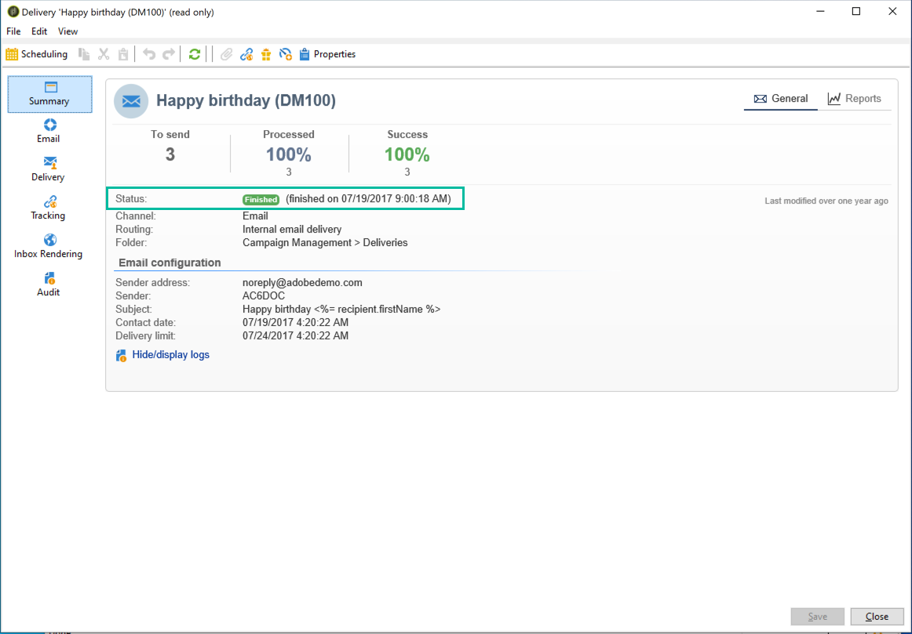

# Leveransstatus {#delivery-statuses}


<!--ajouter intro 

ajouter screenshot -->

När en leverans har skickats visar kontrollpanelen en status som gör att du kan övervaka om sändningen har lyckats. Möjliga statusar beskrivs i avsnittet nedan.



Mer information om olika leveransfel som du kan träffa på och hur du löser dem finns i [den här sidan](understanding-delivery-failures.md).

**Relaterade ämnen:**

* [Kontrollpanel för leverans](delivery-dashboard.md)
* [Leveransfelsökning](delivery-troubleshooting.md)
* [Om levererbarhet](about-deliverability.md)

## Lista över leveransstatus {#list-delivery-statuses}

<table> 
 <thead> 
  <tr> 
   <th> Status<br /> </th> 
   <th> Definitioner och lösningar<br /> </th> 
  </tr> 
 </thead> 
 <tbody> 
  <tr> 
   <td> Skickat<br /> </td> 
   <td> Leveransen skickades korrekt till meddelandeleverantören (men mottagaren tog inte nödvändigtvis emot den).<br /> </td> 
  </tr> 
  <tr> 
   <td> Ignorerad<br /> </td> 
   <td> Leveransen skickades inte till mottagaren på grund av ett fel med deras adress. Den fanns antingen på blockeringslista, i karantän, inte tillhandahållen eller en dubblett. <br /> </td> 
  </tr> 
  <tr> 
   <td> Misslyckades<br /> </td> 
   <td> Leveransen kunde inte nå mottagaren på grund av en ogiltig adress eller en fullständig inkorg, till exempel. Den kan även länkas till ett problem med personaliseringsblock eftersom de kan generera fel när scheman inte matchar leveransmappningen. Se <a href="understanding-delivery-failures.md" target="_blank">Om leveransfel</a><br /> </td> 
  </tr>
  <tr> 
   <td> Väntande<br /> </td> 
   <td> Leveransen är klar att skickas och kommer att bearbetas av leveransservern (MTA). Se <a href="#pending-status" target="_blank">Väntande status</a>.<br /> </td> 
  </tr> 
  <tr> 
   <td> Ej tillämpligt<br /> </td> 
   <td> Leveransen har tagits med i beräkningen av servern (MTA) men har inte bearbetats.<br /> </td> 
  </tr>  
  <tr> 
   <td> Leveransen har avbrutits<br /> </td> 
   <td> Leveransen avbröts av en operator.<br /> </td> 
  </tr> 
  <tr> 
   <td> Tjänsteleverantören har tagit hänsyn till<br /> </td> 
   <td> SMS-tjänstleverantören tog emot leveransen.<br /> För värdbaserade eller hybridinstallationer, om du har uppgraderat till <a href="sending-with-enhanced-mta.md" target="_blank">Förbättrad MTA</a>, vidarebefordrades meddelandet från Campaign till det förbättrade MTA-avtalet.</td> 
  </tr> 
  <tr> 
   <td> Mottaget på mobilen<br /> </td> 
   <td> Mottagaren tog emot SMS på sin mobila enhet.<br /> </td> 
  </tr>
  <tr> 
   <td> Skickat till tjänsteleverantören<br /> </td> 
   <td> Leveransen skickades till SMS-tjänstleverantören men har inte tagits emot än.<br />
   </td> 
  </tr> 
  <tr> 
   <td> Förberedd<br /> </td> 
   <td> Mellanliggande status används endast för externa anslutningar som mobilkanalen. Den följer statusen Väntande och är den externa kopplingen som avgör följande status.<br /> </td> 
  </tr> 
 </tbody> 
</table>

Läs mer om hur du optimerar leveransen av dina Adobe Campaign-mejl på [det här avsnittet](about-deliverability.md). En djupdykning i leveransförmågan finns i [Adobe Deliverability Best Practice Guide](https://experienceleague.adobe.com/docs/deliverability-learn/deliverability-best-practice-guide/introduction.html?lang=sv).

## Väntande status {#pending-status}

När du har bekräftat leveransen ser du att leveransstatus är **[!UICONTROL Pending]**. Den här statusen innebär att körningsprocessen väntar på att vissa resurser ska vara tillgängliga.

The **[!UICONTROL Pending]** status kan först innebära att leveransen har schemalagts och väntar tills det angivna datumet. Mer information finns i [Leveransplanering](steps-sending-the-delivery.md#scheduling-the-delivery-sending) -avsnitt.

Om leveransen inte skickas och dess status kvarstår **[!UICONTROL Pending]**, kan det vara resultatet av:

* MTA (Message Transfer Agent), som kör moduler och processer på leveransservern och som hanterar e-postutskick, kanske inte har startats eller behöver startas om.

   Gör så här om du vill kontrollera detta och starta modulen om det behövs:

   >[!NOTE]
   >
   >Den här åtgärden kan utföras med en **lokal** eller **hybrid** värdmodell med åtkomst till Campaign-servern (se [värdmodeller](../../installation/using/hosting-models.md)).

   1. Kontrollera att `mta@<instance>` -moduler startas på dina MTA-servrar.

      ```
      nlserver pdump
      HH:MM:SS > Application server for Adobe Campaign Classic (X.Y.Z YY.R build nnnn@SHA1) of DD/MM/YYYY
      [...]
      mta@<INSTANCENAME> (9268) - 23.0 Mb
      [...]
      ```

   1. Om MTA inte finns med i listan startar du det med följande kommando:

      ```
      nlserver start mta@<INSTANCENAME>
      ```

      >[!NOTE]
      >
      >Ersätt `<INSTANCENAME>` med namnet på din instans (produktion, utveckling osv.). Instansnamnet identifieras via konfigurationsfilerna: `[path of application]nl6/conf/config-<INSTANCENAME>.xml`

* Leveransen kan ha en tillhörighet som inte har konfigurerats på den sändande servern.

   I det här fallet kontrollerar du konfigurationen för trafikhanteringen (IP-tillhörighet) och använder **[!UICONTROL Managing affinities with IP addresses]** fält för att länka leveranser till den MTA som hanterar tillhörigheten. Mer information om tillhörigheter finns i [det här avsnittet](../../installation/using/configure-delivery-settings.md).

* När för många kampanjer körs förblir leveransstatusen Väntande.

   Gränsen för samtidiga kampanjer definieras i **[!UICONTROL NmsOperation_LimitConcurrency]** alternativ. Standardvärdet är 10.

   Läs mer om alternativen i [den här sidan](../../installation/using/configuring-campaign-options.md).


**Relaterade ämnen:**

* [Leveransloggar och historik](#delivery-logs-and-history)
* [Förstå leveransfel](understanding-delivery-failures.md)
* [Typ av leveransfel och orsaker](understanding-delivery-failures.md#delivery-failure-types-and-reasons)
