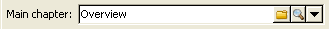

# Förbättra innehåll{#enriching-content}

Med aggregerare kan du förbättra innehållet med externa data. Dessa data kommer från generiska frågor eller länkade tabeller.

## Allmänna frågor {#generic-queries}

Frågor konfigureras via publiceringsmallen på **[!UICONTROL Aggregator]** fliken.

De data som hämtas kommer att berika XML-utdatadokumentet via dess huvudelement.

Exempel på retur från en fråga i mottagarschemat (**nms:receive**):

```
<book name="Content Management">
  ...
  <collection-recipient>
    <recipient lastName="Doe" firstName="John" email="john.doe@aolf.com">
    ...
  </collection-recipient>
</book>
```

Elementet **`<collection-recipient>`** representerar indataelementet i dokumentet som är resultatet av en fråga. De data som hämtas returneras under detta element. i vårt exempel en mottagarlista.

### Lägga till en fråga {#adding-a-query}

Frågeparametrarna redigeras med en guide.

1. På den första sidan anger du etiketten och schemat som innehåller de data som ska hämtas.

   

   >[!NOTE]
   >
   >Redigeringsfältets **sökväg** används för att byta namn på frågeutdataelementet.

1. På nästa sida kan du välja vilka data som ska hämtas.

   

1. Nästa sida definierar filtervillkoren.

   

1. På den sista sidan visas en förhandsgranskning av de data som returnerats av frågan.

   

## Länkade tabeller {#linked-tables}

Med länkar kan du hämta externa data som är länkade till innehållet.

Det finns två typer av länkade data:

* Innehållslänkar: det här är det inbyggda innehållshanteringsläget. Länkens innehåll integreras automatiskt i XML-utdatadokumentet.
* Länkar till externa tabeller ger åtkomst till alla andra tabeller i databasen med begränsningen att hämta data från den markerade länken med en aggregator.

### Länka till ett innehållsschema {#link-to-a-content-schema}

En innehållslänk deklareras i dataschemat enligt följande:

```
<element expandSchemaTarget="cus:chapter" label="Main chapter" name="mainChapter" type="string"/>
```

Definitionen av länken fylls i på en **strängtyp****`<element>`** och attributet **expandSchemaTarget** refererar till målschemat (&quot;cus:chapter&quot; i vårt exempel). Det refererade schemat måste vara ett innehållsschema.

Innehållet i målelementet berikar länkelementet, dvs. elementet **`<chapter>`** i vårt exempelschema:

```
<mainChapter computeString="Introduction" id="7011" title="Introduction" xtkschema="cus:chapter">    
  <page>Introduction to input <STRONG>forms</STRONG>.</page>
</mainChapter>
```

>[!NOTE]
>
>Länkens **beräkningssträng** visas från **computeString** -attributet.

I indataformuläret deklareras redigeringskontrollen för länken enligt följande:

```
<input type="articleEdit" xpath="mainChapter"/>
```



Med den här **[!UICONTROL Magnifier]** ikonen öppnar du redigeringsformuläret för det länkade elementet.

#### Länksamling {#link-collection}

Om du vill fylla i en samling länkar lägger du till attributet **unbound=&quot;true&quot;** i definitionen av länkelementet i dataschemat:

```
<element expandSchemaTarget="cus:chapter" label="List of chapters" name="chapter"  ordered="true" unbound="true"/>
```

Innehållet i målelementet berikar varje samlingselement:

```
<chapter computeString="Introduction" id="7011" title="Introduction" xtkschema="cus:chapter">    
  <page>Introduction to input <STRONG>forms</STRONG>.</page>
</chapter>
```

I indataformuläret deklareras listkontroll enligt följande:

```
<input editable="false" nolabel="true" toolbarCaption="List of chapters" type="articleList" xpath="chapter" zoom="true"/>
```


En standardkolumn visas för att visa **beräkningssträngen** för målelementen.

### Länkar till externa tabeller {#links-to-external-tables}

En länk till en extern tabell deklareras i dataschemat enligt följande:

```
<element label="Main contact" name="mainContact" target="nms:recipient" type="link"/>
```

Definitionen av länken fylls i på en **länktyp****`<element>`** och **målattributet** refererar till målschemat (&quot;nms:receive&quot; i vårt exempel).

Länkar måste deklareras som huvudelement i dataschemat.

Strängen **** Beräkna och nyckeln för målelementet berikar attributen **`<name>-id`** och **`<name>-cs`** för huvudelementet.

I vårt exempel är länken ifylld i &quot;cus:book&quot;-schemat och innehållet i länkdata finns i attributen &quot;mainContact-id&quot; och &quot;mainContact-cs&quot;:

```
<book computeString="Content management" date="2006/06/08" id="6106" language="en" mainContact-cs="John Doe (john.doe@adobe.com)" mainContact-id="3012" name="Content management" xtkschema="cus:book">
```

Länkredigeringskontrollen deklareras enligt följande:

```
<input xpath="mainContact"/>
```


Du kan begränsa valet av målelement genom att lägga till **`<sysfilter>`** elementet via länkdefinitionen i indataformuläret:

```
<input xpath="mainContact">
  <!-- Filter the selection of the link on the Adobe domain -->
  <sysFilter>
    <condition expr="@domain =  'adobe.com '"/>
  </sysFilter>
</input>
```

>[!NOTE]
>
>Den här begränsningen gäller även innehållslänkar.

#### Länksamling {#link-collection-1}

Definitionen av samlingen är identisk med definitionen av en lista över samlingselement:

```
<element label="List of contacts" name="contact" unbound="true">
  <element label="Recipient" name="recipient" target="nms:recipient" type="link"/>
</element>
```

I indataformuläret deklareras listkontroll enligt följande:

```
<input nolabel="true" toolbarCaption="List of contacts" type="list" xpath="contact">
  <input xpath="recipient"/>
</input>
```


>[!NOTE]
>
>Listan är redigerbar och du kan välja länken från en kontroll av typen &quot;link&quot; som visas ovan.

Innehållet i målelementet berikar varje samlingselement i utdatadokumentet:

```
<contact id="11504978621" recipient-cs="Doe John (john.doe@adobe.com)" recipient-id="3012"/>
<contact id="11504982510" recipient-cs="Martinez Peter (peter.martinez@adobe.com)" recipient-id="3013"/>
```

#### Länkaggregering {#link-aggregation}

Innehållet i varje länk som refereras begränsas till den interna nyckeln och **beräkningssträngen** för målelementet.

Ett JavaScript-skript används för att berika innehållet i länkarna via SOAP-frågor.

**Exempel**: Lägga till mottagarnamnet till huvudkontakten och kontaktsamlingslänkarna:

```
// Update <mainContact> link
var mainContactId = content.@['mainContact-id']
var query = xtk.queryDef.create(
    <queryDef schema="nms:recipient" operation="get">
      <select>
        <node expr="@lastName"/>
      </select>
      <where>
        <condition expr={"@id="+mainContactId}/>
      </where>
    </queryDef>)

var recipient = query.ExecuteQuery()
content.mainContact.@lastName = recipient.@lastName

// Update <contact> link collection
for each(var contact in content.contact)
{
  var contactId = contact.@['recipient-id']
  var query = xtk.queryDef.create(
    <queryDef schema="nms:recipient" operation="get">
      <select>
        <node expr="@lastName"/>
      </select>
      <where>
        <condition expr={"@id="+contactId}/>
      </where>
    </queryDef>
  )
  
  var recipient = query.ExecuteQuery()
  contact.@lastName = recipient.@lastName
}
```

Resultatet som erhålls efter skriptkörning:

```
<mainContact lastName="Doe"/>

<contact id="11504978621" lastName="Doe" recipient-cs="Doe John (john.doe@adobe.com)" recipient-id="3012"/>  
<contact id="11504982510" lastName="Martinez" recipient-cs="Martinez Peter (peter.martinez@adobe.com)" recipient-id="3013"/> 
```

Innehållet i JavaScript-koden läggs till via mappen **[!UICONTROL Administration > Configuration > Content management > JavaScript Codes]** och måste fyllas i i publikationsmallen för varje omformning.


