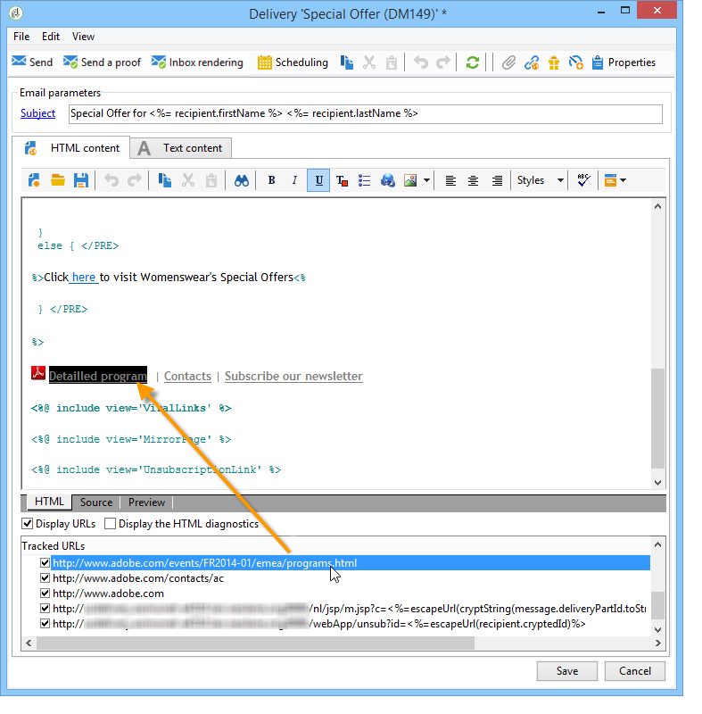

# Konfigurera spårade länkar{#how-to-configure-tracked-links}

För varje leverans kan du spåra mottagningen av meddelanden och aktiveringen av länkarna som infogats i meddelandeinnehållet. På så sätt kan du spåra mottagarnas beteende efter de leveransåtgärder som de har fått som mål.

>[!NOTE]
>
>Spårning gäller för meddelanden, men med webbspårning kan du övervaka hur mottagarna surfar på en webbplats (besökta sidor, inköp).
>
>Konfigurationen av webbspårning visas i [det här avsnittet](../../configuration/using/about-web-tracking.md).

Spårning av meddelanden är aktiverat som standard. Följ stegen nedan för att anpassa hur URL-adresser spåras:

1. Välj **[!UICONTROL Display URLs]** alternativet i den nedre delen av leveransguiden, under meddelandeinnehållet.

   

   När du väljer en URL i listan med spårade URL:er markeras den i leveransinnehållet, med undantag för länken på speglingssidan och den länk för att avbryta prenumerationen som anges som standard.

   

1. För varje URL för meddelandet väljer du om spårning ska aktiveras eller inte.

   >[!CAUTION]
   >
   >När länkens URL används som etikett bör du inaktivera spårning för att undvika risken för avvisning på grund av nätfiske.
   >
   >Om till exempel www.adobe.com URL infogas i meddelandet och spårning aktiveras på det, ändras innehållet i hypertextlänken till https://nlt.adobe.net/r/?id=xxxxxx. Det innebär att det kan anses vara bedrägligt av mottagare som skickar meddelanden.

1. Ändra spårningsetiketten om det behövs, dubbelklicka på etiketten och ange en ny.

   >[!NOTE]
   >
   >Etiketterna för de spårade URL-adresserna och etiketterna kan ändras för att förenkla läsningen av information vid spårning av leveranser. Två URL-adresser eller två etiketter med samma namn läggs ihop när antalet klickningar beräknas.

1. Ändra vid behov spårningsläget och välj ett nytt läge i kolumnen som matchar mållänken, så som visas nedan: **[!UICONTROL Tracking]**

   

   För varje enskild URL kan du ange spårningsläget till något av följande värden:

   * **[!UICONTROL Enabled]** : aktiverar spårning på den här URL:en.
   * **[!UICONTROL Not tracked]** : inaktiverar spårning på den här URL:en.
   * **[!UICONTROL Always enabled]** : aktiverar alltid spårning av den här URL:en. Den här informationen sparas så att spårningen aktiveras nästa gång URL:en visas igen i ett framtida meddelandeinnehåll.
   * **[!UICONTROL Never tracked]** : aktiverar aldrig spårning av den här URL:en. Den här informationen sparas så att spårningen inaktiveras nästa gång URL:en visas igen i ett framtida meddelande.
   * **[!UICONTROL Opt-out]** : hanterar denna URL som en avanmälnings- eller avanmälnings-URL.
   * **[!UICONTROL Mirror page]** : anser att denna URL är en URL för en speglad sida.

1. Dessutom kan du välja en kategori för varje spårad URL i den nedrullningsbara listan i **[!UICONTROL Category]** kolumnen. Dessa kategorier kan visas som i **[!UICONTROL URLs and click streams]** (se [det här avsnittet](../../reporting/using/reports-on-deliveries.md#urls-and-click-streams)). Kategorierna definieras i en viss uppräkning: **[!UICONTROL urlCategory]** (se [Hantera uppräkningar](../../platform/using/managing-enumerations.md)).
