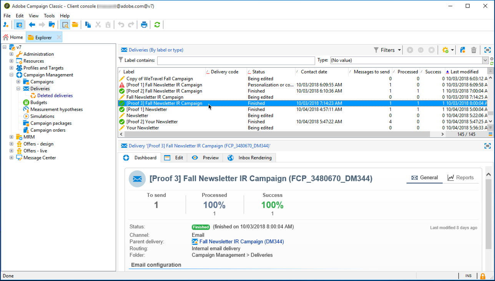

# Inkorgsåtergivning{#inbox-rendering}


## Om inkorgsåtergivning {#about-inbox-rendering}

Innan du trycker på **Skicka** ska du se till att ditt meddelande visas för mottagarna på ett optimalt sätt på olika webbklienter, webbmejl och enheter.

För att detta ska bli möjligt använder Adobe Campaign [Litmus](https://litmus.com/email-testing) webbaserad e-posttestningslösning för att hämta in renderingarna och göra dem tillgängliga i en dedikerad rapport. På så sätt kan du förhandsgranska det skickade meddelandet i olika sammanhang som det kan tas emot i och kontrollera kompatibiliteten i de flesta datorer och program.

>[!CAUTION]
>Inkorgsåtergivning är inte kompatibelt med [återkommande leveranser](communication-channels.md#recurring-delivery).

Litmus är en funktionell e-postvalidering och förhandsgranskning av program. Med den kan e-postskapare förhandsgranska sitt meddelandeinnehåll i över 70 e-postrenderare, till exempel Gmail-inkorgen eller Apple Mail-klienten.

De mobil-, meddelande- och webbmejlklienter som finns för **Inkorgsåtergivning** i Adobe Campaign finns listade på [Litmus webbplats](https://litmus.com/email-testing) (klicka **Visa alla e-postklienter**).

>[!NOTE]
>
>Återgivning av inkorgen behövs inte för att testa personalisering i leveranser. Personaliseringen kan kontrolleras med Adobe Campaign verktyg som **[!UICONTROL Preview]** och [Korrektur](steps-validating-the-delivery.md#sending-a-proof).

## Aktivera inkorgsåtergivning {#activating-inbox-rendering}

För värdbaserade klienter och hybridklienter konfigureras Inkorgsåtergivning av Adobe teknisk support och konsulter. Kontakta din kontoansvarige på Adobe om du vill ha mer information.

För lokala installationer följer du stegen nedan för att konfigurera inkorgsåtergivning.

1. Installera **[!UICONTROL Inbox rendering (IR)]** via **[!UICONTROL Tools]** > **[!UICONTROL Advanced]** > **[!UICONTROL Import package]** -menyn. Mer information finns i [Installera Campaign Classic-standardpaket](../../installation/using/installing-campaign-standard-packages.md).
1. Konfigurera ett externt konto för HTTP-typen via **[!UICONTROL Administration]** > **[!UICONTROL Platform]** > **[!UICONTROL External Accounts]** nod. Mer information finns i [Skapa ett externt konto](../../installation/using/external-accounts.md#creating-an-external-account).
1. Ange externa kontoparametrar enligt följande:
   * **[!UICONTROL Label]**: Information om leveransserver
   * **[!UICONTROL Internal name]**: deliverabilityInstance
   * **[!UICONTROL Type]**: HTTP
   * **[!UICONTROL Server]**: https://deliverability-app.neolane.net/deliverability
   * **[!UICONTROL Encryption]**: Ingen
   * Markera alternativet **[!UICONTROL Enabled]**.

   

1. Gå till **[!UICONTROL Administration]** > **[!UICONTROL Platform]** > **[!UICONTROL Options]** nod. Sök efter **[!UICONTROL DmRendering_cuid]** och kontakta supporten för att få den identifierare för leveransrapporter som behöver kopieras till **[!UICONTROL Value (text)]** fält.
1. Redigera **serverConf.xml** för att tillåta ett anrop till Litmus-servern. Lägg till följande rad i `<urlPermission>` avsnitt:

   ```
   <url dnsSuffix="deliverability-app.neolane.net" urlRegEx="https://.*"/>
   ```

1. Läs in konfigurationen igen med följande kommando:

   ```
   nlserver config -reload
   ```

>[!NOTE]
>
>Du kan behöva logga ut från konsolen och logga in igen för att kunna använda Inkorgsåtergivning.

## Om Litmus-tokens {#about-litmus-tokens}

Eftersom Litmus är en tredjepartstjänst fungerar den på en kreditmodell per användning. Varje gång en användare anropar Litmus-funktionen dras krediten av.

I Adobe Campaign motsvarar krediten antalet tillgängliga återgivningar (kallas tokens).

>[!NOTE]
>
>Antalet tillgängliga Litmus-tokens beror på vilken Campaign-licens du har köpt. Kontrollera licensavtalet.

Varje gång du använder **[!UICONTROL Inbox rendering]** i en leverans minskar varje återgivning dina tillgängliga tokens med en.

>[!IMPORTANT]
>
>Tokens-konto för varje enskild återgivning och inte för hela inkorgsåtergivningsrapporten, vilket innebär att:
>
>* Varje gång rapporten för inkorgsåtergivning skapas dras en token per meddelandeklient av: en token för Outlook 2000-återgivning, en för Outlook 2010-återgivningen, en för Apple Mail 9-återgivningen och så vidare.
>* Om du genererar återgivningen av Inkorgen igen för samma leverans minskas antalet tillgängliga tokens igen med antalet genererade återgivningar.
>


Antalet återstående tillgängliga token visas i **[!UICONTROL General summary]** i [Återgivningsrapport för inkorgen](#inbox-rendering-report).


Återgivningsfunktionen i Inkorgen används vanligtvis för att testa ramverket HTML i ett nyligen utformat e-postmeddelande. Varje återgivning kräver ungefär 70 token (beroende på hur många miljöer som testas i allmänhet). I vissa fall kan du dock behöva flera rapporter om inkorgsåtergivning för att kunna testa leveransen. Det kan därför ta fler tokens att slutföra flera kontroller.

## Få åtkomst till rapporten för inkorgsåtergivning {#accessing-the-inbox-rendering-report}

När du har skapat e-postleveransen och definierat innehållet samt målpopulationen följer du stegen nedan.

Mer information om att skapa, designa och målinrikta en leverans finns i [det här avsnittet](about-email-channel.md).

1. Klicka på knappen **[!UICONTROL Inbox rendering]** -knappen.
1. Välj **[!UICONTROL Analyze]** för att starta hämtningsprocessen.

   

   Ett bevis skickas. Miniatyrbilderna för återgivning finns tillgängliga i det korrekturet några minuter efter att du skickat e-postmeddelandena. Mer information om hur du skickar korrektur finns i [det här avsnittet](steps-validating-the-delivery.md#sending-a-proof).

1. När du har skickat korrekturet visas det i leveranslistan. Dubbelklicka på den.

   

1. Gå till **Inkorgsåtergivning** -fliken för korrekturet.

   

   Återgivningsrapporten för inkorgen visas.

## Återgivningsrapport för inkorgen {#inbox-rendering-report}

I den här rapporten visas inkorgsåtergivningarna så som de visas för mottagaren. Återgivningarna kan variera beroende på hur mottagaren öppnar e-postleveransen: i en webbläsare, på en mobil enhet eller via ett e-postprogram.

The **[!UICONTROL General summary]** visar antalet mottagna, oönskade (skräppost), ej mottagna eller väntande mottagningar som en lista och via en grafisk färgkodad representation.


Håll pekaren över diagrammet om du vill visa information om varje färg.

Rapportens innehåll är uppdelat i tre delar: **[!UICONTROL Mobile]**, **[!UICONTROL Messaging clients]** och **[!UICONTROL Webmails]**. Bläddra nedåt i rapporten för att visa alla återgivningar grupperade i dessa tre kategorier.


Klicka på motsvarande kort om du vill ha information om respektive rapport. Återgivningen visas för den valda mottagningsmetoden.


